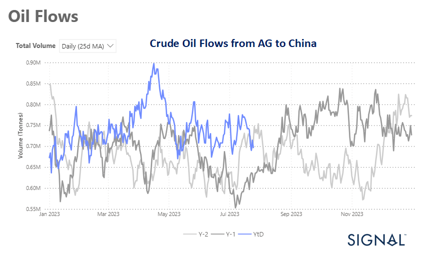

# Weekly Tanker Market Monitor: Week 30, 2023

**Date**: May 18, 2024 | **Category**: Tankers | **Section**: Monitors | **Source**: [https://www.thesignalgroup.com/weekly-market-monitor/tanker-week-30-2023](https://www.thesignalgroup.com/weekly-market-monitor/tanker-week-30-2023)

---

## Crude oil flows from AG to China have been fluctuating at a lower level since the last peak in mid-April

*Data Source:https://app.signalocean.com/tanker/dynamic/oilflows*

In the last days of July, the outlook for crude oil freight rates showed signs of weakness as the growth of demand in tonne days continued to decline. Additionally, the daily 25-day moving average of crude oil flows from Arabian Gulf countries to China has been consistently decreasing since its peak in mid-April. During July, the volume of oil flows reached levels even lower than those recorded in the previous year.

The downward trend in the daily 25-day moving average of crude oil flows from the Arabian Gulf to China highlights a reduction in oil trade between these regions, potentially reflecting changes in oil supply sources or a shift in China's energy import strategy. The combination of these factors points to a challenging period for the crude oil shipping industry. As demand continues to weaken and oil flows to China decrease, freight rates may face further pressure.

As for oil demand growth, there is optimism about stronger growth, which is fueling sentiment for a rebound in prices. Goldman Sachs has made a bullish projection for the oil market, foreseeing an unprecedented surge in demand that will create a substantial deficit. According to the investment bank's forecasts, the demand for oil is expected to reach an all-time high, leaving a significant gap between supply and demand. Currently hovering slightly above $80 per barrel, the bank predicts that Brent crude will experience a further uptick, soaring to $86 per barrel as the year draws to a close. This optimistic outlook indicates a potential price rally in the oil markets, which could have significant implications for various industries and economies worldwide.

For the latest updates and insights, make sure to visit theSignal Ocean Newsroomwebsite page. Clickhere to request a demo.

For subscription to our FREE weekly market trends email, please contact us: research@thesignalgroup.com

-Republishing is allowed with an active link to the source
