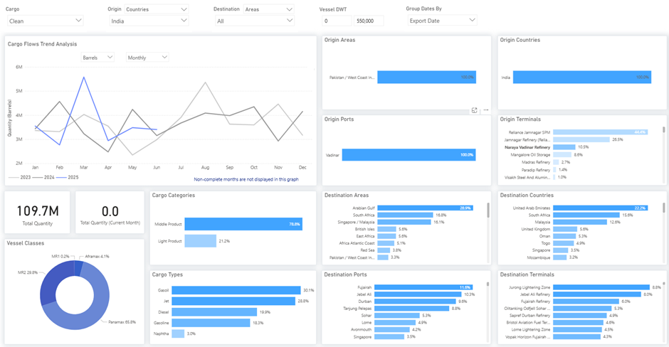

# Weekly Tanker Market Monitor: Week 30, 2025

**Date**: July 25, 2025 | **Category**: Tankers | **Section**: Monitors | **Source**: [https://www.thesignalgroup.com/weekly-market-monitor/tanker-week-30-2025](https://www.thesignalgroup.com/weekly-market-monitor/tanker-week-30-2025)

---

## Special Focus  of the Week

## EU Sanctions Start to Disrupt Clean Product Exports from Nayara’s Vadinar Refinery

‍

The European Union’s latest sanctions on Nayara Energy, India’s Rosneft-linked refiner, are beginning to impact clean product flows out of the Vadinar terminal visibly. Oil flows voyages tracking India-origin seaborne shipments show that the Naraya Vadinar Refinery handles roughly 10.5% of total Indian clean exports.‍

*‍https://app.signalocean.com/tanker/dynamic/oilflows*

‍

A closer examination of India’s monthly clean oil exports shows a sharp peak in March, followed by a marked decline through April and May. This trend coincides with the typical second-quarter maintenance season at major Indian refineries, most notably at Reliance’s Jamnagar complex, the world’s largest refining hub and a critical source of clean product exports. In April, media reports confirmed that Reliance shut down one crude distillation unit along with several secondary units at Jamnagar for a planned 21-day maintenance. The export slowdown appears to have primarily affected middle distillates, which comprised nearly 79% of all clean cargoes shipped during the period.

Additional pressure on flows may stem from early reticence among charterers and traders anticipating tighter scrutiny of Russian-linked product supplies. Compounding this backdrop, early signs of disruption have emerged, including the withdrawal of a scheduled naphtha export tender and the tightening of payment terms for product cargoes.

‍For the latest updates and insights, make sure to visit theSignal Ocean Newsroomwebsite page. Clickhere to request a demo. Readlast week's tanker monitor here.

For subscription to our FREE weekly market trends email,please click here, or contact us at: research@thesignalgroup.com

- Republishing is allowed with an active link to the source
