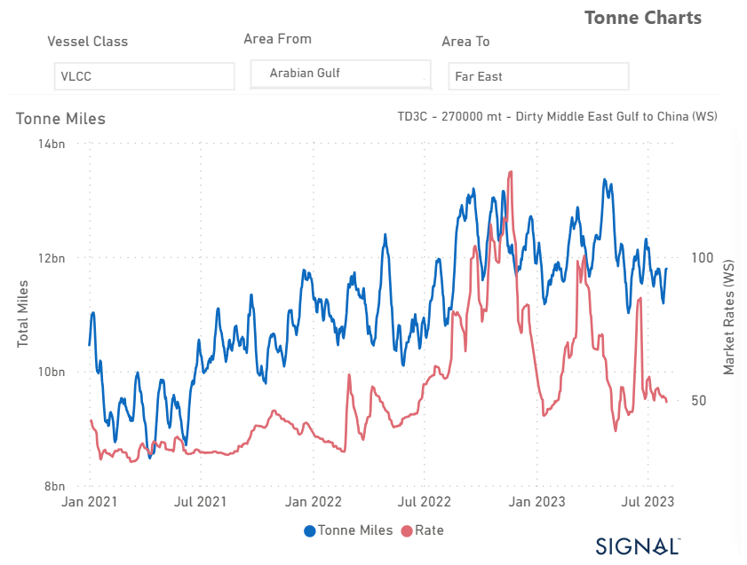

# Weekly Tanker Market Monitor: Week 31, 2023

**Date**: May 18, 2024 | **Category**: Tankers | **Section**: Monitors | **Source**: [https://www.thesignalgroup.com/weekly-market-monitor/tanker-week-31-2023](https://www.thesignalgroup.com/weekly-market-monitor/tanker-week-31-2023)

---

## VLCC tonne miles from AG to China have been fluctuating at a lower level since the last peak in late June

*Data Source:https://app.signalocean.com/tanker/dynamic/oilflows*

In the first days of August, sentiment in the crude tanker market continues to be under pressure, and there are no signs of recovery yet, while on AG the growth of tonne-miles towards the Far East (see image above) is continuously revised downwards. After the last peak in rates from AG  to China at the end of July, sentiment has deteriorated while weakness continues on the Aframax-Med route.

However, there is a glimmer of hope in the MR clean segment, as it shows promising signs of recovery. Despite this, the overall outlook for August crude tanker freight rates remains uncertain.

JP Morgan market estimates are raising concerns about a potential doubling of oil prices in the next two years. Currently, oil prices are at a nearly three-month high due to tightening global supply, as producers are implementing output cuts, and the United States, the world's largest fuel consumer, is witnessing strong demand.

To further bolster the market, analysts anticipate that Saudi Arabia might extend its voluntary oil output cut of 1 million barrels per day (bpd) for an additional month, including September. This move is expected to provide extra support during a virtual meeting with other major oil-producing nations, scheduled for Friday.

The combination of reduced supply and robust demand is creating an atmosphere of uncertainty in the oil market, and investors and stakeholders are closely monitoring the situation. Any decision made during the forthcoming meeting could significantly impact the trajectory of oil prices in the coming months.

For the latest updates and insights, make sure to visit theSignal Ocean Newsroomwebsite page. Clickhere to request a demo.

For subscription to our FREE weekly market trends email, please contact us: research@thesignalgroup.com

-Republishing is allowed with an active link to the source
