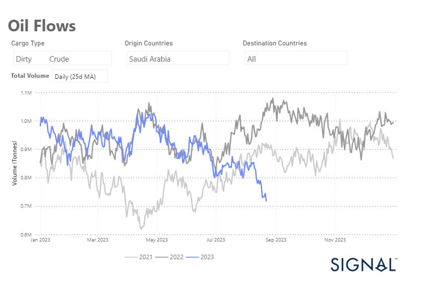

# Weekly Tanker Market Monitor: Week 34, 2023

**Date**: May 18, 2024 | **Category**: Tankers | **Section**: Monitors | **Source**: [https://www.thesignalgroup.com/weekly-market-monitor/tanker-week-34-2023](https://www.thesignalgroup.com/weekly-market-monitor/tanker-week-34-2023)

---

## Saudi Arabia's crude oil exports to all destinations are heading for significantly lower volumes in the summer

*Data Source:https://app.signalocean.com/tanker/dynamic/oilflows*

In the third week of August, downward pressure continues on the VLCC MEG route to China, while Saudi Arabia's crude oil exports to all destinations are expected to decline significantly over the summer compared to the previous two years.

As shown in the chart above, Saudi Arabia's crude oil exports fell in July and August to the lowest level in a similar period in the last two years. The decline follows Saudi Arabia's announcement in early August that it would extend its voluntary cut in oil production by one million barrels per day for another month.

The energy market saw a 1% drop in oil prices on Wednesday. The downward movement was triggered by fears of lower demand due to a significant increase in gasoline inventories in the U.S., combined with sluggish production data at the global level. These factors managed to outweigh the initial enthusiasm triggered by a surprisingly significant reduction in U.S. crude oil reserves.

According to Reuters, the price of Brent crude oil fell 82 cents, or 0.98%, to close at $83.21 per barrel. Earlier, the price had fallen by a considerable 2.5%. U.S. West Texas Intermediate crude oil also fell 75 cents, or 0.9%, to close at $78.89. The low for this type of crude oil was even more pronounced at 3.4%.

For the latest updates and insights, make sure to visit theSignal Ocean Newsroomwebsite page. Clickhere to request a demo.

For subscription to our FREE weekly market trends email, please contact us: research@thesignalgroup.com

-Republishing is allowed with an active link to the source
