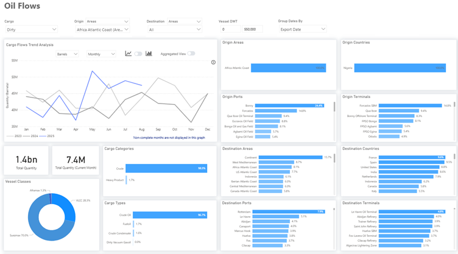
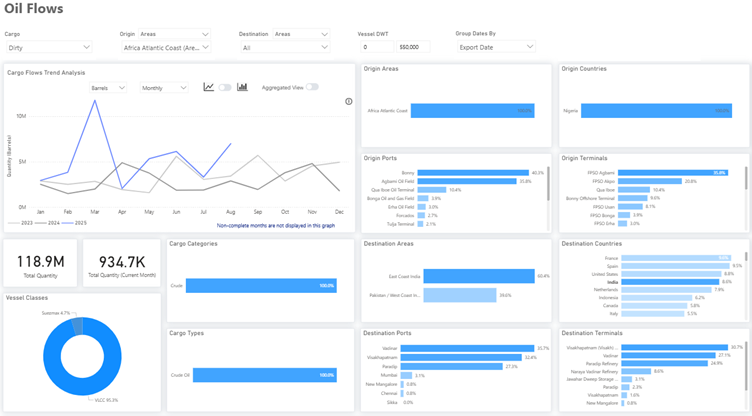
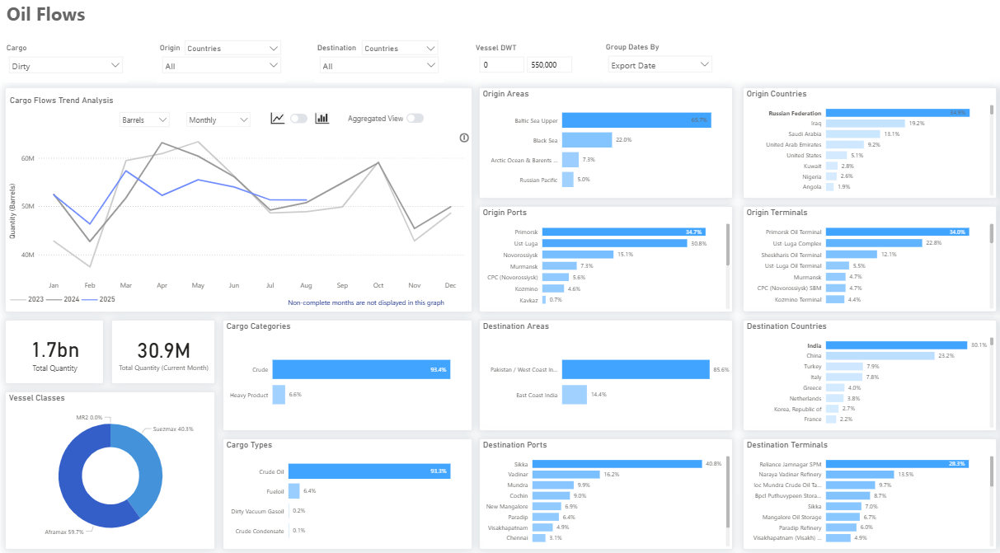
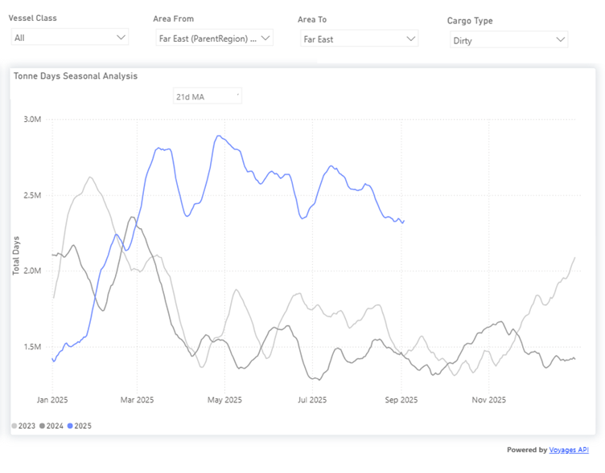

# Weekly Tanker Market Monitor: Week 36, 2025

**Date**: September 5, 2025 | **Category**: Tankers | **Section**: Monitors | **Source**: [https://www.thesignalgroup.com/weekly-market-monitor/tanker-week-36-2025](https://www.thesignalgroup.com/weekly-market-monitor/tanker-week-36-2025)

---

## Spotlight of the Week: Nigeria’s Comeback: Oil Flows Rise as Production Hits a Record in July

Nigeria has re-emerged as a key player in global oil markets, with production reaching new heights in July. Output averaged 1.71 million bpd, according to the Nigerian Upstream Petroleum Regulatory Commission (NUPRC), up 9.9% year-on-year.

Terminal performance underlines the recovery. Bonny posted 8.07 million barrels in July, a 13% jump from June, while Forcados edged higher to 9.04 million barrels, up 2.1% month-on-month. Yet, despite the strong momentum, volumes remain short of Nigeria’s 2025 budget benchmark of 2.06 million barrels per day (bpd), underscoring both the progress made and the challenge of sustaining higher output. Export flows reflect the rebound. Dirty oil shipments surged at the end of Q1 and continued into the summer, with France, Spain, and the U.S. remaining the major buyers.

*https://app.signalocean.com/tanker/dynamic/oilflows*

‍

India has proven to be a significant market. Nigerian exports to India reached a high of over 11 million barrels in March, then decreased to 7 million barrels in August, which is still more than double the levels seen in the same period last year.

*Signal Figure*

One factor behind the shift has been lower buying activity from Indian refiners. Since late Q1,. Russian crude imports by India saw a 17% decrease in April and an 8% decrease in May compared to the same months in 2024. This significant drop appears to be ongoing, with August's figures nearly matching those of the previous year.

*Signal Figure*

Russia's refining capacity has been significantly impacted by Ukraine's drone strikes, with approximately 17% disabled across facilities in Syzran, Volgograd, Saratov, Ryazan, and Krasnodar, raising concerns about supply reliability. Further uncertainty stems from U.S. warnings regarding restrictions on India's purchases of Russian oil, which could strengthen Nigeria's position as a more secure alternative supplier.

‍

This situation is already evident in the growth of oil tonne-days. Reduced Russian flows to the Far East have slowed tonne-day growth since late summer, though current levels remain about one-third above the seasonal norm of the past two years. This creates a favorable environment for Nigeria, where the recent July production increase, if sustained, together with shifting global demand dynamics, could enhance its role as a stronger supplier in the months ahead.

*https://app.signalocean.com/tanker/dynamic/timeseries_tanker*

‍

‍For the latest updates and insights, make sure to visit theSignal Ocean Newsroomwebsite page. Clickhere to request a demo. Readlast week's tanker monitor here.

For subscription to our FREE weekly market trends email,please click here, or contact us at: research@thesignalgroup.com

- Republishing is allowed with an active link to the source
