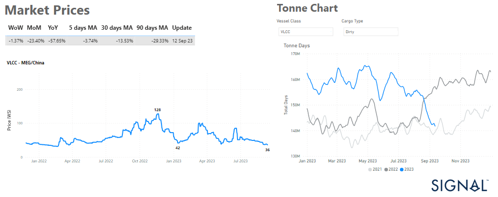

# Weekly Tanker Market Monitor: Week 37, 2023

**Date**: May 18, 2024 | **Category**: Tankers | **Section**: Monitors | **Source**: [https://www.thesignalgroup.com/weekly-market-monitor/tanker-week-37-2023](https://www.thesignalgroup.com/weekly-market-monitor/tanker-week-37-2023)

---

##### Continued downward pressure with a significant decline in VLCC demand growth rates

*Data Source:https://app.signalocean.com/tanker/dynamic/market-prices-tankershttps://app.signalocean.com/tanker/dynamic/timeseries_tanker_downloadable*

The second week of September maintains its grip on the crude oil freight market's sentiments, as VLCC rates have yet to display the anticipated rebound. The struggle persists in the VLCC MEG-China rates, leaving industry observers closely monitoring the demand dynamics of the Chinese economy as we approach the end of September.

Illustrated in the accompanying graph, the growth in VLCC demand tonne days has eroded since July, approaching levels last seen in September 2021. August witnessed a noteworthy development, with Chinese crude oil imports surging to an impressive 12.43 million barrels per day (bpd). This marked the third-highest daily rate on record, reflecting a remarkable 20.9% increase compared to July, according to data by the General Administration of Customs.

On Thursday, oil prices rebounded due to expectations of a tighter global crude supply outlook for the remainder of 2023 and the Brent crude rose to $92.71 a barrel, while U.S. West Texas Intermediate crude (WTI) was at $89.22. Despite concerns over weaker economic growth and rising inventories in the U.S., Saudi Arabia and Russia's decision to extend oil output cuts will result in a market deficit through the fourth quarter, as stated by the International Energy Agency on Wednesday. The slight pullback in prices was caused by the bearish U.S. inventories report.

For the latest updates and insights, make sure to visit theSignal Ocean Newsroomwebsite page. Clickhere to request a demo.

For subscription to our FREE weekly market trends email, please contact us: research@thesignalgroup.com

-Republishing is allowed with an active link to the source
