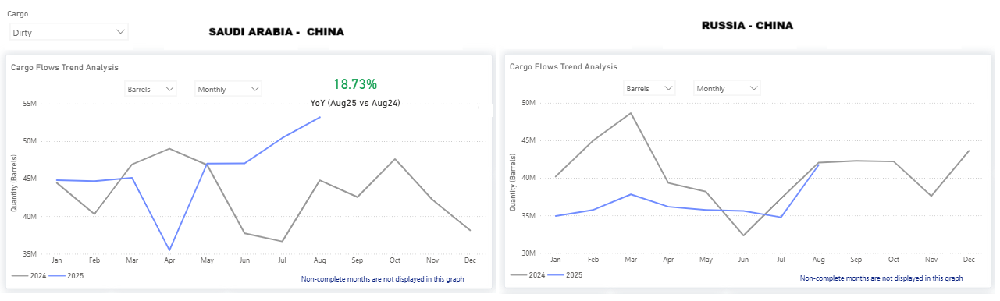

# Weekly Tanker Market Monitor: Week 37, 2025

**Date**: September 12, 2025 | **Category**: Tankers | **Section**: Monitors | **Source**: [https://www.thesignalgroup.com/weekly-market-monitor/tanker-week-37-2025](https://www.thesignalgroup.com/weekly-market-monitor/tanker-week-37-2025)

---

## Spotlight of the Week: Dirty Oil Flows to China

Book a walkthrough session with us to unpack the full data and insights

*https://app.signalocean.com/tanker/dynamic/oilflows*

This week, the spotlight is on the evolving monthly volumes of dirty oil flows, specifically the increasing trend from Saudi Arabia to China. In August, Saudi crude shipments to China surged by 19% year-on-year, exceeding 50 million barrels. This marks not only the highest monthly volume of 2025 so far but also the strongest level since early last year. This consistent upward trajectory since May indicates Saudi Arabia's aggressive strategy of adjusting its pricing to regain Asian market share.

Conversely, Russian flows into China have shown a decreasing trend in the first half of this year. August imports were around 40 million barrels, consistent with the same month in 2024 but significantly lower than the peaks observed in early 2024. While Chinese buyers continue to purchase Russian barrels, growth has clearly decelerated. The attractiveness of discounted Urals crude persists, but uncertainties stemming from U.S. tariff threats and reduced intake from India seemed to have diverted more Russian cargoes to China without generating additional upside. Consequently, it appears China is now favoring Saudi barrels, particularly in light of geopolitical pressures affecting Russian oil trades.

‍For the latest updates and insights, make sure to visit theSignal Ocean Newsroomwebsite page. Clickhere to request a demo. Readlast week's tanker monitor here.

For subscription to our FREE weekly market trends email,please click here, or contact us at: research@thesignalgroup.com

- Republishing is allowed with an active link to the source
