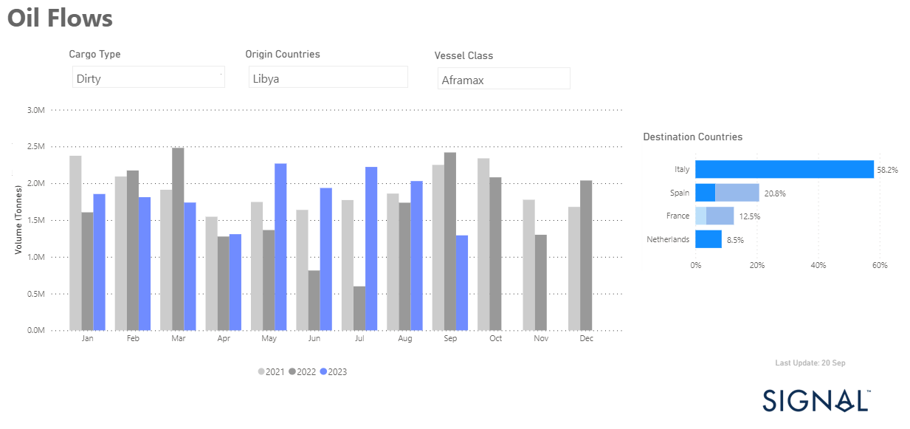

# Weekly Tanker Market Monitor: Week 38, 2023

**Date**: May 18, 2024 | **Category**: Tankers | **Section**: Monitors | **Source**: [https://www.thesignalgroup.com/weekly-market-monitor/tanker-week-38-2023](https://www.thesignalgroup.com/weekly-market-monitor/tanker-week-38-2023)

---

##### Higher growth rates of dirty Libyan exports to Italy, Spain, France and the Netherlands in 2Q - 3Q 2023

*Signal Figure*

The third week of September began on a positive note for VLCC crude oil freight rates, moving well off the August lows and setting a more energetic tone in the transition from the summer season. It remains uncertain whether this newfound momentum will continue through the end of the month as the market hopes for a stronger recovery during the upcoming winter period.

Downward pressure continues to be observed in the Aframax segment. However, one notable development should be highlighted: Libyan crude oil exports to Europe increased significantly during the summer months, exceeding volumes recorded in similar months over the past two years.

The oil market is recently facing the fear of inflation with the rise in oil prices, which have now surpassed $95 per barrel, raising concerns about rising inflation. Incidentally, OPEC has maintained its August estimate of global oil demand for 2023 at 2.4 million barrels per day (mb/d) and for 2024 at 2.2 mb/d.

Late in the week, Reuters published a surprising report on the shipment of the very first Russian crude blend to the United Arab Emirates, a development of great significance. As for oil supply cuts, the UAE has stated that it won't join Saudi Arabia's voluntary oil production cuts, as it believes the Saudi cuts are sufficient to stabilize markets.

For the latest updates and insights, make sure to visit theSignal Ocean Newsroomwebsite page. Clickhere to request a demo.

For subscription to our FREE weekly market trends email, please contact us: research@thesignalgroup.com

-Republishing is allowed with an active link to the source
