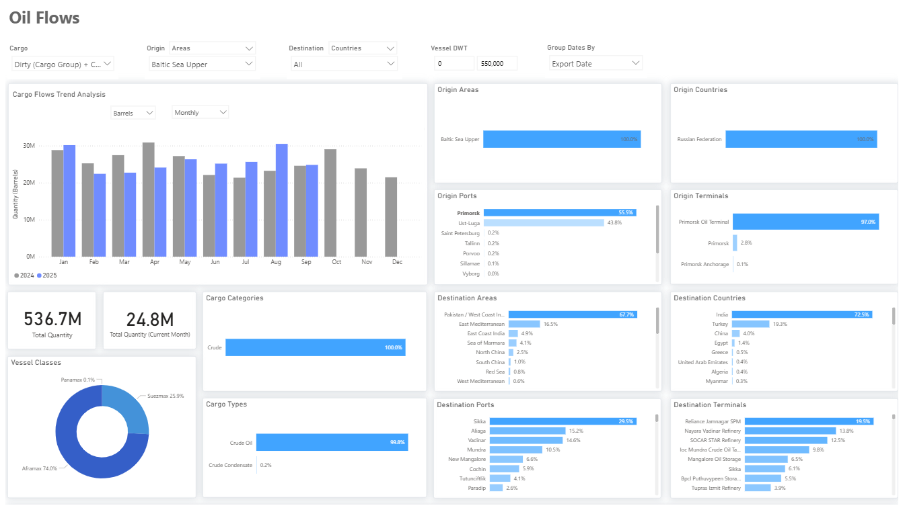
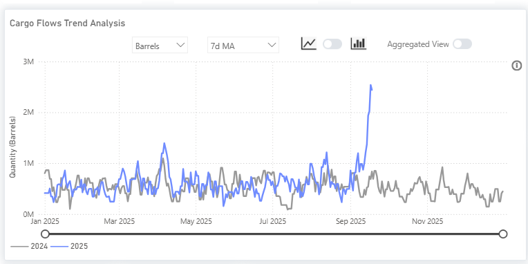
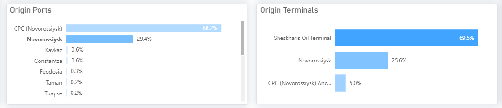
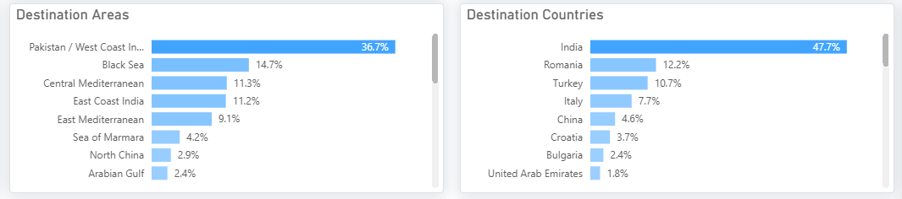

# Weekly Tanker Market Monitor: Week 38, 2025

**Date**: September 22, 2025 | **Category**: Tankers | **Section**: Monitors | **Source**: [https://www.thesignalgroup.com/weekly-market-monitor/tanker-week-38-2025](https://www.thesignalgroup.com/weekly-market-monitor/tanker-week-38-2025)

---

‍

*https://app.signalocean.com/tanker/dynamic/oilflows*

‍

### Baltic Sea Flows Under Pressure

This week’s focus is on the volatility of dirty oil flows from the Baltic Sea's upper region. Russian exports through this corridor have faced pressure after Ukrainian drone strikes on terminals and pipelines introduced new uncertainty into export patterns at Primorsk and Ust-Luga. The ports of Primorsk and Ust-Luga handle nearly all regional shipments. Primorsk accounts for over 55%, while Ust-Luga makes up 44%. Exports are almost entirely transported by Aframax (74%) and Suezmax (26%) ships, with India (73%) and Turkey (19%) as the main buyers, together taking more than 90% of shipments. Since the recent disturbances, we are beginning to see the first signs of a potential significant decrease in the monthly volume of dirty oil shipments from Primorsk. For the first 20 days of September, exports are estimated at 25 million barrels so far, roughly matching the same period last year. However, this is a notable drop of about 6 million barrels from the August peak of approximately 31 million barrels, underscoring how vulnerable Baltic crude flows remain in the face of ongoing shocks.

### Rising Role of Novorossiysk

‍

*Signal Figure*

Black Sea crude flows show a marked reconfiguration of Russia’s export network. Volumes through Novorossiysk appeared to be rising sharply in September, with the 7-day moving average approaching 3 million barrels per day equivalent. The Sheskharis terminal now handles nearly 70% of shipments, while Novorossiysk accounts for a further 25%.

*Signal Figure*

India receives the largest share of flows, at 48%, followed by Romania, Turkey, and Italy. This distribution demonstrates Moscow's strategy to maintain market access despite disruptions in the Baltic region.

*Signal Figure*

Planned September exports from Novorossiysk are now revised upward, with producers such as Novatek redirecting volumes southward after damage at Ust-Luga. These latest adjustments underline the Black Sea’s crucial role for sustaining Russian seaborne exports.

‍For the latest updates and insights, make sure to visit theSignal Ocean Newsroomwebsite page. Clickhere to request a demo. Readlast week's tanker monitor here.

For subscription to our FREE weekly market trends email,please click here, or contact us at: research@thesignalgroup.com

- Republishing is allowed with an active link to the source

‍

‍
