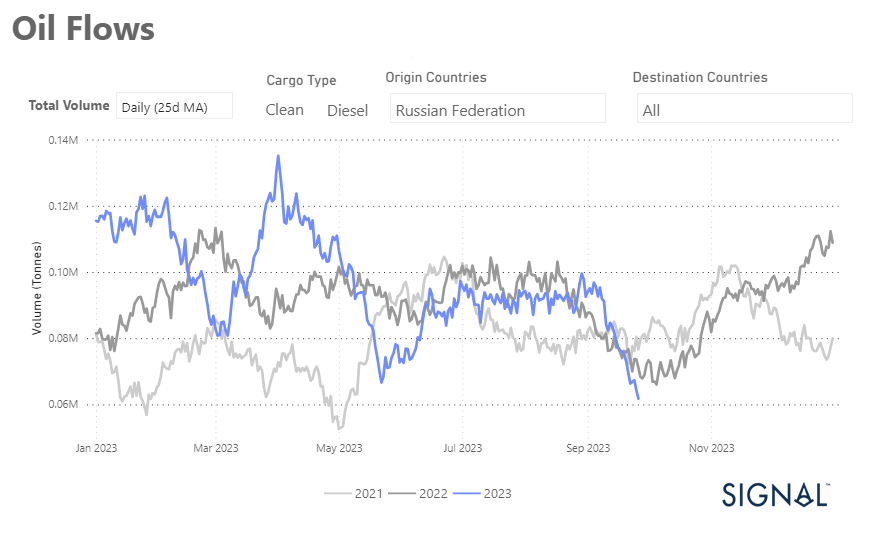

# Weekly Tanker Market Monitor: Week 39, 2023

**Date**: May 18, 2024 | **Category**: Tankers | **Section**: Monitors | **Source**: [https://www.thesignalgroup.com/weekly-market-monitor/tanker-week-39-2023](https://www.thesignalgroup.com/weekly-market-monitor/tanker-week-39-2023)

---

##### Russian diesel oil exports in September hit the lowest level of the year

*Signal Figure*

In the last week of September, there is some optimism in the VLCC crude oil freight market after a difficult summer season. It should be noted, however, that while there are positive signs, growth rates in tonne days aren't yet robust. The real test is ahead as we move into October, with supply figures already showing a downward trend. This decline is expected to be a driving force for the recovery of the freight market in the coming months.

Interestingly, the clean segment has seen a significant decline in Russian diesel shipments to all destinations. Russia appears to be prioritising its domestic energy needs, as evidenced by the decline in exports. From a historical perspective, September recorded the lowest volume compared to the same month two years ago and all of 2023.

In summary, while there is hope for the VLCC crude oil freight market in the last week of September, it's important to closely monitor rate and demand trends through October. The declining supply trend and the unexpected drop in Russian diesel shipments are notable factors that could affect the market recovery in the coming months.

For the latest updates and insights, make sure to visit theSignal Ocean Newsroomwebsite page. Clickhere to request a demo.

For subscription to our FREE weekly market trends email, please contact us: research@thesignalgroup.com

-Republishing is allowed with an active link to the source
