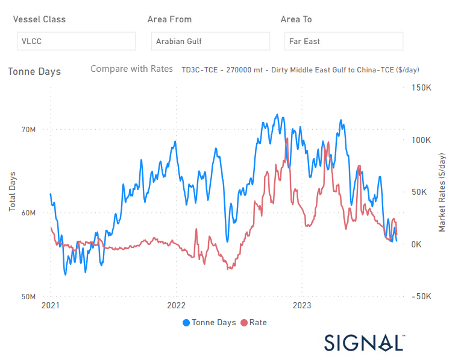

# Weekly Tanker Market Monitor: Week 40, 2023

**Date**: May 18, 2024 | **Category**: Tankers | **Section**: Monitors | **Source**: [https://www.thesignalgroup.com/weekly-market-monitor/tanker-week-40-2023](https://www.thesignalgroup.com/weekly-market-monitor/tanker-week-40-2023)

---

##### VLCC Tonne days growth from AG to China has decreased to the lowest level since the end of 2022

*Signal Figure*

‍

During the first week of October, the VLCC MEG China rates experienced a downward revision, amid hopes of a recovery. Looking at the demand, growth rates are still significantly lower than what they were the previous year leading to a negative sentiment in the crude freight market. Moreover, there are concerns about oil demand as oil prices dropped early in October due to Saudi Arabian oil supply cuts and a drop in US crude oil inventories. The U.S. crude futures have been trading lower for the fourth time in five sessions, and they currently stand at $87.58 a barrel. If this trend continues, it would be the lowest closing price since Sept. 11.

In the meantime, OPEC has decided to leave oil production levels unchanged. The OPEC+ panel reviewed the oil market and ended a brief meeting on Wednesday without recommending any changes to the current oil production policy. This decision came after Saudi Arabia and Russia both released separate statements confirming their intention to stick to their respective voluntary supply cuts until the end of the year.

For the latest updates and insights, make sure to visit theSignal Ocean Newsroomwebsite page. Clickhere to request a demo.

For subscription to our FREE weekly market trends email, please contact us: research@thesignalgroup.com

-Republishing is allowed with an active link to the source
