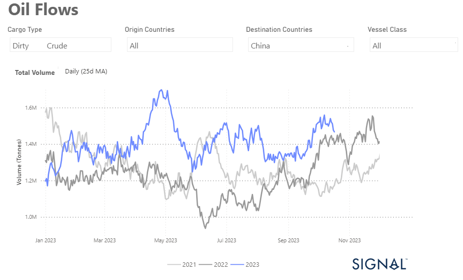

# Weekly Tanker Market Monitor: Week 42, 2023

**Date**: May 18, 2024 | **Category**: Tankers | **Section**: Monitors | **Source**: [https://www.thesignalgroup.com/weekly-market-monitor/tanker-week-42-2023](https://www.thesignalgroup.com/weekly-market-monitor/tanker-week-42-2023)

---

## Upward  revision of the monthly volume of dirty oil flows to China since the beginning of September

*Signal Figure*

The third week of October saw a noticeable improvement in market sentiment in the crude oil freight sector. At the same time, we have observed an increase of rates in the clean tanker segment. This upswing can be attributed to the new geopolitical crisis between Iran and Israel, which has led to a significant level of uncertainty in the oil market. As a result, oil prices have risen noticeably, affecting crude oil freight rates.

A look at the 25-day moving average (as shown in the attached chart) shows that crude flows destined for China have been on a steady upward trend since September, regardless of vessel size category.  The most recent peak was reached in May, underscoring the continued upswing in this area of the market.

On Wednesday, oil prices experienced an upward surge following a devastating explosion at a Gaza hospital. This incident has ignited worries about potential disruptions in the global oil supply. The international standard, Brent crude futures, saw a robust increase of $3, representing a gain of over 2%, pushing the price per barrel to $92.90. Simultaneously, West Texas Intermediate crude (WTI) futures also climbed by $3, marking a 2.1% rise, reaching $89.66 per barrel. These movements in both benchmarks have propelled them to their highest levels in the past two weeks.

For the latest updates and insights, make sure to visit theSignal Ocean Newsroomwebsite page. Clickhere to request a demo.

For subscription to our FREE weekly market trends email, please contact us: research@thesignalgroup.com

-Republishing is allowed with an active link to the source
