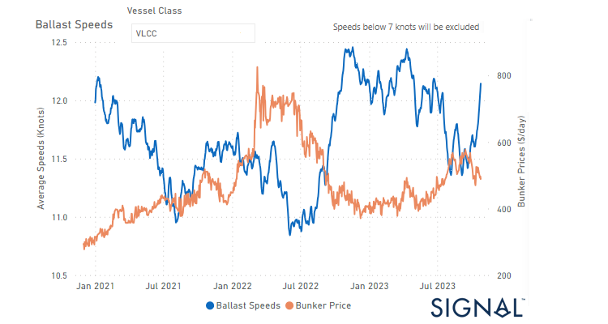

# Weekly Tanker Market Monitor: Week 43, 2023

**Date**: May 18, 2024 | **Category**: Tankers | **Section**: Monitors | **Source**: [https://www.thesignalgroup.com/weekly-market-monitor/tanker-week-43-2023](https://www.thesignalgroup.com/weekly-market-monitor/tanker-week-43-2023)

---

## Upward revision in VLCCs sailing ballast speed from the end of September, which coincides with a decrease in bunker prices

*Signal Figure*

The third week of October saw a noticeable improvement in market sentiment in the crude oil freight sector. At the same time, we have observed an increase of rates in In the final week of October, crude freight rates on the VLCC MEG-China route witnessed a decline, accompanied by a noticeable uptick in the number of vessels at the VLCC Ras Tanura port. This occurred amidst persistent challenges in the oil industry, marked by ongoing crises that exert downward pressure on oil prices and production levels. However, it is interesting to note that the average ballast speed of VLCC tankers (see image above) increased to levels more than 12knots as the bunker prices cost ($/d) started to fall before the end of the month.

On a heightened geopolitical risk, Brent crude futures settled at $90 a barrel. U.S on Wednesday and U.S. West Texas Intermediate (WTI) crude futures at $85.39 a barrel. Meanwhile, CNBC news reported that U.S. President Joe Biden’s administration is likely to tighten crude oil sanctions against OPEC member Iran in response to the Islamic Republic’s backing of Palestinian militant group Hamas.

For the latest updates and insights, make sure to visit theSignal Ocean Newsroomwebsite page. Clickhere to request a demo.

For subscription to our FREE weekly market trends email, please contact us: research@thesignalgroup.com

-Republishing is allowed with an active link to the source
