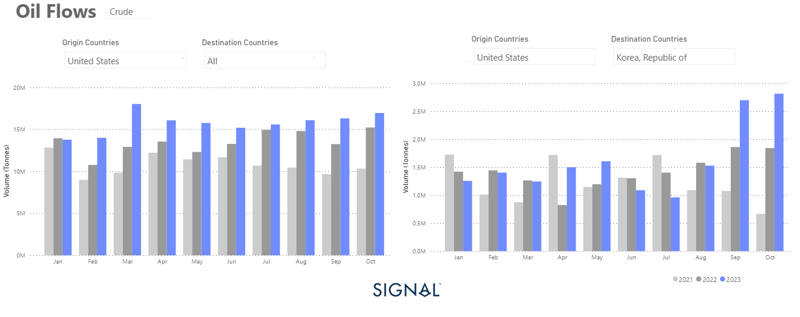

# Weekly Tanker Market Monitor: Week 45, 2023

**Date**: May 18, 2024 | **Category**: Tankers | **Section**: Monitors | **Source**: [https://www.thesignalgroup.com/weekly-market-monitor/tanker-week-45-2023](https://www.thesignalgroup.com/weekly-market-monitor/tanker-week-45-2023)

---

## U.S. crude oil exports record remarkable rise destined to Korea

*Signal Figure*

The crude freight market gained momentum in early November due to the ongoing crisis in the Middle East. The VLCC segment has seen significant activity, but the In the second week of November, freight rates for crude oil tankers remained firm with slight signs of a downward correction. The upward momentum of early November in the second half of November remains uncertain as there are signs of an increase in the supply of crude oil tankers, which contrasts with the downward trend observed at the end of October.

Looking at the demand side of the equation, the growth rates (in tonne days) appear to be strengthening. This trend is expected to continue as the winter season approaches, and Chinese crude oil imports have seen a significant increase in October. It's also worth noting that crude oil exports from the US have increased significantly this year. Korea has even replaced China as the most important destination for American crude oil, which is an interesting development on the global oil market.

Oil prices decreased this week reaching their lowest levels since the end of July. This decline can be attributed to a combination of factors, including mixed economic data from China, increased OPEC exports and the strengthening of the US dollar. According to Reuters, Brent crude futures closed below $80 a barrel on Wednesday for the first time since the Hamas Islamist attack on Israel on October 7. Brent crude futures dropped, settling at $79.54 per barrel, while U.S. crude followed suit, closing at $75. These numbers marked their lowest points since mid-July. Adding to the downward pressure, U.S. crude oil stocks saw a significant uptick, climbing by nearly 12 million barrels last week, according to information from market sources on Tuesday citing American Petroleum Institute data.

For the latest updates and insights, make sure to visit theSignal Ocean Newsroomwebsite page. Clickhere to request a demo.

For subscription to our FREE weekly market trends email, please contact us: research@thesignalgroup.com

-Republishing is allowed with an active link to the source
