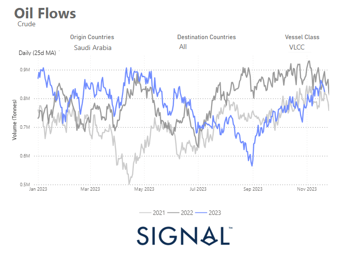

# Weekly Tanker Market Monitor: Week 47, 2023

**Date**: May 18, 2024 | **Category**: Tankers | **Section**: Monitors | **Source**: [https://www.thesignalgroup.com/weekly-market-monitor/tanker-week-46-2023-2](https://www.thesignalgroup.com/weekly-market-monitor/tanker-week-46-2023-2)

---

## Daily 25d moving average at a higher volume pace with VLCC tankers amid production cuts

*Signal Figure*

In the last week of November, the crude oil freight market showed continued weakness in sentiment, although earlier expectations pointed to a recovery in the very large crude carrier (VLCC) segment. At present, the market appears to be struggling to find a balance between the availability of ships and the still erratic growth in demand.

With the ongoing winter season in December, there is optimism that momentum will pick up and concerns about tight supply have gradually eased. In particular, the inflow of Saudi Arabian crude oil to various destinations has gradually increased compared to the levels observed at the end of September.

Looking at the 25-day moving average of the day, a significant increase in volumes can be seen, especially for VLCC tankers given the ongoing production cuts. This recent upward trend suggests that the increased activity will continue in the coming days, with signs pointing to volumes approaching those recorded in the same period last year.

For the latest updates and insights, make sure to visit theSignal Ocean Newsroomwebsite page. Clickhere to request a demo.

For subscription to our FREE weekly market trends email, please contact us: research@thesignalgroup.com

-Republishing is allowed with an active link to the source
