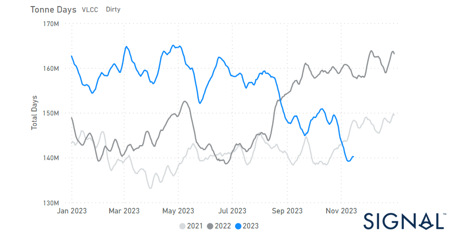

# Weekly Tanker Market Monitor: Week 46, 2023

**Date**: May 18, 2024 | **Category**: Tankers | **Section**: Monitors | **Source**: [https://www.thesignalgroup.com/weekly-market-monitor/tanker-week-46-2023](https://www.thesignalgroup.com/weekly-market-monitor/tanker-week-46-2023)

---

## Growth in VLCC dirty tonne days slowed to its lowest level of the year in the fourth quarter

*Signal Figure*

In the third week of November, crude freight market sentiment recorded a decrease with VLCC AG to China rates holding a resistance for firmer levels, however, when looking at the demand side there has been a further decrease in VLCC dirty tonne days growth. In the clean segment, there has been a rather steady sentiment amid a weakening picture of the previous weeks, while demand does not yet still provoke signs of recovery. Overall, the fourth quarter of the year seems to evolve with a downward pressure on freight rates despite optimism for a winter demand boosting the rates.

On Thursday, a decline in oil prices continued, building on losses from the previous session. This downturn was fuelled by apprehensions about subdued energy demand from China, contributing to a lacklustre sentiment in the market. Brent futures witnessed a dip, hovering around $80, while U.S. West Texas Intermediate crude (WTI) saw a decrease, reaching $76.01. The prevailing market conditions reflect the impact of concerns over Chinese energy demand and contribute to the overall downward trend in oil prices.

For the latest updates and insights, make sure to visit theSignal Ocean Newsroomwebsite page. Clickhere to request a demo.

For subscription to our FREE weekly market trends email, please contact us: research@thesignalgroup.com

-Republishing is allowed with an active link to the source
