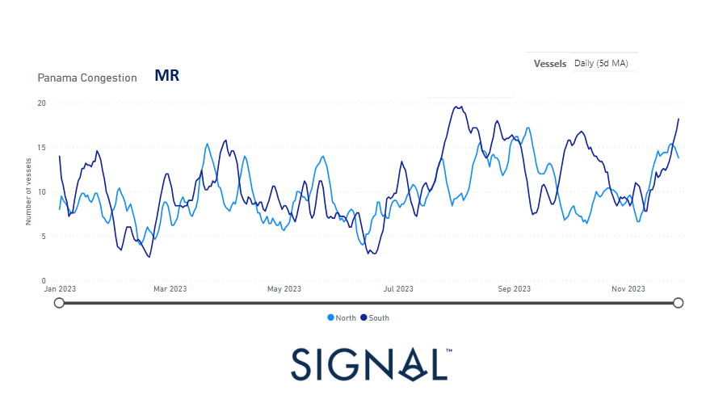

# Weekly Tanker Market Monitor: Week 48, 2023

**Date**: May 18, 2024 | **Category**: Tankers | **Section**: Monitors | **Source**: [https://www.thesignalgroup.com/weekly-market-monitor/tanker-week-48-2023](https://www.thesignalgroup.com/weekly-market-monitor/tanker-week-48-2023)

---

## The congestion in the Panama Canal remained significant for MR, which had a positive impact on USG rates

*Signal Figure*

Sentiment for crude oil freight rates deteriorated in November, which was particularly evident in the weaker trend towards the end of the month. However, there was a glimmer of optimism in the Very Large Crude Carrier (VLCC) segment, supported by a downward trend in supply below the annual average. In particular, the growth rate of VLCC demand in tonne-days recovered in the second half of the month, creating the conditions for more robust momentum in VLCC freight rates at the beginning of December.

Surprisingly, rates recovered in the clean segment for MR1 size vessels in the US Gulf (USG). This unexpected rebound appears to be related to a steady increase in congestion in the Panama Canal, which led to significant spikes during the month. The sustainability of this newfound strength for MR tankers remains uncertain as challenging supply dynamics continue to hamper momentum. The evolving situation prompts close monitoring to assess the lasting stability of these recent positive trends.

Meanwhile, the Saudi Energy Ministry, as stated on its official website, has confirmed the extension of its voluntary reduction of 1 million barrels per day. This extension is set to persist throughout the initial three months of the upcoming year, maintaining the cut that was originally scheduled to conclude by the year-end. Notably, this commitment adds to the broader context of substantial cuts implemented by OPEC+ and individual nations.

For the latest updates and insights, make sure to visit theSignal Ocean Newsroomwebsite page. Clickhere to request a demo.

For subscription to our FREE weekly market trends email, please contact us: research@thesignalgroup.com

-Republishing is allowed with an active link to the source
