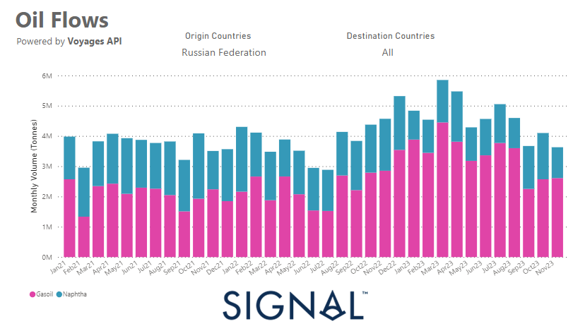

# Weekly Tanker Market Monitor: Week 49, 2023

**Date**: May 18, 2024 | **Category**: Tankers | **Section**: Monitors | **Source**: [https://www.thesignalgroup.com/weekly-market-monitor/tanker-week-49-2023](https://www.thesignalgroup.com/weekly-market-monitor/tanker-week-49-2023)

---

## Russian clean flows to all destinations in a decreasing trend after the end of 2q 2023

*Signal Figure*

At the beginning of the first week of December, the outlook for crude oil freight rates, especially in the VLCC category, isn't yet stable. In the meantime, there is a strong upturn in the MR-US Gulf in the clean segment. There are signs of an upward trend in the vessel supply with figures above the annual average, which raises concerns about a steady potential weakening of crude oil freight rates. However, the Aframax segment offers a contrasting picture with promising demand growth.

In the clean segment, MR vessel sizes are facing problems, particularly reflected in a decline in Russian clean exports in all directions. At the end of the third quarter, there was a significant decline in monthly volume of tonnes for Russian gasoil and naphtha cargoes, suggesting that volumes have fallen sustainably from the peaks in March and April.

For the latest updates and insights, make sure to visit theSignal Ocean Newsroomwebsite page. Clickhere to request a demo.

For subscription to our FREE weekly market trends email, please contact us: research@thesignalgroup.com

-Republishing is allowed with an active link to the source
