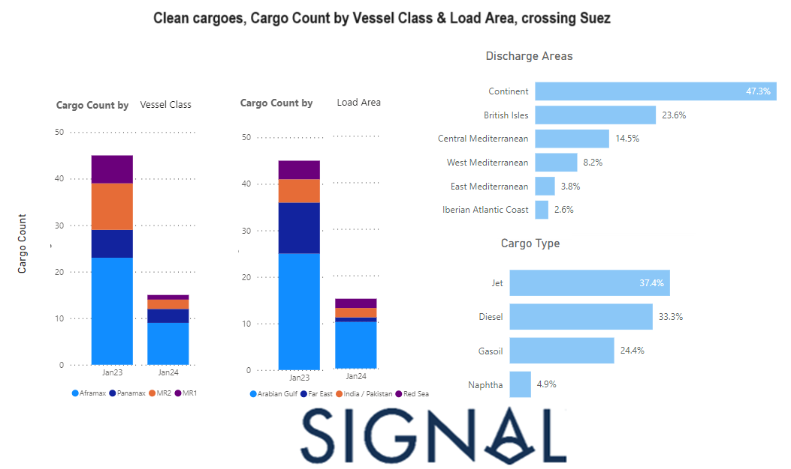

# Weekly Tanker Market Monitor: Week 5, 2024

**Date**: May 18, 2024 | **Category**: Tankers | **Section**: Monitors | **Source**: [https://www.thesignalgroup.com/weekly-market-monitor/tanker-week-5-2024](https://www.thesignalgroup.com/weekly-market-monitor/tanker-week-5-2024)

---

## A significant downward revision compared to the monthly volumes from the previous year

*Signal Figure*

‍

The conclusion of January presents an intriguing perspective on freight rates for LR2 clean product tankers, with recent rate spikes expected to persist into February due to heightened concerns in the Red Sea, influencing cargo deviations. A thorough analysis of clean cargoes originating from loading zones such as the Arabian Gulf, Pakistan/Western Coast of India, Far East, and the Red Sea, destined for the Mediterranean-UK continent, reveals a noteworthy decline in shipment volumes via the Suez Canal in January 2024. The visual representation above vividly portrays the reduction in shipments across various vessel classes and loading areas, underlining a significant contrast to the corresponding period in the previous year.

For the latest updates and insights, make sure to visit theSignal Ocean Newsroomwebsite page. Clickhere to request a demo.

For subscription to our FREE weekly market trends email, please contact us: research@thesignalgroup.com

-Republishing is allowed with an active link to the source
