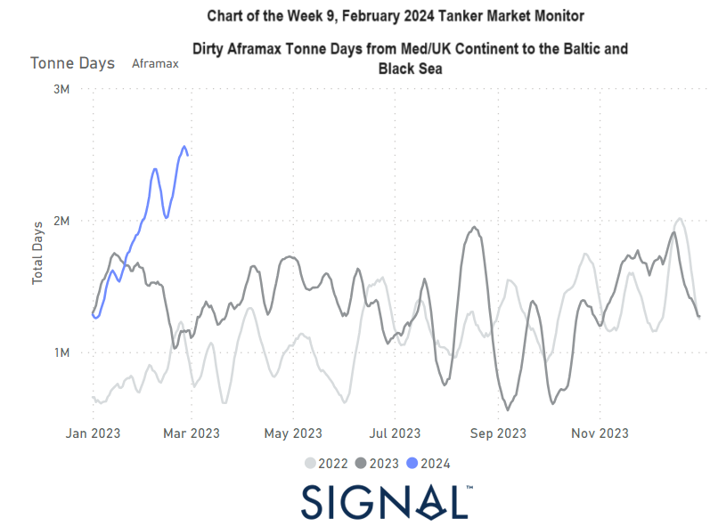

# Weekly Tanker Market Monitor: Week 9, 2024

**Date**: May 18, 2024 | **Category**: Tankers | **Section**: Monitors | **Source**: [https://www.thesignalgroup.com/weekly-market-monitor/tanker-week-9-2024](https://www.thesignalgroup.com/weekly-market-monitor/tanker-week-9-2024)

---

## The Aframax dirty tonne days experienced a significant surge in growth starting from mid-January, particularly in the route from the Mediterranean to the Baltic/Black Sea

‍

*Signal Figure*

By the end of February, the freight market sentiment once again showed weakness in the VLCC MEG-China route, despite hopes for an upturn. Concurrently, the number of vessels in Ras Tanura recorded increased levels above the annual average. It appears that the VLCC market is striving to strike a stronger balance between supply and demand in favor of demand, yet the abundance of supply continues to weigh on the momentum for firmer pricing in market rates.

In terms of demand and the growth of tonne days, there was a glimmer of hope in the second month of the year with a rise in the Aframax segment, along with signs of a potential reversal in the growth of VLCC tonne days. Particularly noteworthy is the notable spike in the growth of total days from mid-February in the Mediterranean/UK continent to the Baltic and Black Sea routes. It remains to be seen how this upturn will manifest in the freight market momentum as we progress into March, nearing the end of the first quarter.

‍

For more information on this week's trends or if you wish to subscribe to our FREE weekly market trends email, please contact us: research@thesignalgroup.com

-Republishing is allowed with an active link to the source
