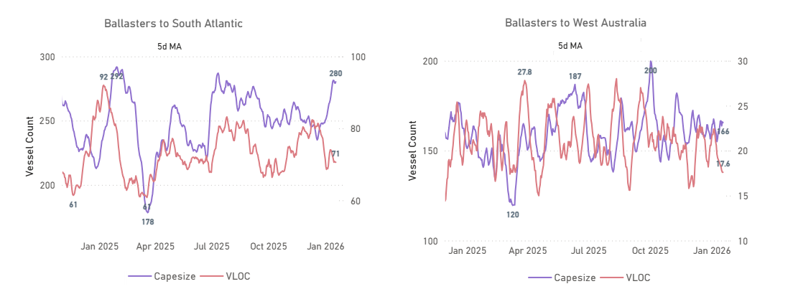
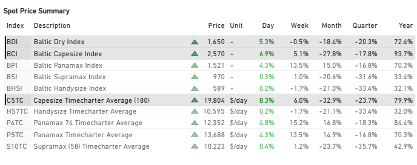
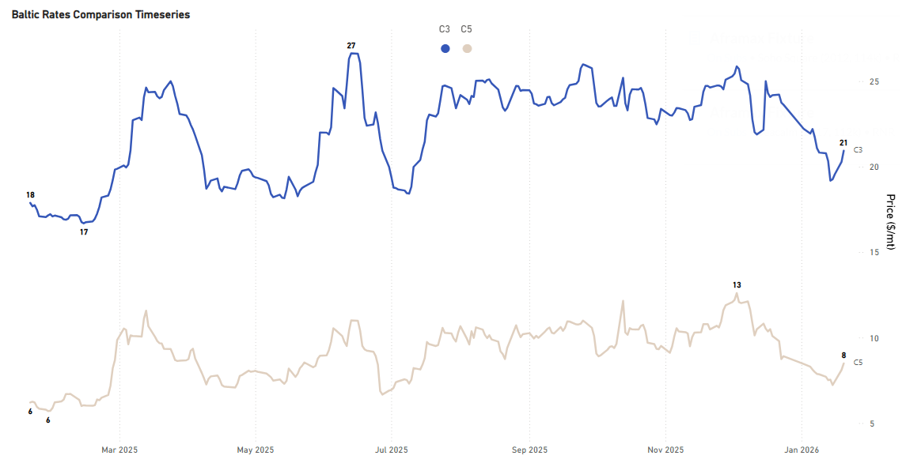
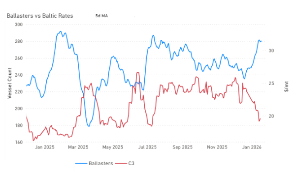
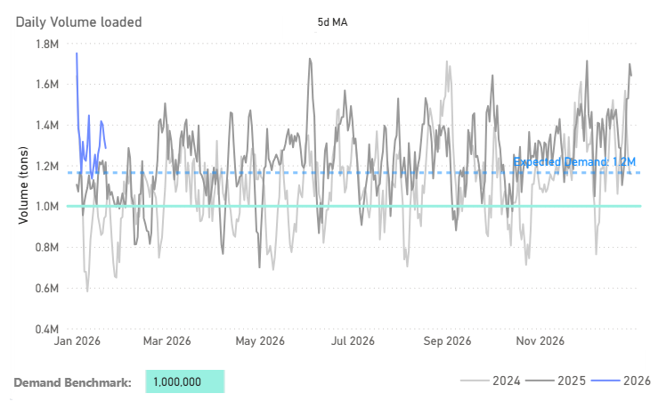
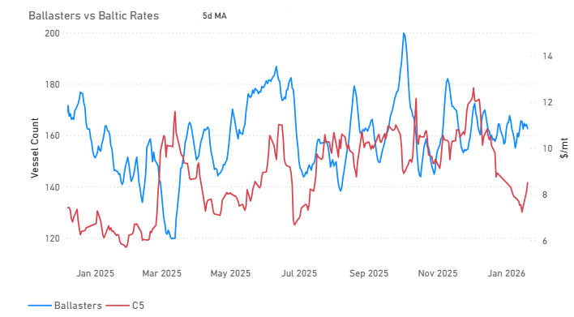
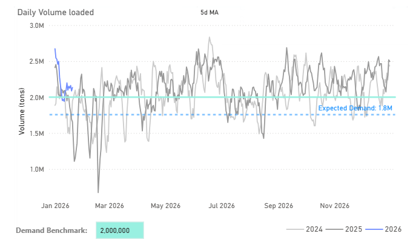
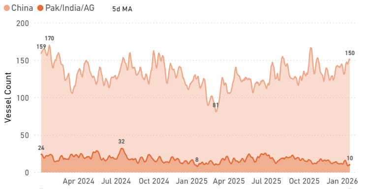

# Weekly Dry Market Monitor: Week 04, 2026

**Date**: January 21, 2026 | **Category**: Dry bulk | **Section**: Monitors | **Source**: [https://www.thesignalgroup.com/weekly-market-monitor/weekly-dry-market-monitor-week-04-2026](https://www.thesignalgroup.com/weekly-market-monitor/weekly-dry-market-monitor-week-04-2026)

---

## Chart of the Week|CapesizeBallasters

South Atlantic Vs Pacific

‍

*Signal Figure*

## Key Takeaways

- The Baltic Capesize Index opened the week marginally firmer, while weekly performance remains lower, indicating continued sensitivity in the freight market.
- Ballaster availability remains elevated across both basins, with approximately 160 vessels (5-day MA) in West Australia and around 280 vessels (5-day MA) in the South Atlantic.
- South Atlantic ballaster counts are around 40 vessels higher than at end-December, highlighting increased vessel availability relative to recent month-end levels.

‍

## Market Overview

### Spot dryfreightindices showed modest daily gains.

*Signal Figure*

The past week delivered a series of developments with potential implications for dry bulk freight demand in the months ahead. At the opening of the third week of January (19 January), market conditions were reflected in Baltic Dry Index value (BDI) of around 1,650, alongside Baltic Capesize Index (BCI) near 2,570 and Baltic Panamax Index (BPI) at approximately 1,520.

On the iron ore front, as of 19 January, prices had declined for a fifth consecutive session, reflecting concerns around oversupply. The move followed confirmation from Beijing of a substantial reduction in steel output, alongside rising port inventories and the arrival of initial cargoes from Guinea’s Simandou project.

In parallel, developments in the coal sector continue to underline China’s central role in bulk commodity demand. China is preparing to commission more than 100 new coal-fired power generation units in 2026, accounting for 85 of the 104 projects planned globally and adding approximately 55 GW of capacity. Other countries, including India, Vietnam, and Indonesia, are also expanding capacity, with India contributing roughly 24 GW. As a result, China is expected to represent 86% of new global coal-fired power capacity entering operation in 2026, up from 78% in 2025, supporting expectations of sustained coal-related trade flows despite the overall energy transition.

Agricultural trade activity also remained firm. China was active in the soybean market, with up to 20 cargoes of US and Brazilian soybeans reportedly traded in the week ending 16 January. Market sources indicated that China is nearing completion of its 12 million metric tonne US soybean purchase target, with some participants suggesting total commitments could exceed this level.

## FREIGHT MARKET

### Capesize |Firmer

‍

*Signal Figure*

‍

- C3– Tubarao to Qingdao is currently assessed at around $20.9/mt, with recent day-on-day (+3.2%) and week-on-week (+3.0%) increases. Over longer horizons, the performance remains lower, with rates 13.6% below month-ago levels and 14.6% below quarter-ago levels. Year-on-year comparisons remain higher at +17.0%. C3 is presently trading below its 52-week average of approximately $22.0/mt, indicating that current levels remain within the lower range of recent historical observations.
- C5– West Australia to Qingdao is currently assessed at around $8.5/mt, with recent day-on-day (+4.7%) and week-on-week (+13.0%) increases. Over longer horizons, rates remain lower, standing 13.3% below month-ago levels and 18.9% below quarter-ago levels. Year-on-year comparisons are higher at +36.8%. Similar to C3, C5 continues to trade below its 52-week average of approximately $9.1/mt.

## BALLASTERS|C3IncreasingVs Baltic Rates

‍

*Signal Figure*

‍

- Between 24 Dec 2025 and 20 Jan 2026, ballaster counts increased from 246 to 282 vessels, reaching a peak during the period between these two observation points, while C3 declined from $23.62/mt to $20.93/mt. This highlights higher vessel availability being observed alongside lower freight levels during January. With ballaster counts having reached a peak during January, subsequent changes typically reflect vessels being absorbed into employment, altering the level of visible ballaster availability.

## DEMAND | South Atlantic Daily Volume Loaded

*Signal Figure*

- When examining daily volume loaded in the South Atlantic for C3, recent data indicate that loadings have been occurring above the 1.0 million-ton benchmark. This suggests that cargo activity remains present, which may contribute to the absorption of vessel availability as the month progresses.

## BALLASTERS|C5SteadyVs Baltic Rates

‍

*Signal Figure*

- In contrast to the Atlantic, the Pacific market presents a different picture. As of 20 Jan 2026, ballaster counts stand at approximately 163 vessels, showing an almost steady trend for January, while C5 is assessed at around $8.50/mt.

## DEMAND | West Australia Daily Volume Loaded

*Signal Figure*

- Recent data indicate that Capesize demand in both the Atlantic and Pacific has been tracking close to, and at times above, established demand benchmarks. For West Australia, daily volumes have recently been recorded above the 2.0 million-ton level, highlighting sustained cargo activity in the region.

## PORT CONGESTION | Discharge China

*Signal Figure*

- The number of vessels congested at Chinese discharge ports has recently been observed at higher levels, with current estimates around 150 vessels. This is above levels recorded toward the end of the previous year and higher than the lows seen earlier in the period, placing congestion toward the upper end of its recent range.

For the latest updates and insights, make sure to visit theSignal Ocean Newsroompage &subscribe to weekly reports. Clickhere to request a demo. Click here to see theprevious dry bulk weeklyreport.

For subscription to our FREE weekly market trends email, please contact us: research@thesignalgroup.com

-Republishing is allowed with an active link to the source
