# Weekly Dry Market Monitor: Week 05, 2026

**Date**: January 29, 2026 | **Category**: Dry bulk | **Section**: Monitors | **Source**: [https://www.thesignalgroup.com/weekly-market-monitor/weekly-dry-market-monitor-week-05-2026](https://www.thesignalgroup.com/weekly-market-monitor/weekly-dry-market-monitor-week-05-2026)

---

## Chart of the Week|U.S. GrainFlowsto China

## China continues to favour Brazilian and South American supplies into early 2026

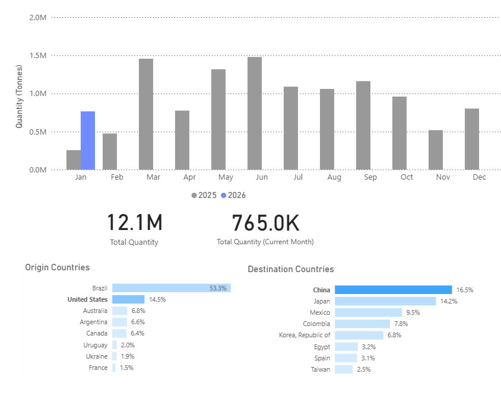
*Signal Figure*

*Signal Figure*

- U.S. soybean shipments have resumed, but flows remain episodic and seasonally concentrated rather than continuous.
- Brazil enters early 2026 with expanding export availability, reinforcing its role as China’s primary supplier.
- Shipment patterns indicate continuity rather than transition in China’s sourcing strategy.

China resumed imports of U.S. soybeans in 2025, with cumulative shipments estimated at approximately 12 million tonnes. These volumes were concentrated early in the year, primarily during January–February, with shipments declining thereafter and remaining limited for the rest of the year. The shipment profile does not indicate a sustained increase beyond this early-season period.

Brazil remained the primary supplier to China throughout the year. Brazilian-origin shipments accounted for more than half of cumulative China-bound volumes, reflecting consistent export availability rather than reliance on short-term shipment windows. While monthly volumes eased toward year-end, Brazil maintained a steady presence across destinations.

## Brazil Supply Outlook

Brazil’s 2025/26 soybean harvest is currently projected at approximately 160–165 million tonnes, placing production near record levels and modestly above the prior year. Harvest activity typically accelerates from January, with export availability increasing into Q1 2026. This timing has supported advance sales and scheduled shipments to China ahead of peak export months.

The moderation in Brazilian shipments observed late in 2025 is consistent with typical seasonal patterns, as export volumes often ease following the main mid-year shipping window and ahead of the next harvest cycle. This timing aligns with the gradual drawdown of old-crop supplies rather than a deterioration in import demand. Import activity during this period appears consistent with advance coverage and scheduling decisions linked to expected early-2026 harvest availability, rather than short-term changes in consumption.

## U.S. Shipment Pattern

Data from early January 2026 indicate a resumption of U.S.–China soybean shipments, although volumes remain below earlier peaks and lower than Brazilian loadings. Viewed alongside the 2025 shipment pattern, U.S. exports to China continue to occur primarily within defined seasonal or pricing-driven periods.

Based on shipment timing and volume distribution, there is no clear evidence of a structural change in China’s sourcing behaviour. Brazil’s production scale and export timing continue to underpin its position in China’s import mix, while U.S. shipments remain intermittent.

## FREIGHT

## Capesize | Atlantic Firmer

*Signal Figure*

## ‍

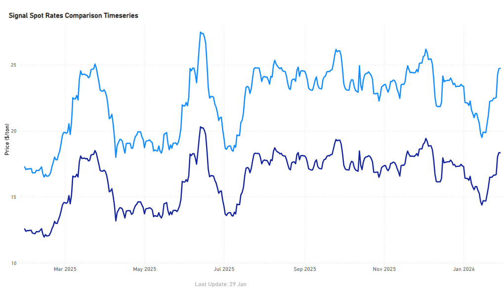
*Signal Figure*

- Atlantic Capesize routes firmed into the close of January, rebounding from mid-January lows, with Brazil–China recovering to around $24.7/tonne (≈+6–7% from mid-Jan troughs) and South Africa–China rising to about $18.3/tonne (≈+5–6%).

## Panamax | Atlantic / Pacific Firmer

*Signal Figure*

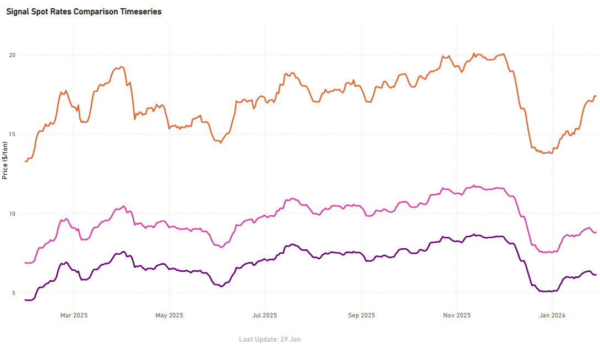
*Signal Figure*

- Atlantic Panamax (EAus–China) strengthened to around $17.4/tonne, up ~26% m/m, while Pacific Panamax also showed solid recovery, with Indo–China at ~$6.1/tonne (+~21% m/m) and Indo–India at ~$8.8/tonne (+~17% m/m).

*Signal Figure*

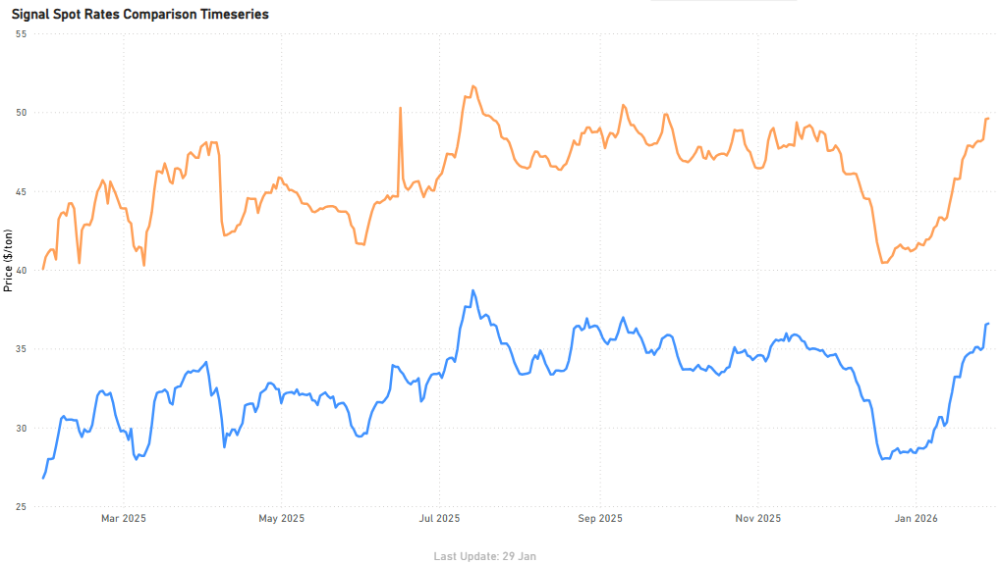
*Signal Figure*

## Supramax | Atlantic Firmer

*Signal Figure*

- Atlantic Supramax USG and ECSA softened on a month-on-month basis, but held firm week-on-week into late January. USG–Far East stood around $38.1/tonne (-0.5% m/m; +0.3% w/w), while ECSA–Far East was at approximately $33.4/tonne (-2.6% m/m; +1.8% w/w)

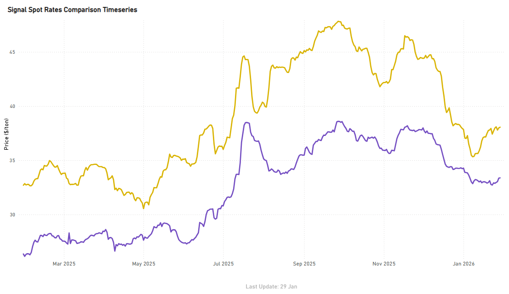
*Signal Figure*

## Handysize | Atlantic Firmer

*Signal Figure*

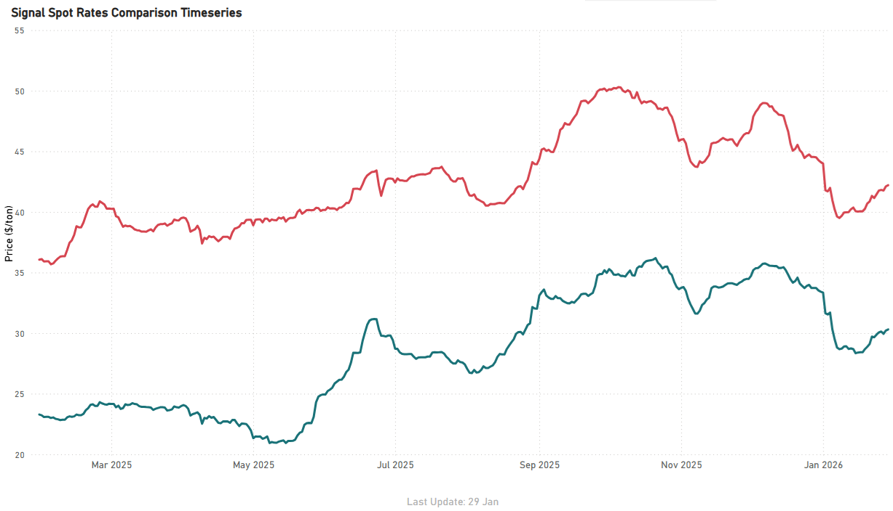
*Signal Figure*

- Handysize Atlantic routes showed renewed weekly firmness, despite remaining softer on a month-on-month basis. Brazil–Skaw/Pass firmed to around $42.2/tonne (+2.2% w/w; -5.2% m/m), while USG–NCSA/Skaw-Pass strengthened to approximately $30.3/tonne (+2.0% w/w; -10.1% m/m)

## BALLASTERS OVERVIEW

## Capesize | 5D MA Increasing

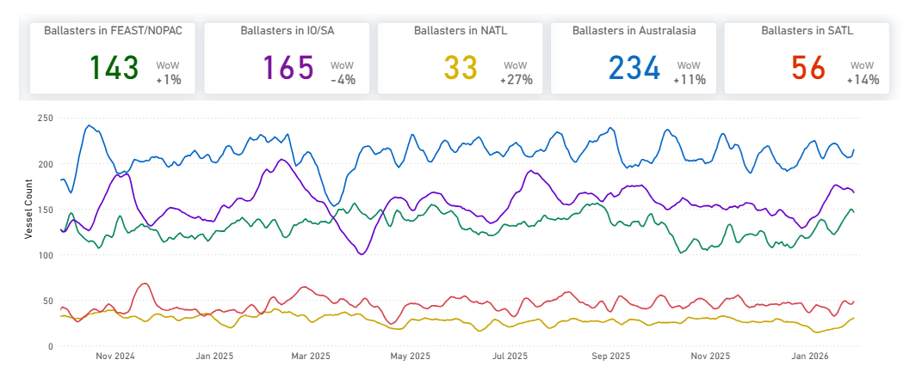
*Signal Figure*

- Supply pressure in the Atlantic significantly increased week-on-week, evidenced by a sharp rise in ballasters. Specifically, North Atlantic ballasters jumped to 33, marking a 26% week-on-week increase, while South Atlantic ballasters climbed to 57, an increase of 30% week-on-week.

## Panamax | 5D MA Mixed

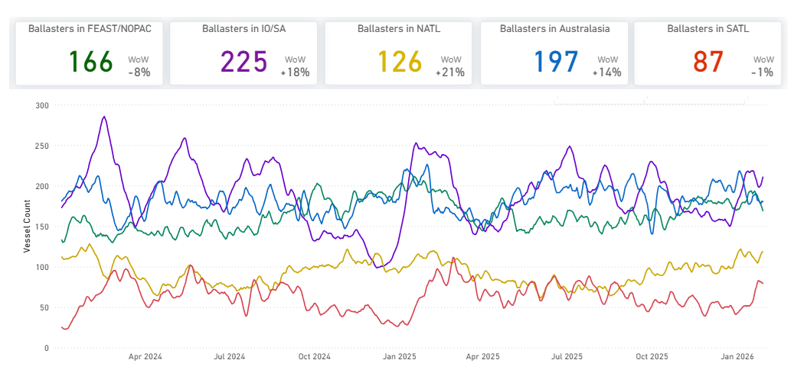
*Signal Figure*

- Supply pressure in the Pacific and Indian Ocean increased week-on-week. SE Asia/Australasia ballasters rose to 197 (+14% WoW), while Indian Ocean/South Africa ballasters climbed sharply to 225 (+18% WoW). FEAST/NOPAC ballasters stood at 166, remaining elevated despite an 8% WoW pullback.

## Supramax| 5D MA Increasing

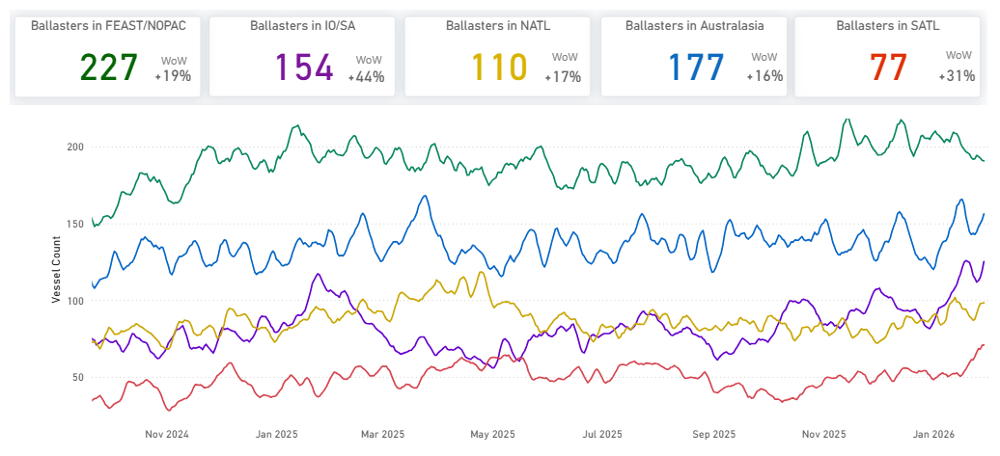
*Signal Figure*

- Supramax supply pressure increased both the Atlantic and Pacific week-on-week. North Atlantic ballasters climbed to 110 (+17% WoW) and South Atlantic rose to 77 (+31% WoW). In the Pacific, FEAST/NOPAC ballasters jumped to 227 (+19% WoW), while Australasia increased to 177 (+16% WoW).

## Handysize| 5D MA Increasing

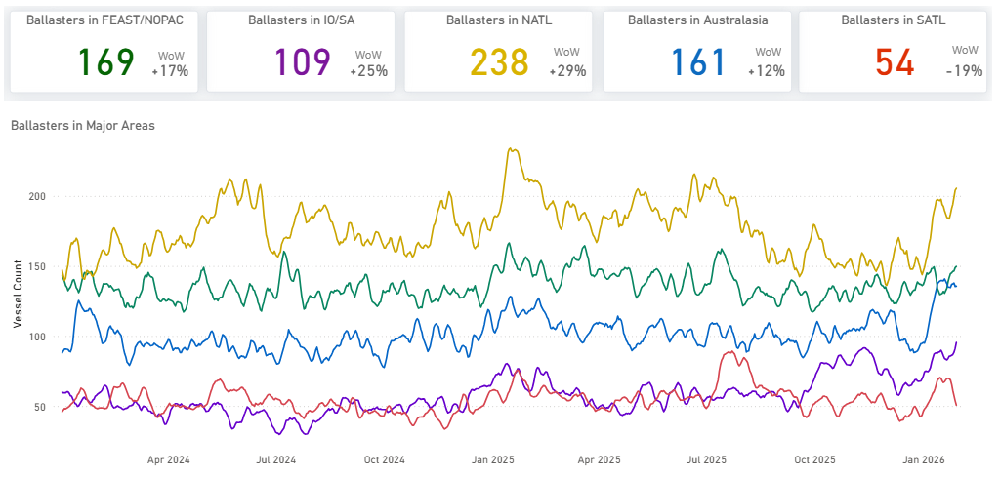
*Signal Figure*

- Handysize supply pressure remained elevated week-on-week, with increases seen in both the Pacific and Indian Ocean, while the North Atlantic was the sole area to see a decline. FEAST/NOPAC ballasters rose to 169 (+17% WoW), and Australasia increased to 161 (+12% WoW), while Indian Ocean/South Africa also increased to 109 (+25% WoW).

## PORT CONGESTION

## SupramaxChittagong| Increasing

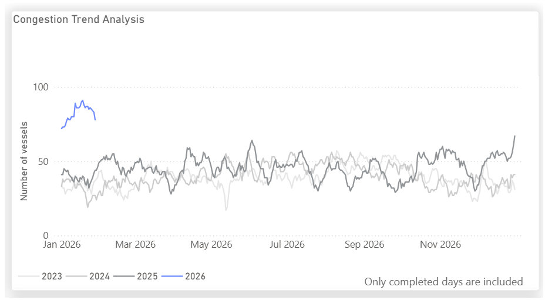
*Signal Figure*

In January 2026, Chittagong experienced a notable increase in vessels anchored offshore, indicative of ongoing port congestion. This backlog aligns with recentnewsdetailing slow discharge operations and limited unloading capacity, which have caused prolonged vessel turnaround times. The strain on berth and yard efficiency is evident, with sources indicating that importers are being pressed to clear cargo within a five-day window.

For the latest updates and insights, make sure to visit theSignal Ocean Newsroompage &subscribe to weekly reports. Clickhere to request a demo. Click here to see theprevious dry bulk weeklyreport.

For subscription to our FREE weekly market trends email, please contact us: research@thesignalgroup.com

-Republishing is allowed with an active link to the source
