# Weekly Dry Market Monitor: Week 08, 2026

**Date**: February 19, 2026 | **Category**: Dry bulk | **Section**: Monitors | **Source**: [https://www.thesignalgroup.com/weekly-market-monitor/weekly-dry-market-monitor-week-08-2026](https://www.thesignalgroup.com/weekly-market-monitor/weekly-dry-market-monitor-week-08-2026)

---

## DRY MARKET MONITOR

Freight Market Signals, Ballasters’ Overview & Tonne Charts

## Key Takeaways

- Argentina begins shipping wheat to China, adding origin diversification but with limited immediate impact on vessel allocation.
- Freight markets remain firm, with the BDI near 2,000 and strong year-on-year gains across most segments.
- Capesize corrects but stays elevated; Panamax remains resilient, particularly on Atlantic grain routes.
- Pacific basin supply pressure persists, especially in larger vessel classes.
- Tonne-mile growth softens for Capesize and Panamax, while smaller segments continue to outperform.

## Spotlight of the Week|Argentina–China Wheat Corridor Emerges

China’s wheat import program has historically been concentrated mostly on Canada and Australia, which together account for roughly 70% of total volumes, while the United States, France, and Russia contribute smaller shares.TSOPflow data mirrors this concentration on the freight side. Approximately 70% of China-bound wheat shipments move on Panamax vessels, with around 20% carried on Supramax vessels (TSOP Seaborne Grain Flow Database, 2023–2025).

![Agricultural Cargo Flows Trend Analysis available via the TSOP platformhereAll data and commentary reflect market conditions as of [Wednesday, 18 February 2026], unless otherwise stated.](../images/6997138e9b960d8765ef4b8c_c43a77f8.png)
*Agricultural Cargo Flows Trend Analysis available via the TSOP platformhereAll data and commentary reflect market conditions as of [Wednesday, 18 February 2026], unless otherwise stated.*

Argentinais entering the Chinese wheat market, adding origin diversity to an otherwise concentrated supplier base. Approximately 107,000 tons are scheduled to ship in the coming weeks, marking the first cargoes following China’s updated quarantine registration approvals. Of this volume, 65,000 tons are expected to load at Timbúes under COFCO’s program, with two additional cargoes of 20,000 and 22,000 tons listed from Bahía Blanca under Cargill. The shipments follow exporter approvals under China’s GACC registration system.

The timing coincides with Argentina’s 2025/26 wheat harvest. Production is projected at approximately 27.5–27.8 million tons, according to the Buenos Aires Grain Exchange and USDA. Exports are forecast at around 17.5 million tons, based on USDA estimates. A significant share is expected to move to traditional markets such as Brazil, with the remaining exportable supply distributed across other destinations, potentially including China.

Although China is the world’s largest wheat producer, it regularly supplements its domestic supply with imports, which in recent years have ranged from roughly 6 to over 12 million tons annually. Imports reached approximately 13.0 million tons in 2023 and 11.0 million tons in 2024, marking recent highs.

At current volumes, Argentina’s participation does not materially change the existing Panamax and Supramax percentage shares in the wheat trading for Asian needs. Panamax vessels are expected to remain dominant. However, if buyers adopt smaller parcel sizes or adjust scheduling, Supramax vessel size utilization could gradually increase modestly above its current share.

A key operational factor is Argentina’s inland export system. Most agricultural exports transit the Paraná–Paraguay waterway to the Rosario hub. The channel has a design draft of approximately 34 feet (10.3 meters). Actual navigable depth varies with seasonal river levels and rainfall. During low-water periods, larger vessels may face loading restrictions. This can require partial loading and subsequent topping-off at deeper-water ports. In such conditions, smaller vessel classes may offer greater flexibility and influence short-term decisions on vessel size selection.

Overall, Argentina’s entry into China’s wheat supplier base is unlikely to materially alter the core structure of the trade as the Panamax vessel size segment remains favored. Future shifts in the Panamax–Supramax balance will depend on river conditions, parcel-size decisions, and the scale of Argentine exports from 2026 onward.

## FREIGHT MARKET OVERVIEW

Despite the Chinese New Year period, the Baltic Dry Index (BDI) showed strength, recovering to nearly 2,000 points after dipping to 1,900 points mid-last week. The index currently indicates robust momentum, showing an exceptional +160% year-on-year increase compared to the same period last year.

While the Capesize segment saw a downward correction, it is still firmer than it was a week ago. C5TC earnings (BCI 180) notably fell below $25k/d, although this segment maintains an outstanding 290% upward movement on an annual percentage basis.

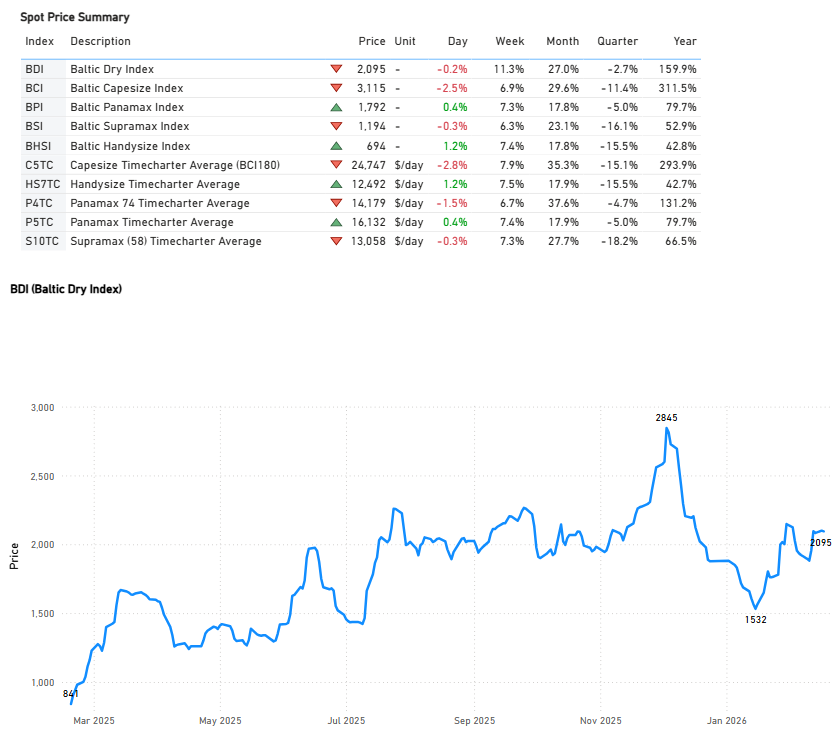
*Signal Figure*

‍

## FREIGHT ATLANTIC

Capesize | Weaker

C3Tubarao–Qingdao /C17Saldanha Bay–Qingdao

‍

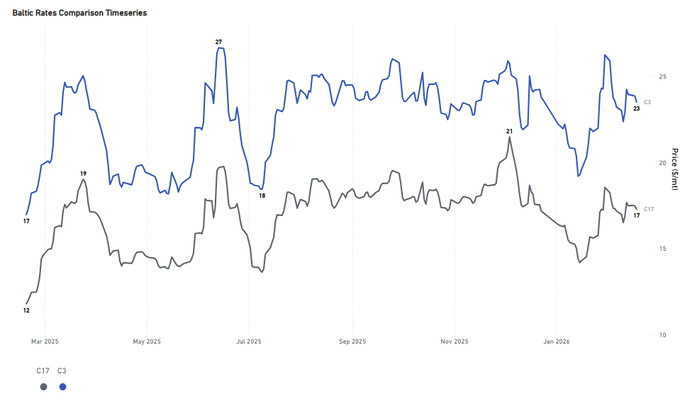
*Signal Figure*

‍

- The rate for the Tubarao to Qingdao route, while dropping below $24/ton, is indicated mid-week at around $23.50/mt. This compares to the $23/ton noted in our lastdry market monitor. Furthermore, the year-on-year upward trend strengthened, rising from 34% in the previous week to 38%. The Saldanha Bay-Qingdao rates held the sentiment of the previous week of around $17/mt (+46% YoY).

PANAMAX | Firmer

P7USG–Qingdao grain ($/mt) /P8Santos–Qingdao ($/mt)

‍

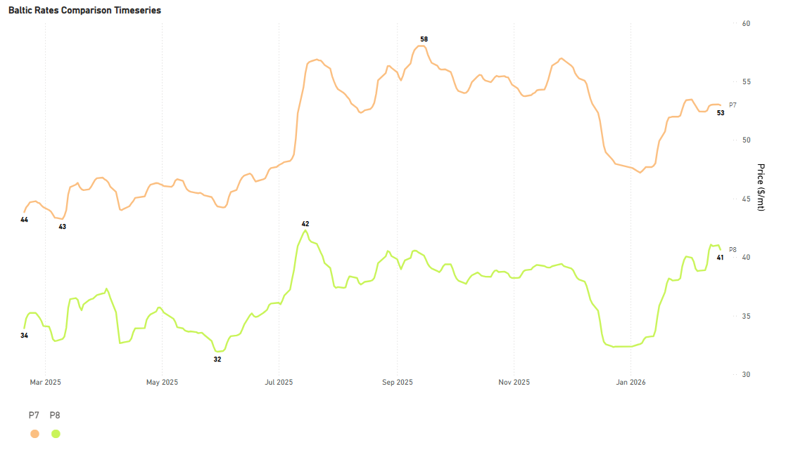
*Signal Figure*

- Rates for the USG-Qingdao and Santos-Qingdao routes remain firm, with both seeing an annual increase of approximately 20% from 17% in the previous week. The USG-Qingdao rate, in particular, continues to hover around a $50/ton premium, a level sustained since early February. Meanwhile, the Santos-Qingdao rate is still nearing $40/ton.

SUPRAMAX | Firmer

S4AUS Gulf trip to Skaw-Passero

‍

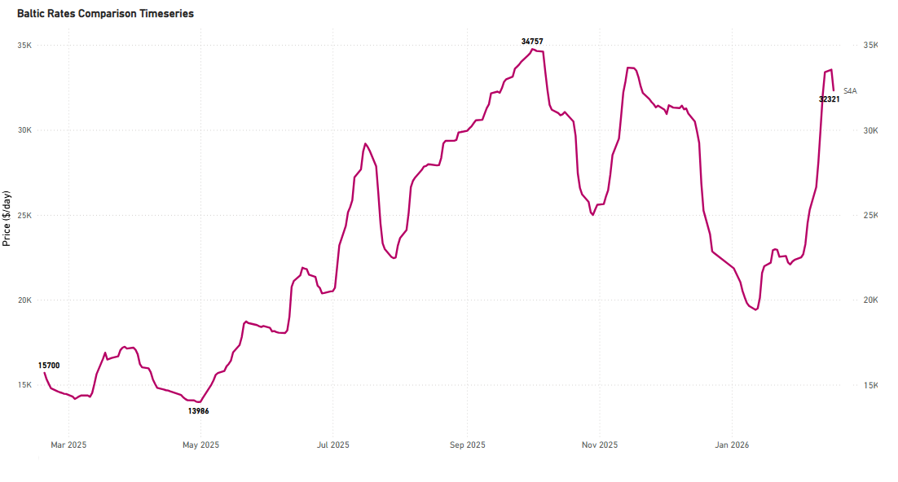
*Signal Figure*

- The USG-to-Skaw-Passero route recorded a remarkable strength, with rates climbing above $30k/day, an increase from the $28k/day seen the previous week. This signifies an annual percentage growth exceeding 100%.

HANDYSIZE | Firmer

HS4_38 -US Gulf trip via US Gulf or north coast of South America to Skaw-Passero

‍

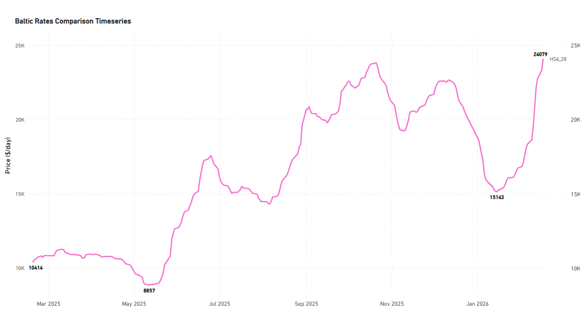
*Signal Figure*

- USG trip to Skaw-Passero recorded levels of around $24k/d, an increase of $4k/d from the previous mid-week levels (+138% YoY).

FREIGHT PACIFIC

Capesize | C5 Firmer

C5West Australia–Qingdao

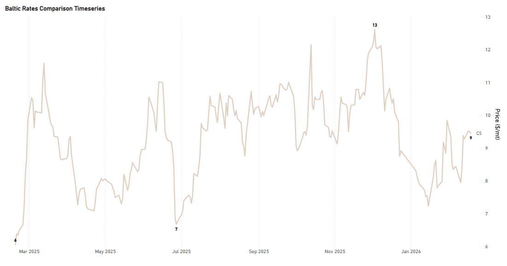
*Signal Figure*

‍

- The West Australia-Qingdao rates strengthened, approaching $9.5/ton, an increase from the mid-$8/ton levels seen the prior week. This current firmer sentiment represents a 56% annual percentage rise. The key question moving forward is how this positive sentiment will develop following the conclusion of the Chinese New Year period.

Panamax | Firmer

P3A_82- HK-S Korea incl Taiwan, one Pacific RV

P5_82- South China, one Indonesian round voyage

‍

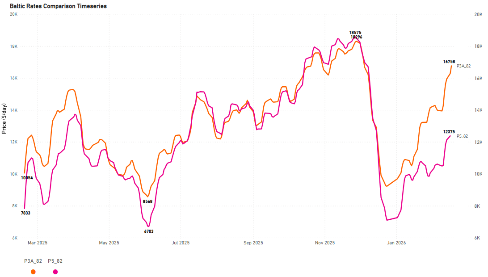
*Signal Figure*

‍

- The Panamax Pacific market has maintained the substantial gains from the previous week, continuing its upward trajectory since the start of the year. Specifically, rates on the P3A_82 route have climbed xs$16k/d, marking about a $7k/day increase compared to the same period last year.

SUPRAMAX | Softening

S2North China one Australian or Pacific round voyage

S10South China trip via Indonesia to South China

‍

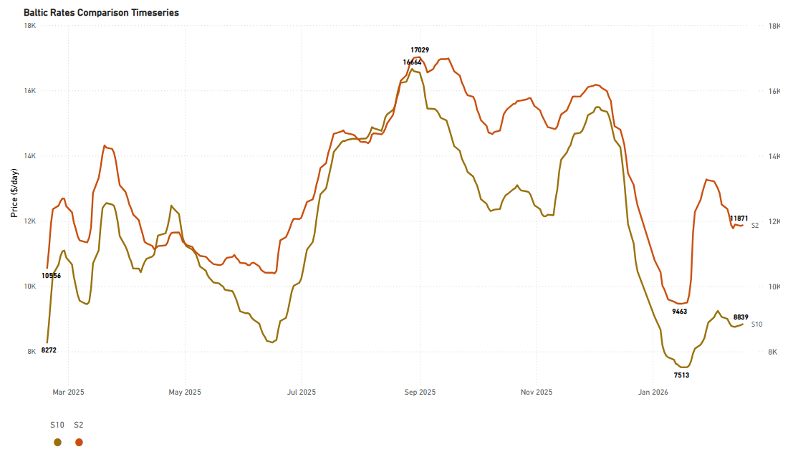
*Signal Figure*

‍

- The Supramax Pacific market shifted direction, moving away from an upward trend to a softening one. Despite this reversal, the S2 route maintained levels around $11.8k/d, reflecting a strong 25% monthly increase. Conversely, the S10 route rates remained subdued, hovering in the low $9k/d range, which still marks a 15% monthly gain.

HANDYSIZE | Weaker

HS5_38- South East Asia trip to Singapore-Japan

HS6_38- North China-South Korea-Japan trip to North China-South Korea-Japan

HS7_38- North China-South Korea-Japan trip to Southeast Asia

‍

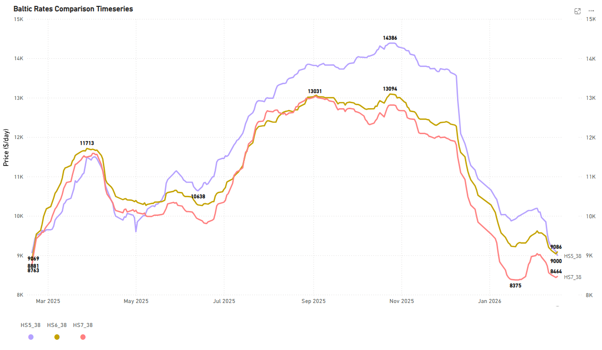
*Signal Figure*

- The Handysize Pacific freight market is still showing a weaker trend from the beginning of the year, with the HS5_38 and HS6_38 rates dropping to around $9k/day each, and HS7_38 nearly $8.5k/d.

## BALLASTERS OVERVIEW

Capesize | 5D MA Increasing

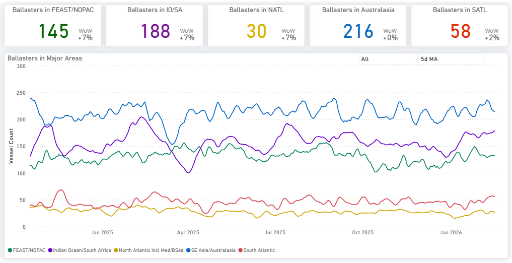
*Availablehere*

- Supply pressure in thePacificincreased, with theFar East/NOPACregion showing a continuous upward trend, reaching levels around 145. While the weekly increase was not significantly higher than the previous week, these levels remained above those recorded at the start of the year. TheIndian Ocean/South Africaarea also saw notable supply pressure, with a vessel count of nearly 190.
- Conversely, theSouth Atlanticregion maintained relatively stable levels, with the 5DMA staying below 60 but still above January's entry.

Panamax | 5D MA Mixed

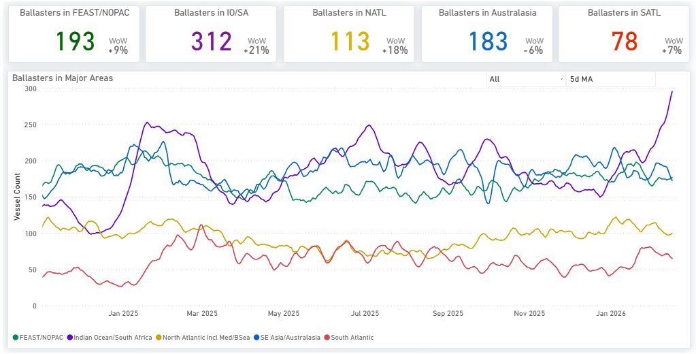
*Availablehere*

- TheIndian Oceansaw another spike from the previous week, reaching more than 300 (+21% WoW). The vessel count of ballasters inAustralasiabegan to show signs of a decrease, to around 180 vessels (6% down from the previous week, when numbers were expected to surpass 190). In theFar East/NOPACregion, levels have now surpassed 190, and although they are not showing a spike similar to the Indian Ocean, they remain on an upward trend.
- Overall, thePacificappears more oversupplied than theAtlantic, with theSouthshowing a tighter picture than theNorth, where the vessel count persists above 100.

Supramax| 5D MA Increasing

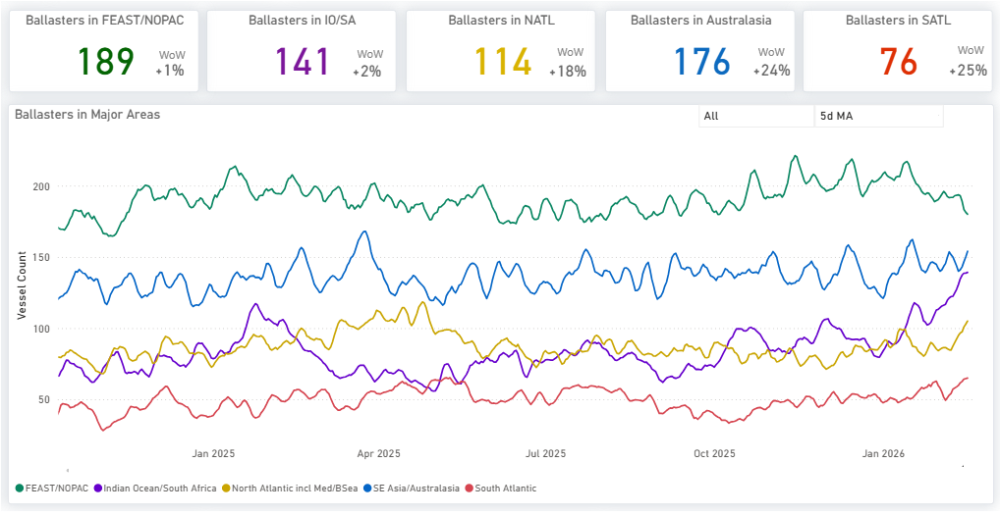
*Availablehere*

- Oversupply in thePacificpersisted from the previous week, albeit with hints of a slight reduction. The vessel count in theFar East/NOPAChas now dipped below 190, a decrease from the over 200 vessels noted in preceding weeks.
- The number of ballasters in theAtlanticremained consistent with the previous week, with approximately 114 vessels in theNorthand 76 in theSouth.

Handysize| 5D MA Increasing

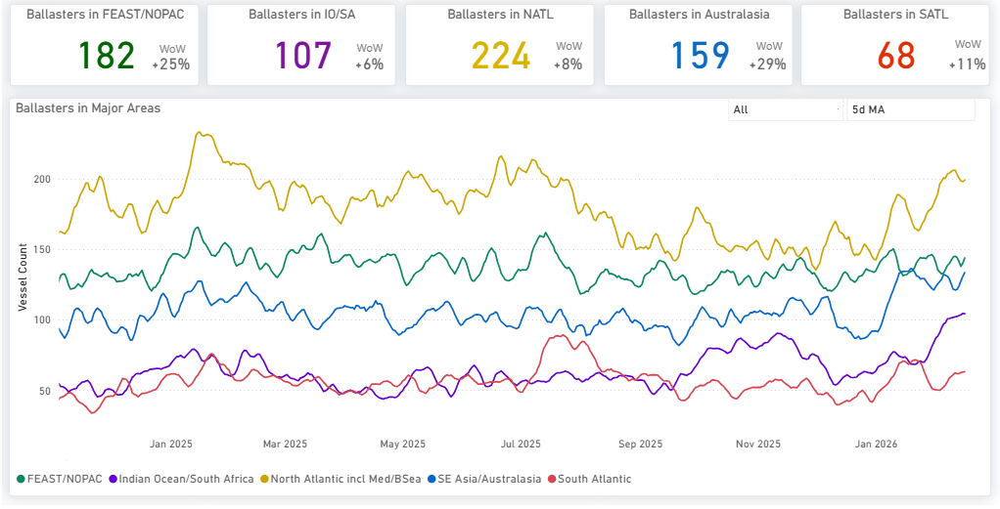
*Availablehere*

- Significant supply pressure persisted for Handysize vessels across key regions. In theNorth Atlantic, the number of ballasters, although slightly down, remained high, standing at over 220 compared to 230 the week prior.
- Pressure intensified noticeably in both theFar East/NOPACandAustralasiaregions. TheFar East/NOPACregion now sees a ballast vessel count exceeding 180, a rise from 157 in the previous week's assessment, whileAustralasia'scount increased to nearly 160 from approximately 150 a week ago.

## DEMAND |TONNE MILES- 7D MA- INDEX VIEW

Capesize↓ 2.2%WoW| Panamax ↓ 3.0%WoWDecreasing

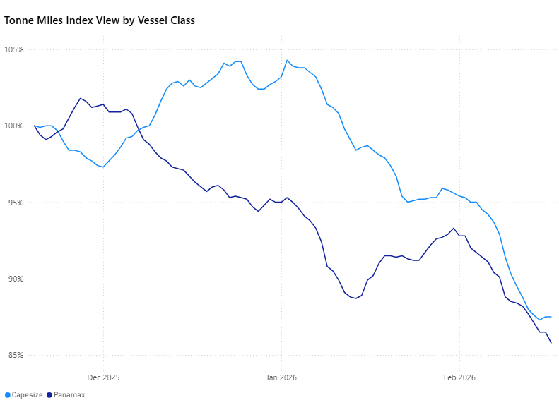
*Signal Figure*

Upon reviewing the tonne-mile growth rate on a Base 100 Index basis, deceleration persists across the larger vessel classes. Capesize stands at 87.5 (Base 100), 12.5 points below the base period, while Panamax is at 85.8, reflecting a 14.2-point shortfall versus base.

Supramax| Handymax |Handysize

Supramax ↑1.1%WoW| Handymax ↓ 1.4%WoW|Handysize ↑0.5%WoW

‍

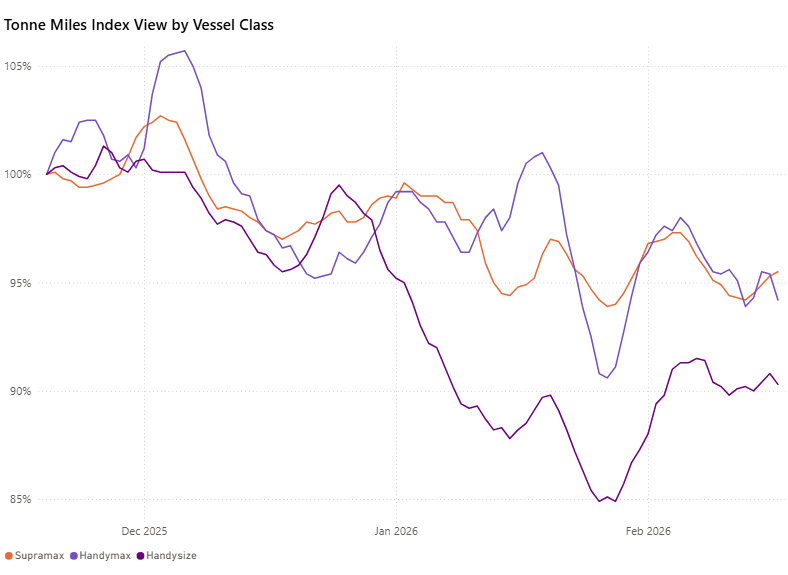
*Signal Figure*

Smaller vessel segments continue to outperform the larger classes, maintaining performance ratios at or above the 90 level (Base 100). Supramax leads at 95.5, followed by Handymax at 94.2, while Handysize has also recovered above 90, reaching 90.3.

Metrics Description:Index View(Base 100) by total Tonne Miles over the selected period. This facilitates relative performance comparisons between segments of different sizes (e.g., comparing the growth rate of Supramax vs Capesize)

For the latest updates and insights, make sure to visit theSignal Ocean Newsroompage &subscribe to weekly reports. Clickhere to request a demo. Click here to see theprevious dry bulk weeklyreport.

For subscription to our FREE weekly market trends email, please contact us: research@thesignalgroup.com

-Republishing is allowed with an active link to the source
