# Weekly Dry Market Monitor: Week 09, 2026

**Date**: February 26, 2026 | **Category**: Dry bulk | **Section**: Monitors | **Source**: [https://www.thesignalgroup.com/weekly-market-monitor/weekly-dry-market-monitor-week-09-2026](https://www.thesignalgroup.com/weekly-market-monitor/weekly-dry-market-monitor-week-09-2026)

---

‍

## ‍Chart of the Week|Panamax Freight View - Indonesia Thermal Coal to India

↓32%Month-on-Month -↓40%Year-on-Year

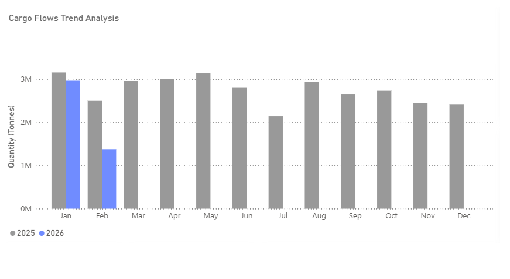
*Thermal Coal Cargo Flows Trend Analysis available via the TSOP platformhere*

This week’s focus highlights the softening trend in TSOP data flows for Indonesian thermal coal shipments to India, particularly within the Panamax vessel segment, toward the end of February.

The deceleration in shipments coincided with adjustments to Indonesia’s reference coal pricing. The Indonesian Ministry of Energy and Mineral Resources (MEMR) lowered the mid-month Harga Batubara Acuan (HBA) for 6,322 kcal/kg GAR for the second half of February compared with the first-half assessment. Similar downward revisions were implemented across other calorific value bands under the HBA framework, reflecting a broader pricing adjustment during the month.

These pricing developments occurred alongside ongoing regulatory discussions concerning Indonesia’s production quota framework (RKAB approvals) and export policy implementation, which together form part of the prevailing market backdrop.

Seasonal factors may also have contributed to softer shipment momentum. February falls within Indonesia’s peak rainy season, and although no widespread force majeure events were reported, weather conditions across key producing regions remain an operational consideration when evaluating export performance.

Firmer South African Flows and Indian Industrial Demand (+ 118YoY)

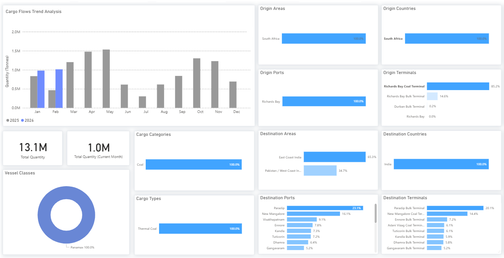
*Signal Figure*

In contrast, South African thermal coal flows to India demonstrated comparatively firmer movement during the same period. The relative positioning of South African cargoes contributed to increased sourcing flexibility within the Indian market, particularly among industrial consumers

Demand from Indian industrial sectors, including sponge iron and cement producers, continued to influence origin selection dynamics across industrial buyers. These segments often require specific calorific profiles and may adjust origin preferences in response to relative pricing dynamics and freight economics.

All data and commentary reflect market conditions as of [Wednesday, 25 February 2026], unless otherwise stated.

FREIGHT MARKET OVERVIEW

The Baltic Dry Index (BDI) has maintained momentum from the previous week, stabilizing above the 2,100-point threshold despite a slight daily dip. This level represents a significant year-on-year increase of +100%. The upward trend is supported by thePanamax,Supramax, andHandysizesegments, all of which recorded positive adjustments. While theCapesizesegment shows early signs of a downward correction, index values remain strong above the 3,000-point mark. C5TC earnings (BCI 180) are in line with the previous week, holding below $25k/d. This reflects a 160% year-on-year increase, compared to the exceptional 290% annual surge recorded mid-week last week.

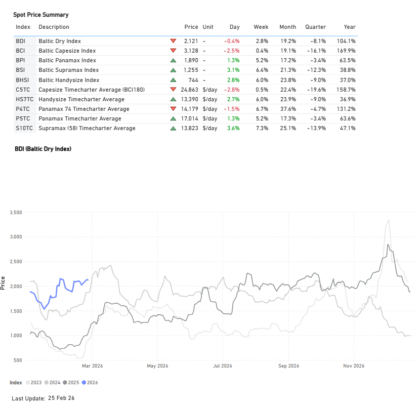
*Signal Figure*

FREIGHT ATLANTIC

Capesize | Weaker

C3Tubarao–Qingdao /C17Saldanha Bay–Qingdao

‍

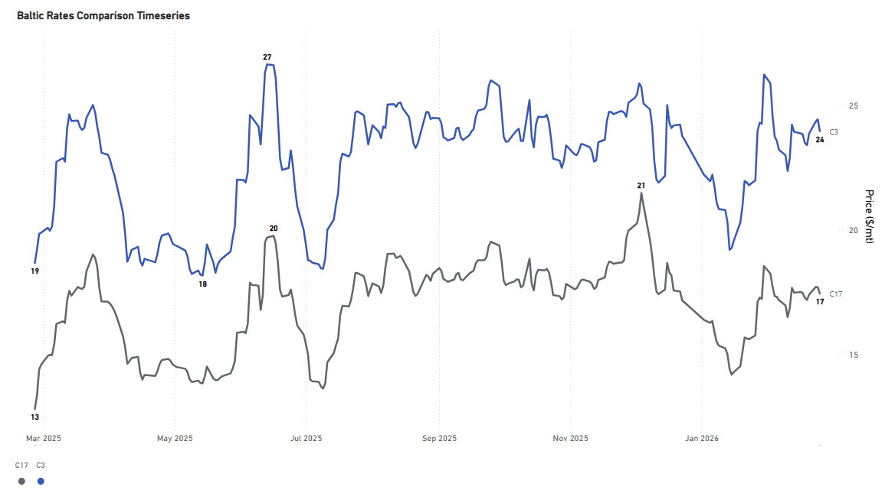
*Signal Figure*

‍

- The rate for the Tubarao to Qingdao route held a similar weakening sentiment to the previous week, with rates around $24/ton (+28% YoY). Similarly, the Saldanha Bay-Qingdao rates continued to be assessed around $17/mt (+36% YoY).

PANAMAX | Firmer

P7USG–Qingdao grain ($/mt) /P8Santos–Qingdao ($/mt)

‍

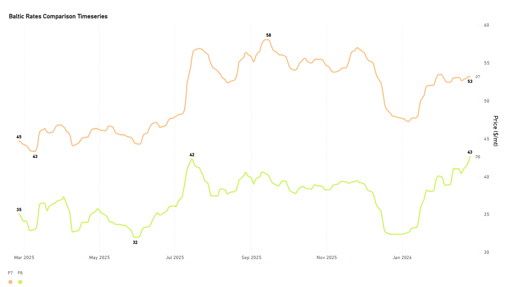
*Signal Figure*

- Rates for the USG-Qingdao and Santos-Qingdao routes continue to hold firm. The Santos-Qingdao rate was assessed mid-week above $40/ton, marking a 22% increase year-over-year. Notably, the USG-Qingdao rate has maintained a premium of around $50/ton (+19% YoY) since the beginning of February.

SUPRAMAX | Weaker

S4AUS Gulf trip to Skaw-Passero

‍

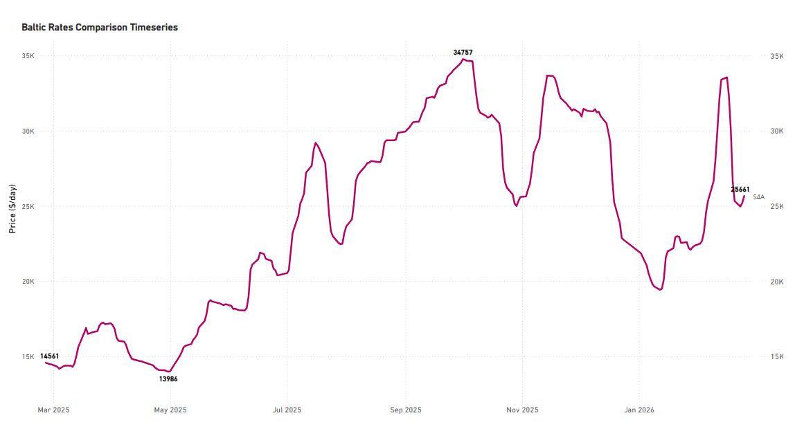
*Signal Figure*

‍

- Rates on the USG-to-Skaw-Passero route saw a notable drop to $26k/d, a significant revision from last week's levels, which were above $30k/day. Despite this recent decline, current rates remain 76% higher than those recorded during the same period last year.

HANDYSIZE | Firmer

HS4_38 -US Gulf trip via US Gulf or north coast of South America to Skaw-Passero

‍

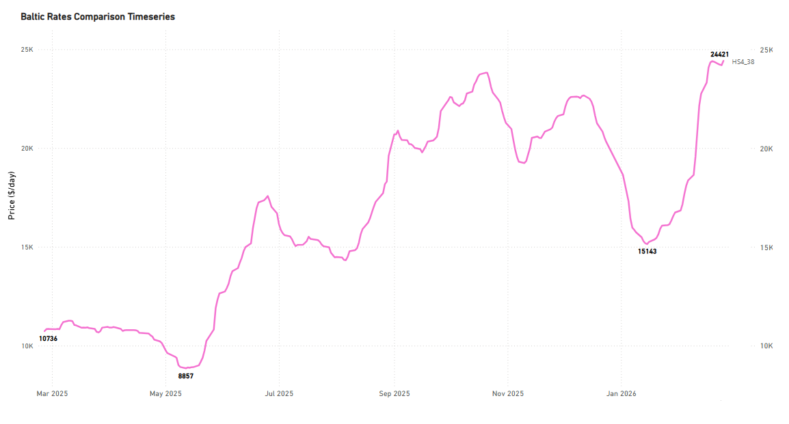
*Signal Figure*

- USG trip to Skaw-Passero recorded levels of around $24k/d, an increase of around $15k/d from mid-January and up by 128% YoY.

FREIGHT PACIFIC

Capesize | C5 Firmer

C5West Australia–Qingdao

‍

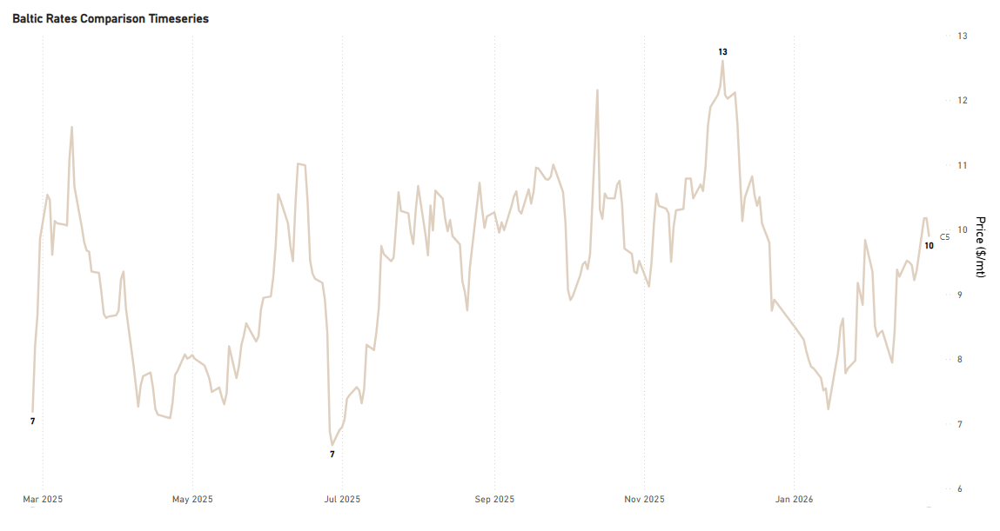
*Signal Figure*

‍

- Rates for the West Australia-Qingdao route remained firm, hovering around $10/ton (+38% YoY). The recent low was observed in mid-January at approximately $7.5/ton.

Panamax | Firmer

P3A_82- HK-S Korea incl Taiwan, one Pacific RV

P5_82- South China, one Indonesian round voyage

‍

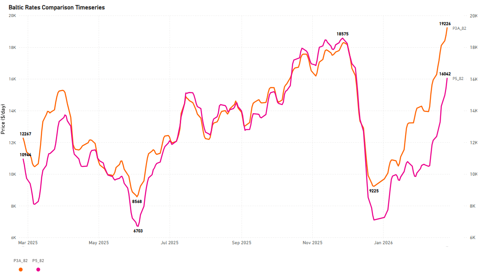
*Signal Figure*

‍

- The Panamax Pacific market has maintained the substantial gains from the previous weeks of February. Specifically, rates on the P3A_82 route have climbed above $19k/d, marking about a $7k/day increase compared to the same period last year.

SUPRAMAX | Firmer

S2North China one Australian or Pacific round voyage

S10South China trip via Indonesia to South China

‍

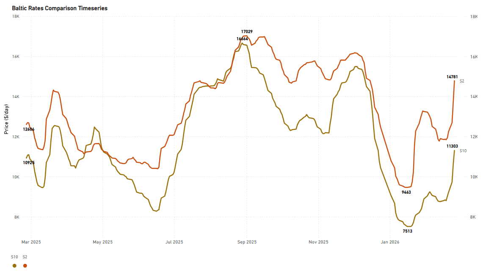
*Signal Figure*

‍

- The upward momentum in the Supramax Pacific market continued from the previous week. Notably, the S2 route experienced a spike, reaching approximately $16k/d, a significant monthly increase of 28%. Similarly, rates for the S10 route saw a substantial monthly gain of 47%, holding steady around $12k/d.

HANDYSIZE | Firmer

HS5_38- South East Asia trip to Singapore-Japan

HS6_38- North China-South Korea-Japan trip to North China-South Korea-Japan

HS7_38- North China-South Korea-Japan trip to Southeast Asia

‍

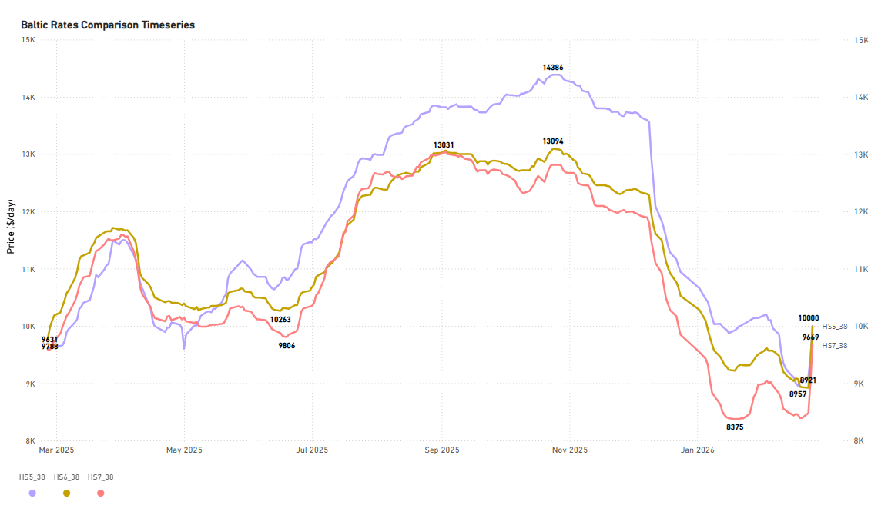
*Signal Figure*

‍

- The Pacific Handysize freight market has shown early signs of recovery from its prior weaker trend. Rates for the HS5_38 and HS6_38 have firmed up to approximately $10k/d each, with the HS7_38 rate close behind at nearly $9.7k/d.

## BALLASTERS OVERVIEW

Capesize | 5D MA Mixed

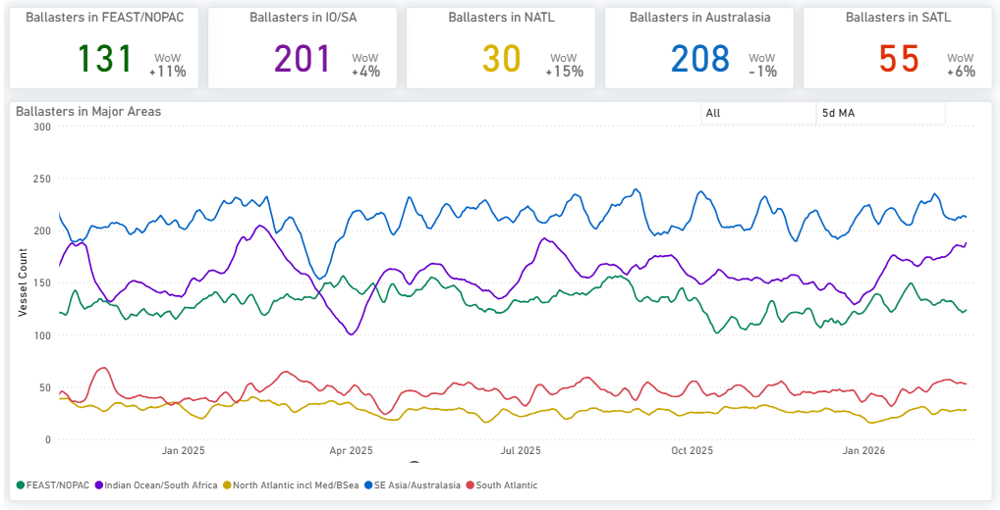
*Signal Figure*

Availablehere

- Vessel supply notably increased in the Indian Ocean/South Africa area, where the count rose to 200, up from roughly 190 in the middle of last week'sdry market monitorperiod. Similarly, the Far East/NOPAC region maintained a high supply level, registering approximately 130 vessels. In contrast, the South Atlantic region began to show a slowdown in supply, with its 5-day moving average dropping below 60 before the close of February.

Panamax | 5D MA Mixed

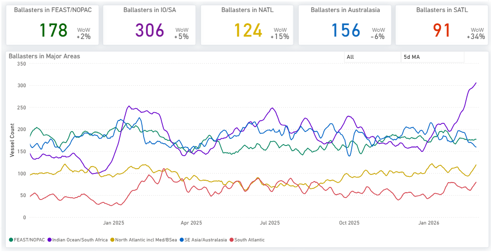
*Signal Figure*

Availablehere

- The Indian Ocean maintained the spike from the previous week, holding above 300. In Australasia, the trend of decreasing ballasters continued, with the vessel count dropping by nearly 24 vessels to approximately 156. Far East/NOPAC levels have now fallen below 180, reversing the increasing signs of the previous week (which pointed toward 190).

- Evidence of increased supply pressure is now present in both the South and North Atlantic. The vessel count in the North is around 90 (+34% WoW), and in the South is above 120 (+15% WoW).

Supramax| 5D MA Increasing

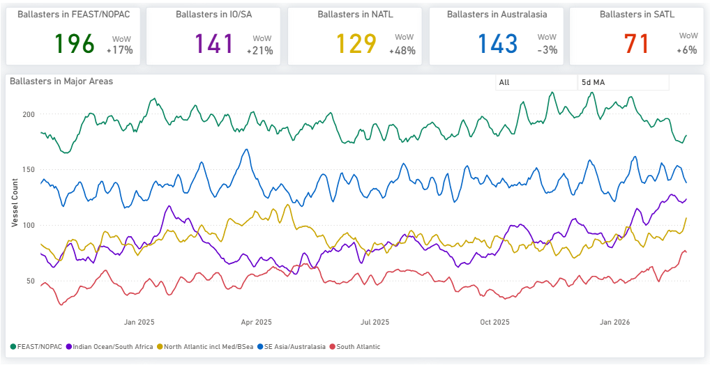
*Signal Figure*

Availablehere

- The Pacific region continued to exhibit elevated vessel availability, a trend persisting from the preceding two weeks. The vessel count in the Far East/NOPAC has climbed notably, now standing at 196 (+17% WoW). Meanwhile, the Atlantic saw a sharp rise in ballasters, particularly in the North Atlantic, where the number surged to almost 130 vessels (+50% WoW).

Handysize| 5D MA Increasing

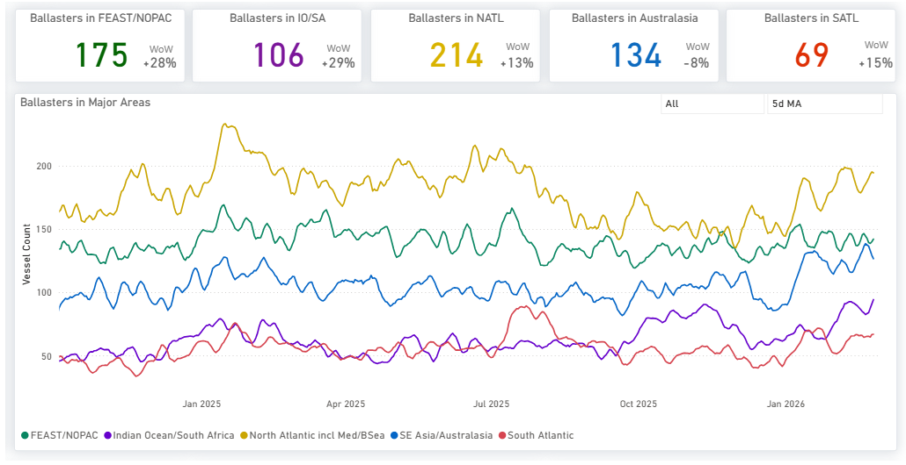
*Signal Figure*

- Handysize vessels continued to face elevated supply pressure. In the North Atlantic, the vessel count remained high, exceeding 200 (+13% WoW). In the Pacific, pressure intensified considerably across two key regions: the Far East/NOPAC, where the ballast vessel count was just below 180 (+28% WoW), and the Indian Ocean, which saw its count rise past 100 (+29% WoW).

‍

DEMAND |TONNE MILES- 7D MA- INDEX VIEW

Capesize ↑5.2%WoW| Panamax ↑2.2%WoW

‍

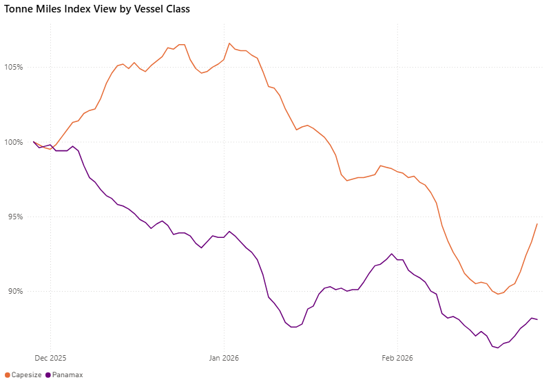
*Signal Figure*

The tonne-mile growth rate, measured on a Base 100 Index, rebounded for the larger vessel classes this week. The Capesize index climbed to 94.5, a notable increase of 4.7 points from the previous week's 89.8 (19 February 2026). Similarly, the Panamax index rose by 1.9 points to 88.1, up from 86.2. Despite this weekly momentum, both segments still fall short of the Base 100 benchmark. Capesize remains 5.5 points below base, and Panamax is 11.9 points below base.

Supramax| Handymax |Handysize

Supramax ↓ 1.8%WoW| Handymax ↑5.3%WoW|Handysize ↓ 4.6%WoW

‍

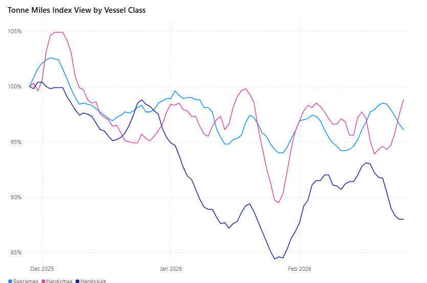
*Signal Figure*

‍

The tonne-mile growth rate, measured on a Base 100 Index basis, showed mixed performance across the smaller vessel classes this week. The Handymax index climbed to 98.8, marking a strong increase of 4.9 points from 93.9 on 19 February 2026. In contrast, the Supramax index eased to 96.1, down 1.8 points from 97.9, while the Handysize index declined more sharply to 88.0, a 4.2-point drop from 92.2. Handymax now sits just 1.2 points below the Base 100 benchmark, Supramax is 3.9 points below base, while Handysize has slipped 12.0 points below the benchmark.

Metrics Description:Index View(Base 100) by total Tonne Miles over the selected period. This facilitates relative performance comparisons between segments of different sizes (e.g., comparing the growth rate of Supramax vs Capesize)

For the latest updates and insights, make sure to visit theSignal Ocean Newsroompage &subscribe to weekly reports. Clickhere to request a demo. Click here to see theprevious dry bulk weeklyreport.

For subscription to our FREE weekly market trends email, please contact us: research@thesignalgroup.com

-Republishing is allowed with an active link to the source
