# Weekly Dry Market Monitor: Week 11, 2026

**Date**: March 13, 2026 | **Category**: Dry bulk | **Section**: Monitors | **Source**: [https://www.thesignalgroup.com/weekly-market-monitor/weekly-dry-market-monitor-week-11-2026](https://www.thesignalgroup.com/weekly-market-monitor/weekly-dry-market-monitor-week-11-2026)

---

## Spotlight Vessel Transits Vs Vessel Count Inside Hormuz

- ~240bulk carriers (>= 25k dwt) remained stranded inside the Strait of Hormuz.

![All data and commentary reflect market conditions as of [Thursday, 12 March  2026], unless otherwise stated.](../images/69b40854fdc21ae7f2d078c9_0d730de5.png)
*All data and commentary reflect market conditions as of [Thursday, 12 March  2026], unless otherwise stated.*

- Vessels are almost evenly split between ballast (50%) and laden status.
- Among the laden vessels, the cargo is mainly minor commodities, with corn being the most significant at 12.5% of the total.
- ~35 bulkers (above 25k) have transited the Strait of Hormuz so far, with more than 80% of vessels remaining inside the strait (as of March 2).
- 86% drop in West-to-East bulk carrier transits within one week of the crisis onset.

As tensions in the Middle East persist, concerns continue to grow over the risk of prolonged disruption to maritime trade. Attention is increasingly focused on signs of safe passage through the Strait of Hormuz, particularly as the United States continues to challenge vessel transits in the area.

Recent data indicate a sharp decline in West-to-East bulk carrier movements through the strait. The average weekly transit count fell from seven vessels on February 26 to just one by the end of the previous week, although the figure now appears to be trending slightly higher at around two vessels.

## Average Weekly Transits(January - March 2026)

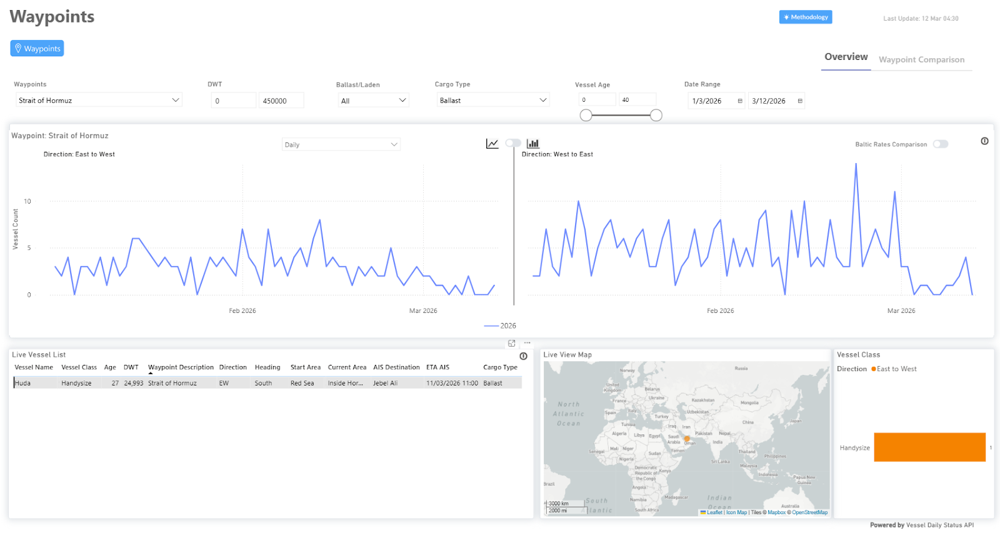
*Source: Signal Ocean |WaypointsAPI Data (last update: March 12, 2026)*

## Vessel Count Inside Hormuz(Dwt >=25k Dwt)

‍

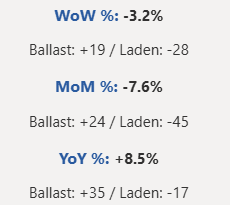
*Signal Figure*

‍

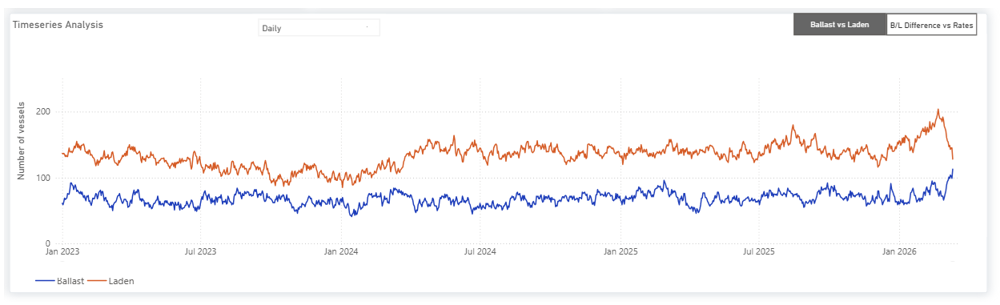
*Source: Signal Ocean |Vessel Count Data(last update: March 12, 2026)*

Around 240 bulk carriers, with a deadweight tonnage (DWT) above 25,000, remain stranded in the Strait of Hormuz, based on vessels currently detectable via AIS tracking. The actual number may be higher, as some vessels may not be transmitting AIS signals.

So far, around 36 bulk carriers have transited the strait, leaving more than 80% of vessels still inside the waterway. Among the vessels that successfully transited, several Chinese-linked ships were identified, which could indicate a potential trend for additional China-affiliated vessels attempting passage.

Recent developments follow warnings fromIranindicating that vessels linked to the United States, Israel, and countries involved in recent strikes against Iran are not allowed to pass. Since the onset of escalations,  Signal Ocean AIS tracking data indicate  Iranian-linked vessels that have passed the Strait, carrying Iranian-origin cargoes, sugar, and gypsum.

- Negar– (~23k DWT), built 1999 (Korea), Rahbaran Omid Darya, East–West (EW).
- Parshad– (~53k DWT), built 2008 (China), Sapid Shipping, sugar, West–East (WE).
- Oura– (~54k DWT), built 2009 (China), Sapid Shipping, sugar, direction West–East (WE).
- Mahnam–(~75k DWT), built 2001 (Korea), Sapid Shipping, gypsum, West–East (WE).
- Parisan– (~53k DWT), built 2009 (China), Sapid Shipping, sugar, West–East (WE).

Separately, the U.S. International Development Finance Corporation, together with American insurers, has reportedly introduced up to$20 billionin war-risk insurance coverage for vessels operating in the region. The initiative is intended to provide reassurance to shipowners and encourage continued transit through the strait despite the heightened risk environment.

The escalation has contributed to growing concerns across the maritime sector, including the potential impact on oil prices, uncertainty surrounding bunker fuel availability in the Arabian Gulf, and a severe increase in freight and security risk. At this stage, it remains too early to determine how long these conditions may persist.

Current indicators suggest that if the uncertainty continues over the coming weeks, transit patterns could partially gradually adjust, with the average number of weekly passages potentially increasing from the present levels, likely exceeding an average of one vessel per day. One of the folding scenarios could be that more and more Iranian and Chinese-linked vessels will ensure the passage, while vessels trapped inside Hormuz in ballast status will face serious difficulties in managing their safe passage.

## FREIGHT MARKET OVERVIEW

The Baltic Dry Index (BDI) has maintained momentum above the 1,900-point mark, with daily gains on the Capesize and Panamax segments, while downward trends are evidenced in all vessel size segments.

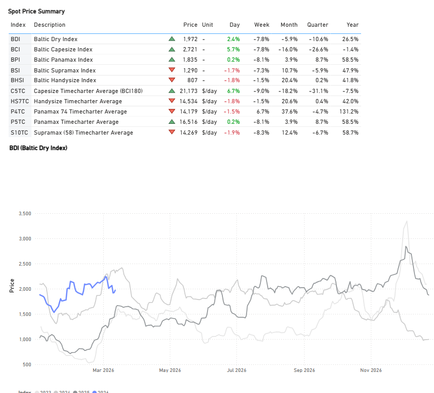
*Signal Figure*

## FREIGHT ATLANTIC

Capesize | Firmer

C3Tubarao–Qingdao /C17Saldanha Bay–Qingdao

‍

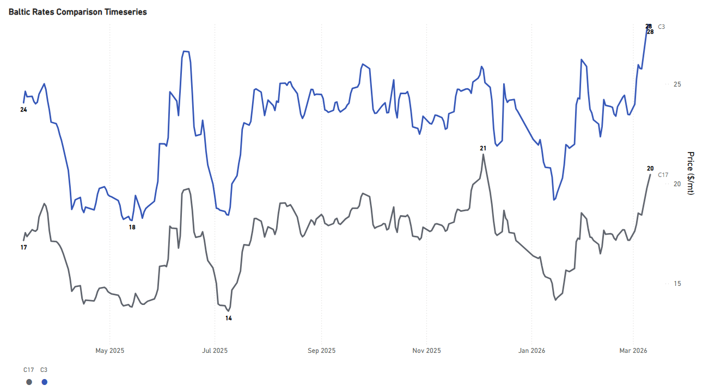
*Signal Figure*

‍

- The rate for the Tubarao to Qingdao route held a firmer sentiment than the previous month, with rates around $30/mt (+20% YoY). Similarly, the Saldanha Bay-Qingdao rates were assessed at around $21/mt (+24% YoY).

PANAMAX | Firmer

P7USG–Qingdao grain ($/mt) /P8Santos–Qingdao ($/mt)

‍

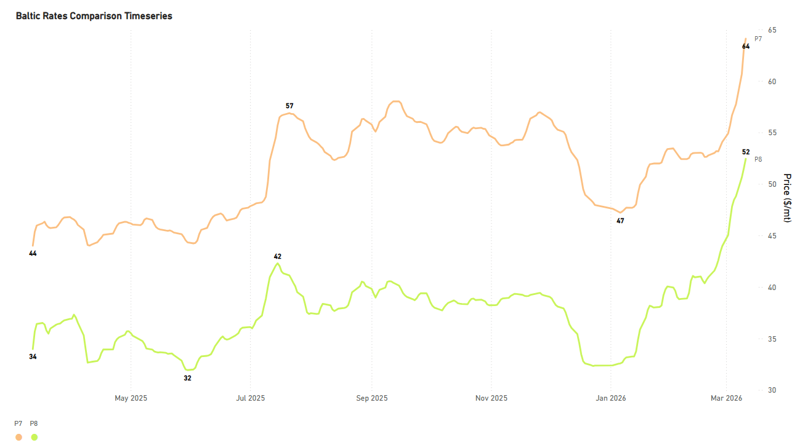
*Signal Figure*

- Rates for the USG-Qingdao and Santos-Qingdao routes continue to hold firm from the beginning of the year, and have now reached one of the highest points. The Santos-Qingdao rate was assessed above $50/mt(+57% YoY). Notably, the USG-Qingdao rate has maintained a premium of above $60/mt (+48% YoY).

SUPRAMAX | Weaker

S4AUS Gulf trip to Skaw-Passero

‍

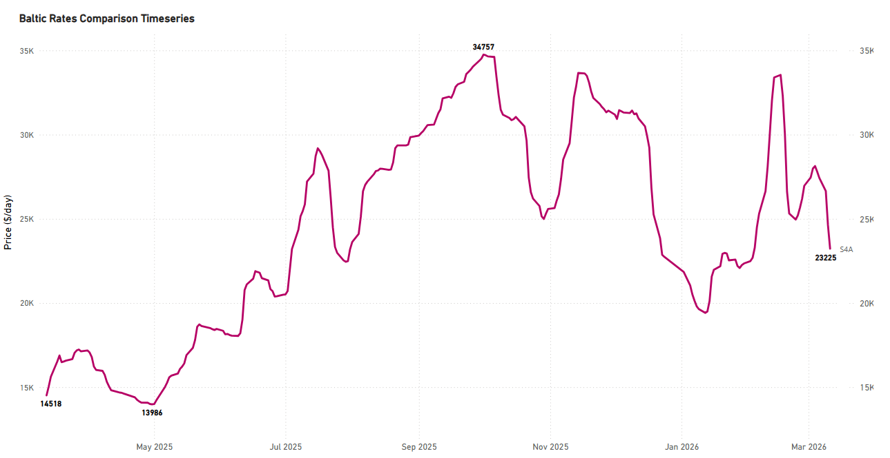
*Signal Figure*

‍

- Rates on the USG-to-Skaw-Passero route saw a notable drop from the end of the previous month to $22k/d, while they still hovered +50% YoY.

HANDYSIZE | Weaker

HS4_38 -US Gulf trip via US Gulf or north coast of South America to Skaw-Passero

‍

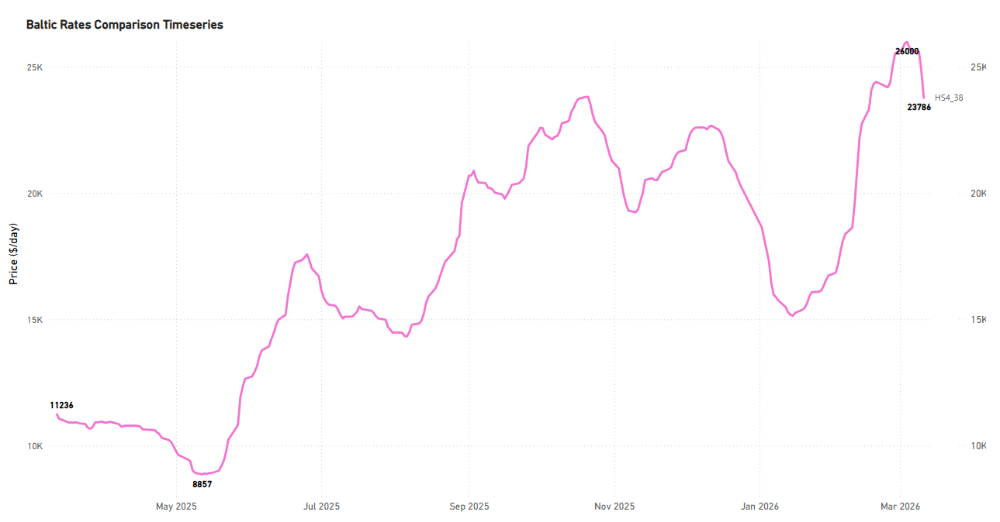
*Signal Figure*

- USG trip to Skaw-Passero recorded levels of around $22k/d, a decrease of around $11k/d on an annual basis and $3.3k/d within a week.

## FREIGHT PACIFIC

Capesize | C5 Softer

C5West Australia–Qingdao

‍

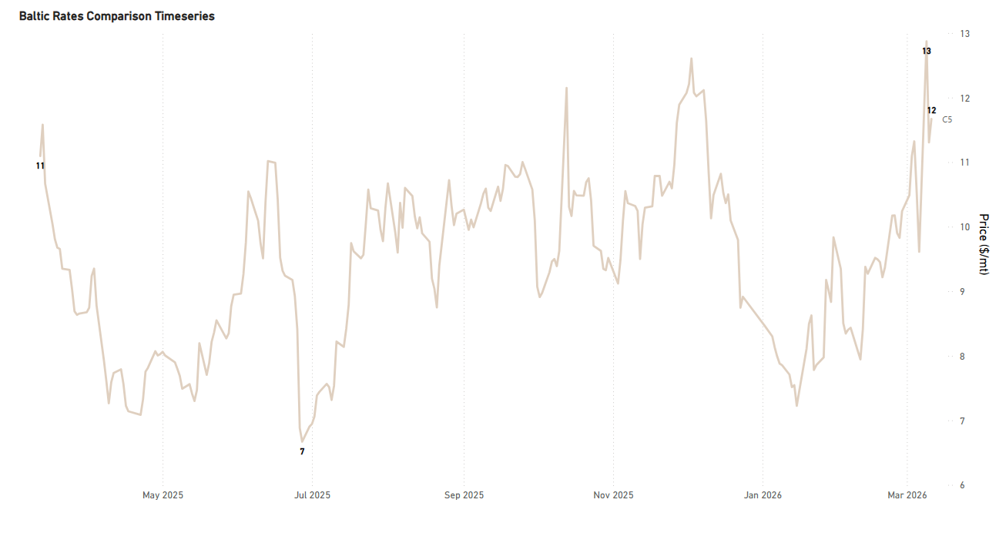
*Signal Figure*

‍

- Rates for the West Australia-Qingdao route recorded a softer trend from the previous week, hovering around $12/ton (+12% YoY). The recent level is significantly higher than the low observed in mid-January at approximately $7.5/ton.

Panamax | Weaker

P3A_82- HK-S Korea incl Taiwan, one Pacific RV

P5_82- South China, one Indonesian round voyage

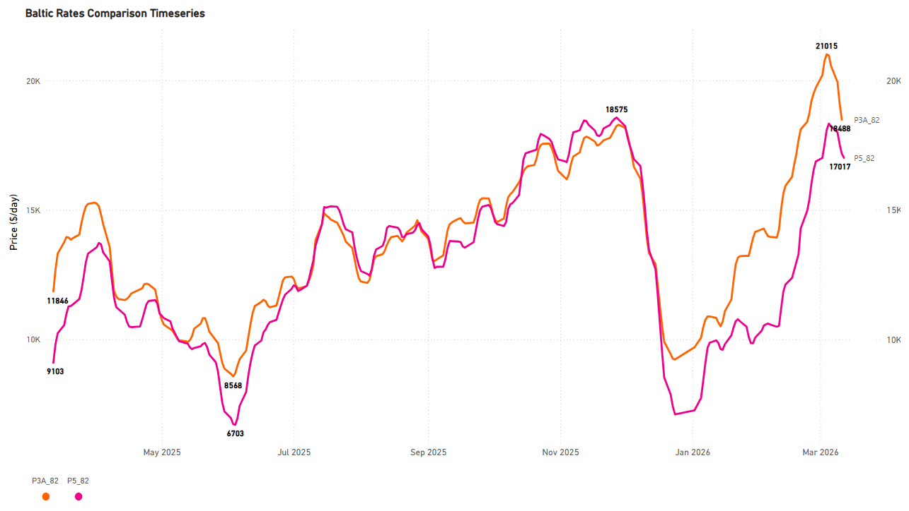
*Signal Figure*

‍

- The Panamax Pacific market has recorded a weaker trend since the beginning of March. Specifically, rates on the P3A_82 route dropped to $18k/d, marking about a $2.6k/day decrease within a week.

SUPRAMAX | Weaker

S2North China one Australian or Pacific round voyage

S10South China trip via Indonesia to South China

‍

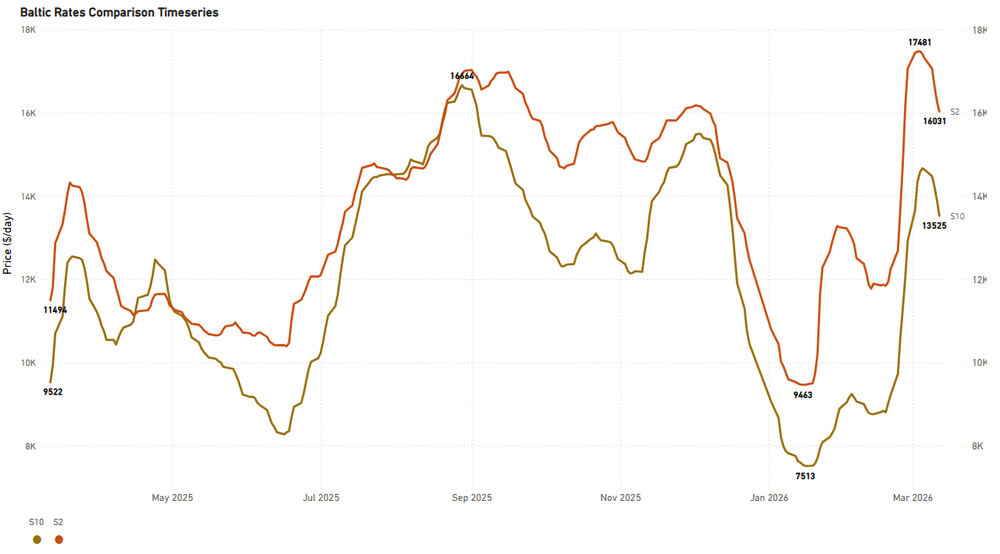
*Signal Figure*

‍

- The positive trend in the Supramax Pacific market has reversed, shifting to a weaker sentiment. This change comes after rates had recently spiked to $17k/d, a level last seen and noted in ourdry market monitoron February 26th. Following this trend, the rates for the S10 route also fell, decreasing by $1.1k/d over the week to settle at approximately $13k/d.

HANDYSIZE | Firmer

HS5_38- South East Asia trip to Singapore-Japan

HS6_38- North China-South Korea-Japan trip to North China-South Korea-Japan

HS7_38- North China-South Korea-Japan trip to Southeast Asia

‍

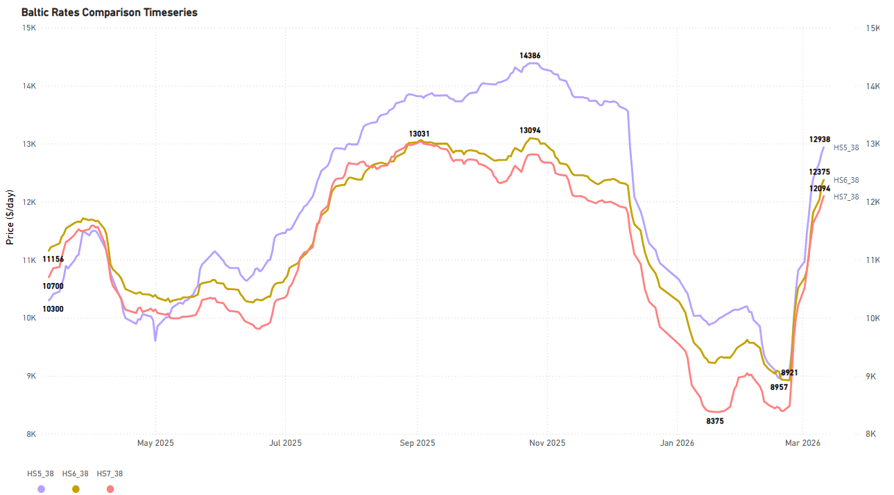
*Signal Figure*

‍

- The Pacific Handysize freight market is confirming the firmer trend we anticipated when we forecast its recovery inlate February. Rates for the HS5_38 and HS6_38 have strengthened to around $12.5-13k/d each, while the HS7_38 rate is now nearing $12k/d.

## BALLASTERS OVERVIEW

Capesize | 5D MA Mixed

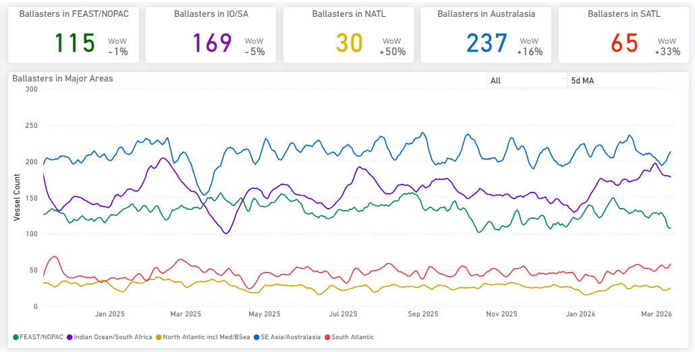
*Signal Figure*

Availablehere

- Vessel supply increased significantly in Australasia, climbing to over 230 units. Conversely, the count of vessels (ballasters) in the Far East/NOPAC region dropped to 115, a decrease from 130 recorded at the end ofFebruary. In the Atlantic, both the South and North saw notable increases in supply, +33% and +50% WoW, respectively.

Panamax | 5D MA Mixed

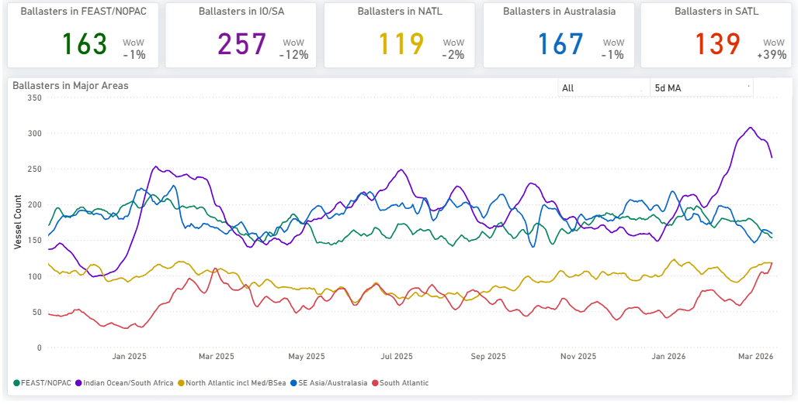
*Signal Figure*

Availablehere

- The Indian Ocean experienced a decrease in levels during early March, dropping to less than 260 after peaking above 300 at the end of February. Conversely, Australasia saw a slight increase, reaching approximately 170. Meanwhile, the Far East/NOPAC confirmed the decreasing trend observed inweek 9, with levels now falling below 170.
- Evidence of increased supply pressure is now present in the South with a vessel count of nearly 140 (+39% WoW) versus a soft decreasing trend in the North, with the vessel count slightly below 120 (-1% WoW).

‍

Supramax| 5D MA Increasing

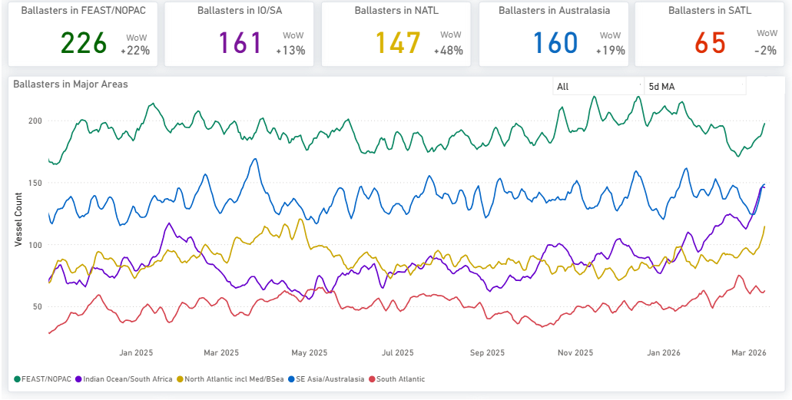
*Signal Figure*

‍

Availablehere

- The Pacific region continued to exhibit elevated vessel availability, a trend persisting from the preceding two weeks. The vessel count in the Far East/NOPAC has climbed notably, now standing at 196 (+17% WoW). Meanwhile, the Atlantic saw a sharp rise in ballasters, particularly in the North Atlantic, where the number surged to almost 130 vessels (+50% WoW).

Handysize| 5D MA Increasing

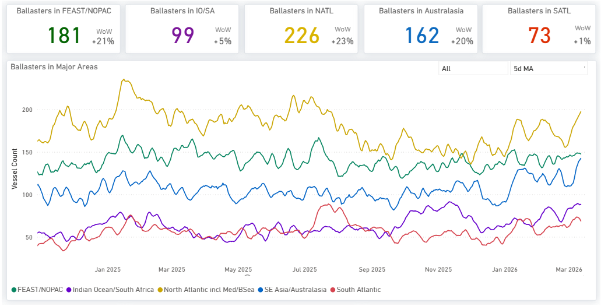
*Signal Figure*

- Handysize vessels continued to face elevated supply pressure from the end of February. In the North Atlantic, the vessel count remained high, exceeding 220 (+20% WoW). In the Pacific, pressure intensified considerably across two key regions: the Far East/NOPAC, where the ballast vessel count held above 180 (+20% WoW), and in Australasia, which saw its vessel count reach more than 160 (+20% WoW).

## DEMAND |TONNE MILES- 7D MA- INDEX VIEW

Capesize ↓ 5.1%WoW| Panamax ↓ 1.1%WoW

‍

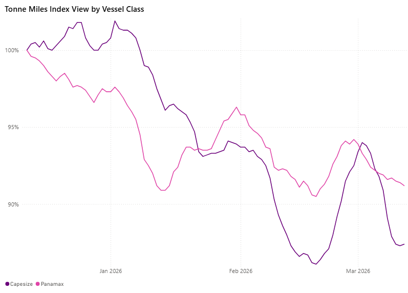
*Signal Figure*

‍

The tonne-mile growth rate, measured on a Base 100 Index basis, weakened for the larger vessel classes this week. The Capesize index declined to 86.8, falling 5.14% week-on-week from 91.5 on 6 March 2026. The Panamax index also edged lower to 91.4, down 1.19% WoW from 92.5. Despite the softer weekly performance, Panamax remains closer to the Base 100 benchmark, while Capesize continues to lag more significantly. Capesize now sits 13.2 points below base, while Panamax stands 8.6 points below the benchmark.

Supramax| Handymax |Handysize

Supramax ↓ 4.5%WoW| Handymax ↓ 3.5%WoW|Handysize ↓ 1.3%WoW

‍

*Signal Figure*

The tonne-mile growth rate, measured on a Base 100 Index basis, weakened for the smaller vessel classes this week. The Handymax index eased to 102.3, a 3.8-point decline from 106.1 on 6 March 2026. The Supramax index fell more sharply to 95.1, down 4.5 points from 99.6, while the Handysize index slipped to 91.2, a 1.2-point decline from 92.4.

Metrics Description:Index View(Base 100) by total Tonne Miles over the selected period. This facilitates relative performance comparisons between segments of different sizes (e.g., comparing the growth rate of Supramax vs Capesize)

For the latest updates and insights, make sure to visit theSignal Ocean Newsroompage &subscribe to weekly reports. Clickhere to request a demo. Click here to see theprevious dry bulk weeklyreport.

For subscription to our FREE weekly market trends email, please contact us: research@thesignalgroup.com

-Republishing is allowed with an active link to the source
