# Weekly Dry Market Monitor: Week 12, 2026

**Date**: March 19, 2026 | **Category**: Dry bulk | **Section**: Monitors | **Source**: [https://www.thesignalgroup.com/weekly-market-monitor/weekly-dry-market-monitor-week-12-2026](https://www.thesignalgroup.com/weekly-market-monitor/weekly-dry-market-monitor-week-12-2026)

---

## U.S. Overtakes Brazil in Corn Exports to China Ahead of End-Q1 2026

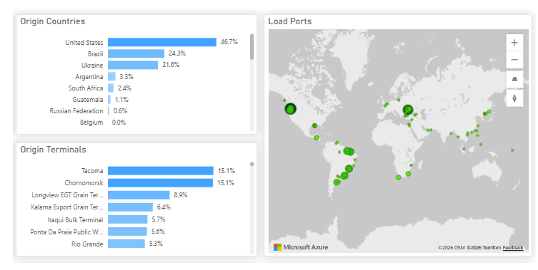
*Source: Signal Ocean Platform |Dry FlowsData (last update: March 18, 2026)*

## Breakdown of Corn Flows to China by Vessel ClassPanamax accounts for approximately 80% of total volumes

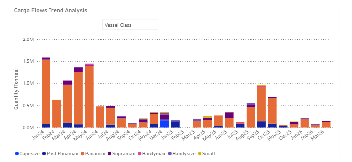
*Source: Signal Ocean Platform |Dry FlowsData (last update: March 18, 2026)*

Chinese corn imports declined to approximately 3.8M mt in 2025, down from 8.4M mt in 2024. Of this, around 2.5M mt originated from Brazil (Panamax: ~2.0M mt vs. 1.78M mt in 2024), while imports from the U.S. totaled 169k mt (Panamax: ~153k mt vs. 1.36M mt in 2024). This contraction aligns with China’s policy direction over the past three years. The focus has been on increasing domestic self-sufficiency. As such, the recent decline in imports is not primarily driven by trade tensions, but rather reflects a policy-driven agricultural transformation underway in Beijing.

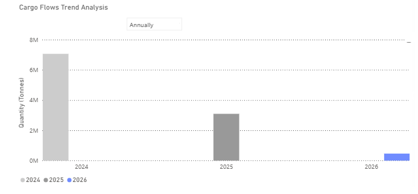
*Source: Signal Ocean Platform |Dry FlowsData (last update: March 18, 2026)*

With imports declining anddomestic outputrising, China’s evolving grain policy is expected to have far-reaching implications for major exporters, including Brazil, the U.S., and Ukraine. Looking ahead, China is likely to continue prioritizing internal efficiency, requiring global corn exporters to adapt to a lower level of Chinese import demand.

While Brazil was the primary supplier of corn to China in 2025, early Q1 2026 data show the U.S. has regained market share and moved ahead by late March.

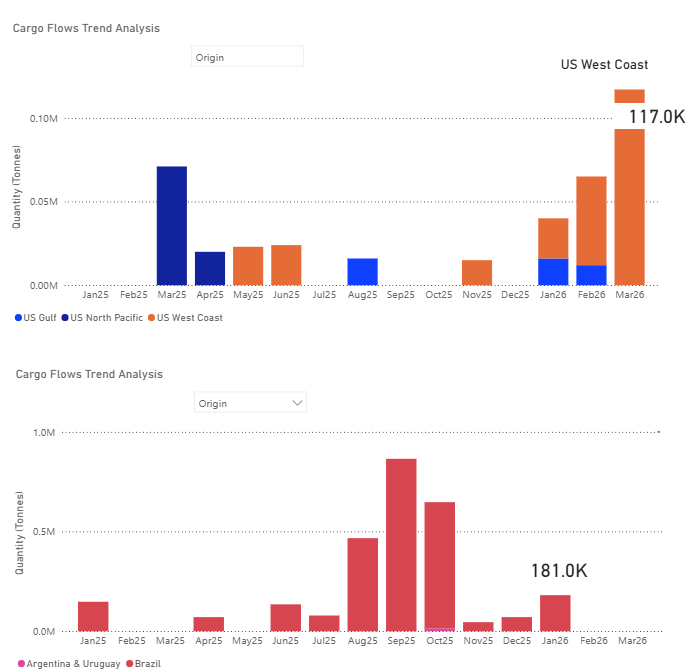
*Source: Signal Ocean Platform |Dry FlowsData (last update: March 18, 2026)*

## FREIGHT MARKET OVERVIEW

The Baltic Dry Index (BDI) recorded an uptick in sentiment before the end of the week, with the index value moving above the 2,000-point mark, driven by weekly gains in the Capesize and Panamax segments.

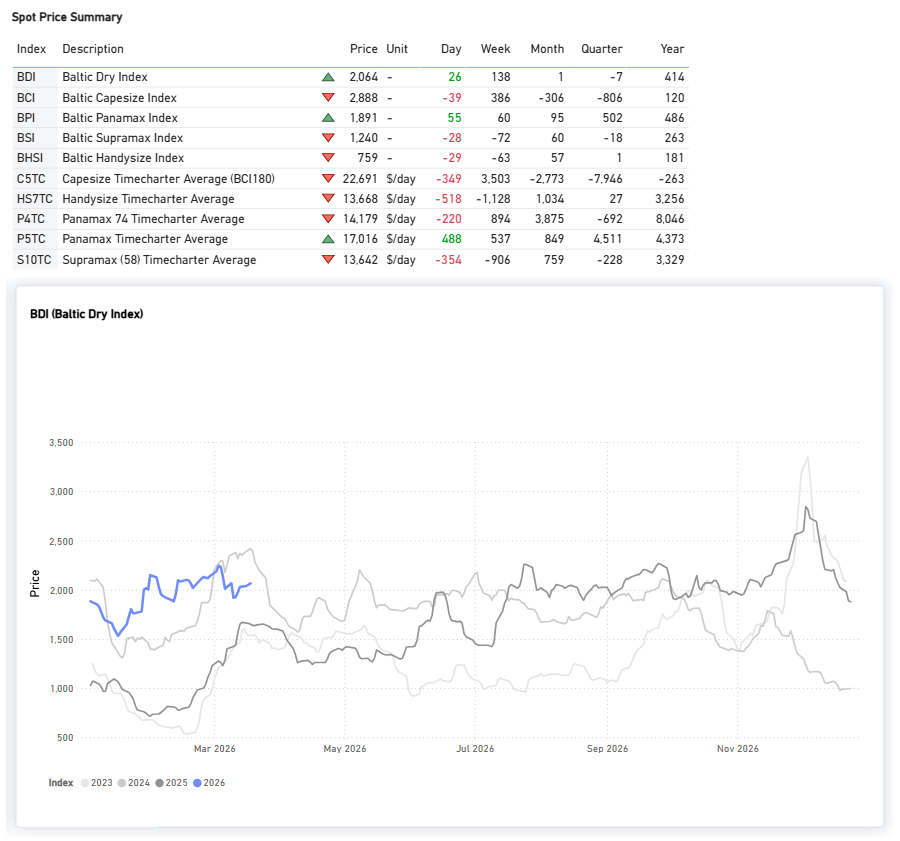
*Signal Figure*

## FREIGHT ATLANTIC

Capesize | Firmer

C3Tubarao–Qingdao /C17Saldanha Bay–Qingdao

‍

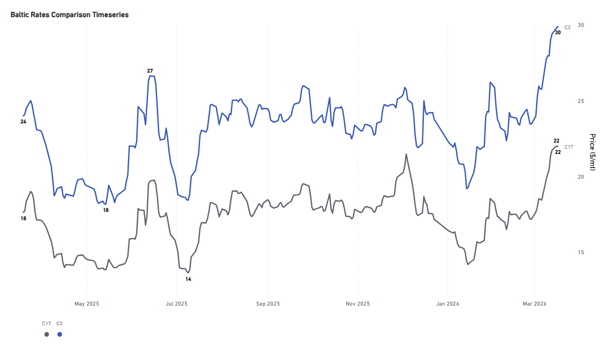
*Signal Figure*

- The rate for the Tubarao to Qingdao route held the firmer sentiment of the previous week, with rates still around $30/mt (+23% YoY). Similarly, the Saldanha Bay-Qingdao rates were assessed at around $22/mt (+24% YoY).

PANAMAX | Firmer

P7USG–Qingdao grain ($/mt) /P8Santos–Qingdao ($/mt)

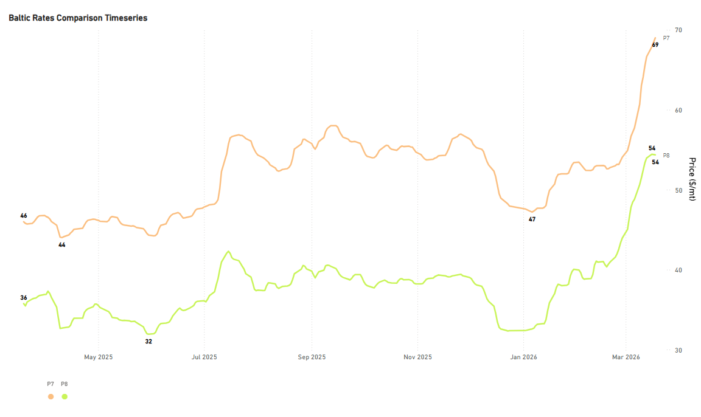
*Signal Figure*

- Rates for the USG–Qingdao and Santos–Qingdao routes are reaching exceptional highs. The Santos–Qingdao rate was assessed at $54/mt (+50% YoY). Notably, the USG–Qingdao rate strengthened further to around $70/mt, approximately $10/mt higher than the previous week (+49% YoY).

SUPRAMAX | Weaker

S4AUS Gulf trip to Skaw-Passero

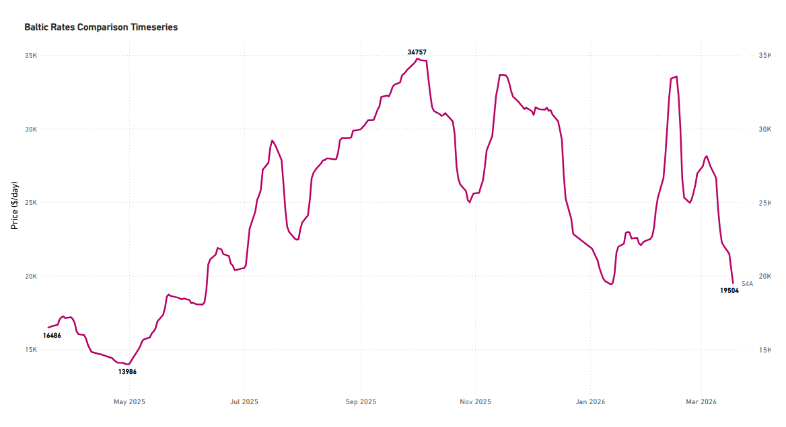
*Signal Figure*

- Rates on the USG-to-Skaw–Passero route continued to decline, as highlighted in our previousDry Market Monitor, and are now around $19k/day, down by $11k/day over the past month.

HANDYSIZE | Weaker

HS4_38 -US Gulf trip via US Gulf or north coast of South America to Skaw-Passero

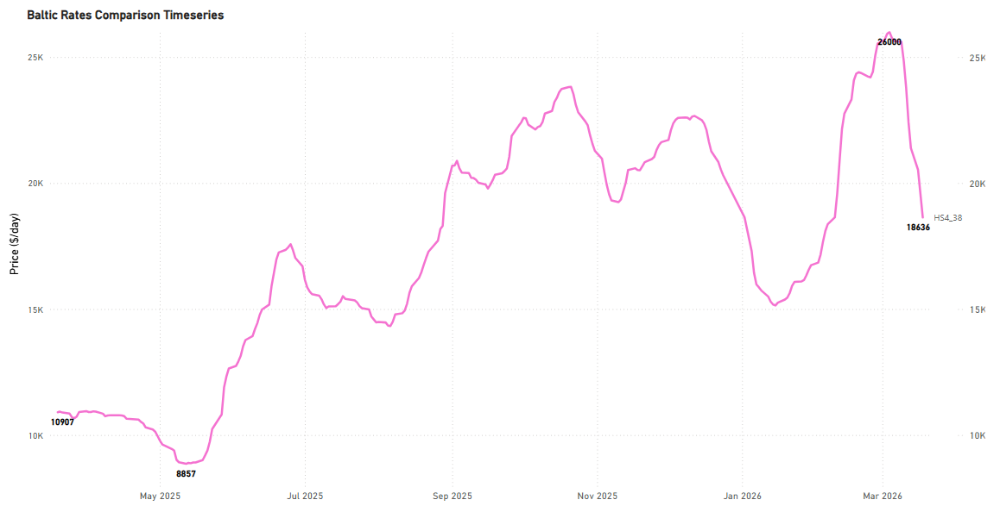
*Signal Figure*

- The USG trip to Skaw–Passero recorded levels of around $18k/day, a decrease of approximately $5k/day from the previous week, which contrasts with the annual rebound of $7.7k/day.

## FREIGHT PACIFIC

Capesize | C5 Softer

C5West Australia–Qingdao

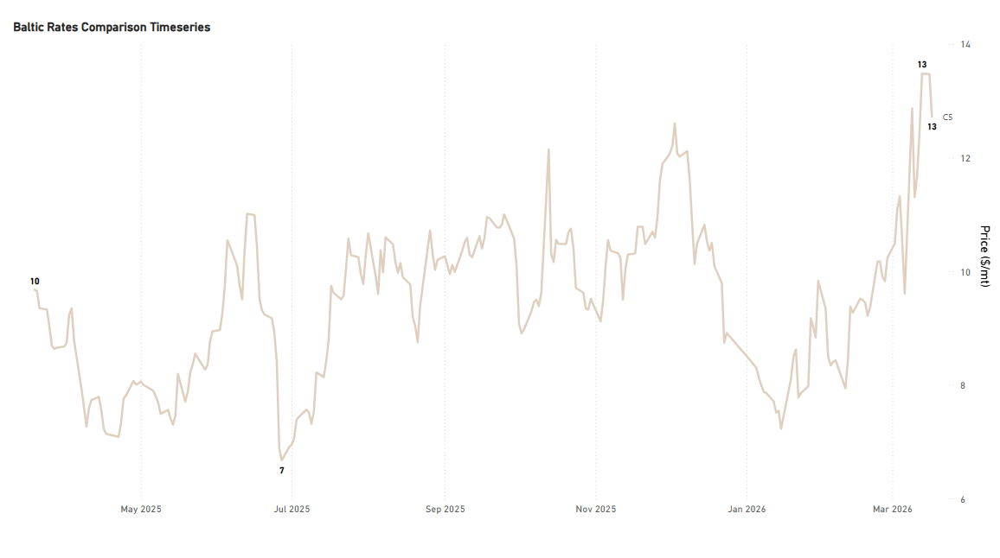
*Signal Figure*

- Rates on the West Australia–Qingdao route extended their softening trend WoW, at around $13/mt (+27% YoY). Despite the recent easing, levels remain well above the mid-January trough of approximately $7.5/mt.

Panamax | Firmer

P3A_82- HK-S Korea incl Taiwan, one Pacific RV

P5_82- South China, one Indonesian round voyage

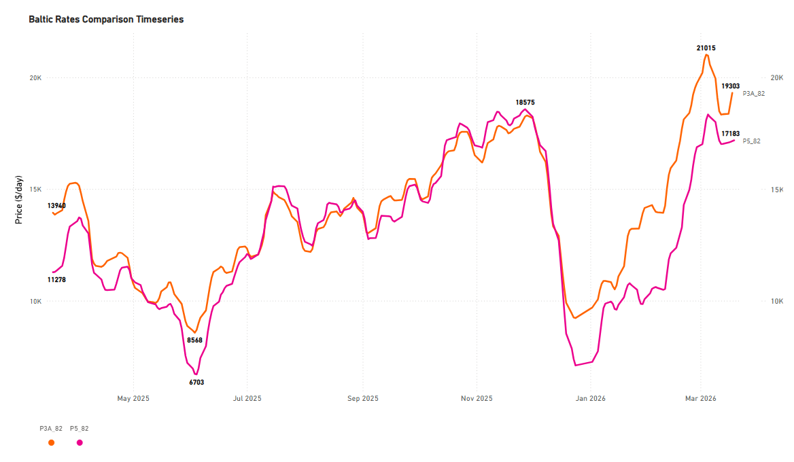
*Signal Figure*

- The Panamax Pacific market has now reversed the weaker trend recorded in the previous week. Specifically, rates on the P3A_82 route rose to $19k/day, and on the P5_82 route to $17k/day.

SUPRAMAX | Weaker

S2North China one Australian or Pacific round voyage

S10South China trip via Indonesia to South China

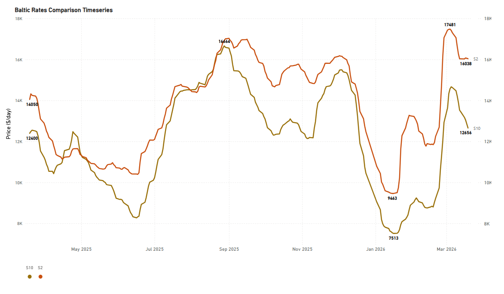
*Signal Figure*

- The positive trend in the Supramax Pacific market has reversed to a weaker sentiment. Compared with the previous week, rates for the S10 route have now settled below $13k/day.

HANDYSIZE | Firmer

HS5_38- South East Asia trip to Singapore-Japan

HS6_38- North China-South Korea-Japan trip to North China-South Korea-Japan

HS7_38- North China-South Korea-Japan trip to Southeast Asia

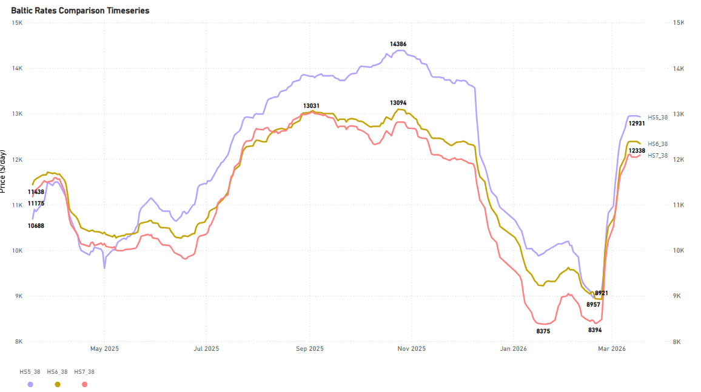
*Signal Figure*

- The Pacific Handysize freight market appears to have reached its highest point since the lows recorded in January and February. Rates for the HS5_38 and HS6_38 routes have strengthened to around $12–13k/day each compared with the previous week, while the HS7_38 rate confirmed the sentiment of the previous week at $12k/day.

## BALLASTERS OVERVIEW

Capesize | 5D MA Mixed

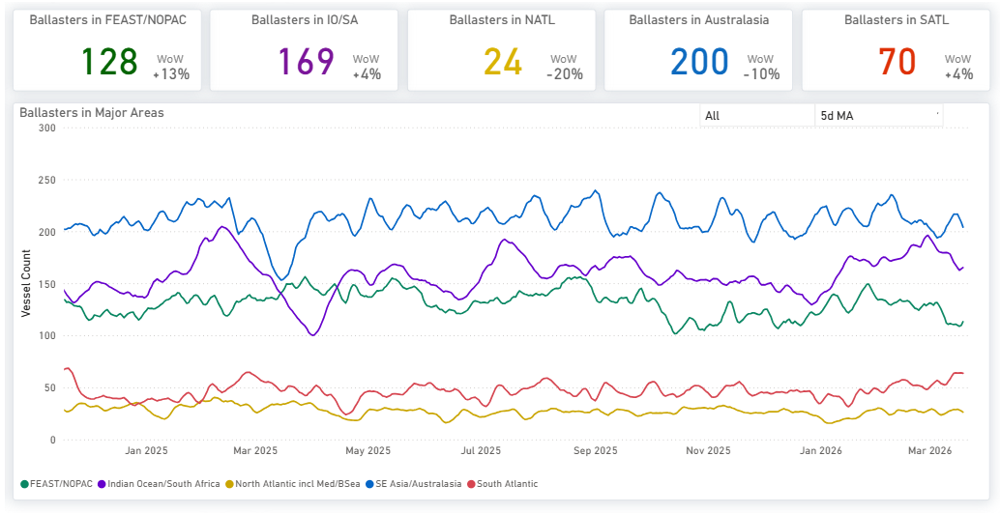
*Signal Figure*

Availablehere

- Vessel supply, although still elevated, showed a decrease to 200 vessels in Australasia, compared with last week when the vessel count climbed to over 230 units. In the Atlantic, both the North saw a notable decrease (-20%), while in the South, the vessel count maintained a similar trend to the previous week (~70, 5D MA).

Panamax | 5D MA Mixed

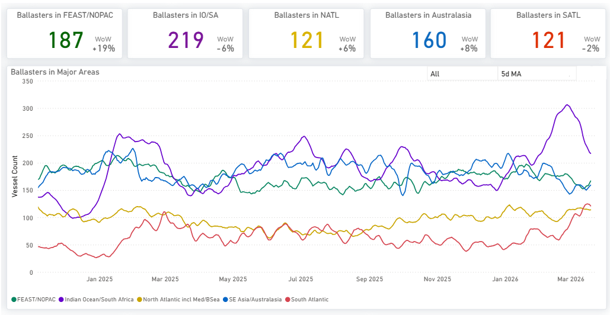
*Signal Figure*

Availablehere

- The Indian Ocean experienced a decrease in levels to around 220 after peaking above 300 at the end of February. Meanwhile, in the Far East/NOPAC, following signs of a decline a week ago, levels have started to increase again to nearly 190, whereas early indications in the previous week pointed to a drop below 170. Evidence of increased supply pressure remains in the South, with a vessel count of nearly 120.

Supramax| 5D MA Increasing

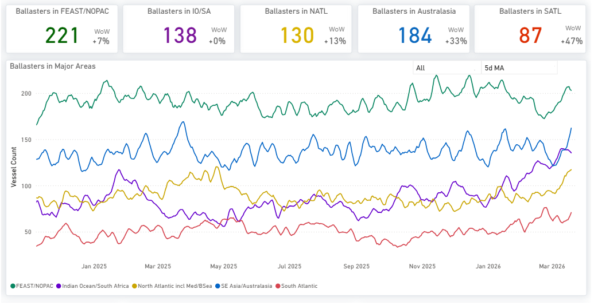
*Signal Figure*

Availablehere

- The Pacific region continued to exhibit elevated vessel availability, a trend persisting from the preceding three weeks. The vessel count in the Far East/NOPAC has climbed notably, now standing at 220. Meanwhile, the Atlantic saw a sharp rise in ballasters, particularly in the North Atlantic, where the number held at the elevated level of 130 vessels.

Handysize| 5D MA Increasing

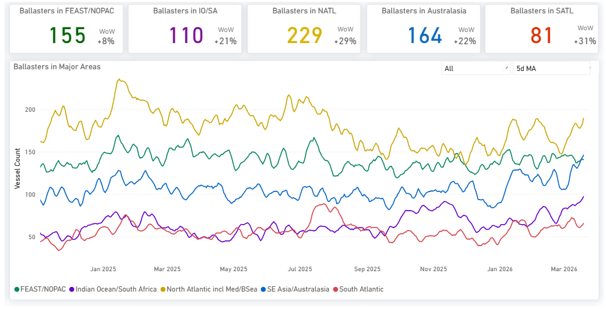
*Signal Figure*

- Handysize vessels continued to face elevated supply pressure since the end of February. In the North Atlantic, the vessel count remained high, exceeding 220 and now nearing 230 (+29% WoW). In the Pacific, pressure intensified in Australasia, where the vessel count surpassed 160 (+20% WoW).

## DEMAND|TONNE MILES- 7D MA- INDEX VIEW

Capesize ↓ 0.2%WoW| Panamax ↓ 2.5%WoW

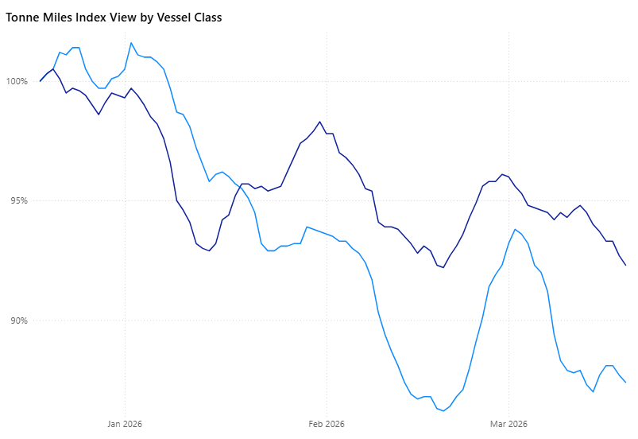
*Signal Figure*

The tonne-mile growth rate, measured on a Base 100 Index basis, weakened for the larger vessel classes this week. The Capesize index declined to 87.7, down 0.6% WoW from 87.9. The Panamax index also fell to 93.1, decreasing 2.6% WoW from 95.5. Despite the softer weekly performance, Panamax remains closer to the Base 100 benchmark, while Capesize continues to lag more significantly. Capesize now sits 12.3 points below base, while Panamax stands 6.9 points below the benchmark.

Supramax|Handymax|Handysize

Supramax ↓ 2.5%WoW| Handymax ↓ 2.0%WoWHandysize ↓ 2.3%WoW

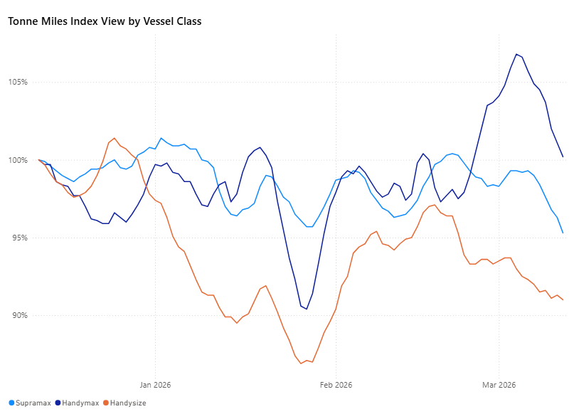
*Signal Figure*

The tonne-mile growth rate, measured on a Base 100 Index basis, showed a mixed trend this week. Supramax declined to 95.9% from 98.3% WoW, while Handysize also eased to 94.9% from 96.2%. In contrast, Handymax remained above the benchmark at 105.8%, although slightly lower than 107% the previous week.

Metrics Description:Index View(Base 100) by total Tonne Miles over the selected period. This facilitates relative performance comparisons between segments of different sizes (e.g., comparing the growth rate of Supramax vs Capesize)

For the latest updates and insights, make sure to visit theSignal Ocean Newsroompage &subscribe to weekly reports. Clickhere to request a demo. Click here to see theprevious dry bulk weeklyreport.

For subscription to our FREE weekly market trends email, please contact us: research@thesignalgroup.com

-Republishing is allowed with an active link to the source
