# Weekly Dry Market Monitor: Week 18, 2026

**Date**: April 29, 2026 | **Category**: Dry bulk | **Section**: Monitors | **Source**: [https://www.thesignalgroup.com/weekly-market-monitor/weekly-dry-market-monitor-week-18-2026](https://www.thesignalgroup.com/weekly-market-monitor/weekly-dry-market-monitor-week-18-2026)

---

## Spotlight | Ballasters Vs Baltic Rates

- Capesize Vs Panamax

April ends with firm sentiment in both Capesize and Panamax segments. On the C3 route, freight levels are supported by ballaster counts trending below the 12-month average. In Panamax, low ballaster availability across the P1/P2/P7 routes signals an undersupplied market, underpinning current rate strength.

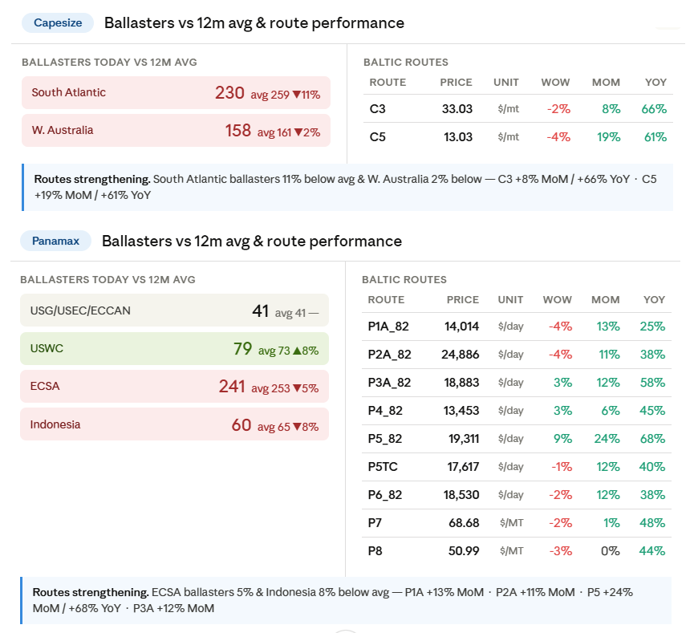
*Source: Signal Ocean Platform |Cape-PanamaxInsights Data (last update: April 28, 2026)*

## FREIGHT MARKET OVERVIEW

The Baltic Dry Index is approaching 2,700 points, with gains recorded across all sub-indices: Capesize leading at +117.4% YoY, followed by Supramax +58.2%, Handysize +41.8%, and Panamax +40.9%.

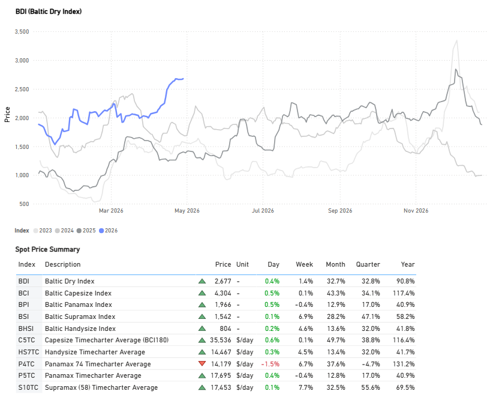
*Source: Signal Ocean Platform |Market PricesData (last update: April 28, 2026)*

‍

## FREIGHT ATLANTIC

Capesize C3 / Panamax P7 Firmer

‍

*Signal Figure*

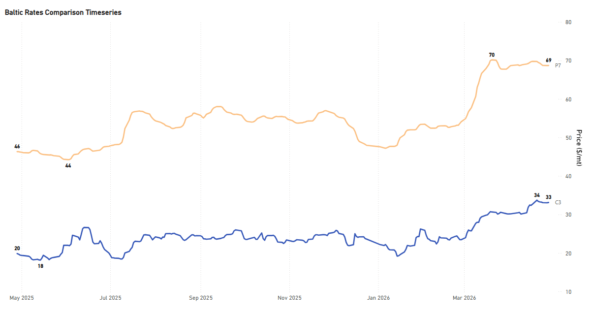
*Signal Figure*

‍

- C3| Tubarao to Qingdao | 33.12 $/MT | Day: +0.09 | Week: -0.28 | Year: +13.27
- P7| US Gulf to Qingdao grain | 68.69 $/MT | Day: +0.01 | Week: -0.78 | Year: +22.37

‍

Supramax S4A / Handysize HS4_38  Firmer

‍

*Signal Figure*

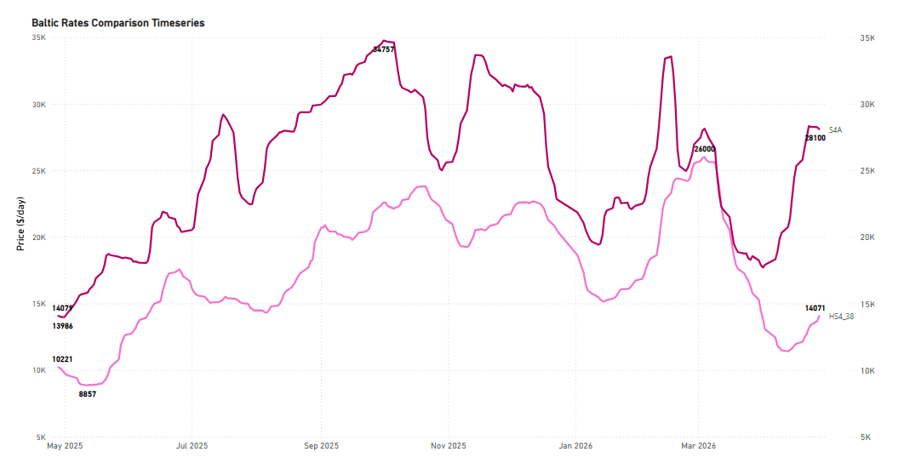
*Signal Figure*

‍

- S4A| US Gulf trip to Skaw-Passero | 28,100 $/day | Day: -143 | Week: +1,379 | Year: +14,021
- HS4_38| US Gulf trip via US Gulf or North Coast South America | 14,071 $/day | Day: +392 | Week: +1,600 | Year: +3,850

‍

## FREIGHT PACIFIC

Capesize | C5 Firmer

C5West Australia–Qingdao

‍

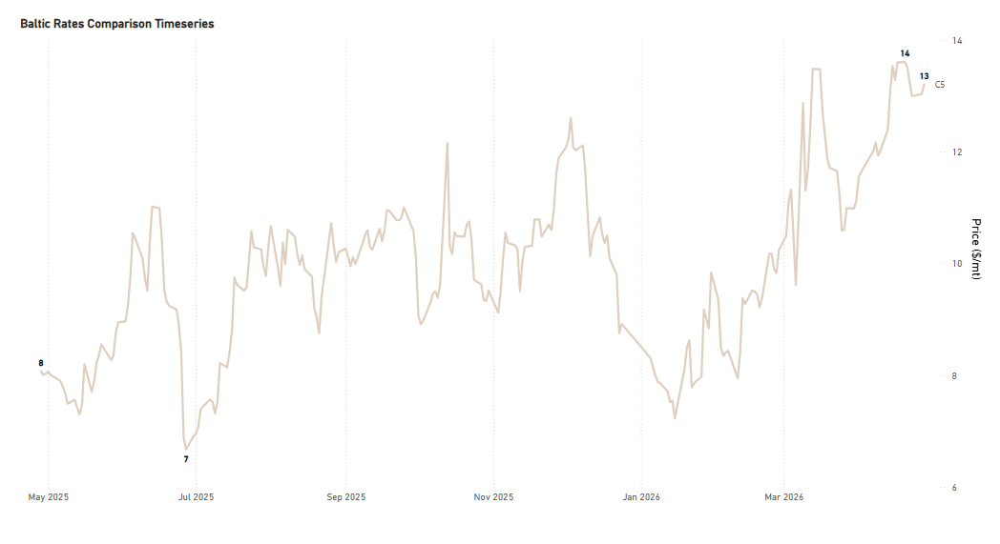
*Signal Figure*

‍

- C5| West Australia to Qingdao | 13.20 $/MT | Day: +0.17 | Week: -0.32 | Year: +5.13

‍

Panamax P5_82 / Supramax S10 Firmer

*Signal Figure*

‍

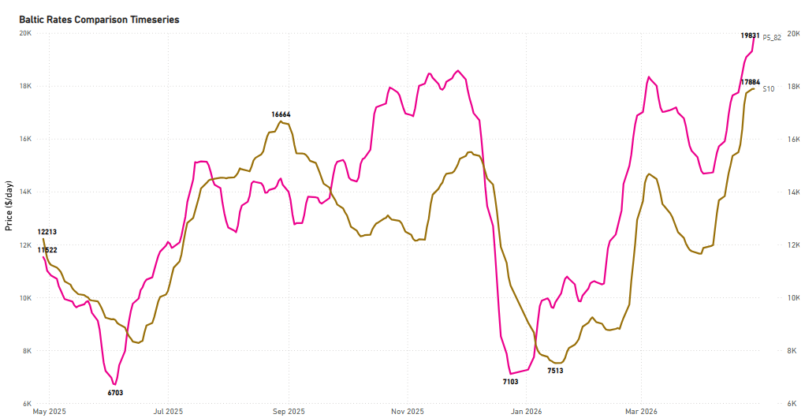
*Signal Figure*

‍

- P5_82| South China, Indonesian round voyage | 20,244 $/day | Day: +413 | Week: +1,772 | Year: +8,863
- S10| South China trip via Indonesia to South China | 17,668 $/day | Day: -216 | Week: +1,305 | Year: +5,832

## BALLASTERS OVERVIEW

We take a closer look at the basins of ballast count increases per vessel size segment.

Capesize:Ballastersare rising in the Indian Ocean/SA to more than 160 (+8% WoW), while in Australasia the count has sustained at 200.

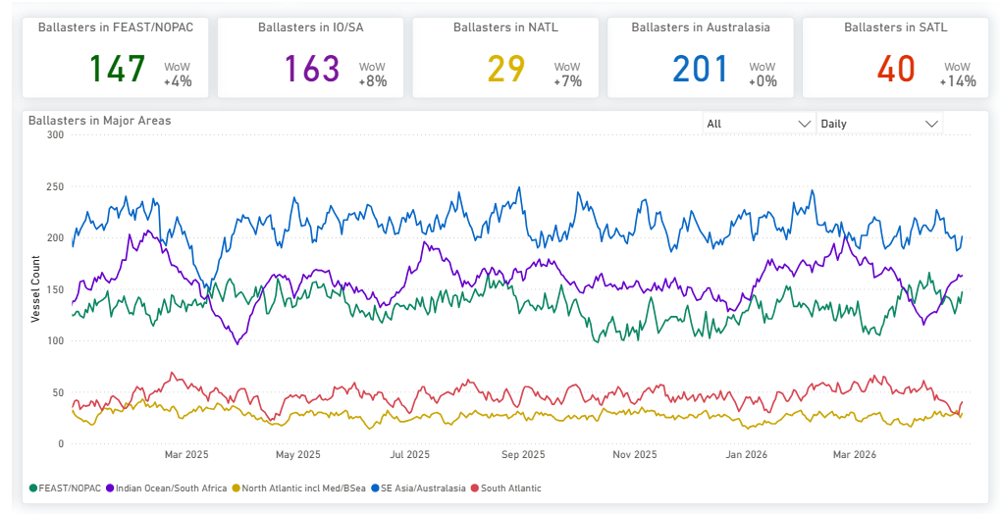
*Signal Figure*

Panamax:Atlanticbasins are surging. NATL up +38% WoW and SATL up +32% WoW, while FEAST/NOPAC basin shows modest growth.

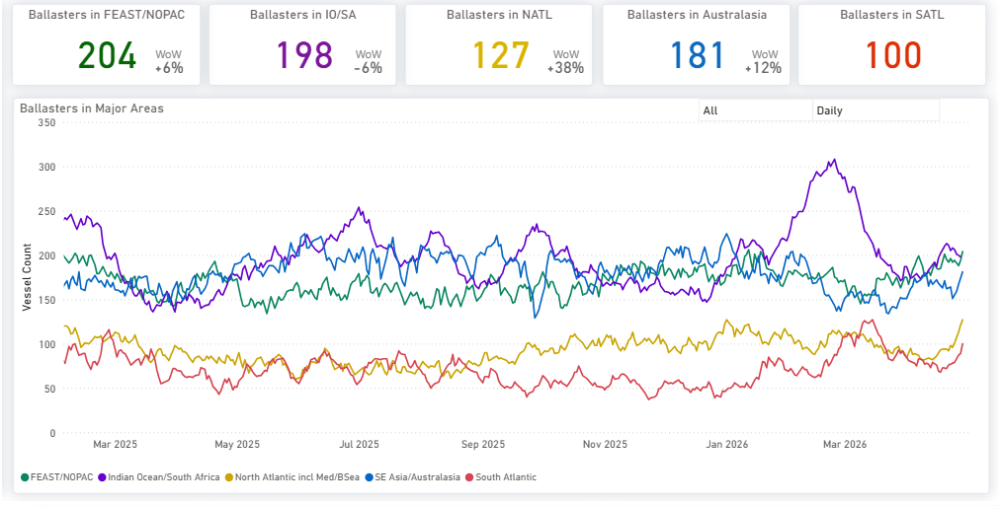
*Signal Figure*

Supramax:TheNorth Atlanticbasin is surging with the count up +40% WoW and FEAST/NOPAC up +20% WoW.

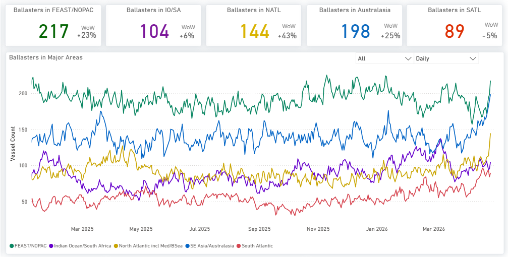
*Signal Figure*

Handysize:Ballastersare surging in the Atlantic and Pacific, with NATL and SATL leading at +31% and +33% WoW. The Indian Ocean is growing at a more measured pace of +9%.

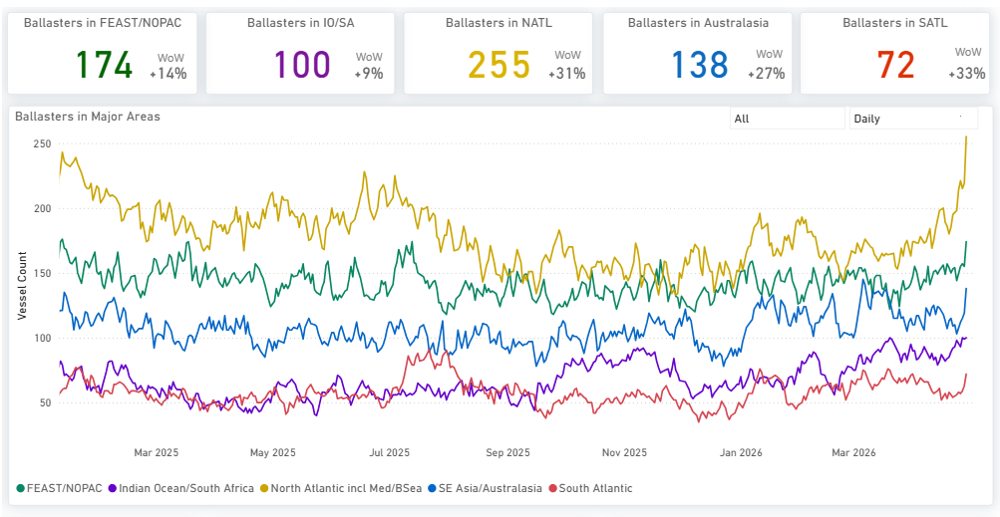
*Signal Figure*

## DEMAND|TONNE MILES- 7D MA- INDEX VIEW

Capesize ↓ 0.9%WoW| Panamax ↓ 1.5%WoW| Supramax ↓0.3%WoW

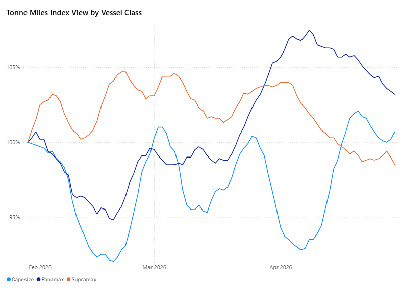
*Signal Figure*

‍

By the end of April, Supramax and Panamax are losing momentum, while Capesize is showing a renewed upward trend. Despite the recent softening, both Capesize and Panamax indices remain above the 100% threshold, indicating still-elevated demand levels, whereas Supramax continues to lag below.

For the latest updates and insights, make sure to visit theSignal Ocean Newsroompage &subscribe to weekly reports. Clickhere to request a demo. Click here to see theprevious dry bulk weeklyreport.

For subscription to our FREE weekly market trends email, please contact us: research@thesignalgroup.com

-Republishing is allowed with an active link to the source
