# Weekly Dry Market Monitor: Week 19, 2026

**Date**: May 08, 2026 | **Category**: Dry bulk | **Section**: Monitors | **Source**: [https://www.thesignalgroup.com/weekly-market-monitor/weekly-dry-market-monitor-week-19-2026](https://www.thesignalgroup.com/weekly-market-monitor/weekly-dry-market-monitor-week-19-2026)

---

## ‍Spotlight | Vessel Crossings Strait of Hormuz

## 1-5 May: 15 Total dry bulk crossings, 8 E-W, 7 W-E, No crossings recorded from May 5th

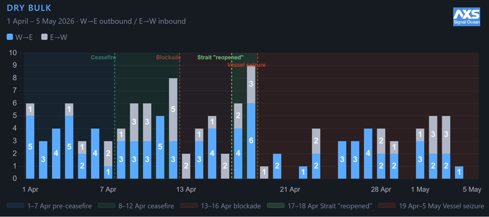
*Signal Figure*

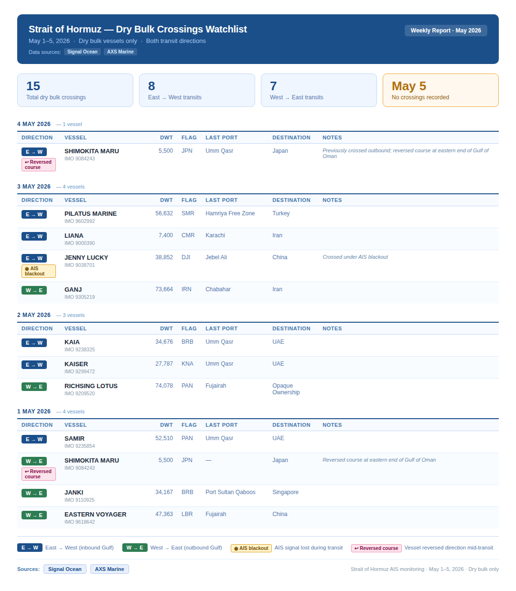
*Signal Figure*

## FREIGHT MARKET OVERVIEW

The Baltic Dry Index is approaching the 3,000-point threshold, supported by sustained gains across all major vessel segments, with theCapesizemarket continuing to lead the rally at +149% year-on-year. Current index levels represent the strongest performance recorded since 2023, reflecting a marked improvement in freight market sentiment, particularly in the Capesize sector, which has driven consistent upward momentum since the end of the first quarter of this year.

The Panamax segment is also demonstrating robust annual growth, with index levels up +57% year-on-year. Meanwhile, positive market fundamentals continue to support the smaller vessel categories, with the Supramax index increasing by +58% year-on-year and the Handysize index by +47% year-on-year.

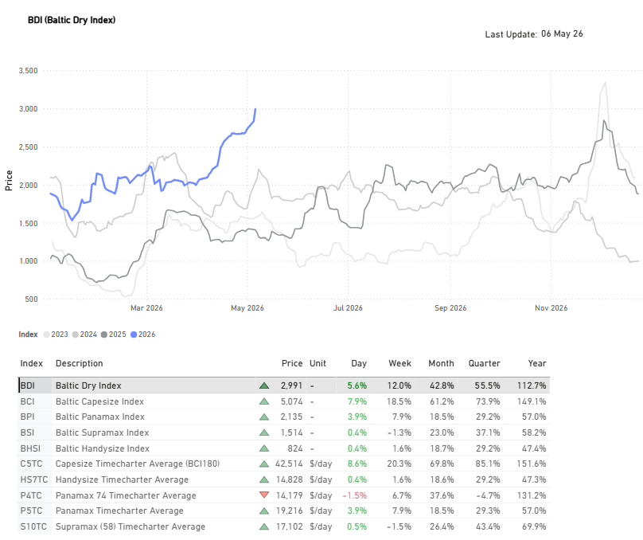
*Source: Signal Ocean Platform |Market PricesData (last update: May 7, 2026)*

## FREIGHT ATLANTIC

Capesize C3 / Panamax P7 Firmer

- C3| Tubarao to Qingdao | 36.91 $/MT | Day: +1.18 | Week: +3.74 | Year: +17.75
- P7| US Gulf to Qingdao grain | 70.75 $/MT | Day: +0.87 | Week: +2.10 | Year: +24.75

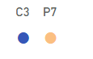
*Signal Figure*

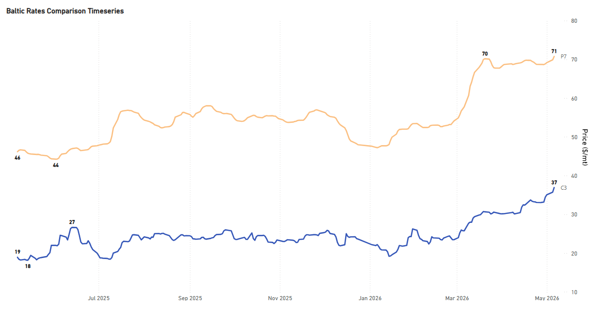
*Signal Figure*

The first week of May has confirmed the bullish momentum in the Atlantic Capesize freight market that emerged during April, with freight rates now exceeding $35/ton and reaching an annual peak of $37/ton. The continued upward trajectory in rates has been closely supported by sustained iron ore export activity from both Australia and Brazil throughout April.

Australian iron ore exports recorded a monthly increase of 5%, while Brazilian volumes showed a more pronounced rise of 11% month-on-month, reaching nearly 33 million metric tons. This marks one of the highest export levels recorded since the previous peak observed in August 2025, when shipments climbed to 41 million metric tons. The strong export performance from both major suppliers continues to provide firm underlying support to Capesize market fundamentals and freight sentiment in the Atlantic basin.

Supramax S4A / Handysize HS4_38  Mixed

*Signal Figure*

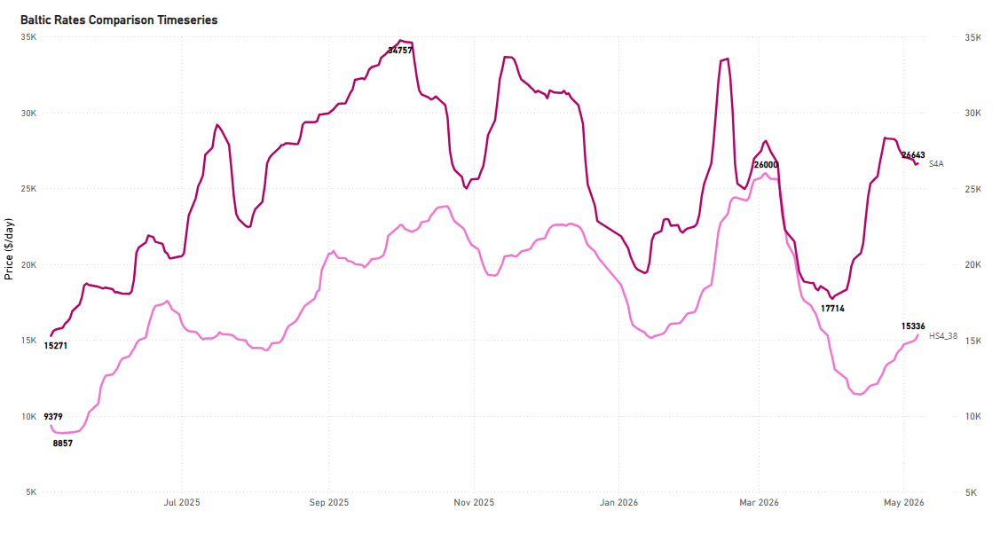
*Signal Figure*

- S4A| US Gulf trip to Skaw-Passero | 26,643 $/day | Day: -678 | Week: +8,307 | Year: +11,372
- HS4_38| US Gulf trip via US Gulf or North Coast South America | 15,336 $/day | Day: +929 | Week: +2,893 | Year: +5,957

## FREIGHT PACIFIC

Capesize | C5 Firmer

C5West Australia–Qingdao

‍

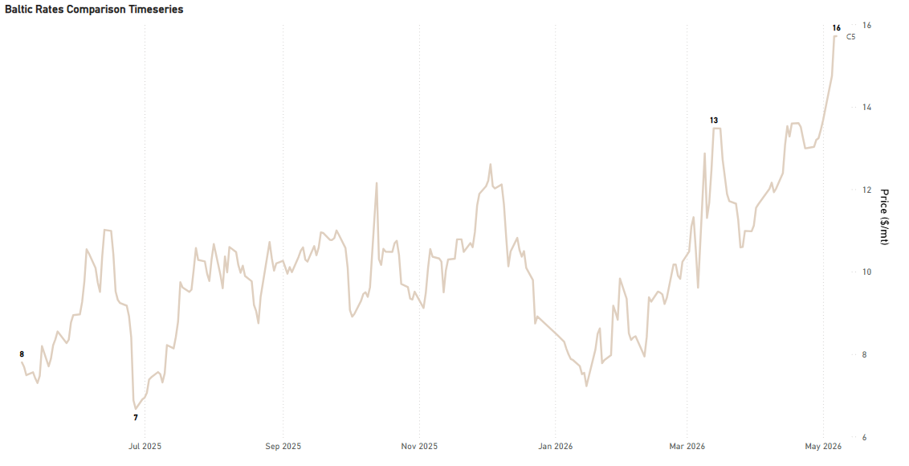
*Signal Figure*

‍

- C5| West Australia to Qingdao | 15.72 $/MT | Day: +0.0 | Week: +2.28 | Year: +7.92

Panamax P5_82 / Supramax S10 Firmer

*Signal Figure*

‍

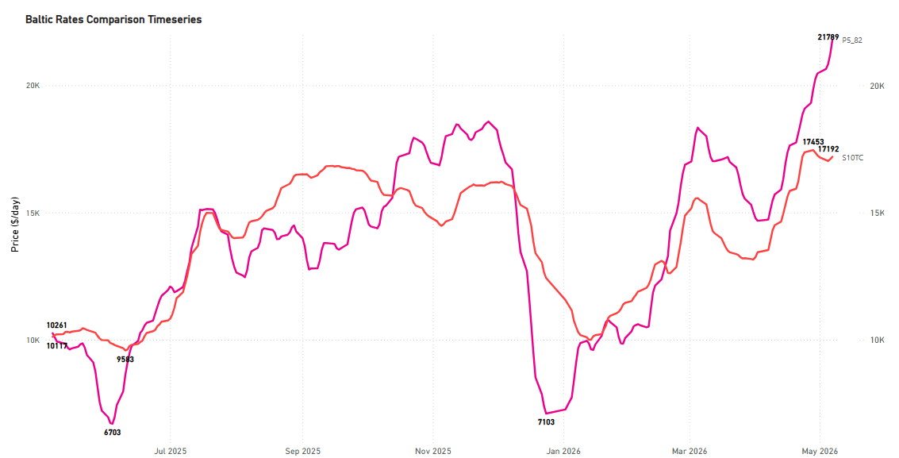
*Signal Figure*

‍

- P5_82| South China, Indonesian round voyage | 21,789 $/day | Day: +564 | Week: +1,322 | Year: +11,528
- S10| South China trip via Indonesia to South China | 17,191 $/day | Day: +95 | Week: -247 | Year: +6,228

## BALLASTERS OVERVIEW

We take a closer look at the basins of ballast count increases per vessel size segment.

Capesize:Ballastersare rising in the Indian Ocean/SA to 170 (+12% WoW), while in Australasia the count has now reached 220 (+15% WoW).

‍

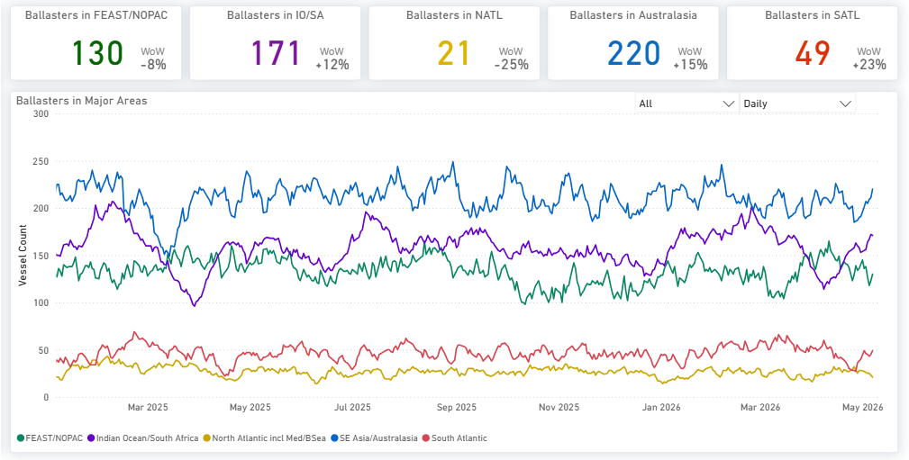
*Signal Figure*

Panamax:The upward trend inAtlanticbasins persisted from the prior week. In the South Atlantic, the ship tally surpassed 100, while the North Atlantic count held at over 110 vessels, reflecting a slight 3% weekly dip. Concurrently, Pacific market pressure intensified in the Far East/NOPAC region, where the vessel count climbed above 200, marking a 10% WoW rise.

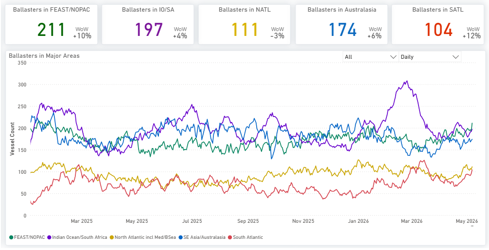
*Signal Figure*

Supramax:For the current week, thePacificbasin is exhibiting a sharp upward trajectory in contrast to theAtlantic. In Australasia, the number of ballasting vessels has surged past 200 (+49% WoW), while the Indian Ocean maintained its previous momentum with a vessel count exceeding 100.

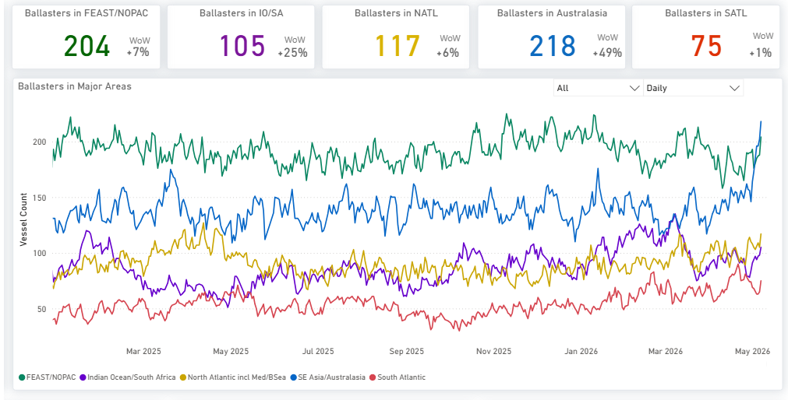
*Signal Figure*

Handysize:The number ofballastersin the Atlantic continues to climb, with the North Atlantic tally exceeding 250 (+15% WoW) and the South Atlantic reaching over 80 (+15% WoW). Simultaneously, the Pacific is experiencing broad upward pressure; vessel counts are approaching 160 in Far East/NOPAC (+18% WoW), topping 100 in the Indian Ocean/South Africa (+19% WoW), and surpassing 120 in Australasia (+15% WoW).

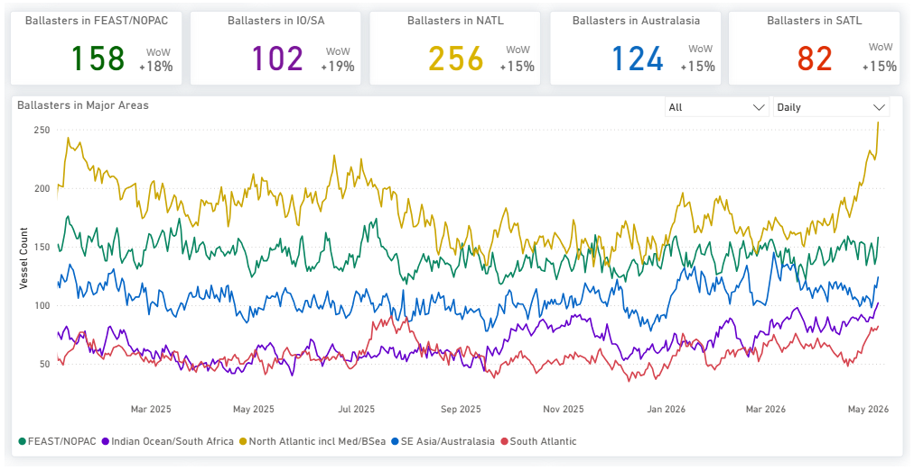
*Signal Figure*

## DEMAND|TONNE MILES- 7D MA- INDEX VIEW

Capesize ↓ 1.3%WoW| Panamax ↑ 0.3%WoW| Supramax ↓1.1%WoW

‍

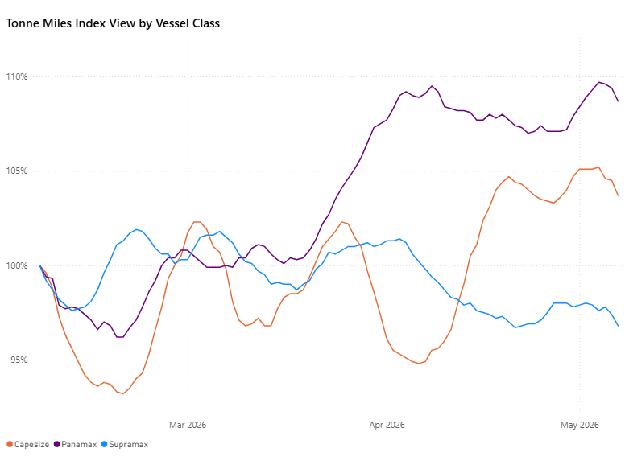
*Signal Figure*

‍

Panamax continues to trade above the 100% threshold, supported by firm tonne-mile demand. Capesize has strengthened in recent weeks and is now above 103%. Supramax remains below 100% at around 97%, reflecting lagging demand and upward pressure on the ballasters' side.

Metrics Description:Index View(Base 100) by total Tonne Miles over the selected period. This facilitates relative performance comparisons between segments of different sizes (e.g., comparing the growth rate of Supramax vs Capesize)

For the latest updates and insights, make sure to visit theSignal Ocean Newsroompage &subscribe to weekly reports. Clickhere to request a demo. Click here to see theprevious dry bulk weeklyreport.

For subscription to our FREE weekly market trends email, please contact us: research@thesignalgroup.com

-Republishing is allowed with an active link to the source
