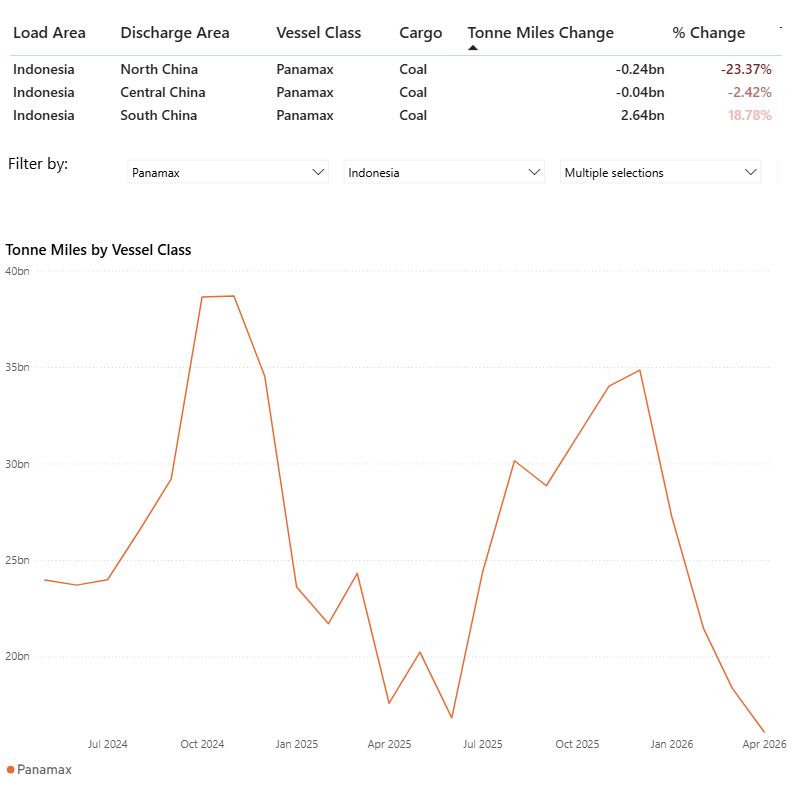
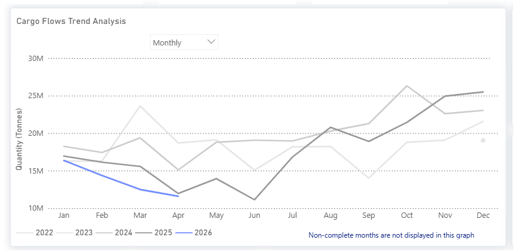
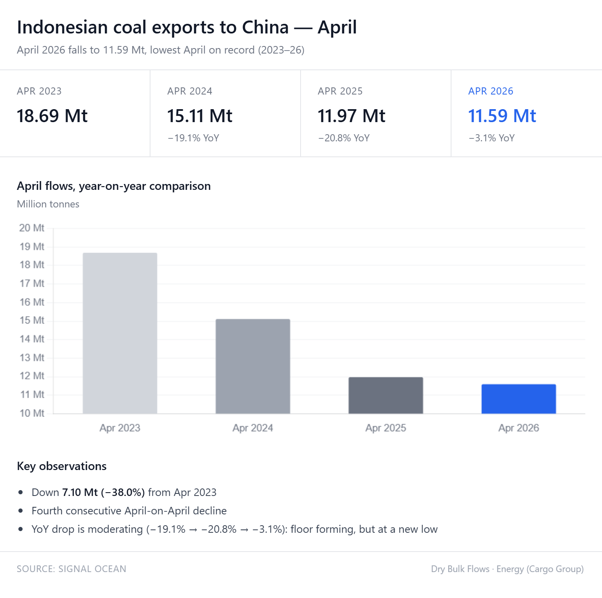
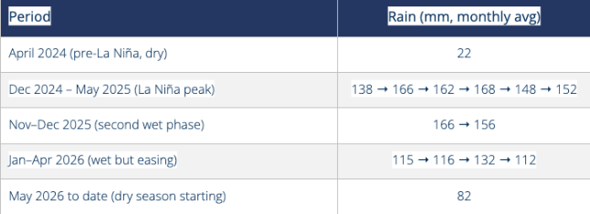
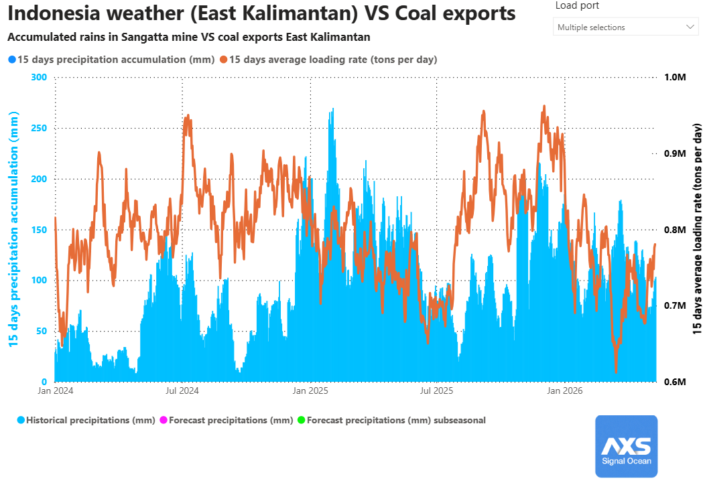
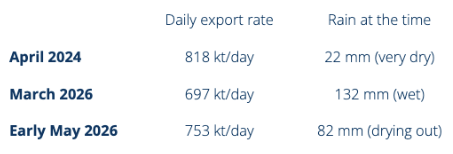

# Weekly Dry Market Monitor: Week 20, 2026

**Date**: May 14, 2026 | **Category**: Dry bulk | **Section**: Monitors | **Source**: [https://www.thesignalgroup.com/weekly-market-monitor/weekly-dry-market-monitor-week-20-2026](https://www.thesignalgroup.com/weekly-market-monitor/weekly-dry-market-monitor-week-20-2026)

---

## ‍DRY Market Insights |Weak Indonesian Coal Exports PressurePanamax Tonne Days‍

- Indonesia–China coal trade weakness is negatively impacting Panamax tonne-mile demand, particularly on northern discharge routes.

*Signal Figure*

## Key Takeaways

- The decline in Indonesian coal exports to China is becoming increasingly evident.
- La Niña-related rainfall disruptions appear to have had only a limited impact on export volumes.

All data and commentary reflect market conditions as of [ 13 May 2026], unless otherwise stated.

## Spotlight | China's appetite forIndonesian coalhits new low

*Signal Figure*

## Flow Trend

Indonesia-to-China seaborne thermal coal flows declined 11.0% year-over-year to 214.1 million tonnes in 2025, from 240.5 million tonnes in 2024, according to Signal Ocean data. The decline began in March 2025, when volumes fell to 15.58 Mt, down 19.6% year-over-year, before reaching a low of 11.13 Mt in June, a decline of 41.6%.

The weakness was concentrated in the first half of 2025, while the second half showed a partial recovery. November and December 2025 volumes exceeded the same months of 2024 by approximately 10%. However, April 2026 flows remained subdued at 11.6 Mt, indicating continued weakness in Chinese imports of Indonesian thermal coal.

*Signal Figure*

## Main Driver

The decline coincided with a concentrated policy rollout in Indonesia between January and March 2025. Indonesia began moving toward its B40 biodiesel mandate from 1 January 2025, with a transition period running into February and full implementation expected in March. On 1 March 2025, Indonesia required coal transactions to use the government-set HBA benchmark. On the same date, GR 8/2025 introduced a requirement for natural-resource exporters to retain 100% of export proceeds within Indonesia’s domestic financial system for twelve months.

According to the Indonesian Coal Mining Association (APBI-ICMA) market commentary published in January 2026, the spread between Indonesian low-calorific-value (low-CV) coal and China’s domestic 4,500 kcal/kg net-as-received (NAR) coal narrowed to its lowest level in at least six years on a CV-adjusted delivered South China basis. Chinese importers were also reported to have resisted the new Harga Batubara Acuan (HBA)-linked pricing structure and sought contract renegotiations.

The continued weakness into 2026 also appears consistent with China’s increasing reliance on domestic coal production and energy-security policies. Higher domestic output and lower local coal prices have reduced the competitiveness of imported low-CV Indonesian cargoes in the Chinese coastal market. China Coal Transportation and Distribution Association (CCTD)  estimates China’s coal output will rise by 35 million tonnes to 4.86 billion tonnes in 2026, while coal imports are expected to decline 5.1% to 465 million tonnes.

## The weather angle

Sangatta 15-day accumulated rainfall data (East Kalimantan) shows the La Niña cycle clearly:

*Signal Figure*

‍

*Signal Figure*

## Did La Niña disrupt export flows?

June 2025 marked the cycle low for Indonesian coal exports to China, totaling 11.13 Mt. Analysis of Sangatta rainfall data suggests that weather was not the primary constraint during this period; while rainfall in June 2025 had eased to 92 mm from a wet-season peak of 168 mm in March, export flows continued to decline at a faster rate. Had weather been the binding factor, the volume low would have likely coincided with the peak precipitation in March or April.

This divergence of weather patterns and trade flows is further evidenced by the H2 2025 recovery, where November and December volumes exceeded 2024 levels despite rainfall rising again to 166 mm in November. Furthermore, April 2026 flows at 11.6 Mt sit just above the previous cycle low. Early May 2026 data shows rainfall dropping to 82 mm, the lowest monthly reading since the 2025 dry season, aligning with NOAA's April 2026 final La Niña advisory and the transition to the dry season in East Kalimantan.

## Two snapshots of the Indonesian daily export rate:

*Signal Figure*

Signal Ocean AXS data indicates a supply-side recovery as daily Indonesian export rates rose from 697 kt/day in March to 753 kt/day in early May 2026. However, when compared to the 818 kt/day recorded in April 2024 (under much drier conditions of 22 mm of rain), a persistent 65 kt/day gap remains, suggesting that demand-side weakness may still be limiting export recovery.

## What's next

The April 2026 ENSO outlook from NOAA indicates that ENSO-neutral conditions are expected in the near term, with an increasing probability of El Niño developing in the second half of 2026. A shift toward drier weather patterns in Indonesia would likely reduce rainfall in Sangatta toward the dry-season lows recorded in 2024, thereby enhancing mining productivity and mitigating existing operational constraints.

Signal Ocean data indicate that coal flows from Indonesia to China were influenced more by demand conditions and regulatory policy changes than by precipitation levels.  The substantial decline observed in the first half of 2025 coincided with Indonesian policy tightening and diminished Chinese purchasing activity, rather than peak rainfall periods.

The primary consideration for the latter half of 2026 is the potential emergence of a new demand window. A recovery toward the 2024 baseline of approximately 20 Mt/month would likely necessitate either intensified Chinese power demand or Indonesian coal re-establishing a more significant price discount relative to Chinese domestic supply. In the absence of such demand-side support, improvements in mining conditions appear insufficient to generate a meaningful increase in tonne-mile growth.

Current market conditions remain challenging, as Indonesian producers continue prioritizing domestic requirements while China and India maintain a strong focus on domestic coal security.

All data, estimates, and projections presented herein are based on information available as of [May 13, 2026]. While every effort has been made to ensure accuracy, the analysis is subject to revision as additional information becomes available.

For the latest updates and insights, make sure to visit theSignal Ocean Newsroompage &subscribe to weekly reports. Clickhere to request a demo. Click here to see theprevious dry bulk weeklyreport.

For subscription to our FREE weekly market trends email, please contact us: research@thesignalgroup.com

-Republishing is allowed with an active link to the source
