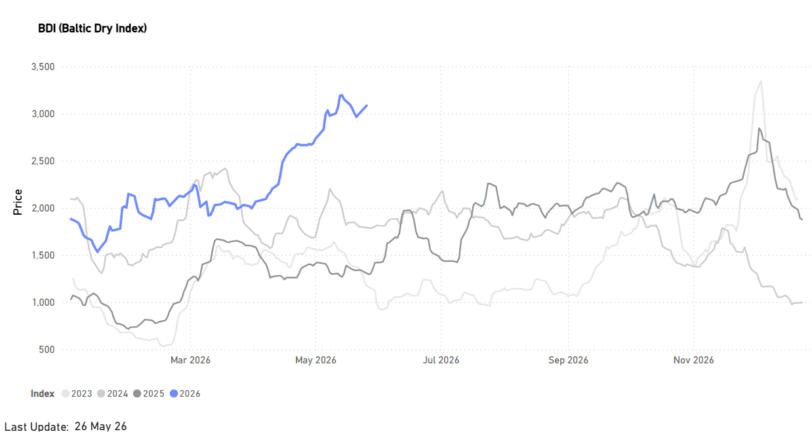

# Weekly Dry Market Monitor: Week 23, 2026

**Date**: June 1, 2026 | **Category**: Dry bulk | **Section**: Monitors | **Source**: [https://www.thesignalgroup.com/weekly-market-monitor/weekly-dry-market-monitor-week-23-2026](https://www.thesignalgroup.com/weekly-market-monitor/weekly-dry-market-monitor-week-23-2026)

---

## Spotlight  on Capesize Freight and Growth of Tonne Miles to India

### Key Takeaway

- The first half of the year is on track for the strongest Baltic Dry Index (BDI) performance since 2023.

*Signal Figure*

- C3 and C5 rates remain supported by resilient Chinese iron ore imports despite weak domestic steel production.
- Market attention is increasingly shifting toward India’s evolving iron ore demand dynamics.

The first half of the year is shaping up to deliver the strongest Baltic Dry Index (BDI) performance since 2023. While activity on the C3 and C5 routes continues to be supported by robust Chinese iron ore import demand, despite continued weakness in domestic steel production, attention is increasingly turning to India. Recent shifts in Indian iron ore demand are beginning to influence dry bulk trade flows and could become a more significant driver of freight market dynamics in the months ahead.

All data and commentary reflect market conditions as of [Friday, 29 May 2026], unless otherwise stated.

## FREIGHT MARKET OVERVIEW | Capesize Snapshot

![Figure 1: Real-time Capesize Spot Price Summary and BCI Seasonal Performance as of May 29, 2026 (Source: [Signal Ocean Platform]Market PricesDashboard).](../images/6a1d5b95dfe69a6480ddab10_a43a6e44.png)
*Figure 1: Real-time Capesize Spot Price Summary and BCI Seasonal Performance as of May 29, 2026 (Source: [Signal Ocean Platform]Market PricesDashboard).*

‍

The Baltic Capesize Index (BCI) closed at 5,503 points in the final week of May, while the Capesize Timecharter Average (C5TC) stands at $46k/day, reflecting a year-on-year increase of 170%. At the route level, the C3 route (Tubarao to Qingdao) is assessed at $38/MT, up 57% quarter-on-quarter and 90% year-on-year, supported by firm Brazil-China iron ore volumes and tighter tonnage availability in the Atlantic basin. The C5 route (West Australia to Qingdao) is currently assessed at $16.4/MT, also up 56% quarter-on-quarter and 97% year-on-year, reflecting stronger Pacific market conditions compared to the same period last year.

## Spotlight | India: An Emerging Driver to Watch

This year, a new dynamic driver has begun to show early signs in India-bound cargo flows. Increased volume of iron ore shipments from major loading hubs (primarily Brazil) to Indian discharge ports is beginning to absorb global tonnage. Although it is still too early to draw definitive conclusions, this developing flow represents an emerging variable. If this trend stabilizes and continues to grow, it could eventually establish itself as a distinct, supplementary benchmark for global freight performance alongside the traditional routes captured in the Spot Price Summary.

![Figure 2: Cargo Flows Trend Analysis Iron Ore to India (Source: [Signal Ocean Platform]Dry Bulk FlowsDashboard).](../images/6a1d5b95dfe69a6480ddab16_5e2a8d3c.png)
*Figure 2: Cargo Flows Trend Analysis Iron Ore to India (Source: [Signal Ocean Platform]Dry Bulk FlowsDashboard).*

- Record Q1 Volume Peak(5.0M Tonnes): Dry bulk flow data for Q1 2026 indicate the highest quarterly cargo volume recorded across the three-year observation period, underscoring a marked acceleration in trading activity.

Of the record 5.0 million tonnes imported in Q1 2026, the three largest identified origins accounted for approximately 54% of total volumes:

- Brazil: 1.8 million tonnes (~36% of total Q1 volume)
- Oman: 735,000 tonnes (~15% of total Q1 volume)
- Australia: 164,000 tonnes (~3% of total Q1 volume)‍

- Strong Year-over-Year Expansion(+127.3%): Cargo volumes increased sharply compared to Q1 2025 (2.2M tonnes) and were more than four times higher than Q1 2024 levels (1.1M tonnes), highlighting the scale of market growth over the past two years.
- Continued Quarter-over-Quarter Strength(+38.9%): Following the strong momentum observed in Q4 2025 (3.6M tonnes), volumes continued to expand into Q1 2026, contrasting with the seasonal softening typically associated with post-holiday trading patterns.

## Why India Bought More Iron Ore from Brazil (The Fundamental Drivers)

## A Quality Mismatch in Domestic Supply

India’s iron ore production remains substantial, but steelmakers continue to face constraints in the availability of higher-grade material. Domestic output is heavily weighted toward fines rather than lump ore, creating quality and consistency challenges for large integrated steel plants that require premium, low-alumina feedstock for efficient blast furnace operations. This has increased reliance on imported high-grade Brazilian ore, particularly among coastal mills.

## Steel Capacity Growth Is Raising Raw Material Demand

India’s steel sector continues to expand in line with the National Steel Policy target of 300 million tonnes of crude steel capacity by 2030-31. The country’s installed crude steel capacity reached more than 220 million tonnes in 2025-26, while infrastructure-led industrial demand remained strong following another increase in public capital expenditure in the 2026-27 budget. As steel output rises, demand for higher-grade metallurgical raw materials is growing faster than domestic supply quality can consistently support.

## Coastal Mills Drives Import Demand

Indian steelmakers with coastal operations were among the strongest drivers of import growth, as imported seaborne ore became increasingly viable relative to inland sourcing costs. JSW Steel, one of India’s largest steel producers, expanded capacity at both Vijayanagar and Dolvi, increasing requirements for premium-grade imported ore.

## Falling Seaborne Prices Improved Import Economics

Lower seaborne iron ore prices improved the attractiveness of imported material during Q1 2026, particularly for coastal steel producers. Elevated domestic rail and handling costs also narrowed the landed-cost gap between imported and domestically sourced ore, supporting additional buying from Brazil.

## India and Brazil Strengthened Mining Cooperation

In February 2026, India and Brazil signed a mining and minerals cooperation agreement aimed at strengthening collaboration across exploration, mining, processing, infrastructure, recycling, and steel-sector supply chains. The agreement reflected an intense effort by both countries to improve long-term raw material security and deepen strategic cooperation in the steel value chain.

## Middle East Supply Risks Added Support

Geopolitical tensions in the Middle East also contributed to shifting procurement patterns during the period. Concerns over the reliability of some pellet supply flows from the region encouraged Indian buyers to diversify sourcing and rely more heavily on established long-haul suppliers, including Brazil.

## DEMAND| TONNE-MILES INDEX VIEW & BILLIONS

Capesize • Cargo: Iron Ore (Ores & Rocks) • Route: All to India • Timeframe: 2-Year Trend (Mid-2024 to Mid-2026)

- Baseline Activity(Mid-2024 to Early 2025): During the initial phase of the observation period, the index established a foundation at approximately 100% in mid-2024. While there was a short-lived seasonal peak in July, reaching 2.0 billion tonne-miles, the market subsequently entered a period of consolidation, maintaining levels near historical lows throughout the winter of 2025 ( dipping below 0.3 billion tonne-miles).
- Major Inflection Point(Spring 2025): A significant shift in demand dynamics occurred starting in April 2025. Capesize tonne-miles for iron ore shipments to India began a sharp upward trajectory, sustained through the second quarter, eventually peaking at roughly 300% (2.9 billion tonne-miles ) by July 2025.
- Record Volume(Early 2026): Following a temporary correction in late 2025, when the index retraced to approximately 150% (around 1.5 billion tonne-miles), the market entered a period of exceptional growth. Demand accelerated sharply, driving the index to a record high of nearly 450% in early 2026, the highest level observed during the past two years, equivalent to approximately 4.2 billion tonne-miles. Since reaching this peak, volumes have moderated slightly but remain at historically elevated levels, averaging around 420% in May, or roughly 3.5 billion tonne-miles.

## Capesize Absolute Tonne-Miles (Index View)

‍

![Figure 3: Tonne Miles Index View (Source: [Signal Ocean Platform]Tonne ChartsDashboard).](../images/6a1d5b95dfe69a6480ddab1c_312f9a63.png)
*Figure 3: Tonne Miles Index View (Source: [Signal Ocean Platform]Tonne ChartsDashboard).*

‍

Metrics Description:Index View(Base 100) by total Tonne Miles over the selected period. This facilitates relative performance comparisons between segments of different sizes (e.g., comparing the growth rate of Supramax vs Capesize)

## Capesize Absolute Tonne-Miles (Billions)

![Figure 4: Tonne Miles (Source: [Signal Ocean Platform]Tonne ChartsDashboard).](../images/6a1d5b95dfe69a6480ddab19_8d1c95cb.png)
*Figure 4: Tonne Miles (Source: [Signal Ocean Platform]Tonne ChartsDashboard).*

‍

For the latest updates and insights, make sure to visit theSignal Ocean Newsroompage &subscribe to weekly reports. Clickhere to request a demo. Click here to see theprevious dry bulk weeklyreport.

For subscription to our FREE weekly market trends email, please contact us: research@thesignalgroup.com

-Republishing is allowed with an active link to the source
