# Weekly Dry Market Monitor: Week 27, 2026

**Date**: July 07, 2026 | **Category**: Dry bulk | **Section**: Monitors | **Source**: [https://www.thesignalgroup.com/weekly-market-monitor/weekly-dry-market-monitor-week-27-2026](https://www.thesignalgroup.com/weekly-market-monitor/weekly-dry-market-monitor-week-27-2026)

---

## ‍SPOTLIGHT OF THE WEEK

## Capesize C3 & C5 Supply vs Demand

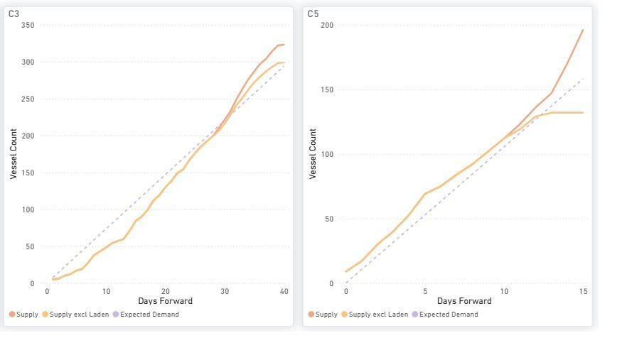
*Figure 1:Capesize — C3 & C5 Forward Balance: cumulative Supply vs Expected Demand over days forward (Source: The Signal Ocean Platform).*

‍

C3 (Tubarao–Qingdao):The current forward balance indicates cumulative vessel supply tracking below expected demand early to late July 2026, before gradually exceeding it into early August, indicating increasing forward vessel availability.

C5 (West Australia–Qingdao):The current forward balance shows cumulative vessel supply tracking above expected demand across most of the forward window, indicating relatively greater vessel availability under current conditions.

## FREIGHT MARKET OVERVIEW | BDI & SEGMENT METRICS

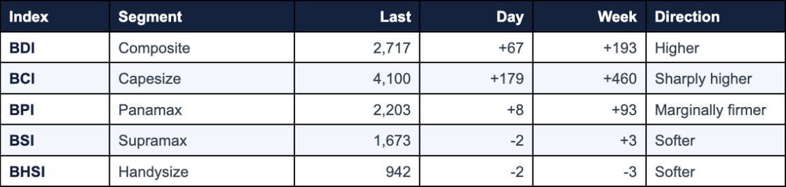
*Signal Figure*

Capesize led the market up: BCI rose to 4,100 (Day +179, Week +460), lifting the BDI to 2,717. C5TC TC avg surged to ~33,678 $/day (+1,618 on the day). Smaller segments showed mixed performance: Panamax was marginally firmer (BPI 2,203, Day +8, Atlantic-led). Supramax eased to 1,673 (Day -2) off its high, and Handysize slipped to 942 (Day -2) after a run of 52-wk highs. Global ballaster counts continued to build across all vessel classes (Handysize +23%, Panamax +13%, Capesize +12% WoW), pointing to gradually rising forward vessel availability.

All data and commentary reflect market conditions as of [3 July 2026], unless otherwise stated.

## CAPESIZE | ANALYSIS

This week, the analysis focuses on the Capesize supply vs demand balance. On the two iron-ore benchmarks, the C3 (Tubarão–Qingdao) route shows supply initially below expected demand through early to late July 2026 before gradually exceeding it into early August, indicating increasing forward vessel availability, while C5 (West Australia–Qingdao) shows supply above expected demand across most of the forward window, indicating higher forward vessel availability.

BCI rose to 4,100 (+179 day-on-day; +460 week-on-week), driving the dry bulk market higher. Average C5TC earnings climbed to $33,678/day (+$1,618 day-on-day). Iron ore routes remained firm, with C3 at $30.11/mt and C5 at $12.25/mt, although both continue to track below levels seen a month ago following the earlier market correction. BCI 52-wk high 5,517 / low 1,654.

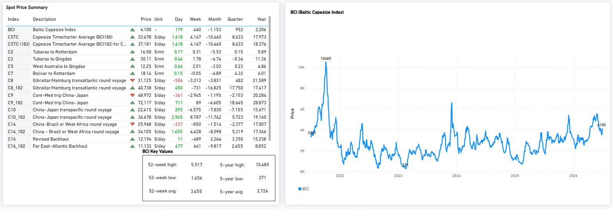
*Figure 2:Baltic Capesize Index (BCI) —spot price summary and BCI performance as of 03 Jul 2026 (Source: The Signal Ocean Platform).*

Global ballaster fleet increased to 624 vessels (+6% WoW). Australasia (229) and the Indian Ocean/South Africa (203) remain the largest ballaster concentrations, while the strongest weekly increase was recorded in the Indian Ocean/South Africa (+22% WoW).

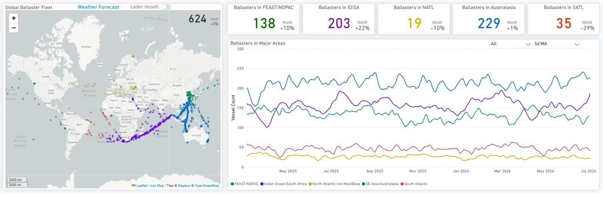
*Figure 3:Capesize —Global Ballaster Fleet and regional positioning (Source: The Signal Ocean Platform).*

Capesize and VLOC tonne-mile indices converge toward the low-90% range, with the recent decline indicating a softening trend in tonne-mile demand for July.

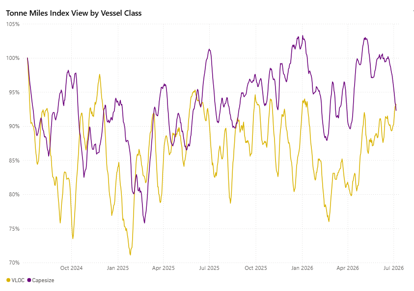
*Figure 4:VLOC vs Capesize —Tonne Miles Index View by Vessel Class (Source: The Signal Ocean Platform).*

## PANAMAX | ANALYSIS

BPI 2,203 (Day +8, Week +93) — marginally firmer, round-voyage-led. P1A_82 (+385) and P2A_82 (+365) are firm on the transatlantic and Pacific rounds. P5TC TC avg 19,825 $/day. The index continues to trade above the 5-year average of 1,894 and well above the 2025 low of 748. 52-wk high 2,521.

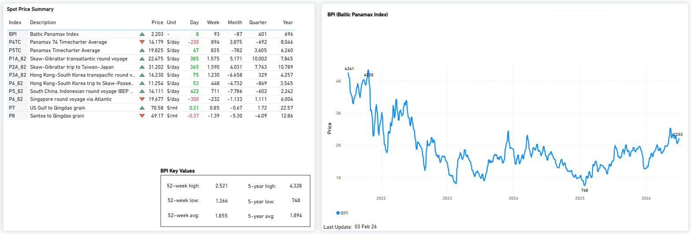
*Figure 5:Baltic Panamax Index (BPI) —spot price summary and BPI performance as of 03 Jul 2026 (Source: The Signal Ocean Platform).*

P1A_82 and P2A_82 continued to support Panamax earnings, while South China congestion remained elevated versus its 12-month average. Most key routes continue to trade above year-ago levels despite mixed month-on-month performance.

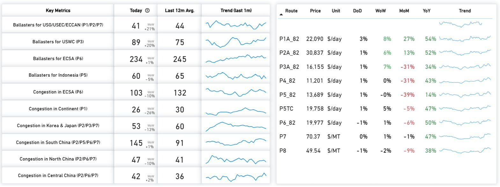
*Figure 6:Panamax — Key Metrics & Route Prices as of 03 Jul 2026 (Source: The Signal Ocean Platform).*

P3 continues to exhibit supply above expected demand throughout the forward horizon, whereas P5 remains below expected demand for most periods. P1/P2/P7 and P6 show supply and demand moving closely together initially, before supply gradually outpaces expected demand later in the window.

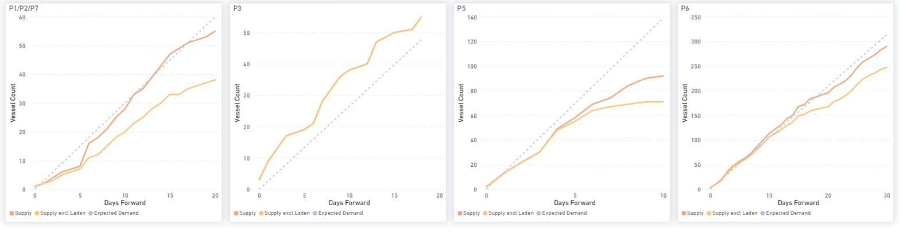
*Figure 7:Panamax —P1/P2/P7, P3, P5 & P6: cumulative Supply vs Expected Demand over days forward (Source: The Signal Ocean Platform).*

Global ballaster fleet rose to 759 vessels (+13% WoW). Australasia (204) and the Indian Ocean/South Africa (201) continue to host the largest ballaster concentrations, while all major regions recorded weekly increases.

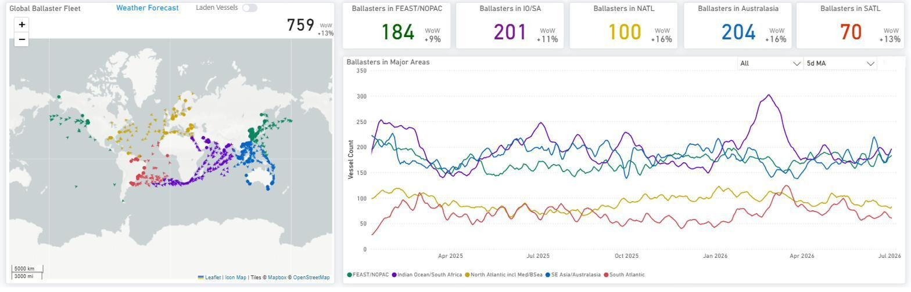
*Figure 8:Panamax — Global Ballaster Fleet and regional positioning (Source: The Signal Ocean Platform).*

Panamax and Post-Panamax tonne-mile indices remained close to the 100% index level, ending at 103.0% and 102.9%, respectively, with both series converging toward similar levels by early July 2026.

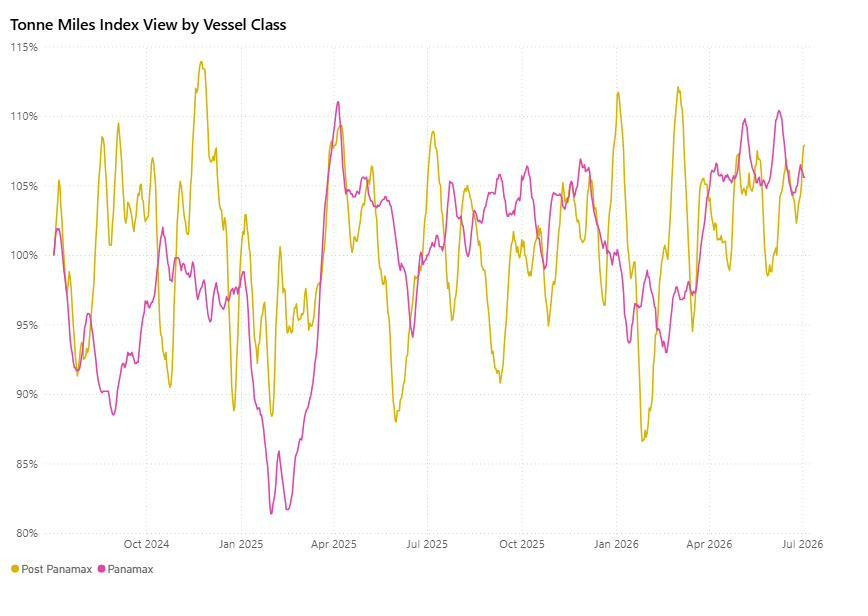
*Signal Figure*

Figure 9:Panamax vs Post-Panamax —Tonne Miles Index View by Vessel Class (Source: The Signal Ocean Platform).

SUPRAMAX | ANALYSIS

BSI eased to 1,673 (-2 day-on-day; +3 week-on-week), pulling back modestly after reaching recent highs. Average S10TC earnings slipped to $19,119/day (-$15 day-on-day), although monthly, quarterly, and annual performance remains above year-ago levels. The index remains close to its 52-week high (1,718), well above the 52-week low (952), and above its 5-year average (1,508).

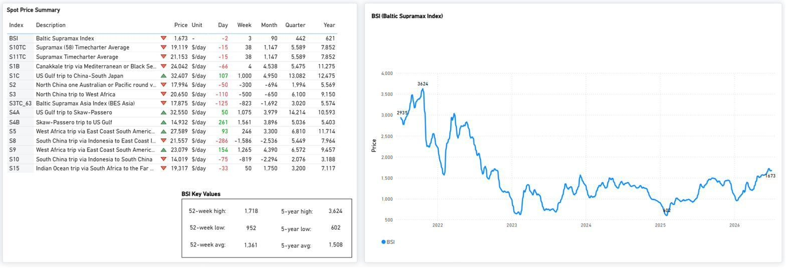
*Figure 10:Baltic Supramax Index (BSI) —spot price summary and BSI performance as of 03 Jul 2026 (Source: The Signal Ocean Platform).*

BSI eased from recent highs, although most key Supramax routes continue to trade above year-ago levels. Net vessel supply remained highest in the U.S. Gulf and Indonesia, while ECSA availability stayed below its historical average. North/Central China continued to show elevated congestion relative to the past 12 months.

S4A/S1C and S4B maintain supply above expected demand throughout the forward horizon. S5 remains closer to expected demand initially before supply gradually outpaces it later in the window, while S8/S10 also shift from near-term alignment to a widening supply-demand gap further forward.

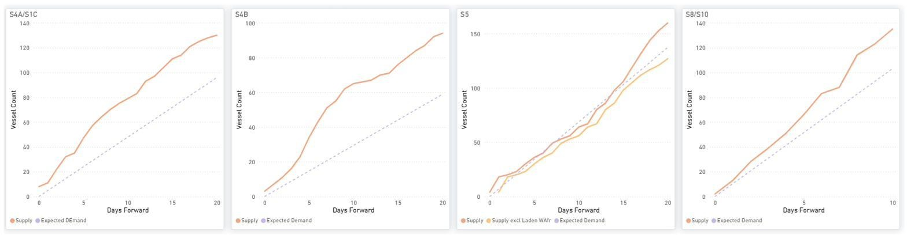
*Figure 11:Supramax —S4A/S1C, S4B, S5 & S8/S10: cumulative Supply vs Expected Demand over days forward (Source: The Signal Ocean Platform).*

Global ballaster fleet rose to 705 vessels (+23% WoW). Australasia (+39% WoW) recorded the strongest regional increase, while FEAST/NOPAC continued to host the largest ballaster concentration alongside Australasia.

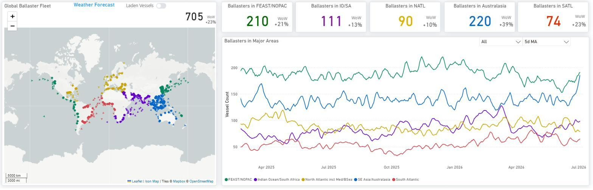
*Figure 12:Supramax —Global Ballaster Fleet and regional positioning (Source: The Signal Ocean Platform).*

## SUPRAMAX | DEMAND

Handymax is the standout with the strongest tonne-mile signal; Supramax firm but spot easing off its high; Handysize softer on tonne-miles even as spot consolidates near highs.

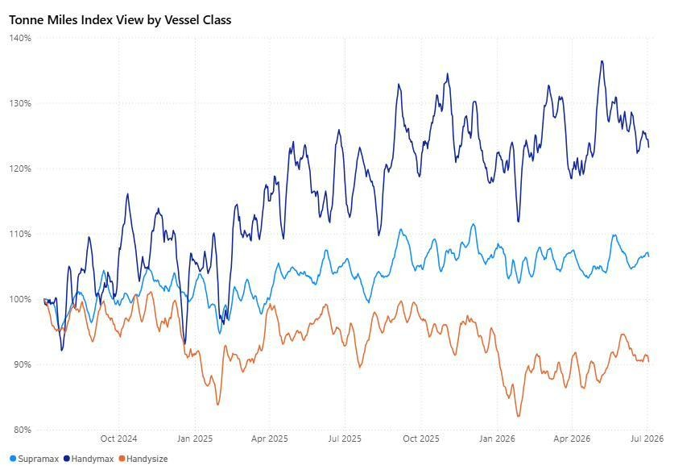
*Figure 13:Supramax · Handymax · Handysize —Tonne Miles Index View by Vessel Class (Source: The Signal Ocean Platform).*

‍

*Signal Figure*

## HANDYSIZE | ANALYSIS

BHSI edged lower to 942 (-2 day-on-day; -3 week-on-week) following a recent test of 52-week highs. Average HS7TC earnings eased to $16,960/day (-$30 day-on-day), with firmer Atlantic activity partly offsetting weaker Pacific routes. Despite the recent pullback, the index remains close to its 52-week high (947), above the 52-week low (588) and its 5-year average (877).

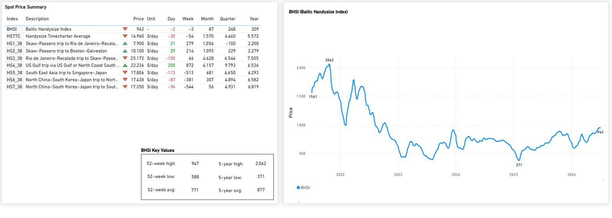
*Figure 14:Baltic Handysize Index (BHSI) —spot price summary and BHSI performance as of 03 Jul 2026 (Source: The Signal Ocean Platform).*

Handysize route performance remained firm, with most benchmarks continuing to trade above year-ago levels. Net vessel supply remained highest in the Far East (108) and UK Continent/Baltic (104), while congestion eased in the Continent and WAus/Indonesia/Philippines.

HS1/HS2 remains above expected demand throughout the forward window. HS5 moves above expected demand after approximately Day 5, while HS6 tracks expected demand more closely before supply edges above it later. HS7 remains below expected demand for much of the forward window before gradually converging toward expected demand.

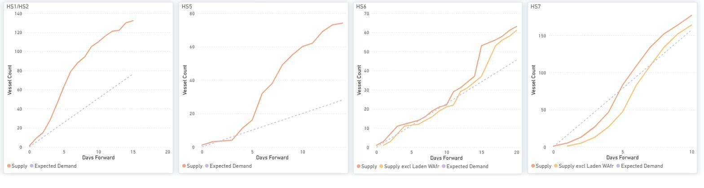
*Figure 15:Handysize —HS1/HS2, HS5, HS6 & HS7: cumulative Supply vs Expected Demand over days forward (Source: The Signal Ocean Platform).*

Global ballaster fleet rose to 682 vessels (+12% WoW). The North Atlantic (223) remained the largest ballaster concentration, while FEAST/NOPAC (+18% WoW) recorded the strongest regional increase.

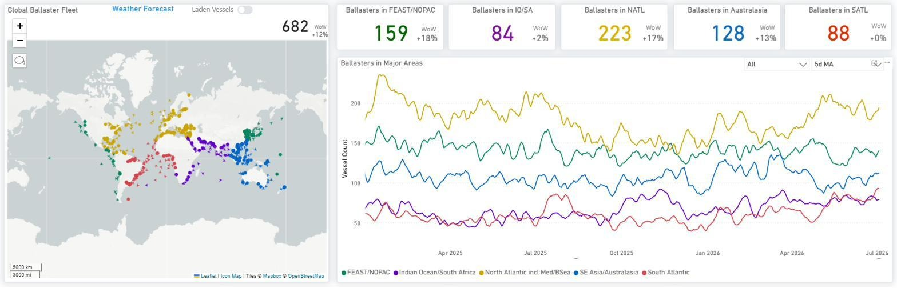
*Figure 16:Handysize —Global Ballaster Fleet and regional positioning (Source: The Signal Ocean Platform).*

‍

## OVERALL MARKET TREND | CONCLUSIONS

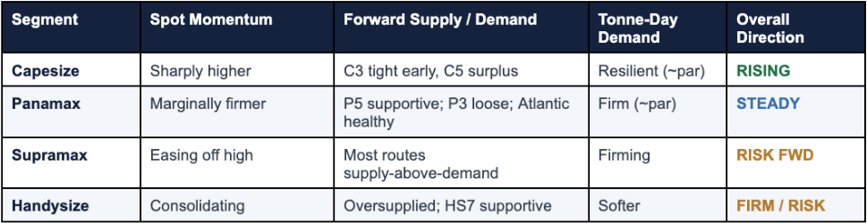
*Signal Figure*

The Capesize segment was the only sector to exhibit strong upward momentum. The Baltic Capesize Index (BCI) increased by 460 points over the week to 4,100 (representing a daily change of +179 points), while the C5TC index advanced by $1,618 on the day to approximately $33,678. The tonne-mile indices for both Capesize and VLOC vessels remained within the mid-90% range, indicating a softening trend. Analysis of the C3 (Tubarao–Qingdao) route indicates that vessel supply is currently below anticipated near-term demand, which aligns with the observed earnings strength; conversely, the C5 (West Australia–Qingdao) route displays an existing forward surplus of tonnage.

The Panamax segment expanded modestly, driven primarily by round-voyage routes. The Baltic Panamax Index (BPI) rose by 93 points on the week to 2,203 (+8 points day-on-day), with the P1A_82 and P2A_82 routes increasing by 385 and 365 points on the transatlantic and Pacific round voyages, respectively. Panamax and Post-Panamax tonne-miles concluded at 103.0% and 102.9%, positioning slightly above the 100% index threshold and reflecting stable rather than accelerating demand. Furthermore, port congestion in South China remained elevated at 145 vessels, compared to the 12-month average of 91.

The Supramax segment retraced from its recent peak, as the Baltic Supramax Index (BSI) declined by 2 points to 1,673 and average S10TC earnings decreased to $19,119 per day, with most benchmark routes now indicating that supply exceeds demand. The Handysize segment also contracted after testing its 52-week high of 947; the Baltic Handysize Index (BHSI) fell by 2 points on the day and 3 points over the week to 942, while the HS7TC index decreased by $30 to $16,960. The Handysize tonne-mile index settled near 90%, representing the weakest performance within the geared vessel group.

Key risk:broad ballaster builds across all classes (Handysize +23%, Panamax +13%, Capesize +12% WoW), with most Supramax routes now reading supply-above-demand.
