# Weekly Dry Market Monitor: Week 28, 2026

**Date**: July 15, 2026 | **Category**: Dry bulk | **Section**: Monitors | **Source**: [https://www.thesignalgroup.com/weekly-market-monitor/weekly-dry-market-monitor-week-28-2026](https://www.thesignalgroup.com/weekly-market-monitor/weekly-dry-market-monitor-week-28-2026)

---

## ‍SPOTLIGHT OF THE WEEK

## Panamax Spot Comparison — P2A_82 vs P5TC vs P6_82

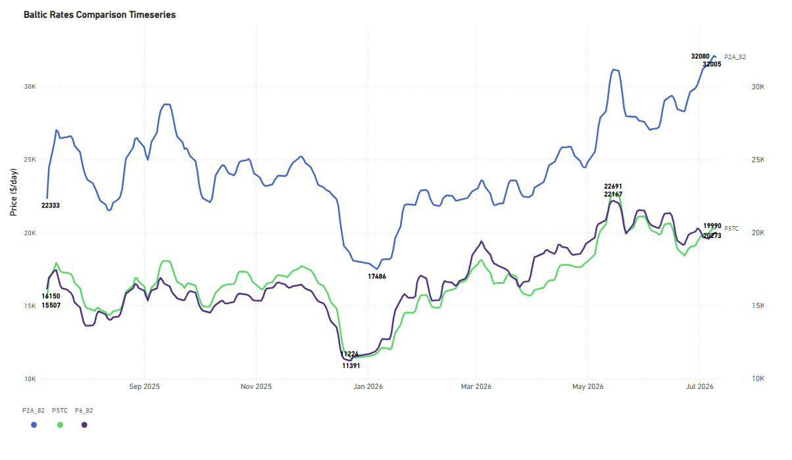
*Figure 1:Baltic Rates Comparison Timeseries — P2A_82, P5TC and P6_82 timecharter-equivalent rates ($/day), 12-month view (Source: The Signal Ocean Platform).‍*

‍P2A_82 (Skaw–Gibraltar / trip to Taiwan–Japan): In the week to 10 July 2026, the Pacific round-voyage benchmark remained the strongest performer in the Panamax market, closing at approximately $32,000/day. From the January 2026 low of $17,486/day, earnings increased steadily and remained close to their highest level of the past 12 months.

P5TC (Panamax TC average) and P6_82 (Singapore round via Atlantic): The two benchmarks continued to move closely together, closing at approximately $20,273/day and $19,990/day, respectively. After recovering from January lows near $11,000–11,400/day to around $22,000–22,700/day in May, earnings eased back toward the $20,000/day level. The spread between P2A_82 and both the P5TC and P6_82 remained around $12,000/day, indicating that Pacific earnings continued to outperform the overall Panamax freight market sentiment.

Early-week assessments as of 14 July place P5TC at approximately $20,260/day, P6_82 at $20,283/day, and P5_82 at $15,761/day, suggesting that the Panamax market has so far preserved the earnings levels recorded during the week to 10 July

## FREIGHT MARKET OVERVIEW | BDI & SEGMENT METRICS

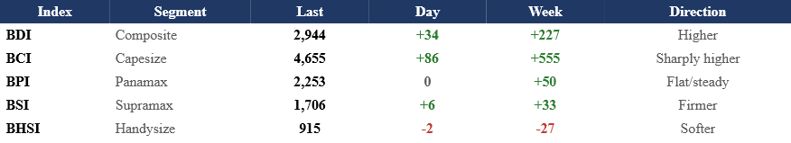
*Signal Figure*

Capesize remained the primary driver of the market, with the BCI rising to 4,655 (+86 day-on-day, +555 week-on-week), lifting the BDI to 2,944 (+227 WoW). Average C5TC earnings reached approximately $38,711/day. Panamax was almost unchanged on the day, with the BPI at 2,253 (0 day-on-day, +50 WoW), supported by the Pacific round-voyage market. Supramax extended its gradual recovery, with the BSI at 1,706 (+6 day-on-day), while Handysize eased to 915 (-2 day-on-day, -27 WoW), remaining below its recent 52-week highs. Global ballast availability showed small variations across segments, with Panamax, Capesize, and Handysize increasing by 3%, 2%, and 2% week-on-week, respectively, while Supramax ballast declined 2% following the previous week's build-up.

All data and commentary reflect market conditions as of 10 July 2026, unless otherwise stated.

## CAPESIZE | ANALYSIS

BCI rose to 4,655 (+86 day-on-day; +555 week-on-week), extending the rally that is driving the dry bulk market higher. Average C5TC earnings climbed to $38,711/day (+$780 day-on-day). Iron ore routes firmed further, with C3 (Tubarao–Qingdao) at $33.00/mt and C5 (West Australia–Qingdao) at $13.32/mt, both recovering strongly month-on-month. BCI 52-wk high 5,517 / low 2,104; 5-yr avg 2,728.

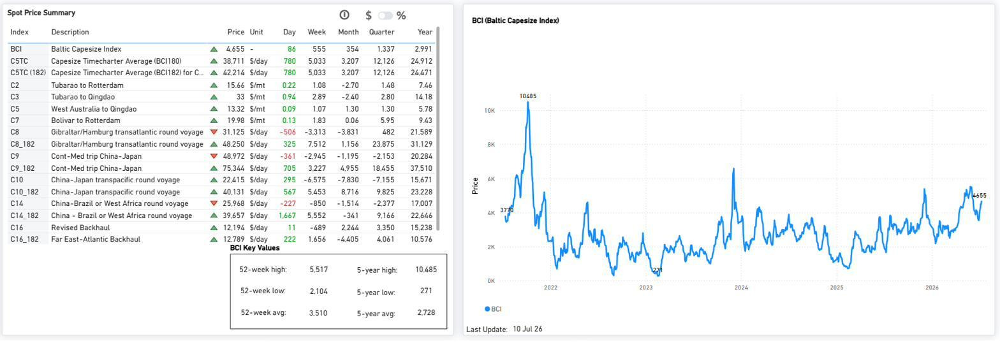
*Figure 2:Baltic Capesize Index (BCI) — spot price summary and BCI performance as of 10 Jul 2026 (Source: The Signal Ocean Platform).*

On the two iron-ore benchmarks,compared with the previous week, the forward balance on theC3 (Tubarao–Qingdao)has shifted modestly in favour of demand, delaying the point at which cumulative vessel supply overtakes expected demand. For theC5 (West Australia–Qingdao),the forward balance is broadly unchanged. Vessel availability continues to build ahead of expected demand over most of the forward horizon, indicating that the Pacific iron ore market remains more supplied than the Brazil trade.

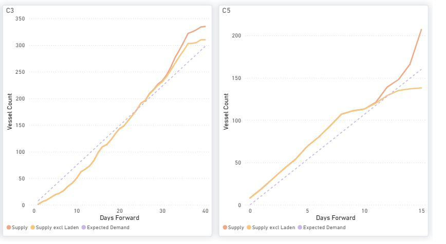
*Figure 3:Capesize — C3 & C5 Forward Balance: cumulative Supply vs Expected Demand over days forward (Source: The Signal Ocean Platform).*

The global ballaster fleet dropped to 615 vessels from 624 in the previous week. The largest concentrations continue to be located in Australasia (224) and the Indian Ocean/South Africa (199). Meanwhile, the sharpest week-on-week increases were recorded in the North Atlantic (+53% WoW) and South Atlantic (+52% WoW), rising off low baselines.

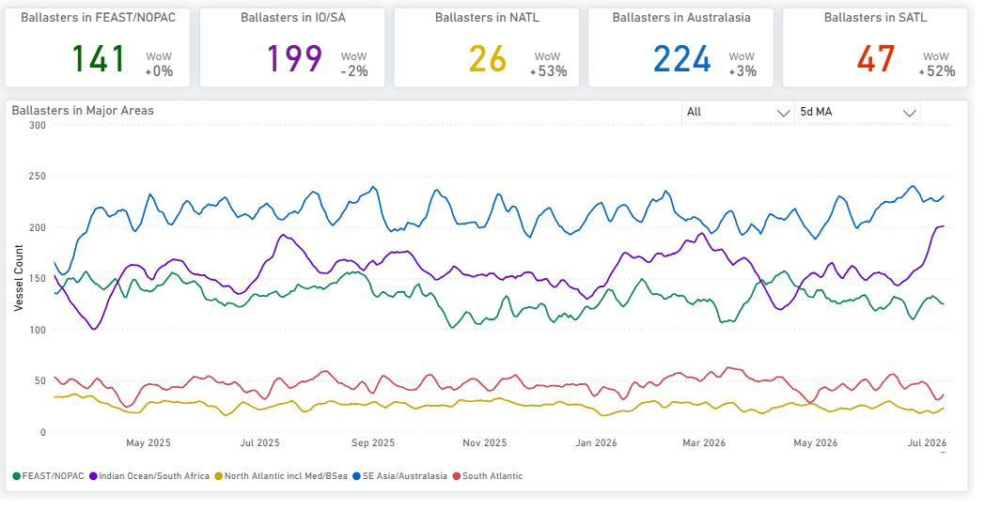
*Figure 4:Capesize — Global Ballaster Fleet and regional positioning (Source: The Signal Ocean Platform).*

Capesize and VLOC tonne-mile indices both eased toward the low-90% range into early July, indicating a moderation in tonne-mile demand despite the recent firming in spot freight rates. As of 14 July, both indices remained in the low-90% range (Capesize 93.7%, VLOC 93.0%), indicating that the decline has yet to reverse.

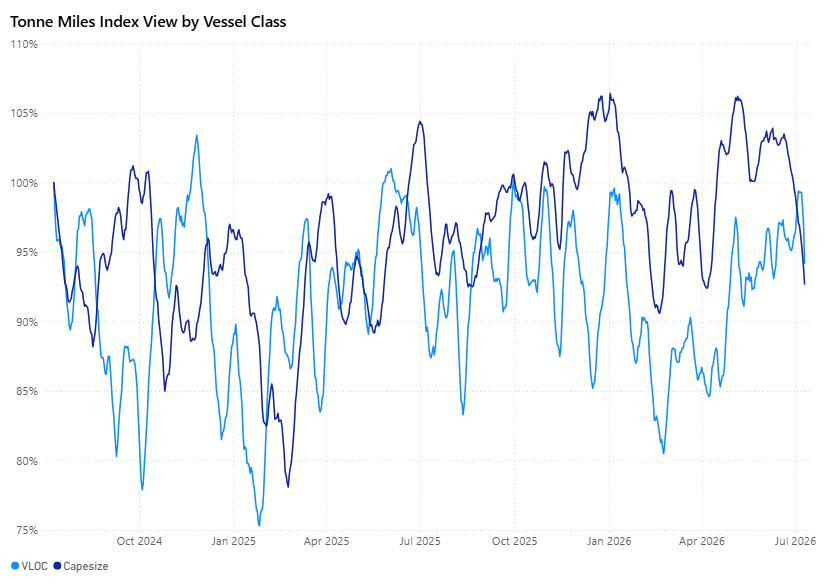
*Figure 5:VLOC vs Capesize — Tonne Miles Index View by Vessel Class (Source: The Signal Ocean Platform).*

## PANAMAX | ANALYSIS

BPI 2,253 (Day 0, Week +50) — flat on the day but firmer over the week, led by the Pacific round. P2A_82 reached 32,005 $/day and P6_82 19,990 $/day, while the transatlantic P1A_82 eased to 23,073 $/day. P5TC TC avg 20,273 $/day. The index continues to trade above the 5-year average of 1,887 and well above the 2025 low of 748, with a 52-wk high of 2,521.

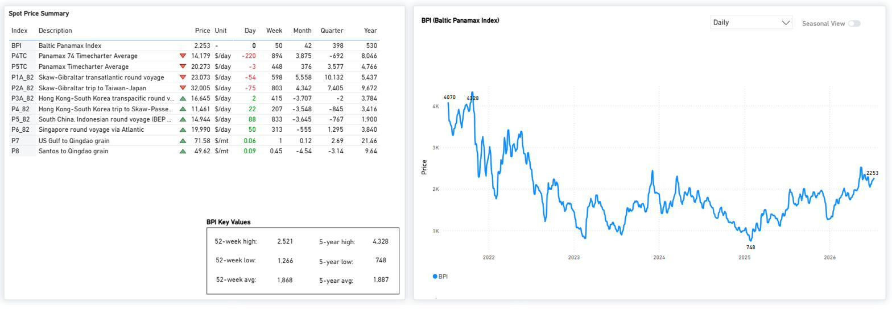
*Figure 6:Baltic Panamax Index (BPI) — spot price summary and BPI performance as of 10 Jul 2026 (Source: The Signal Ocean Platform).*

P2A_82 and the ECSA-facing routes continued to support Panamax earnings, while South China congestion (150 vs a 12-month average of 93) and North China (74 vs 41) remained elevated versus their 12-month averages. Most key routes trade well above year-ago levels despite mixed month-on-month performance.

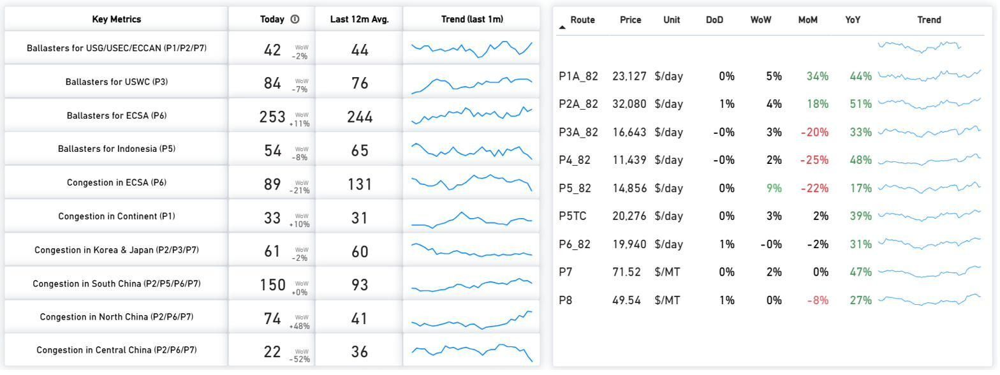
*Figure 7:Panamax — Key Metrics & Route Prices as of 10 Jul 2026 (Source: The Signal Ocean Platform).*

Compared with the previous week, P3 continues to record cumulative supply above expected demand across the full window, maintaining a clear supply surplus. P5 remains the tightest route, with supply below expected demand through most of the period, although the gap has narrowed. On P1/P2/P7, supply falls below expected demand in the early window before moving above it further forward. P6 follows a similar pattern, with demand marginally ahead through the middle of the window before vessel supply builds more clearly toward the end.

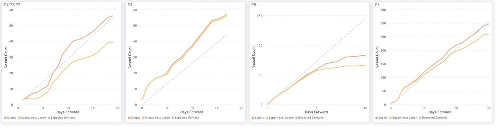
*Figure 8:Panamax — P1/P2/P7, P3, P5 & P6: cumulative Supply vs Expected Demand over days forward (Source: The Signal Ocean Platform).*

The global ballaster fleet fell to 753 vessels from 784 in the prior week. FEAST/NOPAC (211) and the Indian Ocean/South Africa (202) continue to hold the largest concentrations. The most pronounced regional expansions on a week-on-week basis were observed in the South Atlantic (+38% WoW) and FEAST/NOPAC (+19% WoW).

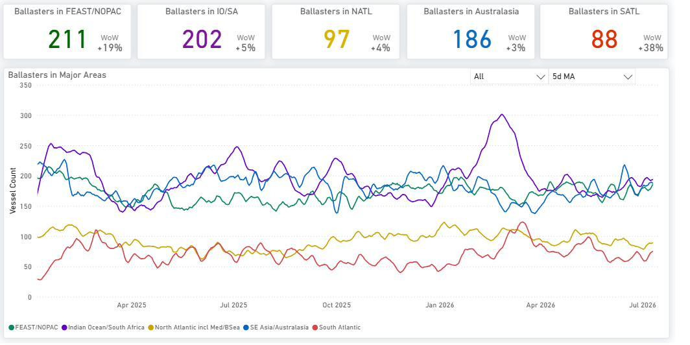
*Figure 9:Panamax — Global Ballaster Fleet and regional positioning (Source: The Signal Ocean Platform).*

Panamax and Post-Panamax tonne-mile indices remained close to the 100% level after peaking around 106–107% in late June. As of 14 July, Panamax stood at 100.8% and Post-Panamax at 101.9%, indicating that tonne-mile demand has continued to hold around its long-term baseline despite the recent pullback.

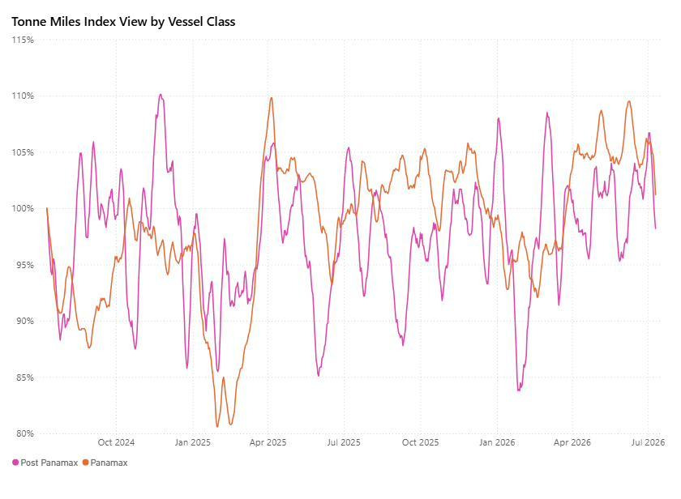
*Figure 10:Panamax vs Post-Panamax — Tonne Miles Index View by Vessel Class (Source: The Signal Ocean Platform).*

## ‍SUPRAMAX | ANALYSIS

BSI firmed to 1,706 (+6 day-on-day; +33 week-on-week), recovering after the prior week's pullback and pushing back toward its 52-week high (1,718). Average S10TC earnings rose to $19,536/day (+$80 day-on-day), with monthly, quarterly and annual performance all above year-ago levels. The index sits well above the 52-week low (952) and its 5-year average (1,503).

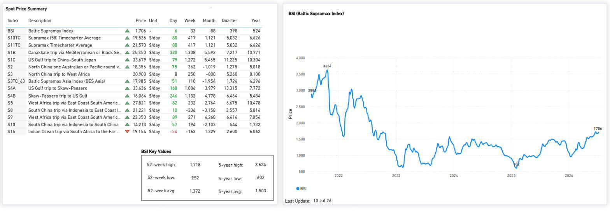
*Figure 11:Baltic Supramax Index (BSI) — spot price summary and BSI performance as of 10 Jul 2026 (Source: The Signal Ocean Platform).*

Freight earnings remained well above year-ago levels on the main Supramax routes, with S1C up 50%, S4A up 31%, and S5 up 68% year-on-year. Net vessel supply was highest in the U.S. Gulf/USEC (S4A/S1C, 111 vessels) and Indonesia (S8/S10, 81 vessels), while ECSA availability stood at 85 vessels, below its 12-month average of 117. Congestion in North/Central China remained elevated at 114 vessels relative to its recent average.

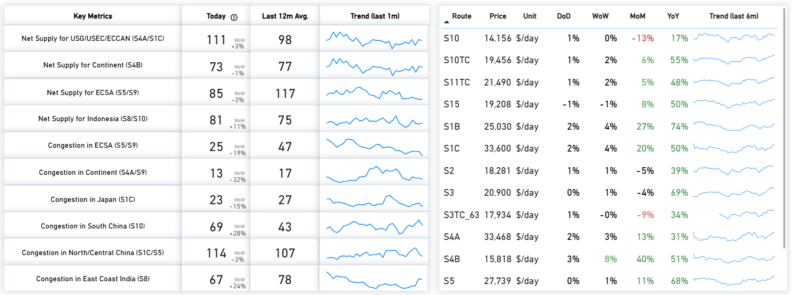
*Figure 12:Supramax — Key Metrics & Route Prices as of 10 Jul 2026 (Source: The Signal Ocean Platform).*

Compared with the previous week, forward balances exhibit only modest changes. S4A/S1C and S4B continue to record cumulative supply above expected demand throughout the forward window, with a marginal narrowing of the surplus on S4A/S1C. S5 remains near equilibrium in the early part of the window before cumulative supply moves into surplus later, while S8/S10 follows a similar pattern, remaining close to equilibrium initially before the supply surplus widens further forward.

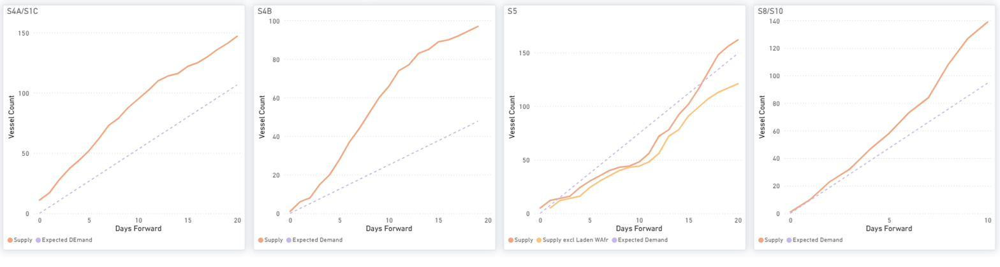
*Figure 13:Supramax — S4A/S1C, S4B, S5 & S8/S10: cumulative Supply vs Expected Demand over days forward (Source: The Signal Ocean Platform).*

The global ballaster fleet expanded to 705 vessels from 691 in the previous week. The highest concentrations are located in FEAST/NOPAC (217) and Australasia (193). Regionally, the North Atlantic saw the sharpest week-on-week increase (+33% WoW), while the South Atlantic experienced a decline (-11% WoW).

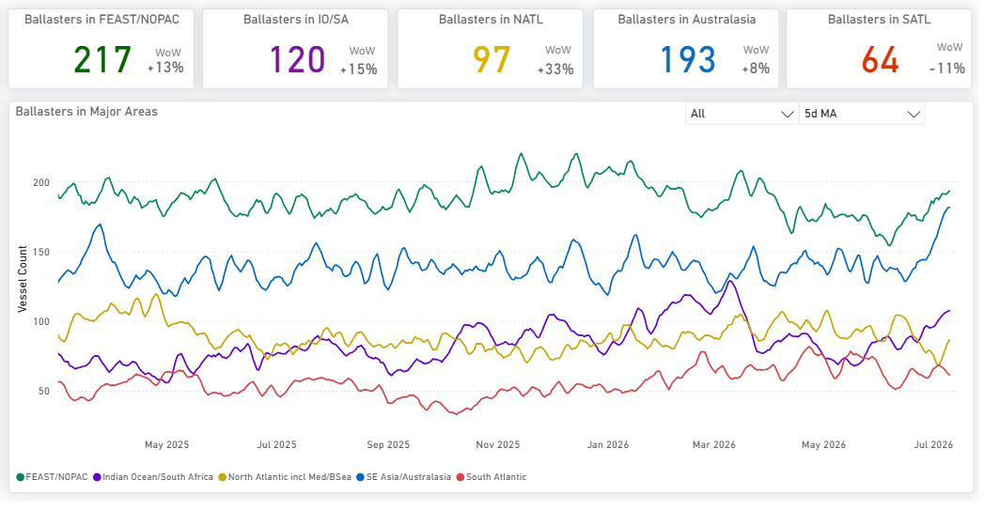
*Figure 14:Supramax — Global Ballaster Fleet and regional positioning (Source: The Signal Ocean Platform).*

The tonne-mile indices continue to differentiate the smaller dry bulk segments. As of 14 July, Supramax stood at105.1%, remaining above its long-term baseline and consistent with the recent improvement in spot earnings. Handymax continued to record the strongest tonne-mile index at120.5%, while Handysize remained below the baseline at90.5%, indicating comparatively weaker tonne-mile demand.

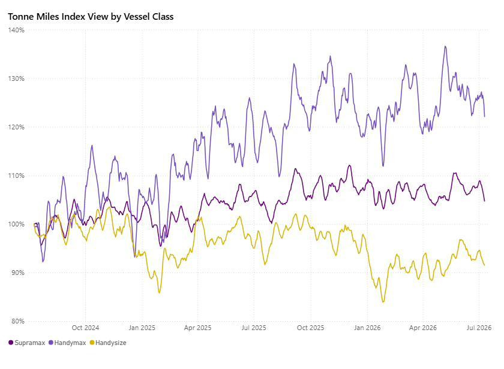
*Figure 15:Supramax · Handymax · Handysize — Tonne Miles Index View by Vessel Class (Source: The Signal Ocean Platform).*

*Signal Figure*

## HANDYSIZE | ANALYSIS

BHSI edged lower to 915 (-2 day-on-day; -27 week-on-week), extending its consolidation below the recent 52-week high of 947. Average HS7TC earnings eased to $16,466/day (-$40 day-on-day), with firmer South Atlantic sentiment (HS1_38 +72, HS2_38 +179 on the day) partly offsetting weaker Pacific routes. Despite the pullback, the index remains above the 52-week low (588) and its 5-year average (874).

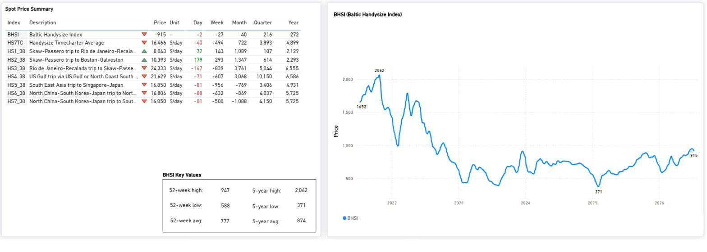
*Figure 16:Baltic Handysize Index (BHSI) — spot price summary and BHSI performance as of 10 Jul 2026 (Source: The Signal Ocean Platform).*

Handysize route performance stayed firm year-on-year (HS6_38 +53%, HS7_38 +53% YoY) even as most routes softened week-on-week. Net vessel supply remained highest in the Far East (HS7, 112) and UK Continent/Baltic (HS1/HS2, 105), while congestion eased in WCNA/WCCA (HS6) and firmed in North China (HS7, +15% WoW).

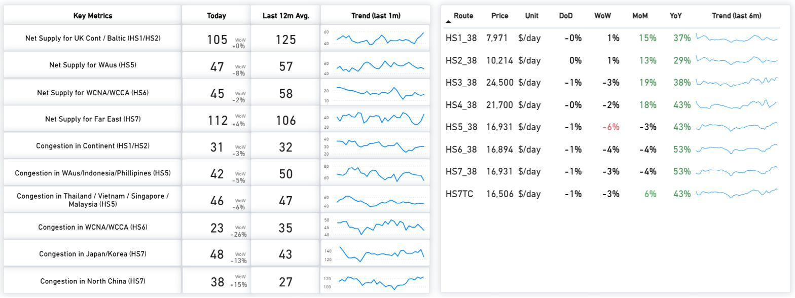
*Figure 17:Handysize — Key Metrics & Route Prices as of 10 Jul 2026 (Source: The Signal Ocean Platform).*

Compared with the previous week, forward balances exhibit only modest changes. HS1/HS2 continues to record cumulative supply above expected demand throughout the forward window, while HS5 also moves into a supply surplus early in the period. HS6 remains the closest to equilibrium, with cumulative supply exceeding expected demand from day 5 in the forward window. HS7 continues to show cumulative supply below expected demand for most of the forward horizon before gradually converging toward expected demand.

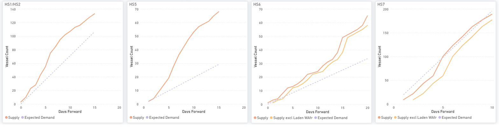
*Figure 18:Handysize — HS1/HS2, HS5, HS6 & HS7: cumulative Supply vs Expected Demand over days forward (Source: The Signal Ocean Platform).*

The global ballaster count declined to 659 vessels from 682. The North Atlantic retained the highest concentration of tonnage with 222 vessels, whereas the most notable week-on-week regional expansions were observed in FEAST/NOPAC (+25% WoW) and the North Atlantic (+21% WoW).

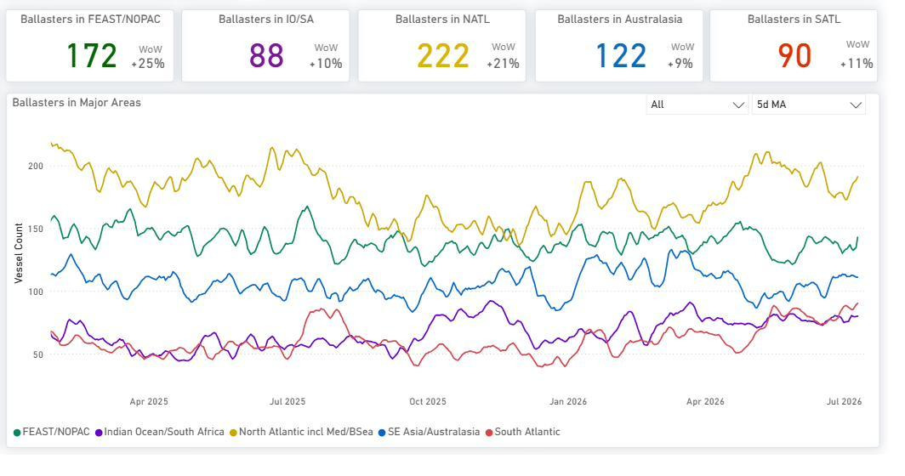
*Figure 19:Handysize — Global Ballaster Fleet and regional positioning (Source: The Signal Ocean Platform).*

## OVERALL MARKET TREND | CONCLUSIONS

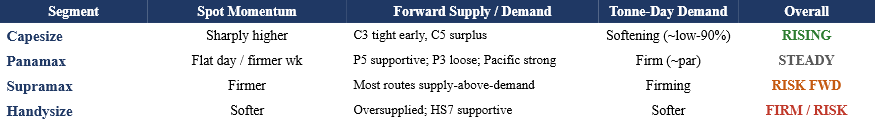
*Signal Figure*

Key takeaway:Capesize remained the strongest-performing segment during the week, with the BCI rising 555 points to 4,655. The C3 forward balance continued to indicate tighter near-term conditions than C5, where cumulative vessel supply remained above expected demand over most of the forward window. Panamax finished the week firmer, led by continued strength in the Pacific round (P2A_82), while Panamax and Post-Panamax tonne-mile indices held close to the 100% baseline. Supramax extended its recovery in spot earnings, although most monitored routes continued to indicate cumulative vessel supply above expected demand further forward. Handysize eased from its recent highs, with lower spot earnings during the week and the weakest tonne-mile index among the geared vessel classes.

Key risk:Forward supply surpluses remain most evident on the Panamax P3 route, Supramax S4A/S1C, S4B routes, and the Handysize HS1/HS2 and HS5 routes, while the Capesize C5 route continues to show cumulative vessel supply above expected demand, unlike the comparatively tighter C3 route.

Methodology:Analysis is based on analytics fromThe Signal Ocean Platform, incorporatingMarket Prices,Capesize, Panamax, Supramax and Handysize Insights, together withTonne-Mile Charts, to evaluate freight market performance, vessel supply-demand balances and fleet positioning.
