# Weekly Dry Market Monitor: Week 29, 2026

**Date**: July 22, 2026 | **Category**: Dry bulk | **Section**: Monitors | **Source**: [https://www.thesignalgroup.com/weekly-market-monitor/weekly-dry-market-monitor-week-29-2026](https://www.thesignalgroup.com/weekly-market-monitor/weekly-dry-market-monitor-week-29-2026)

---

## SPOTLIGHT OF THE WEEK

## Port Hedland Average Waiting Time - Iron-Ore Congestion Meets Labour Action

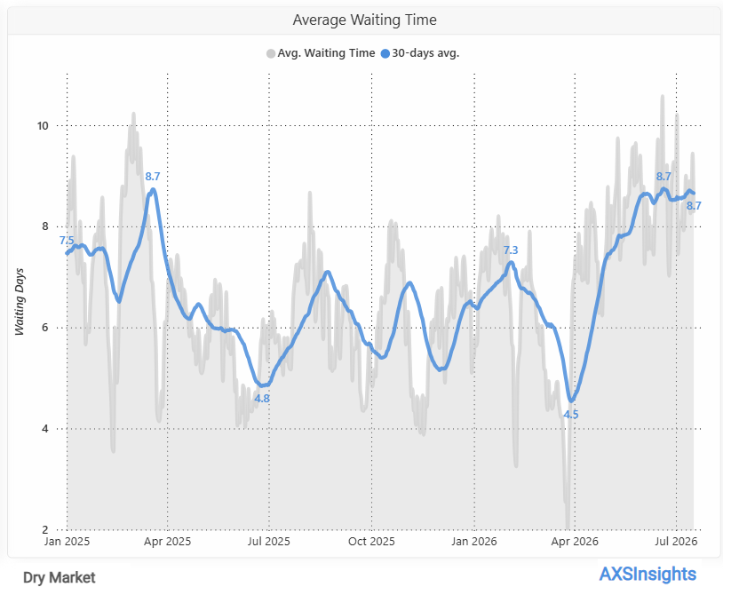
*Figure 1:Port Hedland — Average vessel waiting time (days), daily and 30-day moving average, Jan 2025 – Jul 2026 (Source: AXSInsights).*

Waiting time reached multi-month highs.The average vessel waiting time at Port Hedland rose to approximately8.7 daysin the week to17 July, up from about8.4 daysa week earlier. The30-day moving averagestood at8.66 days, close to the highest level recorded over the past 18 months, highlighting persistently elevated congestion at the port.

The increase coincided with thefirst major industrial action at BHP's Port Hedland operations in more than two decades.Daily waiting time reached a weekly high of9.44 days on 16 July, the same day workers staged an eight-hour protected stoppage between2:00 pm and 10:00 pm. While the dispute centres on wages and employment conditions,BHP confirmed that operations continued during the stoppage and seven vessels were loaded, limiting the immediate impact on export activity.

Attention now turns to the ongoing negotiations between BHP and the unions.Further discussions are scheduled following the initial industrial action, with unions warning that additional stoppages remain possible if no agreement is reached. Any escalation would represent the principal near-term risk to West Australian iron ore export flows and port waiting times.Closing Week 29, theCapesize C5 (West Australia–Qingdao)route eased toUS$11.81/mt(–US$1.51 WoW), while theC5TCtime-charter average fell by approximatelyUS$5,100/day week-on-week. Although the operational impact of the one-day stoppage remained limited, the labour dispute remains an important near-term risk factor for Australian iron ore exports and Capesize freight.

## FREIGHT MARKET OVERVIEW | BDI & SEGMENT METRICS

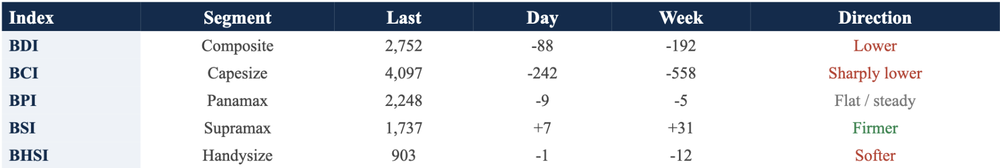
*Signal Figure*

‍

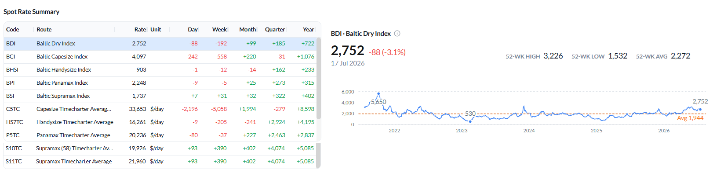
*Figure 2: Baltic Dry Index — spot rate summary across segments and BDI performance as of 17 Jul 2026 (Source: The Signal Ocean Platform).*

The market cooled from the prior week’s highs, led lower byCapesize: the BCI fell to 4,097 (–242 day-on-day, –558 week-on-week), dragging the BDI down to 2,752 (–192 WoW, –3.1% on the day). Average C5TC earnings dropped to roughly $33,653/day (–$5,058 WoW).Panamaxwas near-flat, with the BPI at 2,248 (–9 day-on-day, –5 WoW).Supramaxextended its recovery, with the BSI firming to 1,737 (+7 day-on-day, +31 WoW), whileHandysizeeased to 903 (–1 day-on-day, –12 WoW).

All data and commentary reflect market conditions as of 17 Jul 2026, unless otherwise stated.

## CAPESIZE | ANALYSIS

BCI eased to 4,097 (–242 day-on-day; –558 week-on-week), unwinding part of the prior week’s rally. Average C5TC earnings fell to $33,653/day (–$2,196 day-on-day; –$5,058 week-on-week). Iron-ore routes softened, with C3 (Tubarao–Qingdao) at $32.72/mt (–$0.28 WoW) and C5 (West Australia–Qingdao) at $11.81/mt (–$1.51 WoW), the sharper mover. BCI 52-week high 5,517 / low 2,175; 52-week average 3,552.

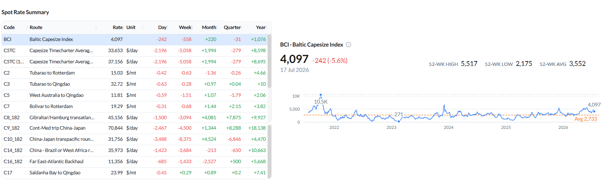
*Figure 3: Baltic Capesize Index (BCI) — spot rate summary and BCI performance as of 17 Jul 2026 (Source: The Signal Ocean Platform).*

Supply / Demand — change vs the previous week:On C3 (Tubarao–Qingdao), cumulative supply now drifts modestly above expected demand toward the far end of the window (30–40 days forward), a slight widening relative to last week, when the C3 balance had shifted in favour of demand. On C5 (West Australia–Qingdao), cumulative supply builds clearly above expected demand from around day 12, widening the forward surplus. The Pacific iron-ore trade (C5) therefore remains more supplied than the Brazil trade (C3).

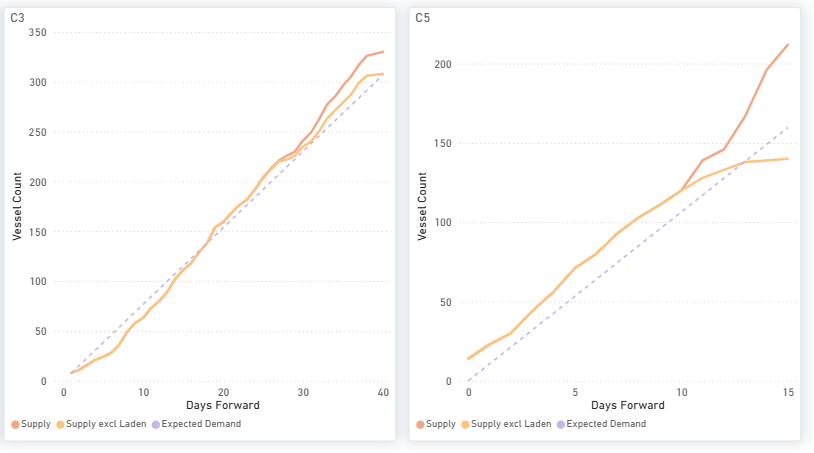
*Figure 4: Capesize — C3 & C5 forward balance: cumulative Supply vs Expected Demand over days forward (Source: The Signal Ocean Platform).*

The global ballaster fleet held nearly the same levels as the previous week at 610 vessels.The largest concentrations continued to be located inAustralasia (189)and theIndian Ocean/South Africa (186). Meanwhile, theNorth Atlantic (+23% WoW)andSouth Atlantic (+14% WoW)continued to record the strongest week-on-week increases in ballaster availability,albeit at a much slower pace than the previous week's gains of +53% and +52%, respectively.

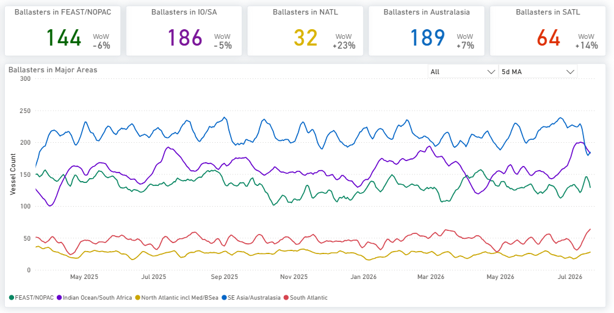
*Figure 5: Capesize — Global ballaster fleet and regional positioning (Source: The Signal Ocean Platform).*

The Capesize tonne-mile index edged slightly higher (+0.3 percentage points), while the VLOC index eased marginally (-0.4 percentage points). Both indices remained near 100% for Capesize and in the mid-90% range for VLOC.

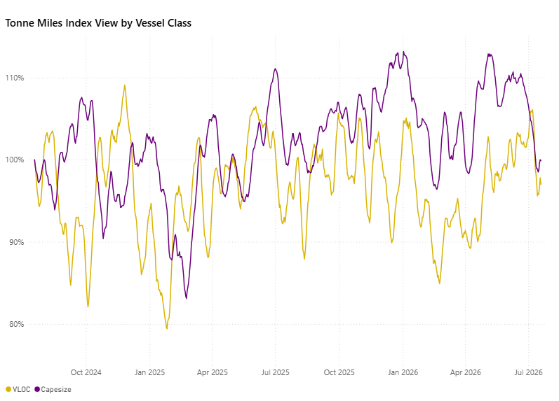
*Figure 6:VLOC vs Capesize — Tonne-Miles Index view by vessel class (Source: The Signal Ocean Platform).*

‍

## PANAMAX | ANALYSIS

The Baltic Panamax Index (BPI) settled at 2,248 (-9 day-on-day; –5 week-on-week), remaining essentially flat but maintaining its position above the 5-year average of 1,887. Earnings were led by the Pacific round, where P2A_82 stood at $31,099/day (–3% WoW), and P6_82 rose to $20,341/day (+2% WoW). In contrast, the transatlantic P1A_82 route softened to $21,941/day (–5% WoW). P5_82 strengthened by 13% WoW to $16,861/day, while the P5TC time-charter average remained stable at $20,236/day.

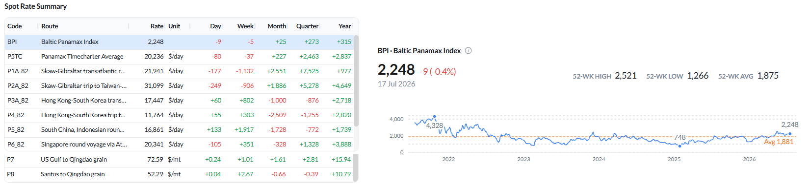
*Figure 7: Baltic Panamax Index (BPI) — spot rate summary and BPI performance as of 17 Jul 2026 (Source: The Signal Ocean Platform).*

Congestion stayed elevated in South China (148 vs a 12-month average of 94) and North China (76 vs 42), with Central China spiking to 67 (+272% WoW off a low base), while ECSA congestion eased to 95 (vs 131). ECSA continued to hold the largest ballaster concentration at 280 vessels (+7% WoW). Most key routes trade well above year-ago levels.

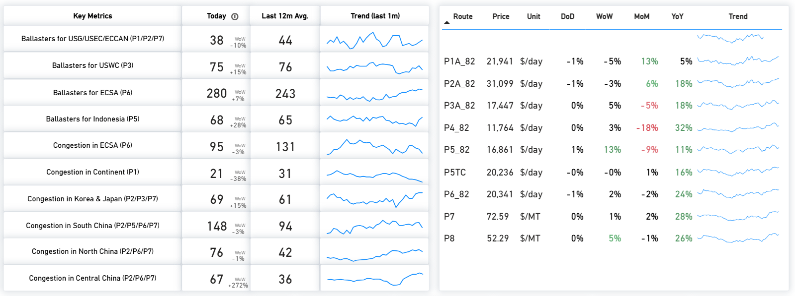
*Figure 8: Panamax — Key metrics & route prices as of 17 Jul 2026 (Source: The Signal Ocean Platform).*

Supply / Demand — change vs the previous week:P3 remains a clear supply surplus, with cumulative supply above expected demand across the full window. P5 stays the tightest route, cumulative supply well below expected demand throughout, the most supportive balance in the segment. P1/P2/P7 now show supply below expected demand through the later window (firmer than last week, when supply moved above demand further forward). P6 sits close to equilibrium, with supply tracking marginally at or above demand toward the end of the window.

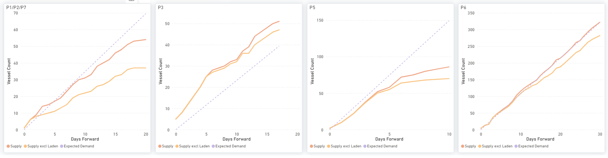
*Figure 9: Panamax — P1/P2/P7, P3, P5 & P6: cumulative Supply vs Expected Demand over days forward (Source: The Signal Ocean Platform).*

The global ballaster fleet rose to 833 vessels +16% prior week. The Indian Ocean/South Africa now holds the largest concentration (238, +20% WoW), ahead of FEAST/NOPAC (201, +14% WoW) and Australasia (194, +17% WoW).

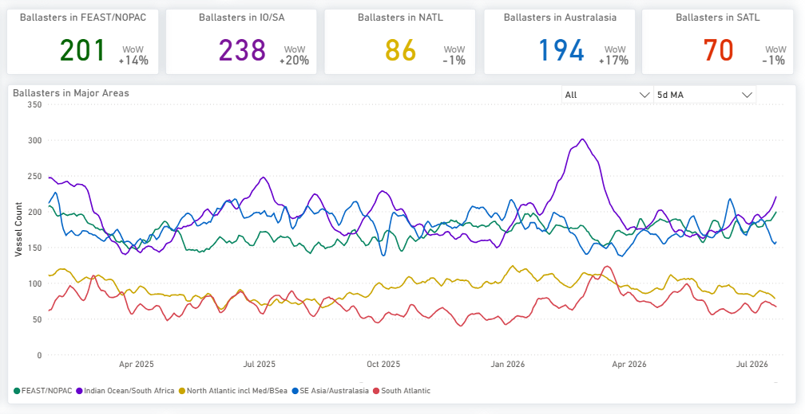
*Figure 10:Panamax — Global ballaster fleet and regional positioning (Source: The Signal Ocean Platform).*

Panamax and Post-Panamax tonne-mile indices remained above the 100% baseline but softened week-on-week. Panamax eased to around 106% from 110%, while Post-Panamax declined to about 102% from 106%, pointing to a slight moderation in tonne-mile demand.

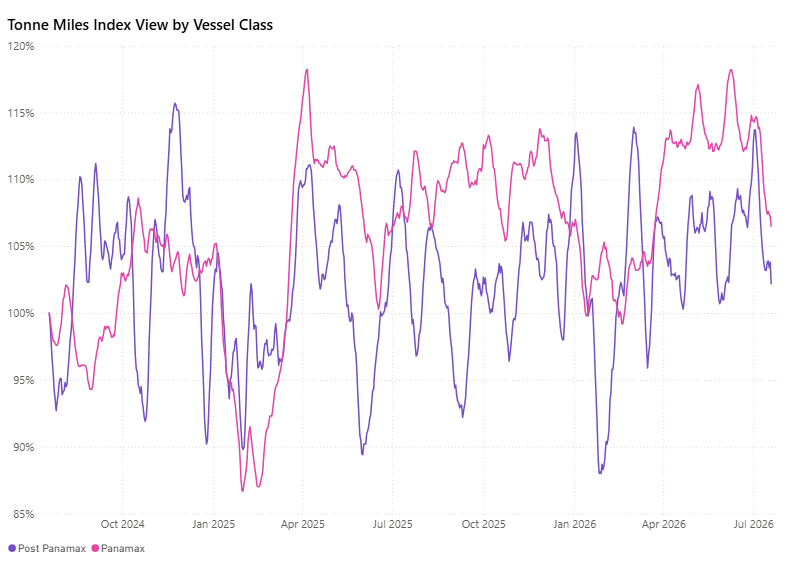
*Figure 11:Panamax vs Post-Panamax — Tonne-Miles Index view by vessel class (Source: The Signal Ocean Platform).*

‍

## SUPRAMAX | ANALYSIS

BSI firmed to 1,737 (+7 day-on-day; +31 week-on-week), extending its recovery back toward recent 52-week highs. Average S10TC earnings rose to $19,926/day (+2% WoW) and S11TC to $21,960/day (+2% WoW). Route strength was broad: S1B +18% MoM / +59% YoY, S2 +7% WoW, and S3TC_63 +8% WoW, while the US Gulf routes S1C ($32,079/day) and S4A ($31,961/day) eased about 5% WoW from elevated levels.

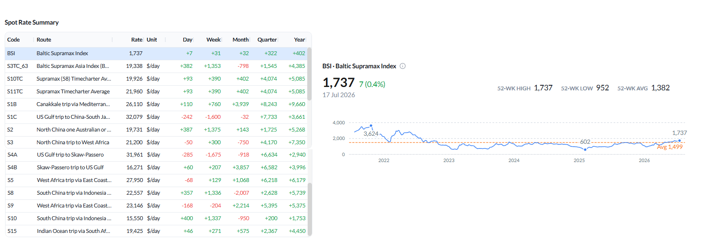
*Signal Figure*

Figure 12: Baltic Supramax Index (BSI) — spot rate summary and BSI performance as of 17 Jul 2026 (Source: The Signal Ocean Platform).

Congestion in North/Central China was notably elevated at 186 vessels (vs a 12-month average of 108, +63% WoW), with South China at 62 (vs 44). Net vessel supply was highest in the US Gulf/USEC (S4A/S1C, 110) and Indonesia (S8/S10, 96, +14% WoW), while ECSA availability at 86 remained below its 12-month average of 117.

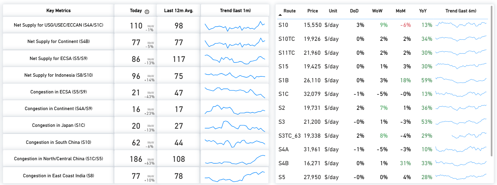
*Signal Figure*

Figure 13: Supramax — Key metrics & route prices as of 17 Jul 2026 (Source: The Signal Ocean Platform).

Supply / Demand — change vs the previous week:The S4A/S1C surplus has widened further, with cumulative supply extending well above expected demand throughout the forward window. S4B continues to exhibit a persistent supply surplus. On S5, the supply-demand balance has improved modestly toward the latter part of the period as expected demand catches up. S8/S10 has shifted to a more pronounced supply surplus compared with the near-balanced outlook observed a week earlier.

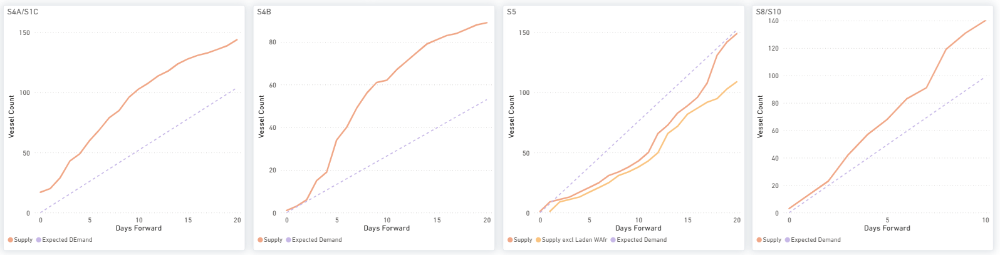
*Signal Figure*

Figure 14: Supramax — S4A/S1C, S4B, S5 & S8/S10: cumulative Supply vs Expected Demand over days forward (Source: The Signal Ocean Platform).

The global ballaster fleet stood near 687 vessels (+24% WoW). FEAST/NOPAC held the largest concentration (214, +22% WoW) ahead of Australasia (177, +21% WoW), while the North Atlantic saw the sharpest week-on-week increase (+44% WoW).

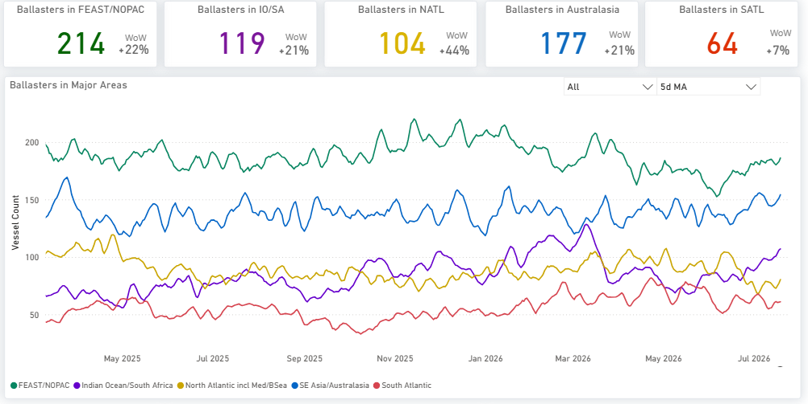
*Signal Figure*

Figure 15: Supramax — Global ballaster fleet and regional positioning (Source: The Signal Ocean Platform).

The tonne-mile indices continued to differentiate the smaller dry bulk segments. Handymax strengthened further to 143%, reinforcing its position as the strongest-performing segment. Supramax remained stable at around 112%, while Handysize continued to lag at approximately 93%.

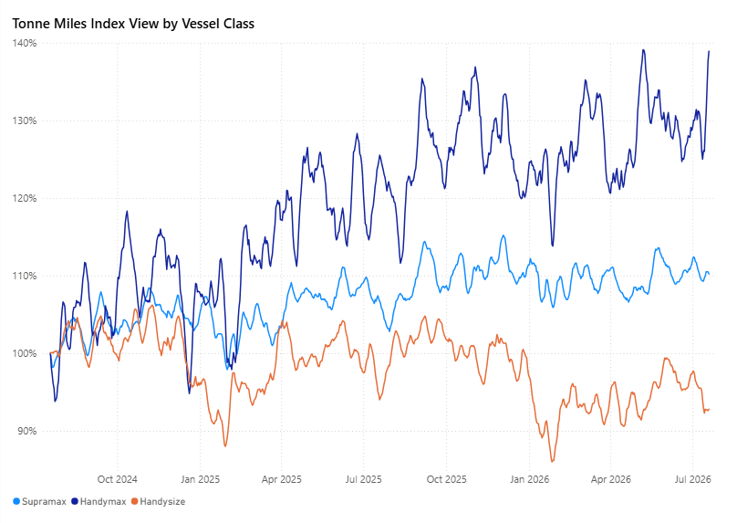
*Signal Figure*

Figure 16: Supramax · Handymax · Handysize — Tonne-Miles Index view by vessel class (Source: The Signal Ocean Platform).

## HANDYSIZE | ANALYSIS

BHSI edged lower to 903 (–1 day-on-day; –12 week-on-week), continuing to ease from its recent 52-week high. Average HS7TC earnings eased to $16,261/day (–1% WoW). The route picture was mixed: HS1_38 ($8,429/day, +5% WoW) and HS2_38 ($11,064/day, +6% WoW) firmed, while HS3_38 ($22,928/day, –6% WoW) and HS4_38 ($20,550/day, –5% WoW) softened. Year-on-year performance remained strong across the board (HS6_38 +44%, HS7_38 +45% YoY).

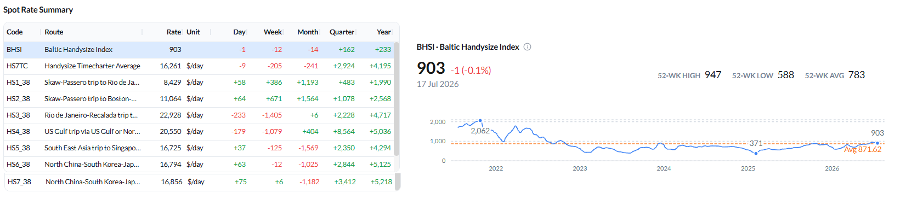
*Signal Figure*

Figure 17:Baltic Handysize Index (BHSI) — spot rate summary and BHSI performance as of 17 Jul 2026 (Source: The Signal Ocean Platform).

Net vessel supply remained highest in the Far East (HS7, 115) and UK Continent/Baltic (HS1/HS2, 109). Congestion eased in the Continent (18, –31% WoW) but firmed in North China (39, +34% WoW).

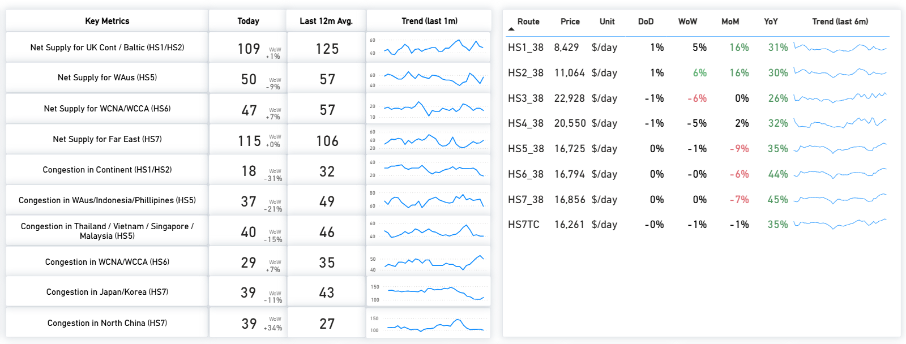
*Signal Figure*

Figure 18:Handysize — Key metrics & route prices as of 17 Jul 2026 (Source: The Signal Ocean Platform).

Supply / Demand — change vs the previous week:HS1/HS2 remains a clear supply surplus throughout the window, and HS5 also sits in surplus from early in the period. HS6 has moved to a wider supply surplus, versus the closest-to-equilibrium balance last week. HS7 remains the tightest route, with cumulative supply below expected demand early before converging toward demand by around day 10.

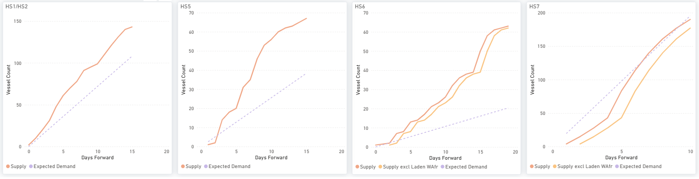
*Signal Figure*

Figure 19:Handysize — HS1/HS2, HS5, HS6 & HS7: cumulative Supply vs Expected Demand over days forward (Source: The Signal Ocean Platform).

‍

The global ballaster count stood near 689 vessels (+15% WoW). The North Atlantic retained the highest concentration of tonnage (220, +15% WoW), while the most notable week-on-week expansion was in FEAST/NOPAC (166, +35% WoW).

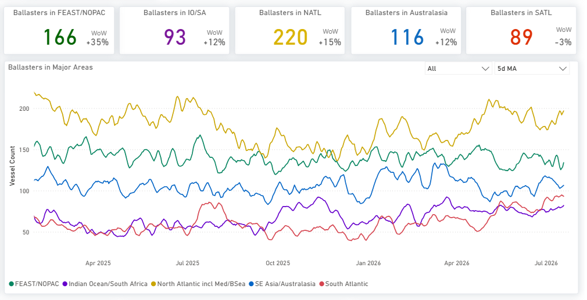
*Signal Figure*

Figure 20: Handysize — Global ballaster fleet and regional positioning (Source: The Signal Ocean Platform).

OVERALL MARKET TREND | CONCLUSIONS

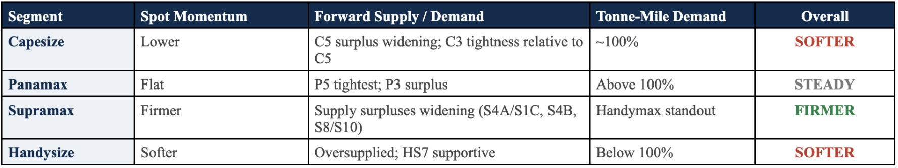
*Signal Figure*

Key takeaway:The dry market softened from the previous week's highs, led by Capesize as the BCI fell 558 points to 4,097 and average C5TC earnings declined by approximately US$5,058/day week-on-week. The weakness remained concentrated in the Pacific iron ore trade, where the C5 (West Australia–Qingdao) forward balance moved further into supply surplus, while Port Hedland waiting times remained elevated near 8.7 days following the first industrial action at BHP's Port Hedland operations in more than two decades. Panamax held broadly stable, supported by the tighter P5 forward balance despite a modest easing in tonne-mile demand. Supramax recorded further gains in spot earnings, although forward supply increased across S4A/S1C, S4B and S8/S10. Handysize remained the softest geared segment, with lower spot earnings and tonne-mile demand below its long-term baseline.

Key risk:Negotiations between BHP and the Combined Ports Unions remain ongoing after the parties reported progress but did not reach an agreement, with further discussions scheduled for28 July. While the initial industrial action had only a limited operational impact and port operations have continued, additional stoppages cannot be ruled out if negotiations fail, leaving Australian iron ore exports and Port Hedland waiting times as key near-term watchpoints. At the same time, widening forward supply surpluses remain evident on Capesize C5, Panamax P3, Supramax S4A/S1C, S4B and S8/S10, and Handysize HS1/HS2, HS5 and HS6, indicating more vessel availability across several major dry bulk trades than a week earlier.

Methodology:Analysis is based on analytics from The Signal Ocean Platform, incorporating Market Prices, Capesize, Panamax, Supramax and Handysize Insights, Tonne-Mile Charts, and Port Congestion / waiting-time analytics for Port Hedland, together with contemporaneous market news, to evaluate freight-market performance, vessel supply-demand balances, fleet positioning and port-side risk.
