# Weekly Dry Market Monitor: Week 30, 2026

**Date**: July 29, 2026 | **Category**: Dry bulk | **Section**: Monitors | **Source**: [https://www.thesignalgroup.com/weekly-market-monitor/weekly-dry-market-monitor-week-30-2026](https://www.thesignalgroup.com/weekly-market-monitor/weekly-dry-market-monitor-week-30-2026)

---

## ‍SPOTLIGHT OF THE WEEK

## Capesize Vessel-Age Share of Tonne-Mile Demand: Iron Ore vs Bauxite

Each chart shows the share of the trade’s Capesize tonne-mile demand carried by five vessel-age bands, by year from 2015 to 2026 (year-to-date). The tables below give the share in 2015, 2020, 2025 and 2026 year-to-date, with the change over the decade (2015 to 2026 YTD) in percentage points.

## Iron ore

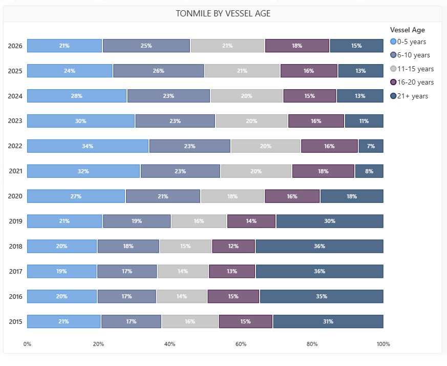
*Signal Figure*

## Bauxite

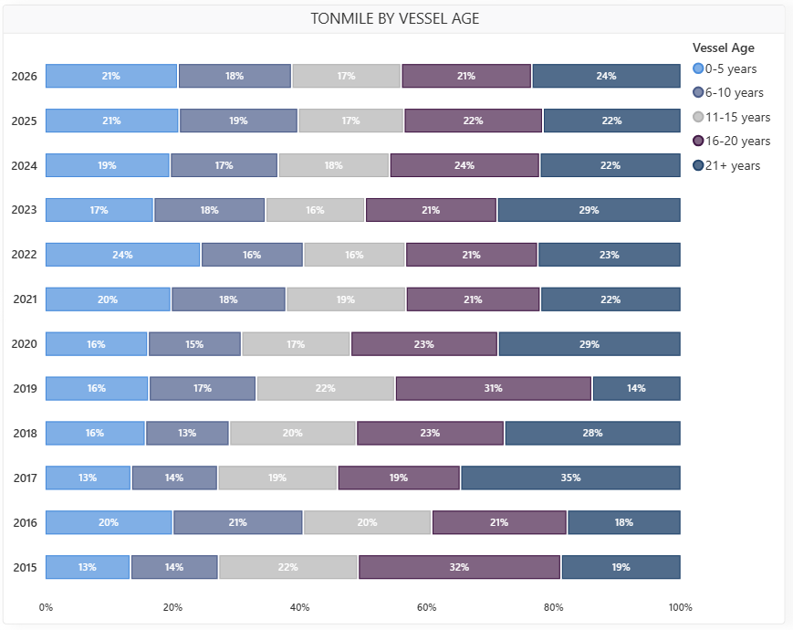
*Figure 1: Share of Capesize tonne-mile demand by vessel-age band, 2015–2026 — iron ore (left) and bauxite (right). (Source: The Signal Ocean Platform / AXSMarine).*

## Iron Ore

‍Modern tonnage dominates tonne-mile demand among Capesize vessels in the iron-ore trade. In 2026, ships under 10 years old accounted for 46% of total demand, with the 0–5 years band contributing 21% and the 6–10 years band adding 25%. In comparison, vessels aged 16 years and over carried 33% of the demand. Over the past decade, the share of the 21-plus age group dropped significantly by 16 percentage points, falling from 31% in 2015 to 13% in 2025, before experiencing a minor increase to 15% in 2026. Meanwhile, the 0–5-year category has adjusted to 21% after hitting a peak of 34% in 2022. Overall, modern vessels continue to command the largest portion of the trade.

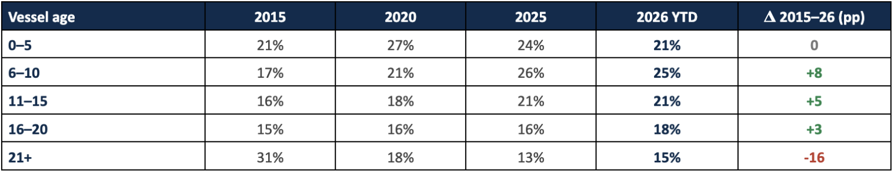
*Signal Figure*

## Bauxite

Tonne-mile demand for Capesize vessels within the bauxite sector is predominantly driven by older tonnage, presenting a clear contrast to the iron ore trade. In 2026, older vessels aged 16 and above accounted for 45% of this demand (with the 16–20 age bracket at 21% and the 21-plus cohort at 24%), compared to only 39% for modern ships under 10 years of age. Most remarkably, the 21-plus segment grew from a 19% share in 2015 to a peak of 29% in 2020, before tempering to 22% in 2025 and landing at 24% in 2026, marking a net 5-point increase over the ten years as the dominant category. Meanwhile, the 16–20 group declined to 21% from its 32% level in 2015. Although newer tonnage has captured some ground, mature vessels collectively continue to overshadow their younger counterparts.

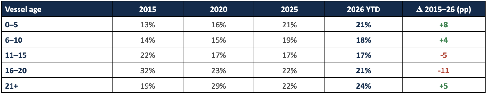
*Signal Figure*

## Comparison

The clearest contrast is modern versus old tonnage, for Capesize ships specifically. In 2026, iron-ore Capesize demand is driven by younger vessels (under-10-year bands 46%, ahead of 33% for the 16-plus bands), whereas bauxite is driven by older vessels (16-plus 45%, ahead of 39% for under-10). During the last decade, the iron ore sector experienced fleet renewal as the 21-plus age bracket decreased by 16 points, in contrast to bauxite, which aged as its 21-plus segment rose by 5 points. In the week to 24 July, iron-ore rates rose: C3 (Tubarao–Qingdao) up $1.96 to $34.68/mt and C5 (West Australia–Qingdao) up $1.05 to $12.86/mt, with Capesize tonne-miles near 101%.

## FREIGHT MARKET OVERVIEW | BDI & SEGMENT METRICS

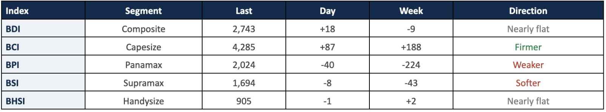
*Signal Figure*

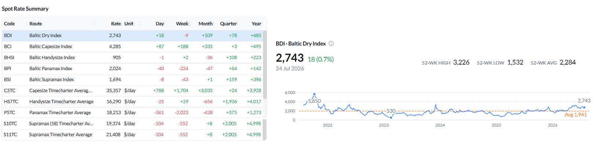
*Figure 2: Baltic Dry Index — spot rate summary across segments and BDI performance as of 24 Jul 2026 (Source: The Signal Ocean Platform).*

The BDI was essentially flat at 2,743 (+18 day-on-day, –9 week-on-week), with a Capesize rebound offsetting a sharp Panamax fall and reversing the prior week, when Capesize had led the market lower. The BCI rose to 4,285 (+87 day-on-day, +188 WoW) after last week’s 558-point fall, and average C5TC earnings rose to about $35,357/day (+$1,704 WoW). The BPI fell to 2,024 (–40 day-on-day, –224 WoW) from a near-flat prior week, with P5TC down about $2,023/day (–10% WoW). The BSI eased to 1,694 (–8 day-on-day, –43 WoW), reversing the prior week’s gain, and the BHSI held at 905 (–1 day-on-day, +2 WoW). Global ballast counts rose across every segment week-on-week, most on Panamax (+11% to about 851).

All data reflect market conditions as of 24 Jul 2026 unless otherwise stated.

## CAPESIZE | ANALYSIS

The BCI recovered to 4,285 (+87 day-on-day; +188 week-on-week) and average C5TC earnings rose to $35,357/day (+$788 day-on-day; +$1,704 week-on-week), reversing most of the prior week’s $5,058/day decline. Iron-ore routes firmed: C3 (Tubarao–Qingdao) rose to $34.68/mt (+$1.96 WoW, from –$0.28 the week before) and C5 (West Australia–Qingdao) to $12.86/mt (+$1.05 WoW). BCI 52-week high 5,517 / low 2,175; 52-week average 3,566.

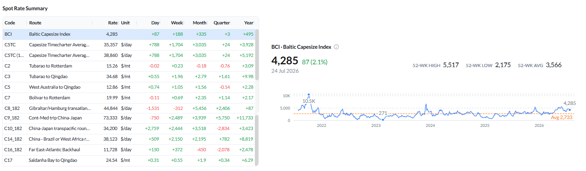
*Figure 3: Baltic Capesize Index (BCI) — spot rate summary and BCI performance as of 24 Jul 2026 (Source: The Signal Ocean Platform).*

Supply / Demand — change vs the previous week:The C3 (Tubarao–Qingdao) supply-demand balance remains close to equilibrium through approximately day 30, with cumulative vessel supply moving only marginally above expected demand from day 30 onward. This points to a slightly tighter forward balance than last week. In contrast, the C5 (West Australia–Qingdao) supply-demand balance continues to show cumulative vessel supply exceeding expected demand from around day 11 through the remainder of the forward window, indicating that the Pacific market remains relatively more supplied than the Atlantic. The recent recovery in Capesize rates therefore appears to have been driven primarily by stronger cargo demand rather than a meaningful tightening in forward vessel supply.

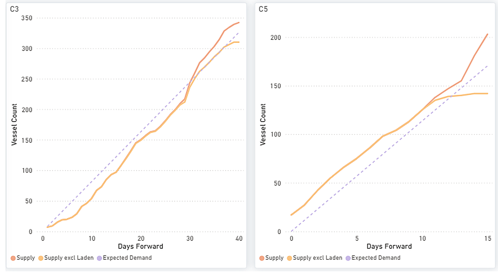
*Figure 4: Capesize — C3 & C5 forward balance: cumulative Supply vs Expected Demand over days forward (Source: The Signal Ocean Platform).*

The global ballaster fleet edged up to about 622 vessels (from ~615). Australasia held the largest concentration (229, +21% WoW) ahead of the Indian Ocean/South Africa (163, –7% WoW); the North Atlantic saw the largest week-on-week rise (+22% WoW).

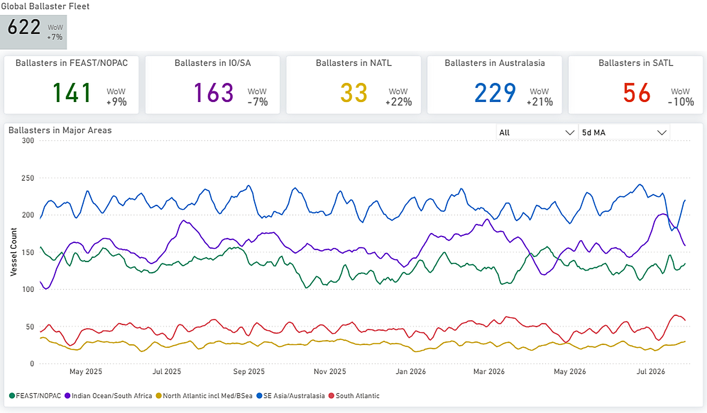
*Figure 5: Capesize — Global ballaster fleet and regional positioning (Source: The Signal Ocean Platform).*

Capesize tonne-mile demand held around 101%, and VLOC eased to roughly 95% into late July, both off the ~110–112% highs of earlier in the month. Versus last week (Capesize ~100%, VLOC ~97%), Capesize was steady, and VLOC softened.

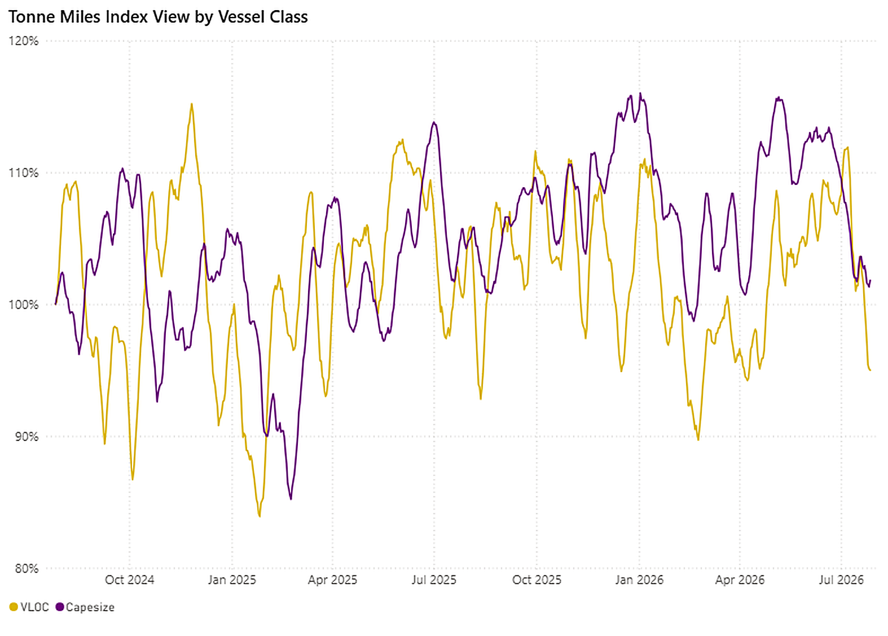
*Figure 6: VLOC vs Capesize — Tonne-Miles Index view by vessel class (Source: The Signal Ocean Platform).*

## PANAMAX | ANALYSIS

The BPI fell to 2,024 (–40 day-on-day; –224 week-on-week) from a near-flat prior week. A widespread drop in earnings was recorded across all sectors: P5TC –10% WoW to $18,213/day (from about $20,236 last week), P2A_82 –5% to $29,478/day, the transatlantic P1A_82 –8% to $20,141/day, and the ECSA-facing P6_82 –9% to $18,413/day. The largest route falls were P3A_82 (–17% WoW) and P5_82 (–15% WoW).

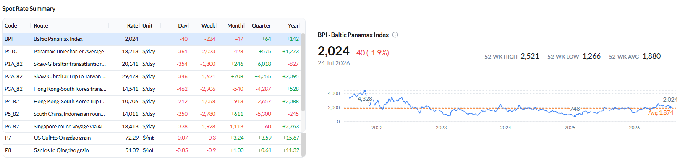
*Figure 7: Baltic Panamax Index (BPI) — spot rate summary and BPI performance as of 24 Jul 2026 (Source: The Signal Ocean Platform).*

‍

Congestion eased across most regions week-on-week — South China to 124 (from 148, –14% WoW), North China to 67 (from 76) and Central China to 55 (from 67) — removing a prior support. ECSA ballasters rose further to 310 (+8% WoW, from ~280).

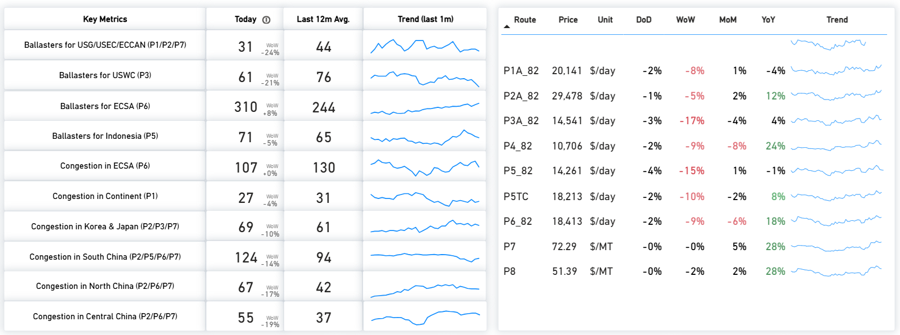
*Figure 8: Panamax — Key metrics & route prices as of 24 Jul 2026 (Source: The Signal Ocean Platform).*

Supply / Demand — change vs the previous week:The forward balances were little changed despite the spot fall, indicating a demand-led move. P3 remains a clear supply surplus across the window; P5 stays the tightest route, with cumulative supply well below expected demand throughout; P1/P2/P7 show supply below expected demand in the later window; and P6 sits close to equilibrium with a marginal late surplus.

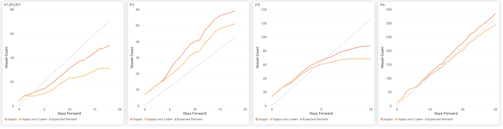
*Figure 9: Panamax — P1/P2/P7, P3, P5 & P6: cumulative Supply vs Expected Demand over days forward (Source: The Signal Ocean Platform).*

The global ballaster fleet rose to about 851 vessels (+11% WoW, from ~789) — the largest build of any segment. The Indian Ocean/South Africa held the biggest concentration (250, +10% WoW), followed by Australasia (222, +11% WoW) and FEAST/NOPAC (216, +9% WoW).

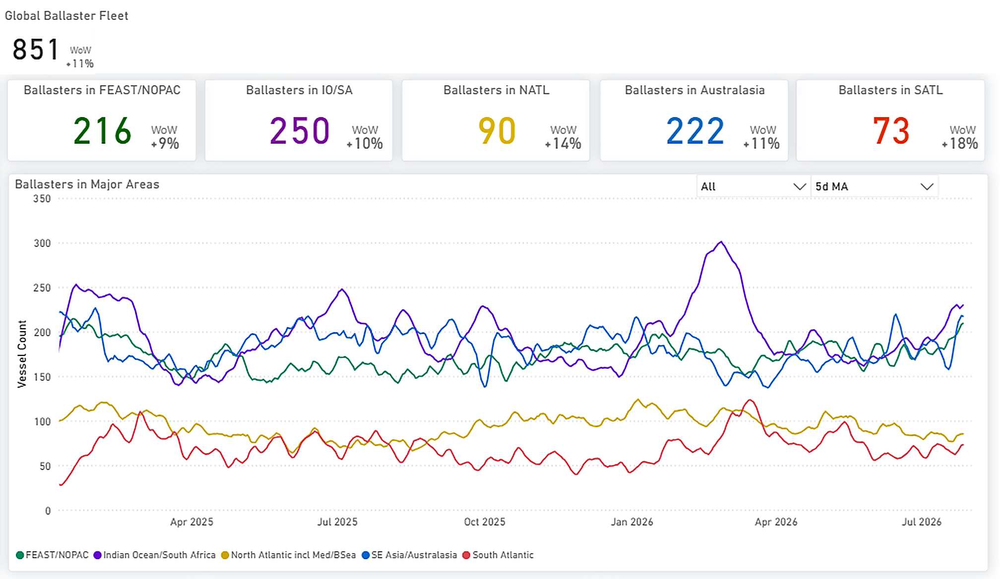
*Figure 10: Panamax — Global ballaster fleet and regional positioning (Source: The Signal Ocean Platform).*

Panamax and Post-Panamax tonne-mile indices fell to around 101% and 100% respectively into late July, from about 106–107% and 102–104% a week earlier and well below their mid-July peaks near 118–120%.

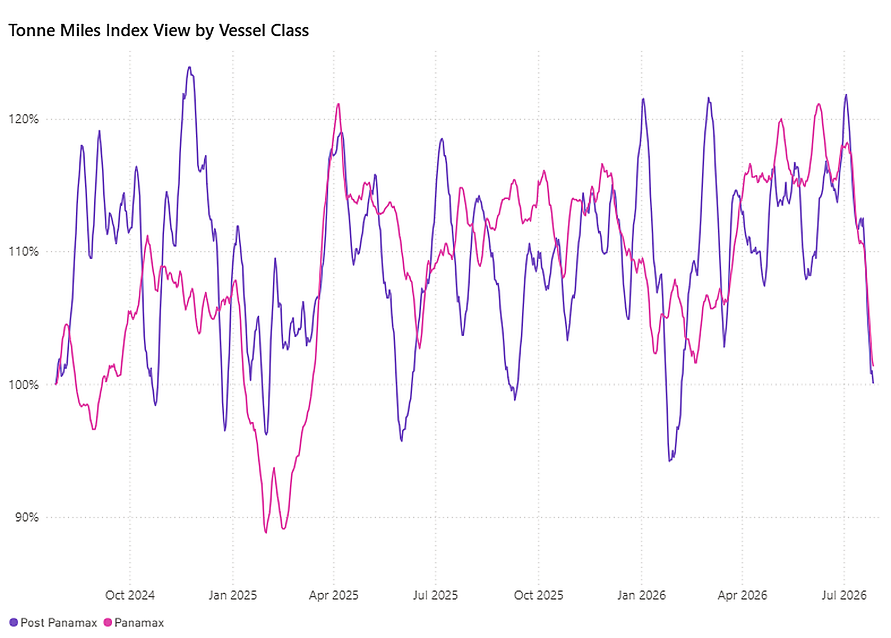
*Figure 11: Panamax vs Post-Panamax — Tonne-Miles Index view by vessel class (Source: The Signal Ocean Platform).*

## SUPRAMAX | ANALYSIS

The BSI eased to 1,694 (–8 day-on-day; –43 week-on-week), reversing the prior week’s +31 gain. Average S10TC earnings slipped to $19,374/day (–3% WoW) and S11TC to $21,408/day (–3% WoW). The decline was led by the US Gulf, with S1C –9% WoW to $29,279/day and S4A –8% WoW to $29,407/day, while S4B (+2% WoW) and S1B (+2% WoW, +58% YoY) held firmer. Year-on-year comparisons remained positive across routes.

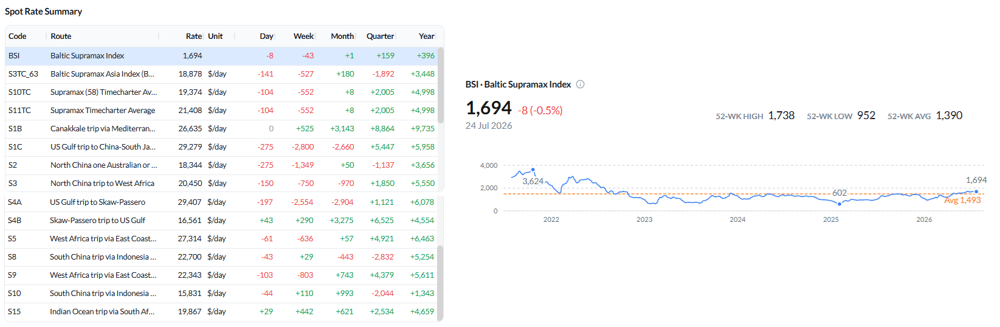
*Figure 12: Baltic Supramax Index (BSI) — spot rate summary and BSI performance as of 24 Jul 2026 (Source: The Signal Ocean Platform).*

Congestion in North/Central China remained elevated at 174 vessels (12-month average 109) but eased from ~186 last week; East Coast India fell to 67 (–16% WoW). Net vessel supply was highest in the US Gulf/USEC (S4A/S1C, 120) and Indonesia (S8/S10, 80); ECSA availability at 97 stayed below its 12-month average of 116.

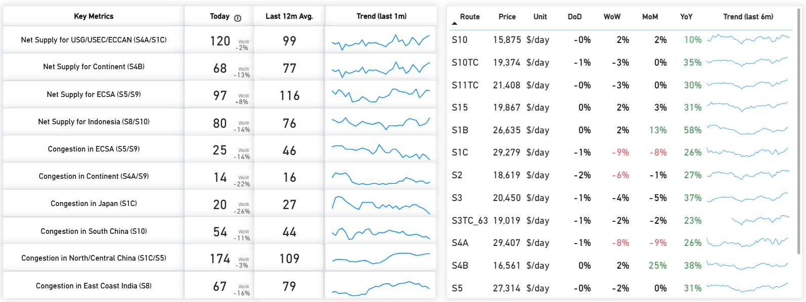
*Figure 13: Supramax — Key metrics & route prices as of 24 Jul 2026 (Source: The Signal Ocean Platform).*

Supply / Demand — change vs the previous week:Forward balances were little changed. S4A/S1C and S4B remain clear supply surpluses across the window; S5 sits near equilibrium with expected demand catching up to supply later in the period; and S8/S10 remain in supply surplus.

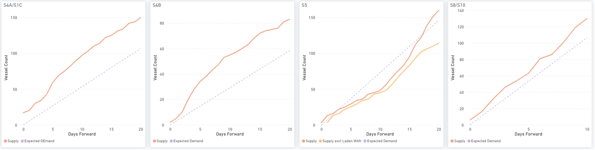
*Figure 14: Supramax — S4A/S1C, S4B, S5 & S8/S10: cumulative Supply vs Expected Demand over days forward (Source: The Signal Ocean Platform).*

The global ballaster fleet rose to about 692 vessels (+19% WoW, from ~678). FEAST/NOPAC held the largest concentration (215, +9% WoW) ahead of Australasia (191, +21% WoW); the North Atlantic recorded the largest jump (+40% WoW).

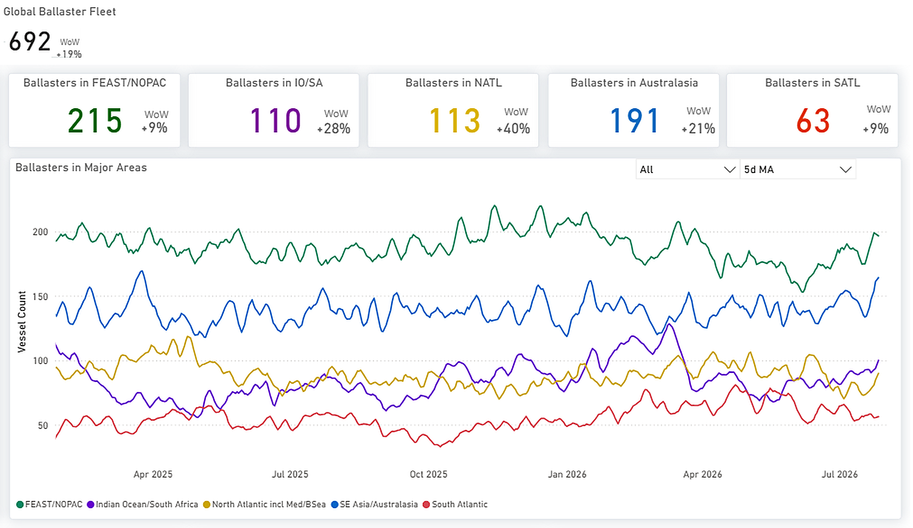
*Figure 15: Supramax — Global ballaster fleet and regional positioning (Source: The Signal Ocean Platform).*

On tonne-miles, Handymax was the highest at about 139% (off a ~146% peak), Supramax around 106–107% (from ~110% last week) and Handysize the lowest at roughly 92%.

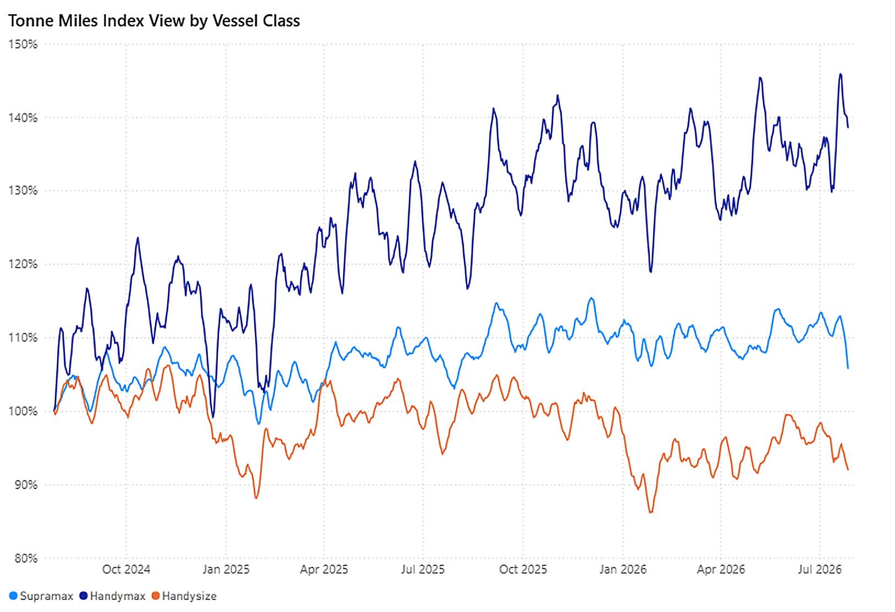
*Figure 16: Supramax · Handymax · Handysize — Tonne-Miles Index view by vessel class (Source: The Signal Ocean Platform).Type image caption here (optional)*

## HANDYSIZE | ANALYSIS

The BHSI held at 905 (–1 day-on-day; +2 week-on-week), stabilising after last week’s 27-point decline. Average HS7TC earnings were flat at $16,290/day (from $16,261 last week). Routes were mixed: the UK Continent/Baltic routes firmed (HS1_38 +3% WoW to $8,668/day, HS2_38 +3% to $11,346/day), along with the Pacific HS5_38 (+3%) and HS6/HS7 (+2%), while the South Atlantic HS3_38 (–5% WoW) and HS4_38 (–5%) softened. Year-on-year gains remained strong (HS6_38 +41%, HS7_38 +39% YoY).

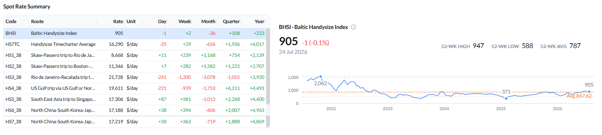
*Figure 17: Baltic Handysize Index (BHSI) — spot rate summary and BHSI performance as of 24 Jul 2026 (Source: The Signal Ocean Platform).*

Net vessel supply remained highest in the Far East (HS7, 101, –15% WoW) and UK Continent/Baltic (HS1/HS2, 110). Congestion firmed in South-East Asia (Thailand/Vietnam/Singapore/Malaysia +45% WoW) and Japan/Korea (46, +10% WoW), and eased on the Continent (20, –9% WoW).

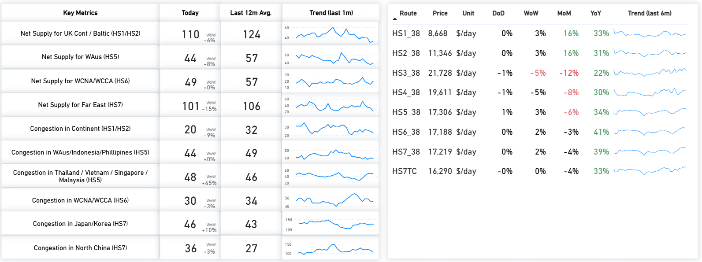
*Figure 18: Handysize — Key metrics & route prices as of 24 Jul 2026 (Source: The Signal Ocean Platform).*

Supply / Demand — change vs the previous week:HS1/HS2 and HS5 remain clear supply surpluses across the window. HS6 is close to equilibrium with a modest surplus (marginally tighter than last week), and HS7 stays the tightest route, with cumulative supply below expected demand early before converging toward demand by about day 8–10.

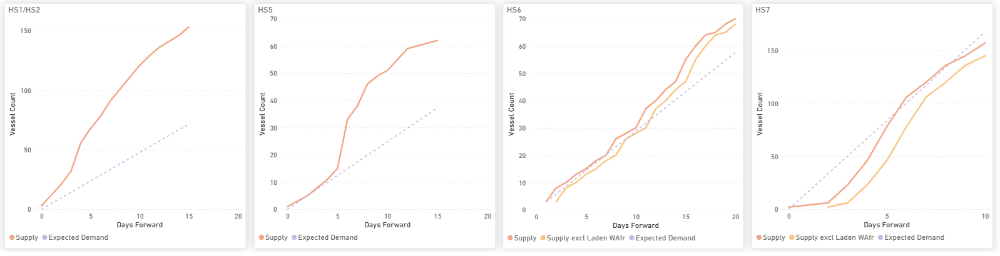
*Figure 19: Handysize — HS1/HS2, HS5, HS6 & HS7: cumulative Supply vs Expected Demand over days forward (Source: The Signal Ocean Platform).*

The global ballaster count eased to about 664 vessels (from ~684). The North Atlantic retained the highest concentration (202, +10% WoW); the Indian Ocean/South Africa saw the largest week-on-week increase (+41% WoW).

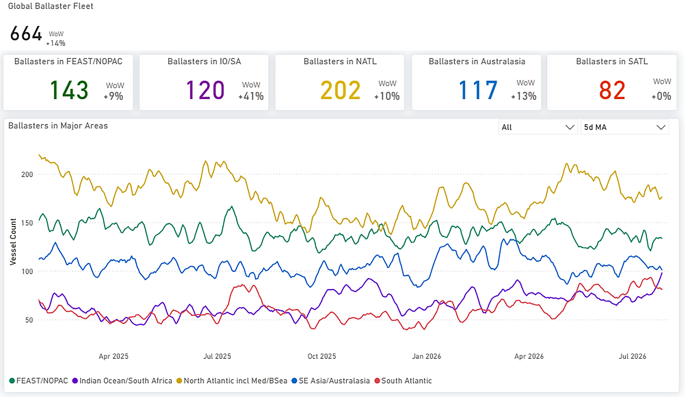
*Figure 20: Handysize — Global ballaster fleet and regional positioning (Source: The Signal Ocean Platform).*

## OVERALL MARKET TREND | CONCLUSIONS

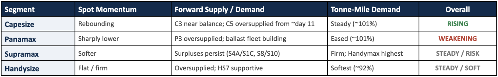
*Signal Figure*

Key takeaway:Capesize regained leadership this week as stronger iron ore activity supported the Atlantic basin and kept tonne-mile demand close to recent highs. Panamax weakened the most, with softer grain and coal activity, easing congestion and a larger ballast fleet weighing on sentiment. Supramax remained under pressure, led by weaker US Gulf demand, while Handysize continued to hold comparatively stable despite softer tonne-mile demand.

Key risk:The main downside risk continues to exceed expected demand across several benchmark routes. By contrast, the Capesize market remains comparatively better balanced, with the C3 supply-demand balance tracking expected demand closely, while vessel supply on C5 continues to exceed expected demand from around day 11 onward. A longer-term consideration is the aging profile of the bauxite fleet: around 45% of bauxite tonne-mile demand is carried by vessels aged 16 years or older, compared with roughly one-third in the iron ore trade, making bauxite more exposed to future demolition-driven changes in effective fleet supply.

Methodology:Analysis is based on data from The Signal Ocean Platform and AXSMarine, covering market prices, Capesize, Panamax, Supramax and Handysize insights, tonne-mile charts and vessel-age analytics by trade. Week-on-week comparisons reference the week ending 17 July 2026.
