# Weekly Dry Market Monitor: Week 31, 2026

**Date**: August 6, 2026 | **Category**: Dry bulk | **Section**: Monitors | **Source**: [https://www.thesignalgroup.com/weekly-market-monitor/weekly-dry-market-monitor-week-31-2026](https://www.thesignalgroup.com/weekly-market-monitor/weekly-dry-market-monitor-week-31-2026)

---

## SPOTLIGHT OF THE WEEK

## Strait of Hormuz - a Renewed Blockade Impairs Dry-Bulk Crossings

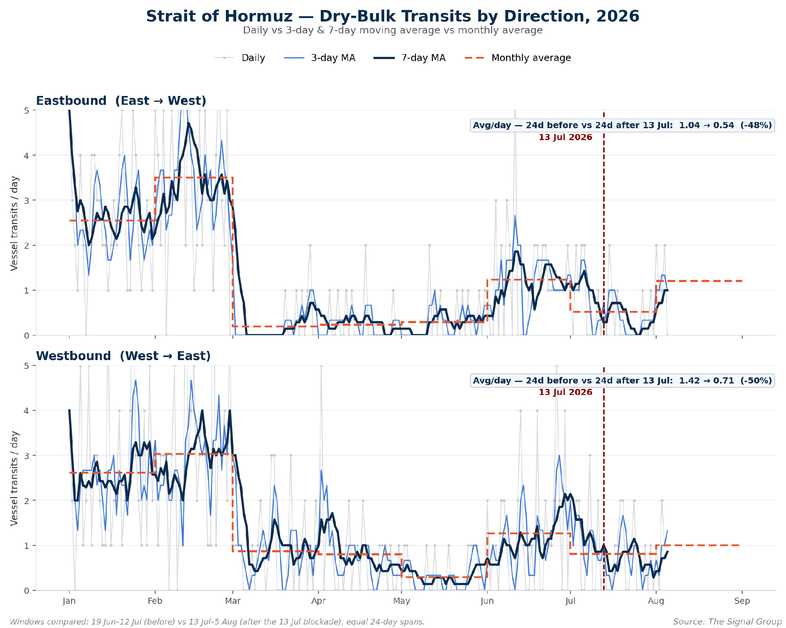
*Figure 1: Strait of Hormuz dry-bulk transits by direction (eastbound and westbound), 2026 - daily counts with 3-day and 7-day moving averages against the monthly average; the dashed line marks the 13 July blockade (Source: The Signal Group).*

On13July2026, US Central Command announced a renewed naval blockade of Iranian ports (effective 14 July), ending a 60-day ceasefire following Iran’s 7 July attacks on commercial vessels in the strait. The chart tracks dry-bulk transits of the Strait of Hormuz by direction — eastbound (east-to-west) and westbound (west-to-east) — as daily counts, with 3-day and 7-day moving averages plotted against the monthly average.

Crossings had recovered only partially in June, after the 18 June ceasefire and the lifting of the previous blockade. The 13 July action reversed that recovery. Comparing equal windows on either side of the announcement — the 24 days before (19 June–12 July) against the 24 days after (13 July–5 August) — average daily dry-bulk transits fell by roughly half:eastboundfrom1.04to0.54crossings/day(−48%)andwestboundfrom1.42to0.71(−50%).

## FREIGHT MARKET OVERVIEW | BDI & SEGMENT METRICS

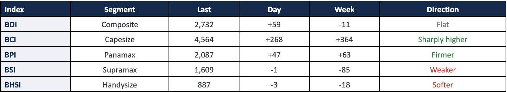
*Signal Figure*

‍

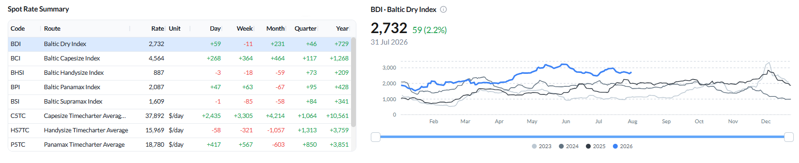
*Figure 2: Baltic Dry Index - spot rate summary across segments and BDI performance as of 31 Jul 2026 (Source: The Signal Group).*

Driven by a robust performance in theCapesizesector that offset softer results in the Supramax and Handysize segments, the BDI dipped slightly by 11 points to 2,732 (+59 day-on-day, −11 WoW). Specifically,Capesizecontinued its upward trend, pushing the BCI up to 4,564 (+268 day-on-day, +364 WoW) and boosting average C5TC earnings to around $37,892/day (+$3,305 WoW). ThePanamaxmarket also showed strength, with the BPI firming to 2,087 (+47 day-on-day, +63 WoW). In contrast,Supramaxproved to be the week's main underperformer, sliding to 1,609 (−1 day-on-day, −85 WoW), whileHandysizealso lost ground, easing to 887 (−3 day-on-day, −18 WoW).

All data reflect market conditions as of 31 Jul 2026 unless otherwise stated.

## CAPESIZE | ANALYSIS

The BCI extended its rally to 4,564 (+268 day-on-day; +364 week-on-week), a second consecutive strong week, and average C5TC earnings rose to $37,892/day (+$2,435 day-on-day; +$3,305 week-on-week). The gains were Pacific-led: C5 (West Australia–Qingdao) jumped to $14.45/mt (+$1.82 WoW, about +14%), while C3 (Tubarao–Qingdao) firmed more modestly to $34.81/mt (+$0.45 WoW).

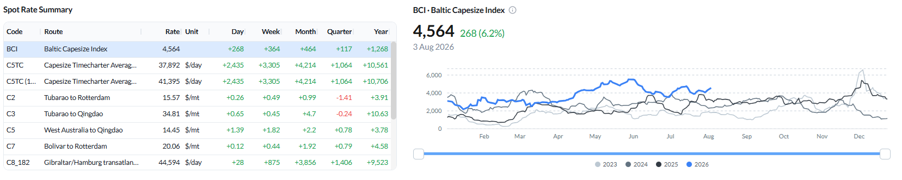
*Figure 3: Baltic Capesize Index (BCI) - spot rate summary and BCI performance as of 31 Jul 2026 (Source: The Signal Group).*

Supply / Demand - the forward read:As of31 July 2026, expected demand onC3 (Tubarão–Qingdao)remains above projected vessel supply through most of August. The two curves converge around27–29 August, after which projected supply moves above expected demand and the surplus widens into the first week of September. OnC5 (West Australia–Qingdao), projected supply excluding laden vessels remains above expected demand through most of the 15-day window. The curves converge around12–13 August, but total projected supply rises sharply thereafter and finishes well above expected demand by15 August.

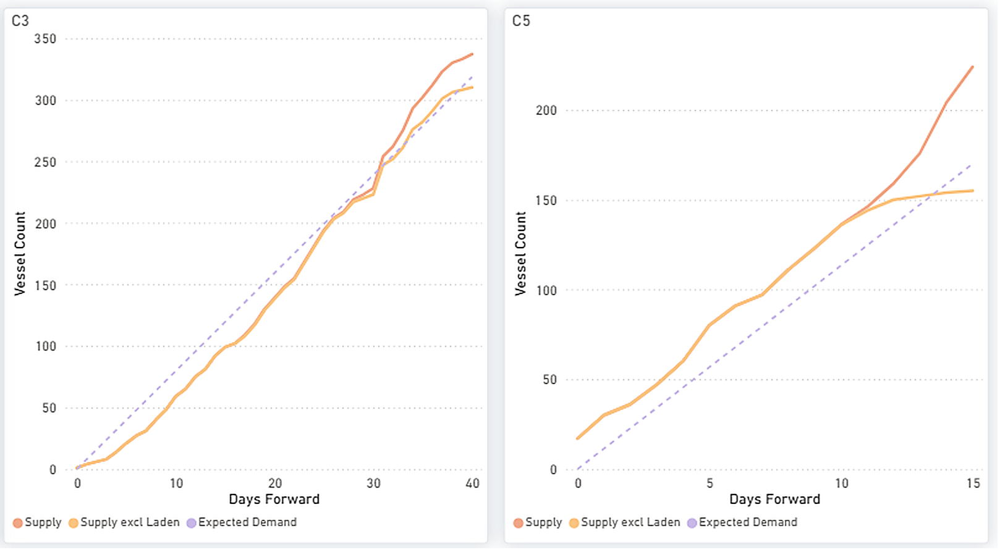
*Figure 4: Capesize - C3 & C5 forward balance: cumulative Supply vs Expected Demand over days forward (Source: The Signal Group).*

The global Capesize ballaster fleet increased to 605 vessels (+2% WoW). Australasia remained the largest ballast region with 224 vessels (+3% WoW), while the Indian Ocean/South Africa increased to 184 (+12% WoW). In contrast, ballast numbers fell in the North Atlantic (-13% WoW), South Atlantic (-8% WoW) and East Asia/NOPAC (-5% WoW). The regional distribution indicates that vessel availability remains weighted towards Australasia and the Indian Ocean, while ballast availability in the Atlantic continued to tighten.

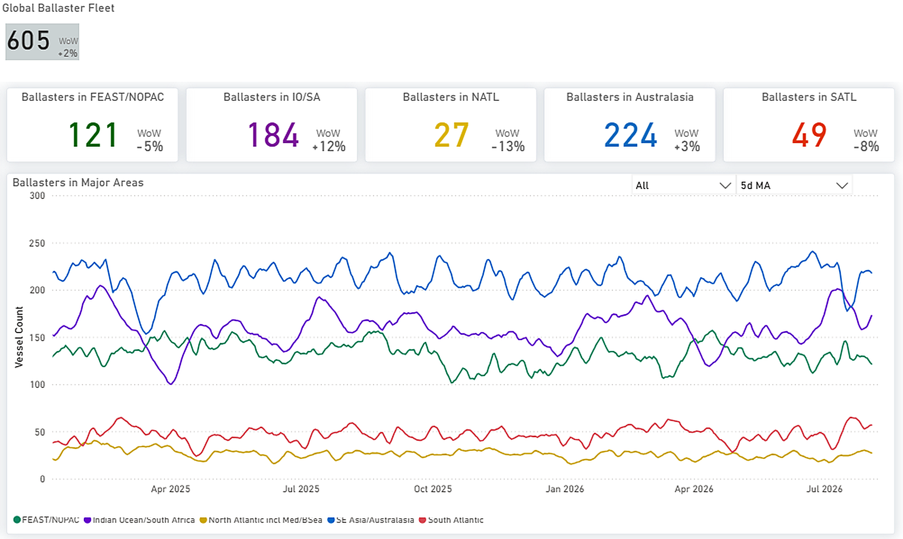
*Figure 5: Capesize - Global ballaster fleet and regional positioning (Source: The Signal Group).*

Capesize tonne-mile demand held firm around 102–103%, but the VLOC index fell sharply to about 83% - the widest gap between the two classes in months.

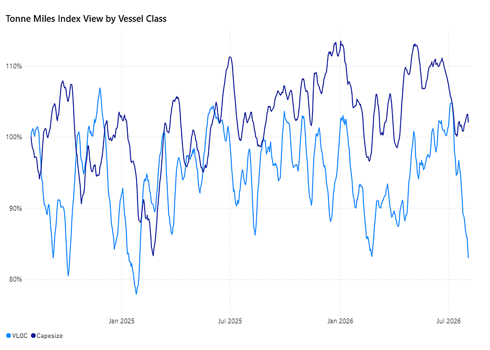
*Figure 6: VLOC vs Capesize - Tonne-Miles Index view by vessel class (Source: The Signal Group).*

## PANAMAX | ANALYSIS

The BPI firmed to 2,087 (+47 day-on-day; +63 week-on-week). Earnings rose on the fronthaul and Atlantic routes — P1A_82 +5% WoW to $21,205/day, P2A_82 +5% to $30,840/day and P3A_82 +7% to $15,618/day — while P5_82 (−2%) and P6_82 (−2%) eased; the P5TC average rose 3% WoW to $18,780/day. Most routes trade well above year-ago levels (P6_82 +33% YoY).

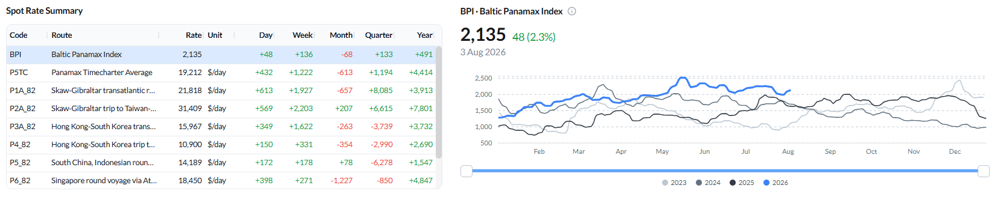
*Figure 7: Baltic Panamax Index (BPI) - spot rate summary and BPI performance as of 31 Jul 2026 (Source: The Signal Group).*

The metrics carry a forward caution. ECSA ballasters climbed again to 323 (+8% WoW),  and USG/USEC/ECCAN open tonnage jumped 45% WoW to 42.

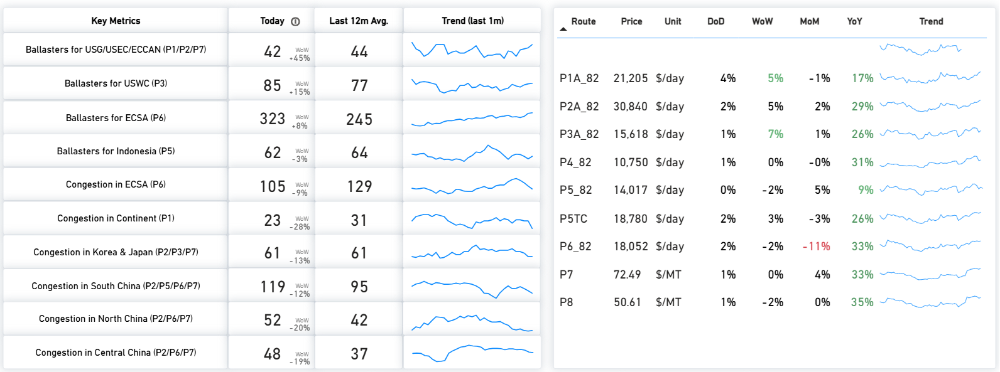
*Figure 8: Panamax - Key metrics & route prices as of 31 Jul 2026 (Source: The Signal Group).*

Supply / Demand - the forward read:The balances look much like last week, but the implication is directional. P5 remains the segment’s anchor, with cumulative supply well below expected demand across the window - the main reason the Pacific round can hold even as ballasters build. P3 keeps a clear supply surplus that should cap the transatlantic; P1/P2/P7 tighten only later in the window; and P6 sits close to balance. Net, the curve supports the Pacific but leaves the Atlantic exposed if the ECSA tonnage build persists.

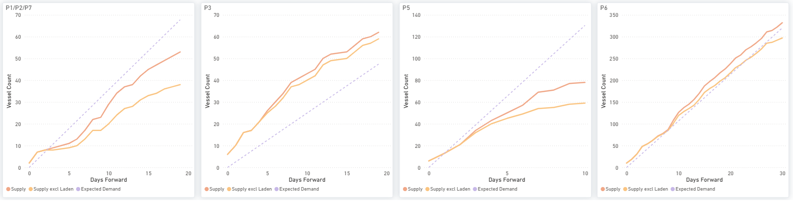
*Figure 9: Panamax - P1/P2/P7, P3, P5 & P6: cumulative Supply vs Expected Demand over days forward (Source: The Signal Group).*

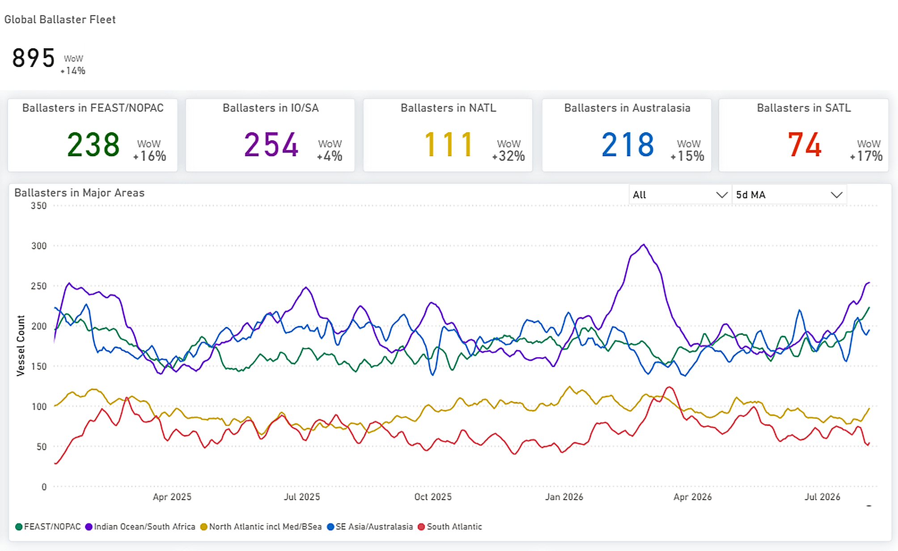
*Figure 10: Panamax - Global ballaster fleet and regional positioning (Source: The Signal Group).*

Panamax and Post-Panamax tonne-mile indices declined to around 96–100% by the end of July, from above 113–120% in mid-month. Despite the softer tonne-mile reading, Panamax spot rates continued to strengthen. Whether those freight gains can be sustained will depend on a recovery in tonne-mile demand over the coming weeks.

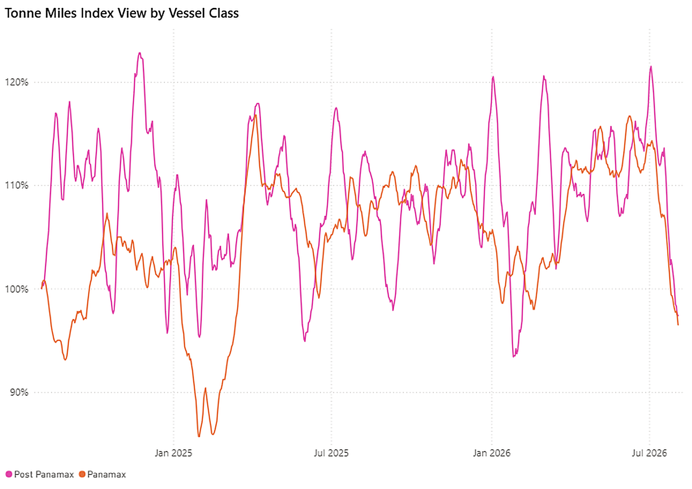
*Figure 11: Panamax vs Post-Panamax - Tonne-Miles Index view by vessel class (Source: The Signal Group).*

## SUPRAMAX | ANALYSIS

The BSI fell to 1,609 (−1 day-on-day; −85 week-on-week), reversing recent gains. Average S10TC earnings dropped 6% WoW to $18,302/day, with declines across most routes — S2 −9%, S3TC_63 −7%, S4A −7% and S5 −6%. The US Gulf routes S1C ($28,418/day) and S4A ($27,311/day) led lower, though year-on-year comparisons remain strongly positive (S1B +59% YoY).

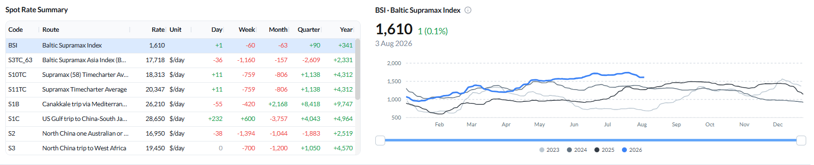
*Figure 12: Baltic Supramax Index (BSI) - spot rate summary and BSI performance as of 31 Jul 2026 (Source: The Signal Group).Type image caption here (optional)*

Net vessel supply remained concentrated in the US Gulf/US East Coast (S4A/S1C), with 121 available vessels, while the Continent (S4B) increased to 76 (+17% WoW). East Coast South America (ECSA) continued to tighten, with net vessel supply falling to 26 vessels (-28% WoW). Meanwhile, congestion in North and Central China remained elevated at 167 vessels (+4% WoW), limiting the amount of vessel capacity immediately available to the Pacific market.

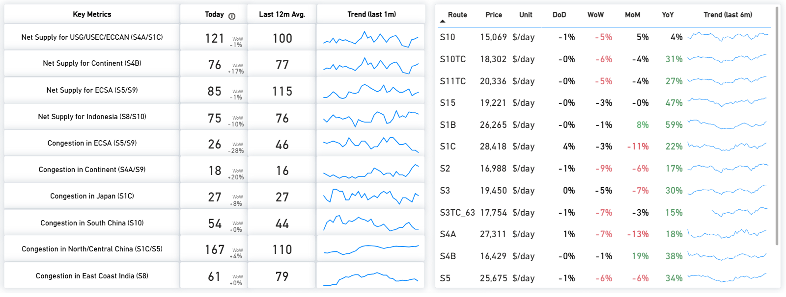
*Figure 13: Supramax - Key metrics & route prices as of 31 Jul 2026 (Source: The Signal Group).*

Supply / Demand - the forward read:Little changed week-on-week, and that is the point: supply surpluses still dominate the curve. As of31 July 2026, cumulative projected vessel supply remains above expected demand throughout the forecast period onS4A/S1C (US Gulf/US East Coast),S4B (Continent)andS8/S10 (Pacific), with the supply-demand gap persisting across the forecast window.S5 (East Coast South America)follows a different pattern, with cumulative expected demand exceeding projected vessel supply through most of the forecast period. The two curves converge during the final days of the forecast, when cumulative projected supply moves marginally above expected demand.

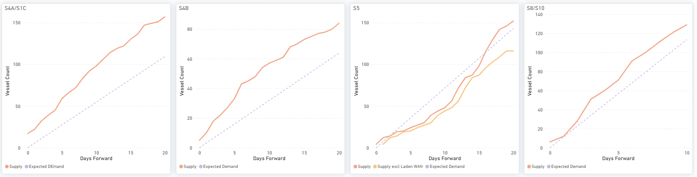
*Figure 14: Supramax - S4A/S1C, S4B, S5 & S8/S10: cumulative Supply vs Expected Demand over days forward (Source: The Signal Group).*

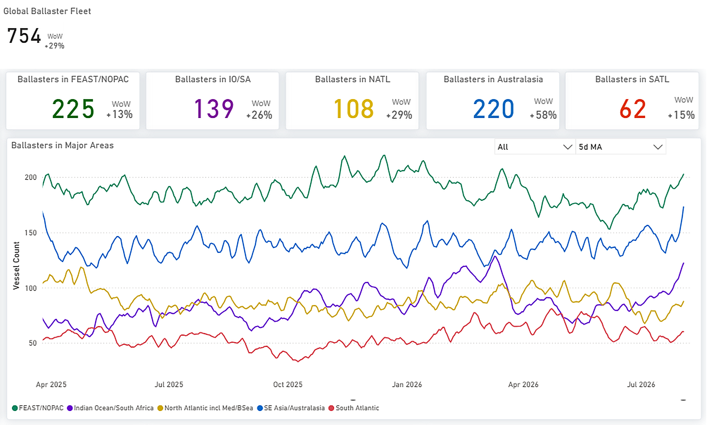
*Figure 15: Supramax - Global ballaster fleet and regional positioning (Source: The Signal Group).*

A softer forward outlook is reinforced by fading tonne-mile momentum across the geared classes. This trend is highlighted by Handymax pulling back from its recent peak toward 123–130% and Supramax easing to around 104%, while Handysize continues to languish near 90%.

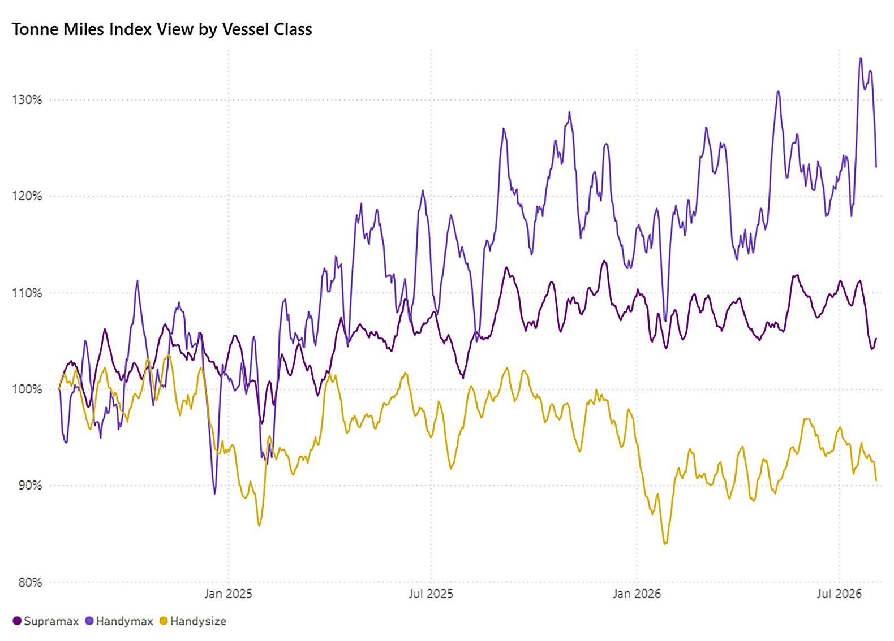
*Figure 16: Supramax · Handymax · Handysize - Tonne-Miles Index view by vessel class (Source: The Signal Group).*

## HANDYSIZE | ANALYSIS

The BHSI eased to 887 (−3 day-on-day; −18 week-on-week). Average HS7TC earnings slipped 2% WoW to $15,969/day. The softness was led by the South Atlantic (HS3_38 −4%, HS4_38 −7% WoW), while the Continent/Baltic and Pacific routes (HS1, HS2, HS5, HS6, HS7) were nearly flat. Year-on-year gains remain strong (HS6_38 +38%, HS7_38 +36% YoY).

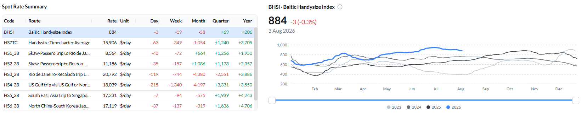
*Figure 17: Baltic Handysize Index (BHSI) - spot rate summary and BHSI performance as of 31 Jul 2026 (Source: The Signal Group).*

Net vessel supply was highest in the UK Continent/Baltic (HS1/HS2, 119, +7% WoW) and the Far East (HS7, 104, +8% WoW); congestion firmed on the Continent (31, +35% WoW) and in North China (38, +9% WoW).

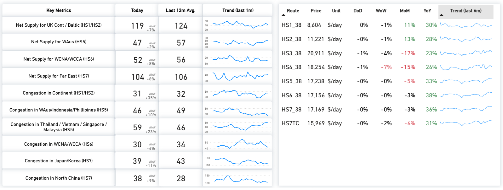
*Figure 18: Handysize - Key metrics & route prices as of 31 Jul 2026 (Source: The Signal Group).*

Supply / Demand - the forward read:As last week, forward supply-demand projections indicate a cumulative vessel supply surplus on HS1/HS2, HS5 and HS6 throughout most of the forecast period. HS7 (Far East) remains the exception, with expected demand exceeding projected supply during the early part of the forecast before the two curves converge towards the end of the period. Net vessel supply also increased in the UK Continent/Baltic (+7% WoW) and the Far East (+8% WoW), reflecting higher vessel availability than a week earlier.

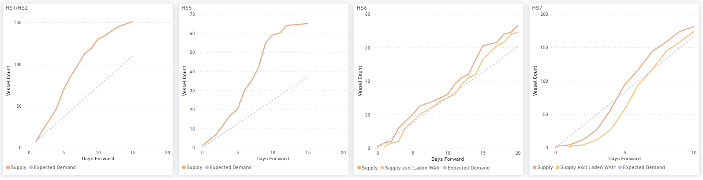
*Figure 19: Handysize - HS1/HS2, HS5, HS6 & HS7: cumulative Supply vs Expected Demand over days forward (Source: The Signal Group).*

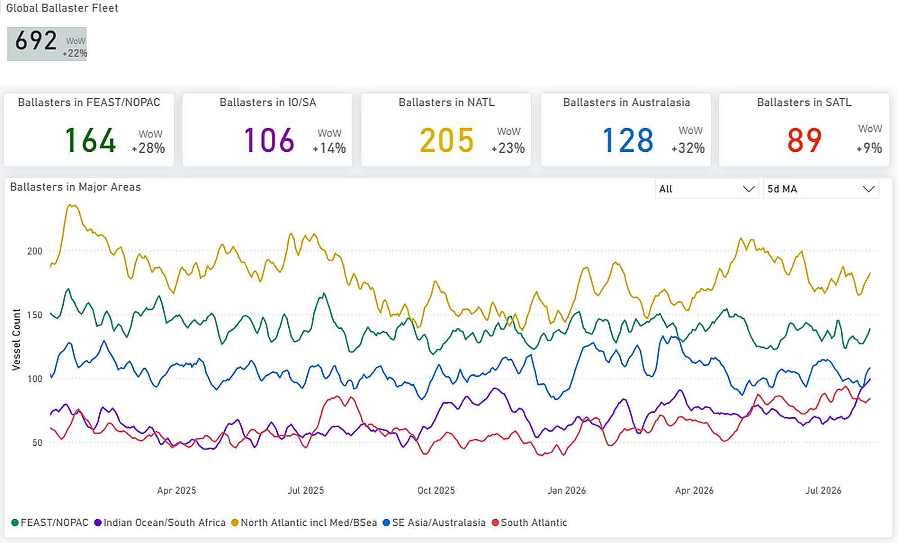
*Figure 20: Handysize - Global ballaster fleet and regional positioning (Source: The Signal Group).*

## OVERALL MARKET TREND | CONCLUSIONS

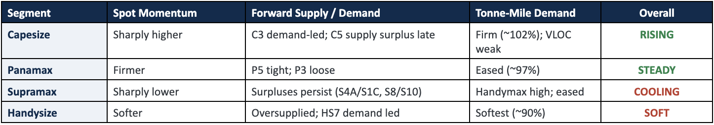
*Signal Figure*

Key takeaway:Capesize maintained positive momentum on Pacific iron ore activity, while Panamax freight strengthened despite softer tonne-mile demand. In contrast, forward supply continued to exceed expected demand across most Supramax and Handysize benchmark routes, consistent with weaker market conditions in both segments.

Key risk:Forward supply surpluses remain most evident on Panamax P3, Supramax S4A/S1C, S4B and S8/S10, and Handysize HS1/HS2 and HS5, while Capesize C5 still shows cumulative supply above expected demand in the far window. The renewed US naval blockade of Iran (see Spotlight) is the principal geopolitical watch-item: it has roughly halved dry-bulk transits of the Strait of Hormuz since 13 July, and any broadening of Gulf disruption or sustained re-routing would intensify the risk to regional flows and rates.

Methodology:Analysis is based on data from The Signal Ocean Platform and AXSMarine, covering market prices, Capesize, Panamax, Supramax and Handysize insights, tonne-mile charts, forward supply-demand balances and waypoint transit counts for the Strait of Hormuz.
