# Weekly Dry Market Monitor: Week 32, 2026

**Date**: August 13, 2026 | **Category**: Dry bulk | **Section**: Monitors | **Source**: [https://www.thesignalgroup.com/weekly-market-monitor/weekly-dry-market-monitor-week-32-2026](https://www.thesignalgroup.com/weekly-market-monitor/weekly-dry-market-monitor-week-32-2026)

---

## SPOTLIGHT OF THE WEEK

## Chinese Buying Builds the Next U.S. Soybean Export Programme

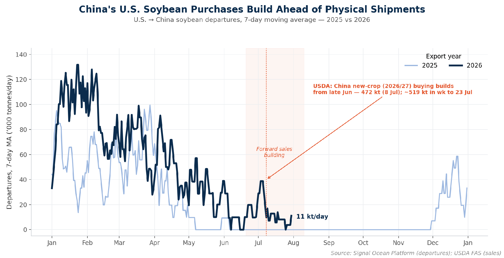
*Figure 1: U.S. → China soybean departures, 7-day moving average (2025 vs 2026), with USDA new-crop (2026/27) sale annotations (Source: Signal Group, departures; USDA FAS, sales).*

U.S. soybean shipments to China remain seasonally subdued, while forward sales have strengthened markedly since late June. Chinese purchases of new-crop (2026/27) U.S. soybeans have run well ahead of physical departures, building the forward cargo pipeline as the U.S. export season approaches.

According to USDA export-sale data, China returned to the U.S. new-crop market in late June, and buying gathered pace through July. USDA reported a472,000-tonnesaletoChinaon8July(336,000 tonnes for the 2026/27 marketing year), followed by a run of additional daily “flash” sales. In the week to 23 July, 2026/27 soybean sales totaled about 1.33 million tonnes, with China the largest buyer at roughly 519,000 tonnes (about 39% of the week’s new-crop sales). China has since continued to add new-crop commitments into August, although the latest weekly report (week ending 6 August) showed net sales easing as the old-crop window closed.

Physical U.S.–China soybean departures nonetheless remained subdued in Signal Ocean Platform vessel data, with the 7-day moving average at about 11,000 tonnes/day at the end of July. The increase in forward buying has therefore yet to be matched by a comparable rise in physical departures. This leaves part of the recently contracted volume ahead of the physical shipping curve as the U.S. export season approaches.

## FREIGHT MARKET OVERVIEW | BDI & SEGMENT METRICS

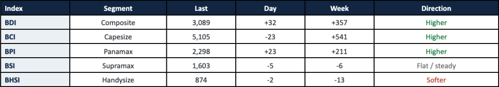
*Signal Figure*

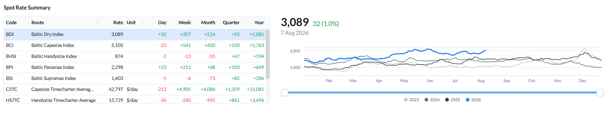
*Figure 2: Baltic Dry Index — spot rate summary across segments and BDI performance as of 7 Aug 2026 (Source: The Signal Group).*

The BDI rose to 3,089 (+32 day-on-day, +357 WoW) on a strong week for the larger sizes.Capesizeextended its rally for a third week, the BCI up to 5,105 (+541 WoW) with average C5TC earnings climbing to about $42,797/day (+$4,905 WoW).Panamaxalso strengthened, with the BPI rising to 2,298 (+211 WoW) and the P5TC average up roughly 10% WoW to $20,684/day. The geared sizes lagged:Supramaxwas flat (BSI 1,603, −6 WoW) andHandysizesoftened (BHSI 874, −13 WoW).

## CAPESIZE | ANALYSIS

Freight.The BCI extended its rally to 5,105 (−23 day-on-day; +541 week-on-week), a third consecutive strong week, with average C5TC earnings up to $42,797/day (+$4,905 WoW). The move stayed Pacific-led: C5 (West Australia–Qingdao) rose to $16.23/mt (+$1.79 WoW, about +12%) and the C10_182 transpacific round jumped nearly $9,700/day WoW, while C3 (Tubarao–Qingdao) firmed to $35.57/mt (+$0.76 WoW).

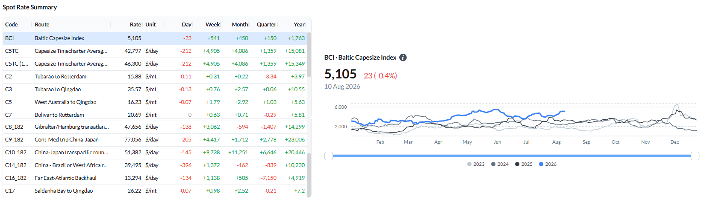
*Figure 3: Baltic Capesize Index (BCI) - spot rate summary and BCI performance (Source: The Signal Group).*

Ballasters vs the previous week.The global Capesize ballaster count was little changed at 602 (+1% WoW), but the mix moved in the market’s favour: open tonnage in Australasia fell 11% WoW to 196, thinning the pool competing for West Australia cargo as C5 rallied, while FEAST/NOPAC rose 20% to 147 and the Indian Ocean/South Africa held at 182.

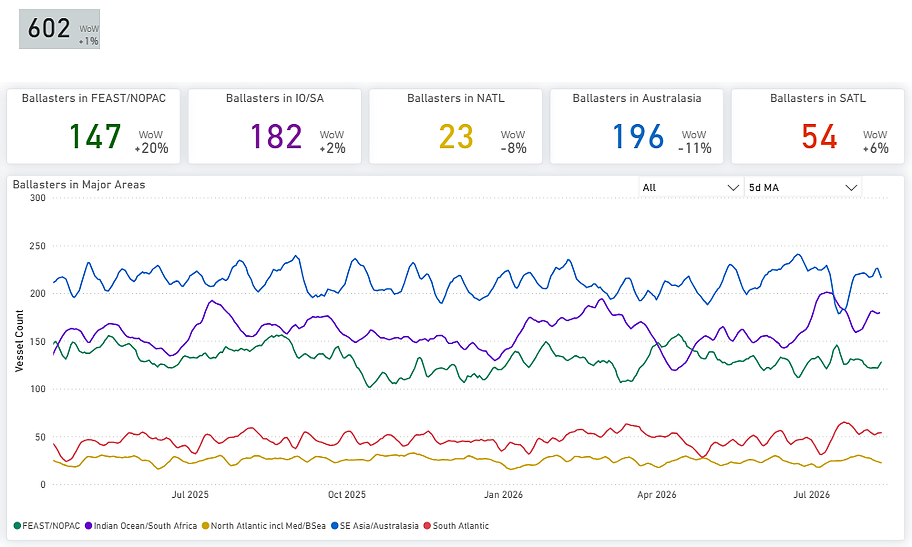
*Figure 4: Capesize - Global ballaster fleet and regional positioning (Source: The Signal Group).*

Supply/demand by route.C3 (Tubarao–Qingdao) holds cumulative supply below expected demand through most of the forward window, tipping into only a slight surplus in the final ten days. C5 (West Australia–Qingdao) is near balance early and builds a supply surplus from around day 12.

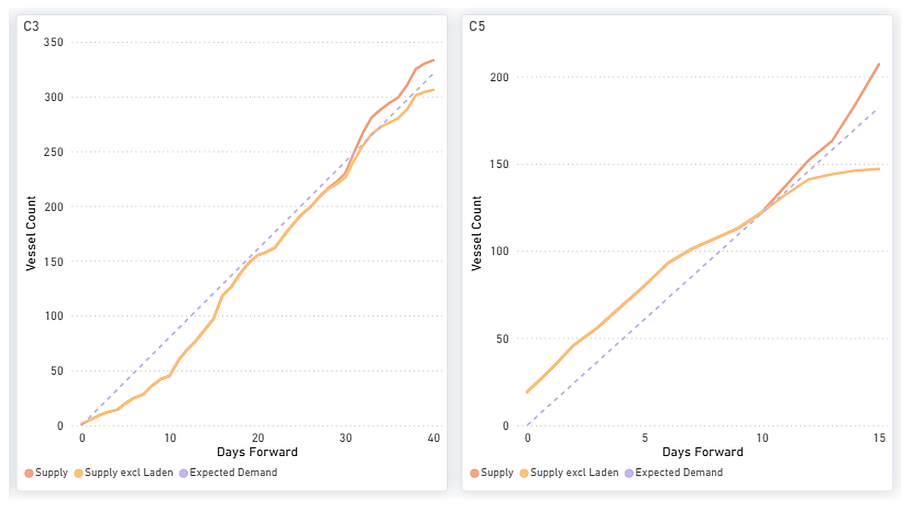
*Figure 5: Capesize - C3 & C5 forward balance: cumulative Supply vs Expected Demand over days forward (Source: The Signal Group).*

Demand/supply ratioC5TC rose 10.0% on the week to $41,947/day in the week ending 6 August, the strongest performance across the four dry bulk segments and placing C5TC earnings in the 88th percentile of weekly observations over the past year. The demand index stood at 108.6 versus 102.0 for supply, indicating that demand was running further above its year-ago level than supply. This left the demand-to-supply ratio at 1.06, with demand growth continuing to outpace supply growth and the ratio remaining above 1.00 since late July.

‍

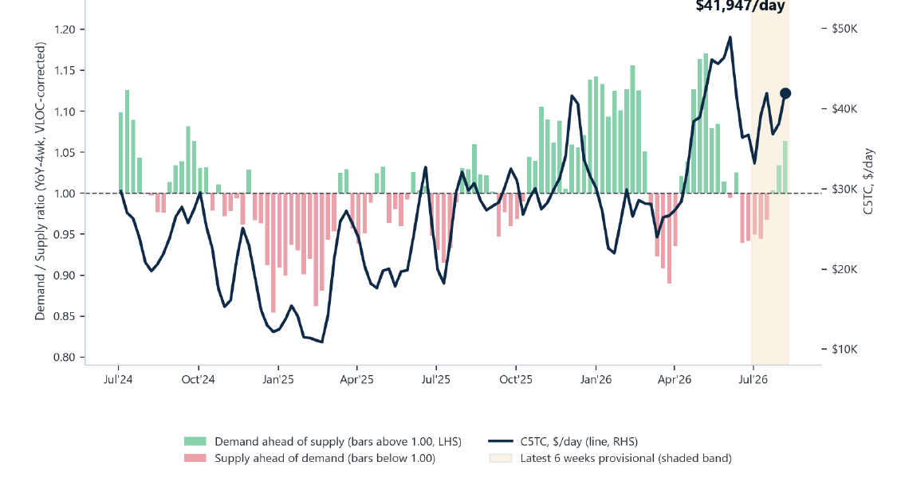
*Figure 6: Capesize demand/supply ratio (LHS) and C5TC spot rate (RHS) — weekly (Source: Baltic Exchange; Signal Group — Trade Flows, Vessel Daily Status).*

## PANAMAX | ANALYSIS

Freight.The BPI rose to 2,298 (+23 day-on-day; +211 week-on-week) and the P5TC average gained about 10% WoW to $20,684/day. The rally was broad: P1A_82 +$2,959, P5_82 +$2,027, P2A_82 +$2,124, P6_82 +$1,650 and P3A_82 +$1,559 WoW. The grain routes firmed too — P7 (US Gulf–Qingdao) to $73.81/mt and P8 (Santos–Qingdao) to $51.98/mt.

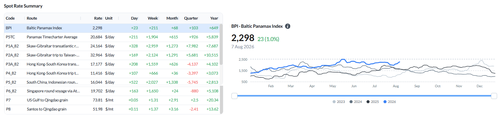
*Figure 7: Baltic Panamax Index (BPI) — spot rate summary and BPI performance (Source: The Signal Group).*

Ballasters vs the previous week.The global Panamax ballaster count rose 5% WoW to 870, with the build concentrated in the South Atlantic (+54% WoW to 97) as ECSA tonnage lengthened; the Indian Ocean/South Africa eased 5% to 233, while FEAST/NOPAC (232) and Australasia (206) were nearly steady.

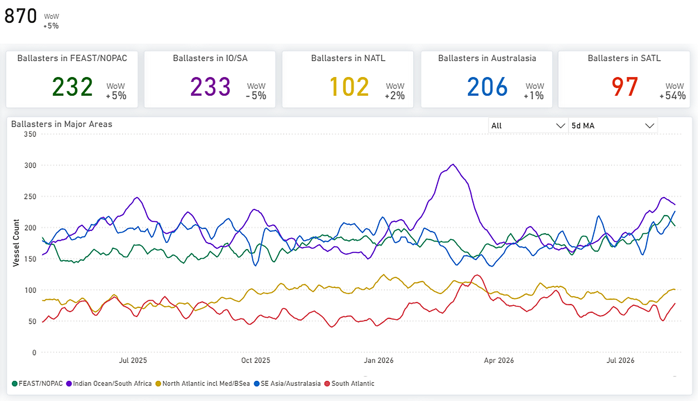
*Figure 8: Panamax - Global ballaster fleet and regional positioning (Source: The Signal Group).*

Supply/demand by route.P5 (Indonesia round) and P1/P2/P7 keep cumulative supply below expected demand across the window, while P3 (transatlantic) and, more mildly, P6 sit in supply surplus.

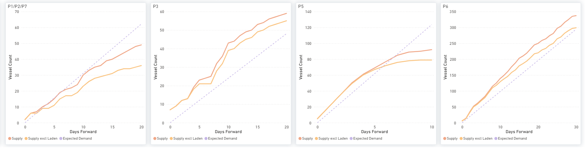
*Figure 9: Panamax - P1/P2/P7, P3, P5 & P6: cumulative Supply vs Expected Demand over days forward (Source: The Signal Group).*

Demand/supply ratioP5TC recovered 7.1% on the week to $19,406/day. The latest demand index stood at 87.7 against 103.6 for supply, leaving the demand-to-supply ratio at 0.85, compared with 1.00 in the last settled week of 16 July. On the currently available data, the rate recovery has therefore not been accompanied by a comparable improvement in the demand/supply pace. The latest week remains provisional, covering 6 of 7 loading days (73% complete).

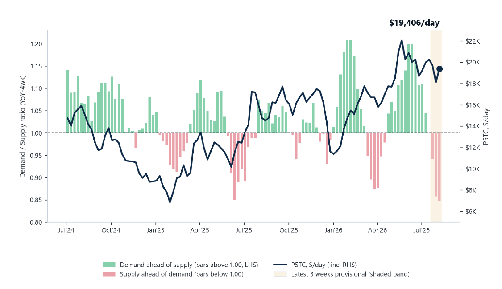
*Figure 10: Panamax demand/supply ratio (LHS) and P5TC spot rate (RHS) - weekly (Source: Baltic Exchange; The Signal Group - Trade Flows, Vessel Daily Status).*

## SUPRAMAX | ANALYSIS

Freight.The BSI was essentially flat at 1,603 (−5 day-on-day; −6 week-on-week), but the tape masked a sharp split. US Gulf routes surged — S1C (US Gulf–China/Japan) +$1,639 and S4A (US Gulf–Skaw-Passero) +$2,868 WoW — while Asia/Pacific routes fell, S10 −$706, S8 −$693, S15 −$813 and S1B −$682 WoW. The S10TC average was little changed at $18,224/day (−$78 WoW).

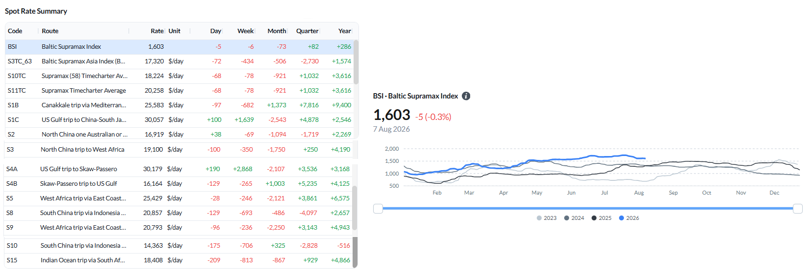
*Figure 11: Baltic Supramax Index (BSI) — spot rate summary and BSI performance (Source: The Signal Group).*

Ballasters vs the previous week.The global Supramax ballaster count rose 9% WoW to 667, with builds in Australasia (+18% to 185), the South Atlantic (+26% to 63) and the Indian Ocean/South Africa (+16% to 132); FEAST/NOPAC eased 4% to 192.

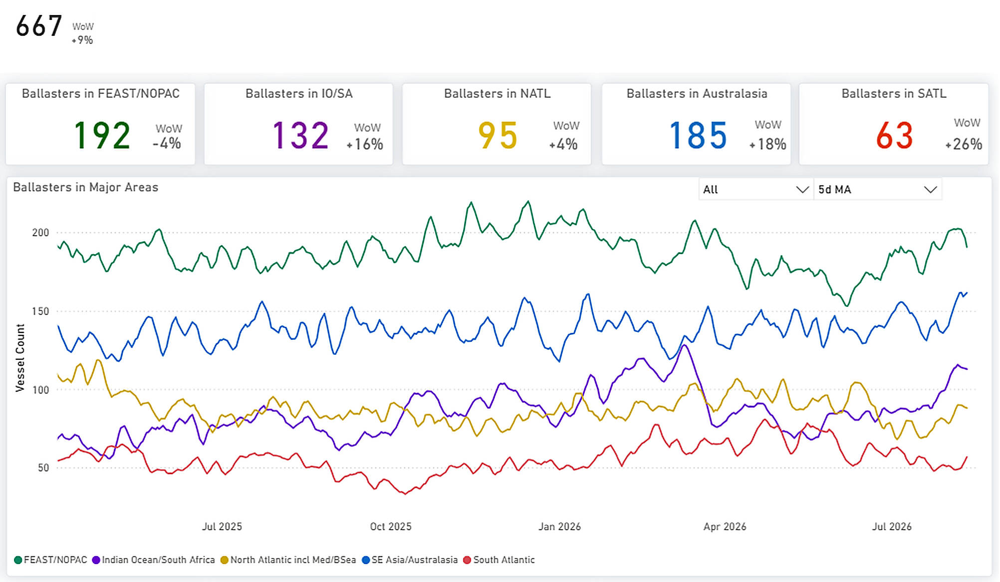
*Figure 12: Supramax — Global ballaster fleet and regional positioning (Source: The Signal Group).*

Supply/demand by route.S4A/S1C and S4B carry a clear cumulative supply surplus — notably on the very US Gulf routes whose spot rates spiked — while S5 and S8/S10 sit close to balance.

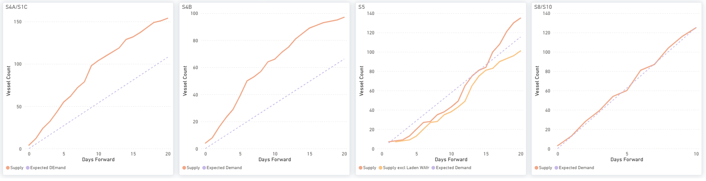
*Figure 13: Supramax — S4A/S1C, S4B, S5 & S8/S10: cumulative Supply vs Expected Demand over days forward (Source: The Signal Group).*

Demand/supply ratioS11TC eased 3.2% on the week to $20,350/day, while demand firmed to 89.9 against its year-ago level and supply eased to 98.6, lifting the demand-to-supply ratio to 0.91 from 0.90. The rate and the pace therefore moved in opposite directions in the latest week.

‍

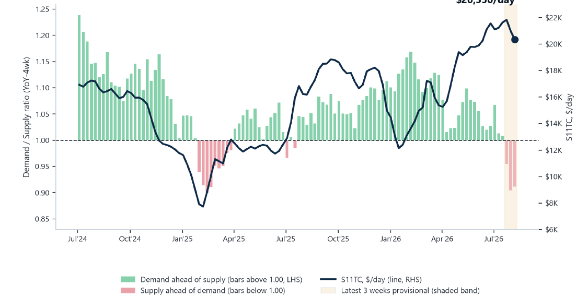
*Figure 14: Supramax demand/supply ratio (LHS) and S11TC spot rate (RHS) — weekly (Source: Baltic Exchange; Signal Group — Trade Flows, Vessel Daily Status).*

## HANDYSIZE | ANALYSIS

Freight.The BHSI eased to 874 (−2 day-on-day; −13 week-on-week), with the split running the other way: the Atlantic softened — HS4_38 (US Gulf) −$1,290, HS3_38 (Rio de Janeiro–Recalada) −$423 and HS2_38 (Skaw-Passero–Boston) −$214 WoW — while the Pacific held up (HS5, HS6 and HS7 modestly higher). The HS7TC average slipped to $15,729/day (−$240 WoW).

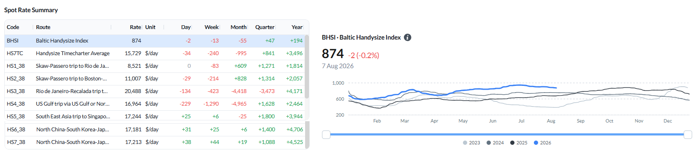
*Figure 15: Baltic Handysize Index (BHSI) — spot rate summary and BHSI performance (Source: The Signal Group).*

Ballasters vs the previous week.The global Handysize ballaster count jumped 18% WoW to 723, the largest build of any segment, led by the North Atlantic (+26% to 226) with broad increases elsewhere (Australasia +20%, South Atlantic +20%, FEAST/NOPAC +12%).

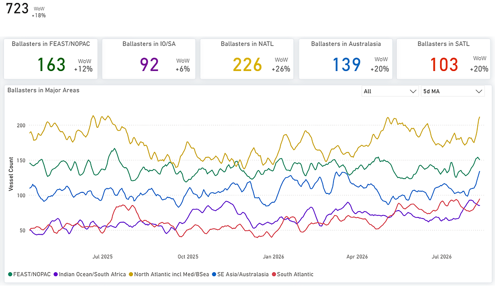
*Figure 16: Handysize — Global ballaster fleet and regional positioning (Source: The Signal Group).*

Supply/demand by route.HS1/HS2, HS5 and HS6 carry a cumulative supply surplus, while HS7 (Far East) holds supply below expected demand.

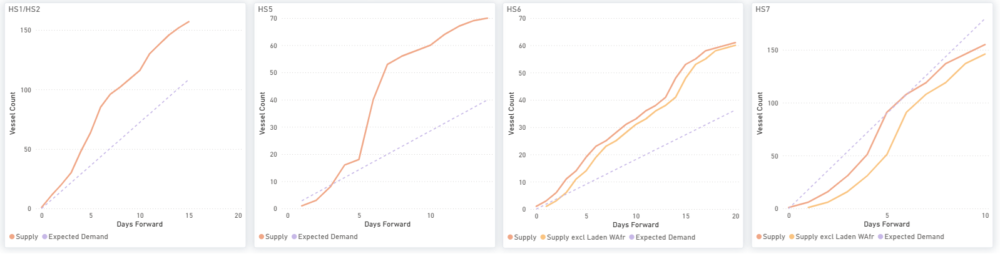
*Figure 17: Handysize — HS1/HS2, HS5, HS6 & HS7: cumulative Supply vs Expected Demand over days forward (Source: The Signal Group).*

Demand/supply ratioHS7TC eased 2.0% on the week to $15,894/day. Demand fell to 85.9 against its year-ago level while supply eased to 90.0, taking the demand-to-supply ratio to 0.95 from 1.04. A reading below 1.00 indicates that demand growth is running below supply growth; it does not indicate a physical cargo-to-vessel surplus.

‍

*Figure 18: Handysize demand/supply ratio (LHS) and HS7TC spot rate (RHS) — weekly (Source: Baltic Exchange; Signal Group — Trade Flows, Vessel Daily Status). Handysize demand is derived from Trade Flows voyages alone, unlike the Panamax and Supramax series, so absolute ratio levels should not be compared directly across those segments.*

## OVERALL MARKET TREND | CONCLUSIONS

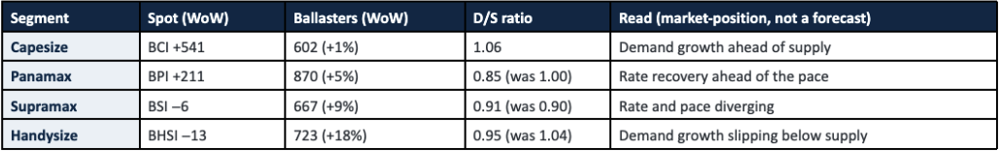
*Signal Figure*

Key takeaway:Freight and the demand/supply pace tell a nuanced story this week. Capesize led on both — the BCI rose 541 to 5,105, and its demand-to-supply ratio held at 1.06, with demand growth still ahead of supply. Panamax rates jumped (BPI +211), but the pace has not followed; the ratio was at 0.85 versus 1.00 in mid-July, so the rate recovery is running ahead of the underlying demand-to-supply balance. Supramax was flat, with the ratio (0.91) and the rate diverging, and Handysize eased as its ratio slipped to 0.95, demand growth falling below supply growth.

Watch next:The U.S. soybean programme to China remains an important flow to track. USDA data show new-crop forward sales strengthening while physical departures remain subdued. The next point to watch is whether those contracted volumes begin to appear in physical loadings as the U.S. export season develops.

Methodology — demand/supply ratio:The demand-to-supply ratio compares four-week-average year-on-year growth in demand with the same growth in available tonnage; 1.00 means the two growth rates are equal. It is a market-position indicator, not a physical cargo-to-vessel balance and not a freight forecast. The latest completed weeks are provisional and will be revised as loadings and vessel events settle. The four segments are independent: a firm rate in one segment is not demand-led by another segment’s softer pace, and one segment’s figures should not be read as explaining another’s. Freight and route assessments are as of 7 August; the demand/supply series is for the week ending 6 August 2026.

Disclaimer:This report is provided for information purposes only and does not constitute investment, trading or commercial advice. Figures are drawn from the sources cited and, where indicated, are provisional. Soybean export-sale figures are as reported by the USDA Foreign Agricultural Service; vessel departure and positioning data are from the Signal Ocean Platform and AXSMarine; index and route assessments are from the Baltic Exchange.
