# Weekly Dry Market Monitor: Week 35, 2026

**Date**: September 3, 2026 | **Category**: Dry bulk | **Section**: Monitors | **Source**: [https://www.thesignalgroup.com/weekly-market-monitor/weekly-dry-market-monitor-week-35-2026](https://www.thesignalgroup.com/weekly-market-monitor/weekly-dry-market-monitor-week-35-2026)

---

## SPOTLIGHT OF THE WEEK

## Black Sea Disruption Redirects Russian Wheat Towards the Baltic

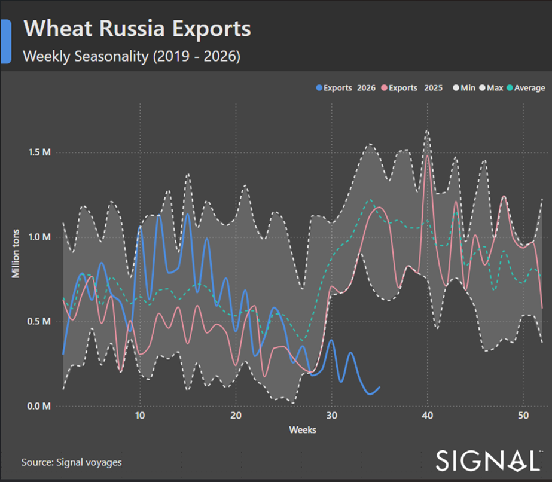
*Figure 1: Russian wheat exports - weekly seasonality, 2019–2026 (million tonnes). (Source: Signal Voyages).*

Russian wheat loadings from the four deep-sea Black Sea terminals fell by around 60% during the five weeks to 28 August compared with the same period in 2025. (Figure 2 shows the underlying cargo volumes and voyage counts.) The reduction persisted throughout the period rather than reflecting a single disrupted week. Weekly volumes remained below the comparable 2025 range, with activity even lower during the second half of the window than at the beginning. Loadings were concentrated at Novorossiysk, as the port remained the principal outlet despite its own volume roughly halving. Vessel activity at Taman fell sharply, and no qualifying wheat loading was recorded at Kavkaz. Tuapse, the smallest of Russia’s deep-water grain terminals, remained in operation and was the only terminal to record an increase.

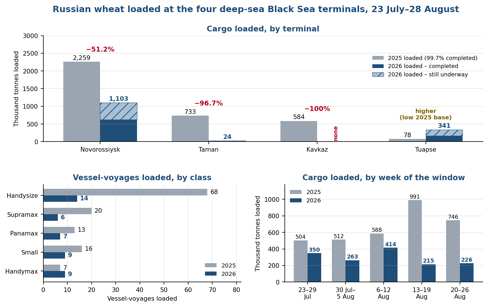
*Signal Figure*

Figure 2: Russian wheat loaded at Novorossiysk, Taman, Kavkaz and Tuapse over the matched load-date window 23 July–28 August, 2025 vs 2026. Upper panel measures cargo tonnage loaded, with the 2026 bar split between voyages that have completed and voyages still underway; lower-left panel counts vessel-voyages loaded, by class, with cargo carried to more than one discharge port counted as a single voyage; lower-right panel measures cargo tonnage loaded in each week of the window. Voyages are counted by load date, so both years carry equal coverage. The weekly panel covers the five full weeks to 26 August; the final two days of the window are included in all other figures (Source: Signal, Voyage Details).

The decline extended across vessel-size categories, with the geared segments bearing the brunt of the reduction. Handysize remained the most active class but recorded a steep decline, while Supramax, Panamax and smaller-vessel employment also weakened. Handymax was the exception, registering slightly more voyages than a year earlier from a small base. The disruption has increased interest in alternative Baltic routes. Rail booking requests for grain bound for Russia’s Baltic terminals reached 5 million tonnes by 18 August, approaching the 6 million tonnes requested for Novorossiysk and Tuapse. Exporters are using Russian Baltic facilities, including Vysotsk, Ust-Luga, St Petersburg and Kaliningrad, while also considering transit through neighbouring Baltic states, particularly Latvia. The Baltic cannot fully replace the southern corridor. Russia’s Baltic terminals have an estimated annual grain-handling capacity of around 7 million tonnes, well below the volumes normally shipped through the Black Sea and Sea of Azov. Longer rail distances also add logistical complexity and raise export costs.

Data coverage.The analysis covers wheat only; records containing other grain commodities have been excluded. Load ports are the four deep-sea terminals of Novorossiysk, Taman, Kavkaz and Tuapse. Sea of Azov, rivers, and shallower-draft ports are outside the scope. Voyages are counted once and identified by vessel, voyage number, load date, and load port. Cargo is assigned by load date. The 2026 bars separate cargo on completed voyages from cargo still underway; the 2025 comparison is 99.7% completed. These are vessel movements rather than customs statistics and do not include grain moving by rail or through land borders. Period covered. The analysis covers 23 July to 28 August 2026—the five weeks from the escalation in attacks on shipping and port infrastructure to the latest common load date in the dataset. 2025 comparison. The comparison uses the identical calendar dates in 2025, the same terminals, and the same wheat-only cargo filter. The 2025 period represents only the equivalent five-week window and not the full calendar year.

## FREIGHT MARKET OVERVIEW | BDI & SEGMENT METRICS

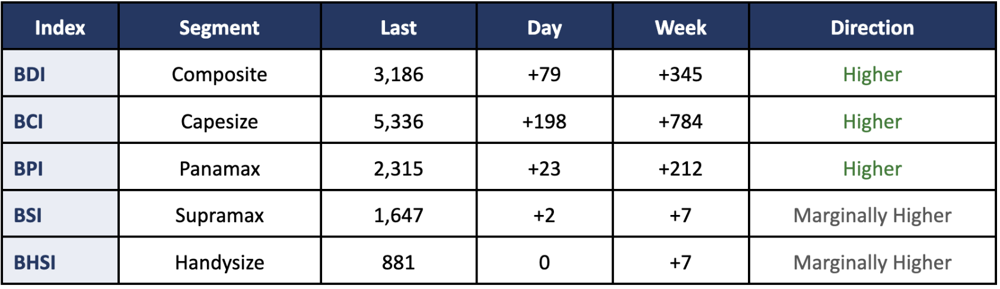
*Figure 3: Baltic Dry Index - spot rate summary across segments and BDI performance as of 28 Aug 2026 (Source: Signal).*

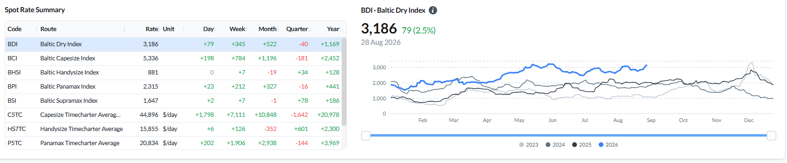
*Signal Figure*

The BDI rose to 3,186 (+79 day-on-day, +345 WoW) on a stronger week for the larger sizes. Capesize led the increase, with the BCI rising to 5,336 (+784 WoW) and average C5TC earnings climbing to $44,896/day (+$7,111 WoW). Panamax also strengthened, with the BPI rising to 2,315 (+212 WoW) and the P5TC average up to $20,834/day (+$1,906 WoW). The geared sizes were steady: Supramax was flat (BSI 1,647, +7 WoW) and Handysize unchanged on the day (BHSI 881, +7 WoW).

## CAPESIZE | ANALYSIS

Freight.The BCI rose to 5,336 (+198 day-on-day; +784 week-on-week), with average C5TC earnings up to $44,896/day (+$7,111 WoW) and the 180,000 dwt adjusted average at $48,399/day. The move extended to the Atlantic: C8_182 (Gibraltar/Hamburg transatlantic round) rose $10,000/day WoW to $50,188/day, while C2 (Tubarao–Rotterdam) firmed to $16.89/mt (+$1.65 WoW) and C7 (Bolivar–Rotterdam) to $21.30/mt (+$2.44 WoW). C3 (Tubarao–Qingdao) rose to $38.36/mt (+$2.58 WoW) and C5 (West Australia–Qingdao) to $16.18/mt (+$1.59 WoW, about +11%).

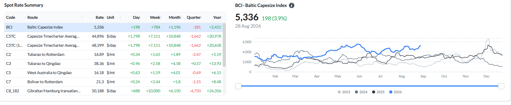
*Figure 4: Baltic Capesize Index (BCI) - spot rate summary and BCI performance (Source: Signal).*

Ballasters vs the previous week.The global Capesize ballaster count was unchanged at 612 (+0% WoW), but the mix shifted: open tonnage in Australasia fell 8% WoW to 209 and the South Atlantic fell 27% to 51, while FEAST/NOPAC rose 20% to 151, the North Atlantic rose 62% to 34 and the Indian Ocean/South Africa held at 167 (+1%).

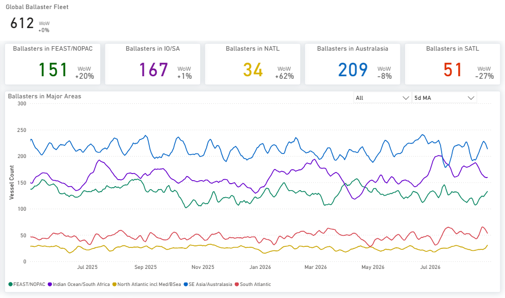
*Figure 5: Capesize - Global ballaster fleet and regional positioning (Source: Signal).*

Supply/demand by route.C3 (Tubarao–Qingdao) shows cumulative supply remaining below expected demand throughout the forward window, with the shortfall widening after day 30. On C5 (West Australia–Qingdao), supply initially exceeds expected demand before moving below it from around day 7. Total supply rises above demand again after day 13, but supply excluding laden vessels levels off at approximately 150 vessels and remains in deficit.

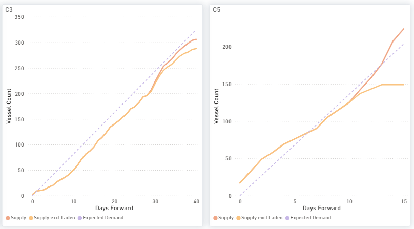
*Figure 6: Capesize - C3 & C5 forward balance: cumulative Supply vs Expected Demand over days forward (Source: Signal).*

Demand-to-supply ratio.C5TC rose 5.6% on the week to $43,024/day in the week ending 27 August, placing C5TC earnings in the 88th percentile of weekly observations over the past year. The demand index stood at 101.72 versus 98.25 for supply, both relative to year-ago levels. This lowered the demand-to-supply ratio to 1.04 from 1.12 in the previous week. The reading remains above 1.00, indicating that demand growth is running slightly ahead of supply growth, but Capesize is not reported as a settled change of side: whether a reading sits above or below the balance point can turn on revision alone, and the range these weekly values move on revision rests on a single vintage pair of six provisional observations.

*Figure 7: Capesize demand/supply ratio (LHS) and C5TC spot rate (RHS) - weekly (Source: Baltic Exchange; Signal - Trade Flows, Vessel Daily Status). Bars = demand/supply ratio (left axis); line = C5TC $/day (right axis). Above 1.00 = demand growing faster than available tonnage, below = slower. Four-week average year-on-year growth basis. Available tonnage is adjusted for vessels already committed to VLOC cargo. Latest 6 weeks provisional (shaded band).*

## PANAMAX | ANALYSIS

Freight.The BPI rose to 2,315 (+23 day-on-day; +212 week-on-week) and the P5TC average gained $1,906 WoW to $20,834/day. The rally was broad: P3A_82 +$2,372 to $19,300/day, P1A_82 +$2,023 to $20,541/day, P6_82 +$1,897 to $22,033/day, P5_82 +$1,742 to $16,981/day and P2A_82 +$1,594 to $30,339/day. P4_82 lagged at $12,300/day (+$789 WoW).

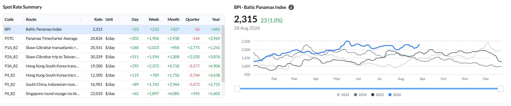
*Figure 8: Baltic Panamax Index (BPI) - spot rate summary and BPI performance (Source: Signal).*

Ballasters vs the previous week.The global Panamax ballaster count rose 4% WoW to 811, with the build in the East: FEAST/NOPAC +13% WoW to 218 and the Indian Ocean/South Africa +8% to 225. The South Atlantic eased 23% to 75, while Australasia rose 6% to 182 and the North Atlantic held at 111 (−1%).

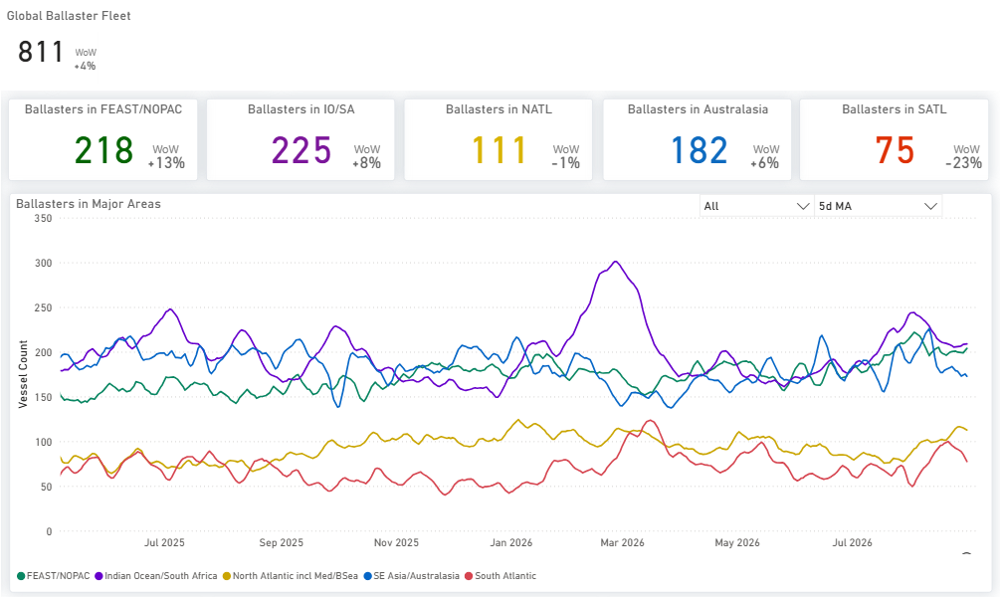
*Figure 9: Panamax - Global ballaster fleet and regional positioning (Source: Signal).*

Supply/demand by route.P5 (Indonesia round) keeps cumulative supply well below expected demand across the window, with supply flattening below 60 vessels against expected demand above 100. P1/P2/P7 sits in supply surplus across the full 20 days, while P3 (transatlantic) carries a modest surplus that closes late in the window and P6 tracks close to balance.

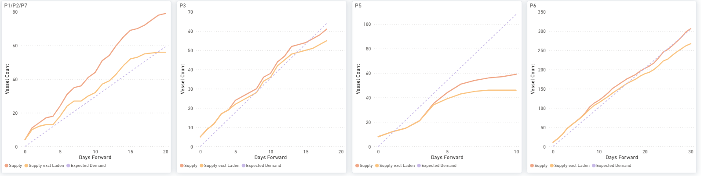
*Figure 10: Panamax - P1/P2/P7, P3, P5 & P6: cumulative Supply vs Expected Demand over days forward (Source: Signal).*

Demand-to-supply ratio.P5TC eased 0.6% on the week to $19,472/day, placing it in the 76th percentile of weekly observations over the past year. The demand index stood at 97.50 versus 104.19 for supply, both relative to year-ago levels. This lifted the demand-to-supply ratio to 0.94 from 0.89 in the previous week, bringing the market closer to balance, although demand continues to lag supply. The latest tonne-mile estimate is 73.3% complete, including adjustments for voyages still in progress.

*Figure 11: Panamax demand/supply ratio (LHS) and P5TC spot rate (RHS) - weekly (Source: Baltic Exchange; Signal - Trade Flows, Vessel Daily Status). Bars = demand/supply ratio (left axis); line = P5TC $/day (right axis). Above 1.00 = demand growing faster than available tonnage, below = slower. Four-week average year-on-year growth basis. Shaded band = the latest provisional weeks.*

## SUPRAMAX | ANALYSIS

Freight.The BSI was essentially flat at 1,647 (+2 day-on-day; +7 week-on-week), with a split across the basins. Asia firmed — S3TC_63 +$385 to $19,205/day and S2 +$444 to $19,050/day — while the Mediterranean and West Africa routes eased, S1B −$929 to $23,371/day and S3 −$200 to $19,400/day. S1C slipped $66 to $30,356/day. The S10TC average rose to $18,785/day (+$91 WoW), with S11TC at $20,819/day.

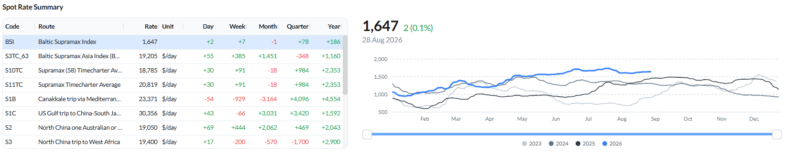
*Figure 12: Baltic Supramax Index (BSI) - spot rate summary and BSI performance (Source: Signal).*

Ballasters vs the previous week.The global Supramax ballaster count rose 24% WoW to 723, the largest build of any segment, with increases across all regions: the Indian Ocean/South Africa +45% to 144, the South Atlantic +44% to 78, Australasia +28% to 182, the North Atlantic +16% to 118 and FEAST/NOPAC +7% to 201.

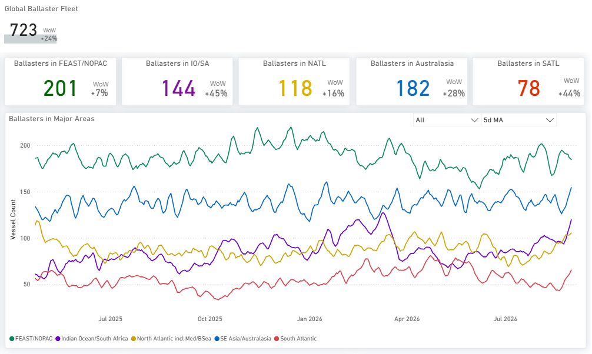
*Figure 13: Supramax - Global ballaster fleet and regional positioning (Source: Signal).*

‍Supply/demand by route.S4A/S1C and S4B carry a clear cumulative supply surplus across the window, widest on S4B at about 105 vessels against expected demand near 55 at day 20. S8/S10 also sits in surplus, while S5 tracks close to balance for the first ten days before supply moves modestly ahead.

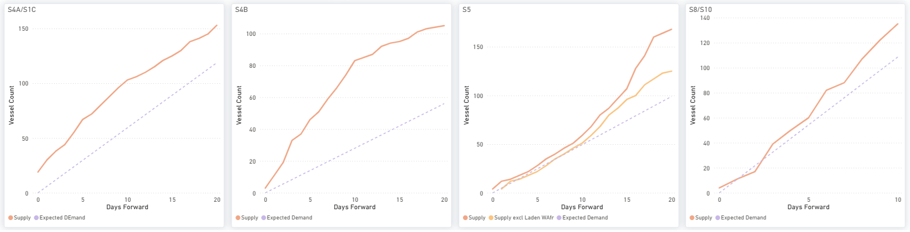
*Figure 14: Supramax - S4A/S1C, S4B, S5 & S8/S10: cumulative Supply vs Expected Demand over days forward (Source: Signal).*

Demand-to-supply ratio.S11TC increased 0.8% on the week to $20,752/day, placing it in the 84th percentile of weekly observations over the past year. The demand index stood at 86.69 versus 98.68 for supply, both relative to year-ago levels. This lowered the demand-to-supply ratio to 0.88 from 0.91 in the previous week, showing that demand continues to lag supply despite firmer spot earnings. The latest tonne-mile estimate is 74.4% complete, including adjustments for voyages still maturing, and may be revised as the data settle.

*Figure 15: Supramax demand/supply ratio (LHS) and S11TC spot rate (RHS) - weekly (Source: Baltic Exchange; Signal - Trade Flows, Vessel Daily Status). Bars = demand/supply ratio (left axis); line = S11TC $/day (right axis). Above 1.00 = demand growing faster than available tonnage, below = slower. Four-week average year-on-year growth basis. Shaded band = the latest provisional weeks.*

## HANDYSIZE | ANALYSIS

Freight.The BHSI was unchanged on the day and +7 on the week at 881, with the HS7TC average up to $15,855/day (+$126 WoW). The gains were in South America and Asia — HS3_38 (Rio de Janeiro–Recalada) +$1,238 to $22,494/day, HS2_38 +$264 to $10,721/day and HS5_38 +$200 to $18,081/day — while the US Gulf and North European legs eased: HS4_38 −$672 to $14,964/day, HS1_38 −$171 to $7,993/day and HS6_38 −$81 to $17,225/day.

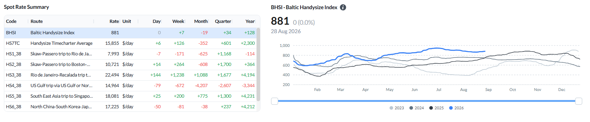
*Figure 16: Baltic Handysize Index (BHSI) - spot rate summary and BHSI performance (Source: Signal).*

Ballasters vs the previous week.The global Handysize ballaster count rose 22% WoW to 760, led by the North Atlantic including Med/Black Sea (+32% to 245). Australasia rose 30% to 156, the Indian Ocean/South Africa 24% to 105, the South Atlantic 11% to 89 and FEAST/NOPAC 7% to 165.

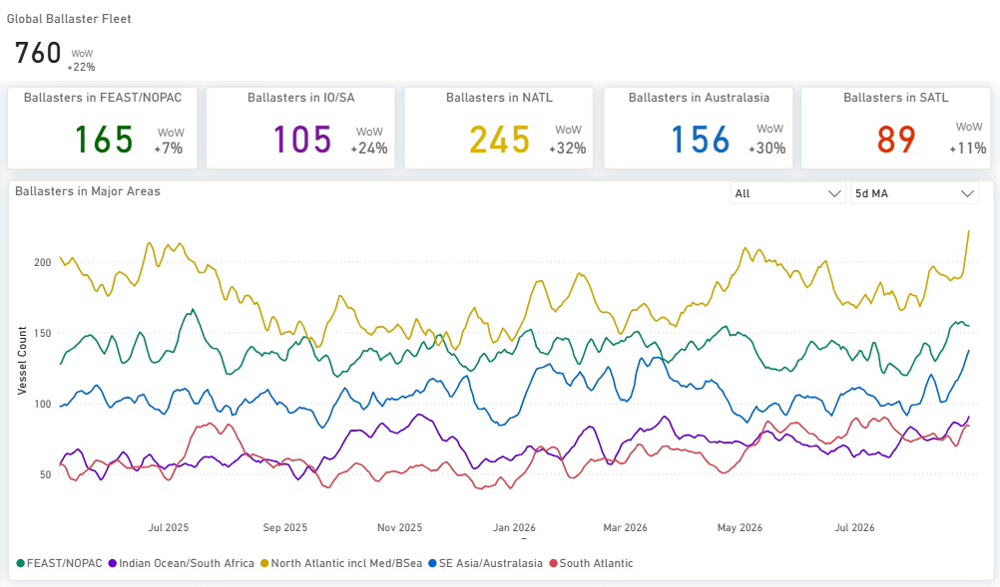
*Figure 17: Handysize - Global ballaster fleet and regional positioning (Source: Signal).*

Supply/demand by route.HS1/HS2, HS5 and HS6 carry a cumulative supply surplus, widest on HS1/HS2 at about 170 vessels by day 15 against expected demand near 90. HS7 (Far East) sits in surplus through the first week and closes to balance by day 10.

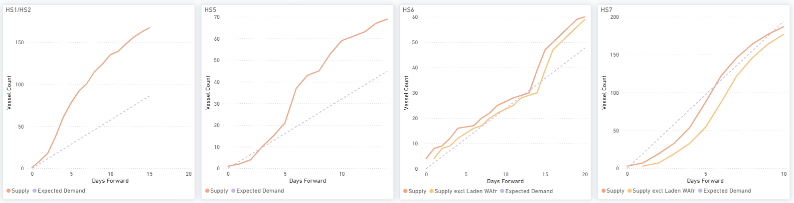
*Figure 18: Handysize - HS1/HS2, HS5, HS6 & HS7: cumulative Supply vs Expected Demand over days forward (Source: Signal).*

Demand-to-supply ratio.HS7TC increased 1.2% on the week to $15,774/day, placing it in the 80th percentile of weekly observations over the past year. The demand index stood at 87.33 versus 90.22 for supply, both relative to year-ago levels. This brought the demand-to-supply ratio down to 0.97 from 1.09 in the previous week. The year-on-year growth rates were close, with demand growing slightly more slowly than available tonnage; this is a comparison of growth rates and not a physical cargo-to-vessel balance. The reading sits closer to 1.00 than the revision range measured for this series, so it is not reported as a settled change of side. The latest five weeks remain provisional.

![Figure 19: Handysize demand/supply ratio (LHS) and HS7TC spot rate (RHS) - weekly (Source: Baltic Exchange; Signal - Trade Flows, Vessel Daily Status). Bars = demand/supply ratio (left axis); line = HS7TC $/day (right axis). Above 1.00 = demand growing faster than available tonnage; below = slower. Four-week average year-on-year growth basis. Shaded band = the latest provisional weeks. Handysize demand is derived from Trade Flows voyages alone, unlike the Panamax and Supramax series, so absolute ratio levels should not be compared directly across those segments.](../images/6a993e0ccb228466bb3b4900_54ae7deb.png)
*Figure 19: Handysize demand/supply ratio (LHS) and HS7TC spot rate (RHS) - weekly (Source: Baltic Exchange; Signal - Trade Flows, Vessel Daily Status). Bars = demand/supply ratio (left axis); line = HS7TC $/day (right axis). Above 1.00 = demand growing faster than available tonnage; below = slower. Four-week average year-on-year growth basis. Shaded band = the latest provisional weeks. Handysize demand is derived from Trade Flows voyages alone, unlike the Panamax and Supramax series, so absolute ratio levels should not be compared directly across those segments.*

## OVERALL MARKET TREND | CONCLUSIONS

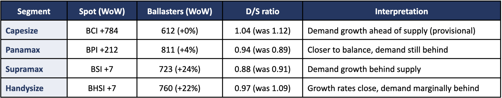
*Signal Figure*

Key takeaway:Signal Voyage Details data show Russian wheat loadings at the four principal deep-sea Black Sea terminals falling by around 60% in the five weeks to 28 August, on a like-for-like measure of cargo loaded, with the number of voyages down to under a third of the year-earlier count. The reduction, held across every week of the window, concentrated the remaining programme on Novorossiysk and fell most heavily on Handysize and Supramax employment.

Weekly comparison:The larger sizes carried the week. The BCI rose 784 points to 5,336 and the BPI 212 points to 2,315, while the BSI and BHSI each rose 7 points, to 1,647 and 881. Ballaster counts increased materially in the geared segments, Supramax up 24% to 723 and Handysize up 22% to 760, while Capesize was unchanged at 612 and Panamax rose 4% to 811. On the demand-to-supply ratio, Capesize eased to 1.04 from 1.12 and Supramax to 0.88 from 0.91, while Panamax rose to 0.94 from 0.89 and Handysize fell to 0.97 from 1.09.

Methodology - demand/supply ratio:The demand-to-supply ratio compares four-week-average year-on-year growth in demand with the same growth in available tonnage; 1.00 means the two growth rates are equal. It is a market-position indicator on a year-on-year pace basis, not a physical cargo-to-vessel balance and not a freight forecast, so 1.00 does not mean supply equals demand. Governed testing covers Panamax and Supramax only. On those two segments it has found no significant relationship between the ratio and the spot rate at any lead or lag out to six weeks, so neither confirms nor predicts the other. Whether a reading is above or below the balance point can turn on revision alone, so this week Capesize and Handysize are reported with that caveat rather than as a settled change of side. The reasons are not the same: the Capesize reading sits further from 1.00 than the range these weekly values move on revision, but that range rests on a single vintage pair and six provisional observations; the Handysize reading sits closer to 1.00 than the range measured for its own series. The latest completed weeks are provisional and will be revised as loadings and vessel events settle; settled weeks are superseded as the source revises, and values may restate. The four segments are independent: a firm rate in one segment is not demand-led by another segment’s softer pace, and a reader should not treat one segment’s figures as explaining another’s. Freight and route assessments are as of 28 August; the demand-to-supply series is for the week ending 27 August 2026.

Sources:Signal, Voyage Details (spotlight cargo and voyage data); Signal — Trade Flows and Vessel Daily Status (ballaster, route supply/demand and demand-to-supply series); Baltic Exchange (index and route assessments).

Disclaimer:This report is provided for information purposes only and does not constitute investment, trading or commercial advice. Figures are drawn from the sources cited and, where indicated, are provisional. Wheat voyage and cargo data, vessel positioning, and Trade Flows series are from Signal; index and route assessments are from the Baltic Exchange.
