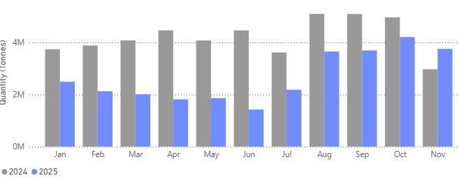
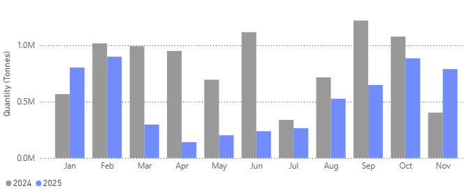

# Weekly Dry Market Monitor: Week 50, 2025

**Date**: December 8, 2025 | **Category**: Dry bulk | **Section**: Monitors | **Source**: [https://www.thesignalgroup.com/weekly-market-monitor/weekly-dry-market-monitor-week-50-2025](https://www.thesignalgroup.com/weekly-market-monitor/weekly-dry-market-monitor-week-50-2025)

---

## Chart of the Week|Russian WheatFlowsto All Destinations

As international diplomatic efforts around the Russia–Ukraine conflict continue, we are closely monitoring the year-over-year changes in Russian grain shipment volumes.

## ‍

*Signal Figure*

## ‍

*Signal Figure*

## EGYPT|Top Destination for Russian Wheat

*Signal Figure*

## ‍

*Signal Figure*

Egypt’s near-doubling of Russian wheat imports in November is consistent with the country’s renewed buying spree, as state buyer Mostakbal Misr secured roughly 500,000 tonnes ofBlack Sea wheat, including a large share from Russia, for December–January delivery, while Egypt intensified purchases to stabilise domestic supply. Recent reports also note that Ukraine and Bulgaria have increased shipments to Egypt, but Russia remains the dominant supplier, reinforced by high-level negotiations and deepening economic ties highlighted during Russia’s November delegation visit to Cairo. Together, these developments confirm the sharp year-on-year rebound in Egypt’s intake of Russian wheat and its continued role as Moscow’s top overseas market.

Subscribe to weekly reports to read the full report.For the latest updates and insights, make sure to visit theSignal Ocean Newsroompage. Clickhere to request a demo. Click here to see theprevious dry bulk weeklyreport.

-Republishing is allowed with an active link to the source
