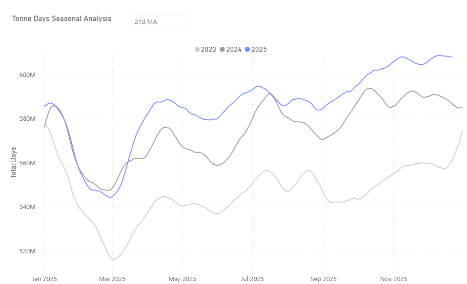
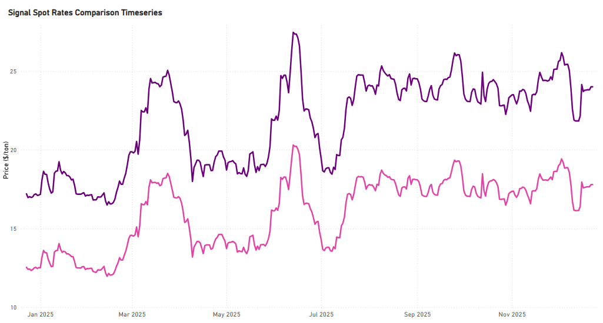
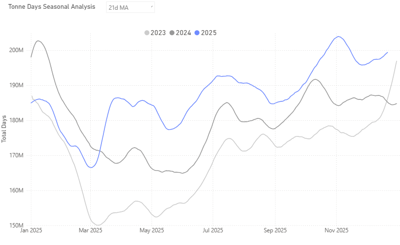
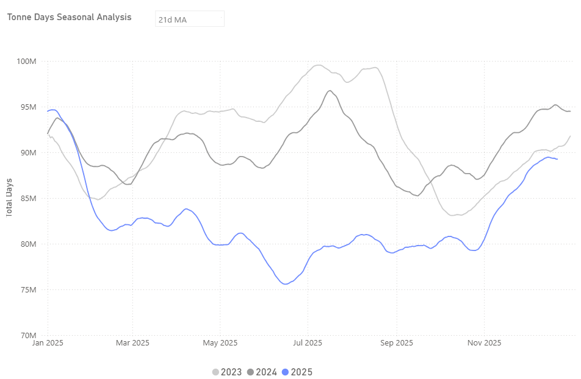
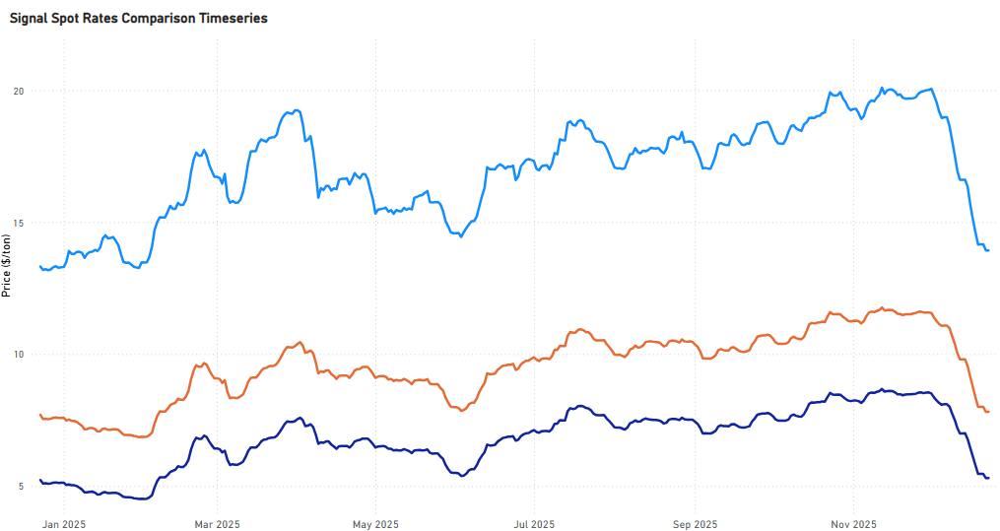
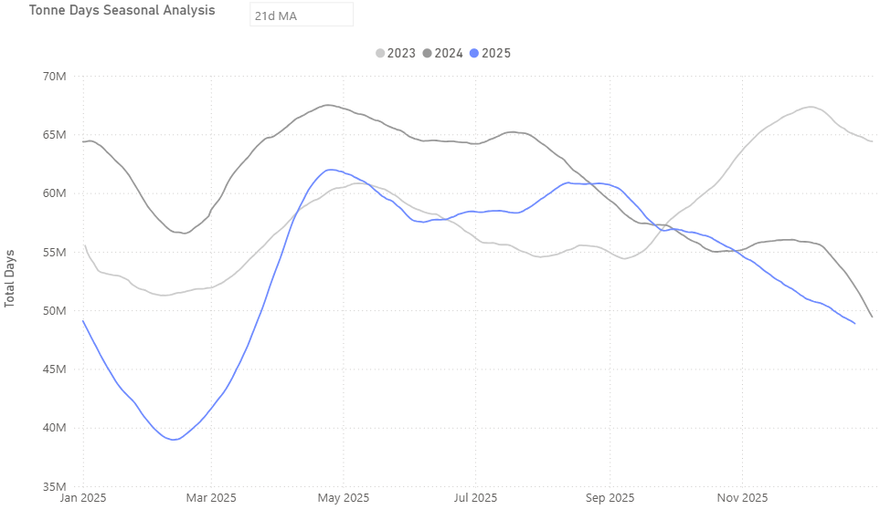
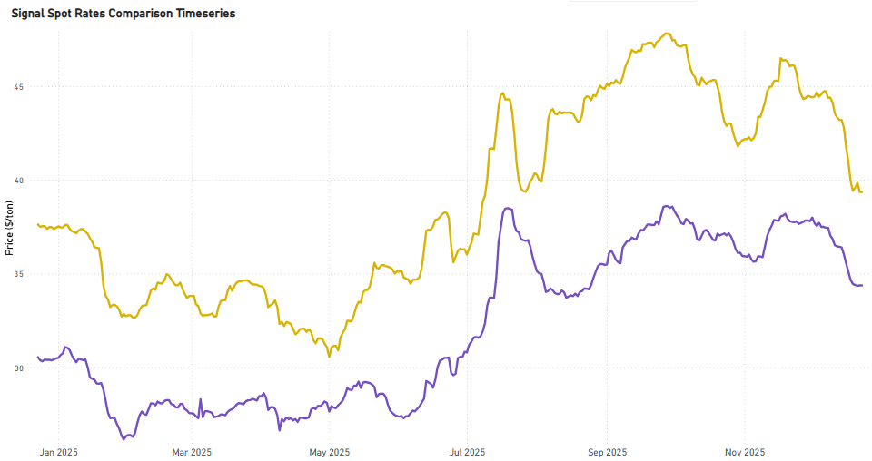

# Weekly Dry Market Monitor: Week 52, 2025

**Date**: December 23, 2025 | **Category**: Dry bulk | **Section**: Monitors | **Source**: [https://www.thesignalgroup.com/weekly-market-monitor/weekly-dry-market-monitor-week-52-2025](https://www.thesignalgroup.com/weekly-market-monitor/weekly-dry-market-monitor-week-52-2025)

---

## Chart of the Week|DryTonneDays

*Signal Figure*

- Dry bulk tonne-days reached record highs in 2025, exceeding previous historical peaks, up around 4% year on year and close to 9% compared with 2023, highlighting the role of distance-driven demand in supporting vessel utilisation.

- The increase in tonne-days has been driven primarily by iron ore trade, reflecting the impact of long-haul Atlantic basin exports on Capesize demand.
- Freightmarket trends ahead of the Christmas period indicate strengthening momentum on Brazil–China and South Africa–China Capesize routes, pointing to a firmer tone into year-end. Although Brazil–China Capesize rates peaked on 3 December at nearly $26/ton, the subsequent pullback has been contained, with current levels holding at about $24/ton rather than signaling a broader deterioration, supported by ongoing long-haul cargo demand.

## FREIGHT | Capesize | Atlantic Firmer

*Signal Figure*

*Signal Figure*

## Iron Ore: Core Contributor to Tonne-Day Growth

Iron ore has remained the dominant driver of the recent recovery in dry bulk tonne-days, with Chinese import demand continuing to underpin Capesize utilisation despite weak macroeconomic signals and subdued downstream steel sentiment. Growth in iron ore–related tonne-days is estimated at approximately 199 million, accounting for a significant share of the overall expansion and underscoring the continued importance of long-haul iron ore trades relative to other dry bulk commodities.

## ‍

*Signal Figure*

At the same time, bauxite has emerged as an increasingly important contributor to tonne-day growth, particularly within the Capesize segment. Longer-haul sourcing patterns and rising Chinese alumina demand have elevated bauxite’s role in fleet utilisation, a dynamic examined in greater detail in our latestCommodity Radar, with a dedicated focus on bauxite’s growing contribution to current demand growth. Looking ahead, iron ore tonne-day fundamentals remain supported into the remainder of the quarter, although early Q1 is expected to see a temporary moderation around the Chinese New Year period. However, such slowdowns have historically been short-lived, with a post-holiday rebound as supply chains normalise and deferred cargoes re-enter the system.

By contrast, tonne-day growth in coal and agricultural trades has been revised lower toward year-end compared with the previous two years, underscoring the growing reliance on iron ore and bauxite for demand support.

## Coal: Seasonal Rebound, Revised Annual Growth

By year-end, downward revisions were observed in full-year tonne-day growth for coal to the Far East, reflecting weaker performance earlier in the year.

*Signal Figure*

However, a clear rebound emerged in the fourth quarter, with coal tonne-days reaching around 90 million following a pronounced decline at the end of the summer season. This recovery aligns with the typical winter seasonal upturn, although the magnitude remains lower compared with previous years, suggesting a more moderate seasonal effect on freight demand rather than a significant shift.

## FREIGHT | Panamax | Pacific Weaker

*Signal Figure*

Freight markets are set to close the final quarter of the year with a pronounced downward momentum across key Panamax routes. On a quarter-on-quarter basis, Indonesia–China rates have fallen by 37.5%, Indonesia–India by 32.1%, East Australia–China by 29.3%, and US Gulf–China by 15.8%. These steep QoQ declines confirm that the monthly correction observed earlier in the year has evolved into a deeper momentum downturn. As a result, the market is likely to enter the start of the new year from a weaker base, increasing the risk that Q1 freight levels remain under pressure in the absence of a meaningful supply-side tightening.

*Signal Figure*

## ‍

## Agricultural Trades: Continued Downward Trend

Agricultural tonne-days continued to trend lower, contributing to the overall downward revisions observed toward year-end.

*Signal Figure*

From a freight standpoint, long-haul demand is moderating as China’s agri self-sufficiency strategy caps incremental import growth and vessel-day generation, with prevailing industry estimates suggestingapproximately  1 million tonnesyear-on-year reduction in soybean imports for the 2025–26 crop year, despite stable meal feed demand.

Supramax Atlantic routes are closing the final quarter under sustained downward pressure. On a quarter-on-quarter basis, US Gulf–Far East rates are down14.6%, while US Gulf–Skaw/Pass has declined by14.9%. ECSA–Far East has also weakened, posting an8.9%QoQ contraction, though the magnitude of the decline remains smaller relative to US Gulf–origin routes. As a result, the Supramax market enters the start of the new year from a weaker Atlantic-driven base, limiting upside at the beginning of Q1.

## FREIGHT | Supramax | Atlantic Weaker

*Signal Figure*

*Signal Figure*

## Takeaways and Upcoming Trends

Overall, the year concludes with tonne-day demand driven primarily by iron ore flows into the Far East, while coal and agricultural trades make a more moderate contribution.

In the coal segment, the most notable recent development has been a shift in South African export destinations, with a clear increase in shipments to Israel observed toward year-end. At the same time, China’s coal import dynamics continue to be shaped by supplier economics, logistical considerations, and policy settings, alongside domestic production levels and power-sector requirements.

In agricultural markets, China’s ongoing emphasis on domestic self-sufficiency, together with geopolitical tensions between Russia and Ukraine, remains an important contextual factor for freight markets. Black Sea exports have continued, but under sustained operational and commercial uncertainty, including elevated risk perceptions and higher insurance and compliance costs.

Looking ahead, freight market performance in the coming year is expected to remain strongly influenced by geopolitical risks, Chinese policy direction, and broader macroeconomic developments. These factors will shape both cargo demand and vessel supply dynamics, with current signals pointing toward continued momentum in the Capesize freight market.

For the latest updates and insights, make sure to visit theSignal Ocean Newsroompage &subscribe to weekly reports. Clickhere to request a demo. Click here to see theprevious dry bulk weeklyreport.

For subscription to our FREE weekly market trends email, please contact us: research@thesignalgroup.com

-Republishing is allowed with an active link to the source
