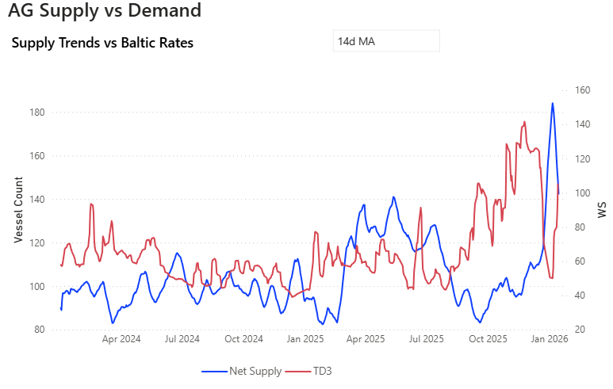
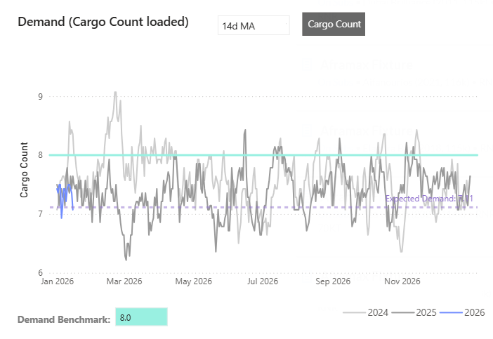
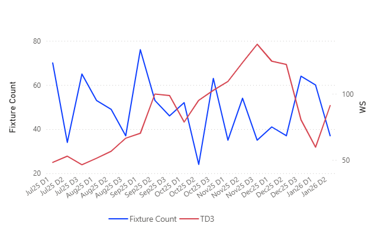
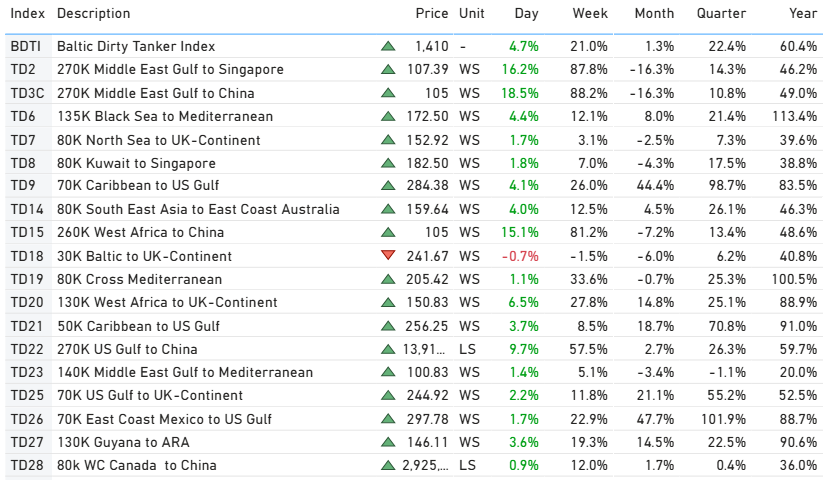
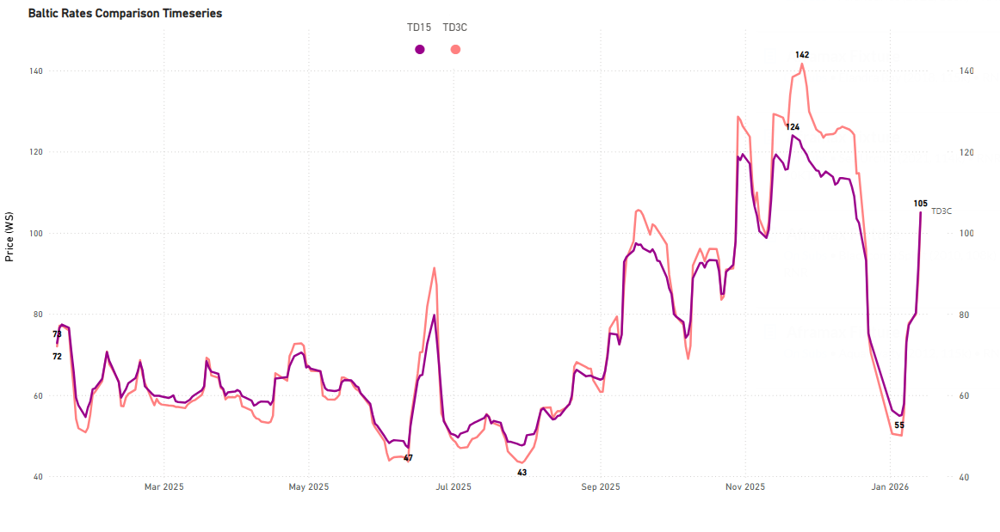
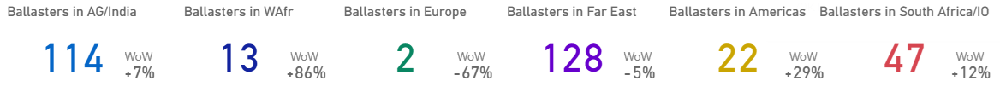
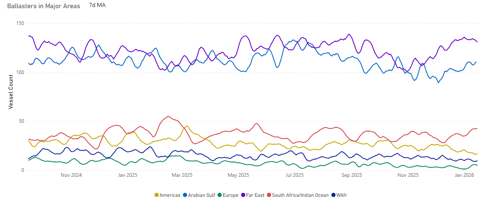
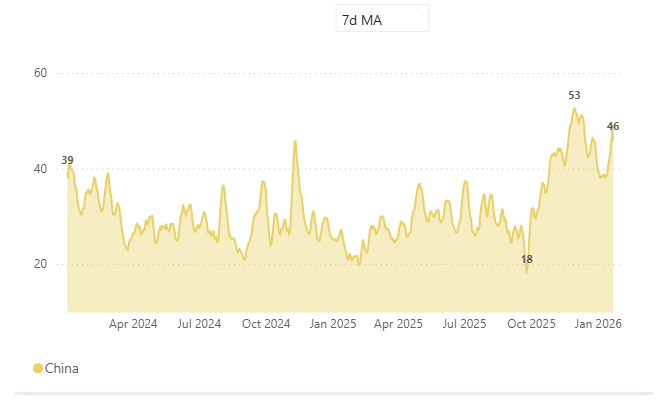

# Weekly Tanker Market Monitor: Week 03, 2026

**Date**: January 15, 2026 | **Category**: Tankers | **Section**: Monitors | **Source**: [https://www.thesignalgroup.com/weekly-market-monitor/weekly-tanker-market-monitor-week-03-2026](https://www.thesignalgroup.com/weekly-market-monitor/weekly-tanker-market-monitor-week-03-2026)

---

## Chart of the Week| AG Supply Vs Demand

- Despite some encouraging short-term signals, the underlying demand is not yet strong enough to fully warrant the current positive sentiment in the VLCC market.

*Signal Figure*

- AG freight conditions have improved from the early-January extremes, alongside a roughly 20% reduction in net vessel supply from recent peak levels.
- Net supply has eased from ~184 vessels (06 Jan 2026) to ~148 vessels (14 Jan 2026), coinciding with a ~110% rebound in TD3 rates over the same period, from ~50 WS to ~105 WS. Despite this improvement, rates remain ~26% below late-November highs (~142 WS on 25 Nov 2025), when AG net supply was materially tighter at ~103 vessels,  around 30% lower than current levels.

## Forward Balance: Gross Supply vs Demand

A demand benchmark of 8 cargoes per day is applied, reflecting recent observed AG loading averages and providing a neutral near-term reference.

*Signal Figure*

‍

- At 10 days forward, gross supply reaches ~110 vessels, versus expected demand of ~71 cargos, implying a ~39-vessel surplus (~55% oversupply relative to demand).
- At 20 days forward, gross supply increases to ~215 vessels, while expected demand totals ~142 cargos, widening the imbalance to a ~73-vessel surplus (~50% oversupply).
- Even after excluding laden vessels, effective supply remains elevated at ~104 vessels (10 days) and ~193 vessels (20 days), exceeding expected demand at both horizons.
- The forward curves show supply accumulating faster than demand, with the surplus widening as the time horizon extends.

## Fixture Activity vs Spot Rate Evolution

‍

*Signal Figure*

- Fixture activity peaked in late December, with 64 fixtures recorded on 25 Dec, while TD3 averaged ~80 WS. By late January, TD3 strengthened to ~91 WS (26 Jan), while fixture counts declined to 37, indicating reduced fixing intensity. The gap between higher rates and lower fixture volumes suggests that recent rate strength has not yet been fully reflected in fixing activity.

‍

## Freight Market

‍

*Signal Figure*

‍

## VLCCMEG- ChinaFirmer

‍

*Signal Figure*

‍

- Spot rates across MEG–China (TD3C), MEG–Singapore (TD2), and WAF–China (TD15) have recorded strong short-term gains, with WoW increases of +18.5%, +16.2%, and +15.1%, respectively, alongside robust YoY growth. However, the strength fades when viewed on a broader time horizon. All three routes remain materially weaker on a MoM basis, with TD2 and TD3C down ~16% MoM and TD15 down ~7% MoM, while QoQ performance remains well below the magnitude of weekly gains.

## Ballasters| AG/IndiaSupply

AG/India Supply Builds, Testing Market Recovery

‍

*Signal Figure*

‍

- Despite recent signs of improvement, elevated ballast availability in AG (114 vessels, +7% WoW) alongside a sharp increase in West Africa (13 vessels, +86% WoW) is likely to reassert supply pressure

‍

*Signal Figure*

‍

## Congestion| Discharge:China

‍

*Signal Figure*

- The near-term outlook appears moderately bullish, driven in part by a rising trend in VLCC congestion into China, even as demand indicators point to a subdued outlook for January.
- VLCC congestion has increased since early December, rising from ~18 vessels to a recent range of ~45–50 vessels, tightening effective supply by absorbing prompt tonnage.
- With demand growth limited, elevated congestion levels through late December and into January have helped to a firmer market momentum of rates, partially offsetting the impact of softer loading activity.

## Takeaway

- VLCC rates have improved, with recent gains primarily reflecting supply-side factors rather than stronger demand.
- Near-term indicators remain supportive, though underlying cargo volumes have yet to show a sustained pickup.
- In the absence of firmer demand, upside appears limited, and rate movements are likely to remain volatile.

‍

For the latest updates and insights, make sure to visit theSignal Ocean Newsroompage &subscribe to weekly reports. Clickhere to request a demo. Click here to see theprevious tanker weeklyreport.

For subscription to our FREE weekly market trends email, please contact us: research@thesignalgroup.com

-Republishing is allowed with an active link to the source
