# Weekly Tanker Market Monitor: Week 04, 2026

**Date**: January 23, 2026 | **Category**: Tankers | **Section**: Monitors | **Source**: [https://www.thesignalgroup.com/weekly-market-monitor/weekly-tanker-market-monitor-week-04-2026](https://www.thesignalgroup.com/weekly-market-monitor/weekly-tanker-market-monitor-week-04-2026)

---

## ‍Chart of the Week| Dirty OilFlowsRussia - India

The downward trend in the 7-day moving average points to easing demand momentum

‍

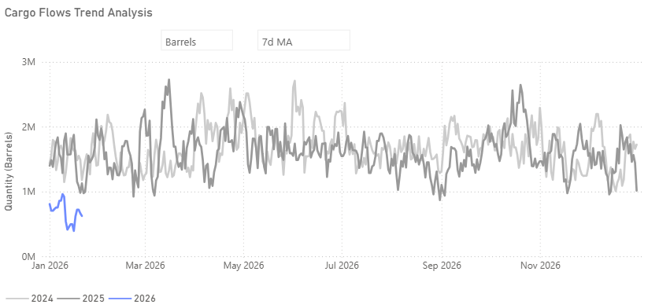
*Figures reflect market-based estimates as of 22 January and remain subject to further revision.*

Cargo-flow analysis indicates that Russian crude shipments to India slowed in early January, as reflected in the 7-day moving average across the first three weeks of the month. While India remains one of the most important destinations for Russian oil, current trends indicate a more gradual pace of arrivals compared to recent years.

By late January, the 7-day moving average indicated lower Russian crude shipments to India compared to prior years, with flows approximately 20% below 2022 levels and more than 50% below early-2024 benchmarks, based on rolling estimates that continue to be revised.

Publicly available tender data suggests that some Indian refiners are increasingly turning to Middle Eastern crude suppliers. Bharat Petroleum Corporation Limited is reported to have issued tenders for Iraqi and Omani crude covering periods of more than one year, and to have sought Murban crude from the United Arab Emirates under a separate tender. Similarly, Reliance Industries, one of the largest buyers of Russian crude earlier in the year, has publicly stated that it does not expect Russian deliveries in January. These developments help explain why aggregate Russian crude inflows into India did not strengthen during the month.

As a result, January Russian crude deliveries to India appear increasingly concentrated among a narrower group of buyers. These include Nayara Energy and select state-owned refiners, most notably Indian Oil Corporation, as several other refiners, both private and state-owned, have sought alternative crude supply.

## Market Overview

Spotfreightindices showed a mixed mid-week picture, supported by firmer Aframax rates, while VLCC WS momentum corrected below WS130. Some of last week’s gains were nevertheless retained, after TD3C closed Friday at around WS130, below its most recent peak of WS139.28 on 24 November.

‍

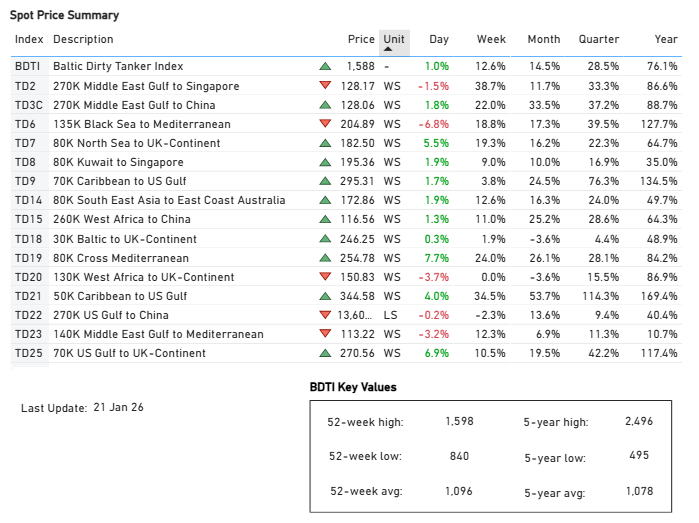
*Signal Figure*

‍

## VLCCWeaker

‍

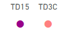
*Signal Figure*

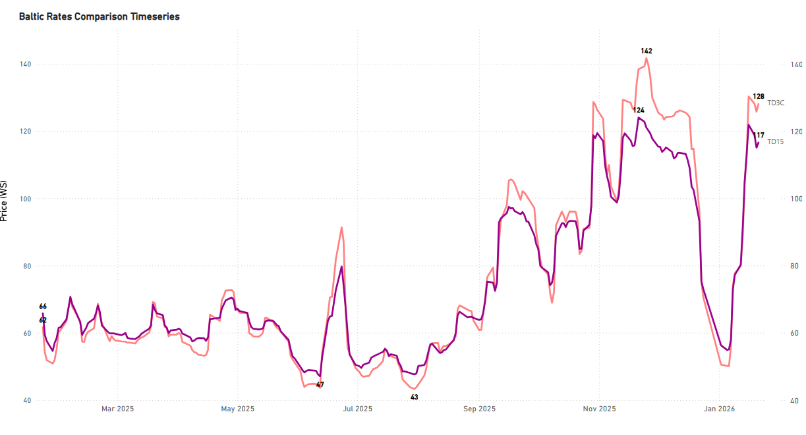
*Signal Figure*

- WS rates for MEG–China (TD3C) and WAF–China (TD15) have rebounded from recent lows, but current levels remain below last Friday’s close. Both routes are now trading below WS 130, suggesting that the recent upside correction has yet to be fully confirmed. While near-term gains point to improving sentiment, the market will need to be tested through the remainder of the month to assess whether this upward correction can be sustained.

## SuezmaxWeaker

‍

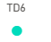
*Signal Figure*

‍

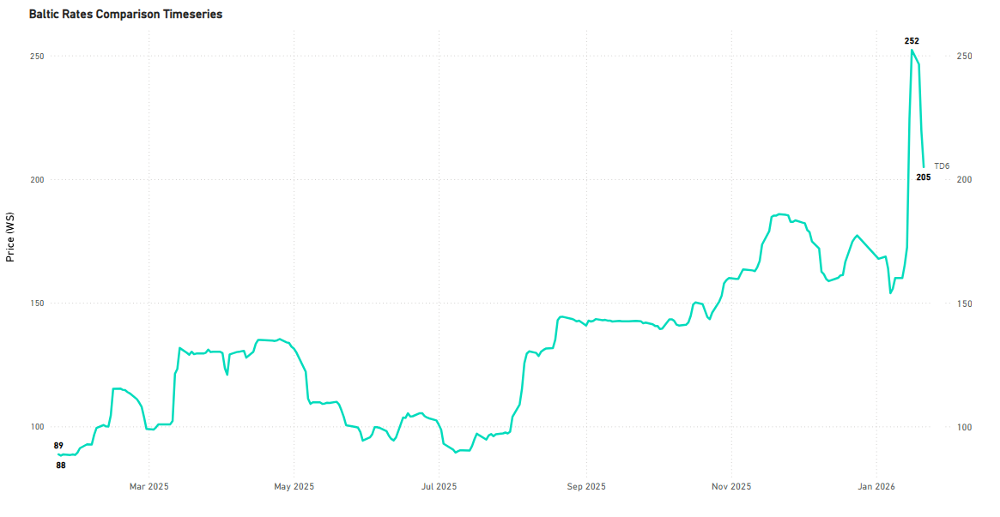
*Signal Figure*

‍

- After peaking in mid-January, WS rates for Black Sea - Mediterranean (TD6) have retreated significantly, dropping from roughly WS 252 to the low-WS 200s, assupplyconditions in the Black Sea increasingly signal oversupply.

‍

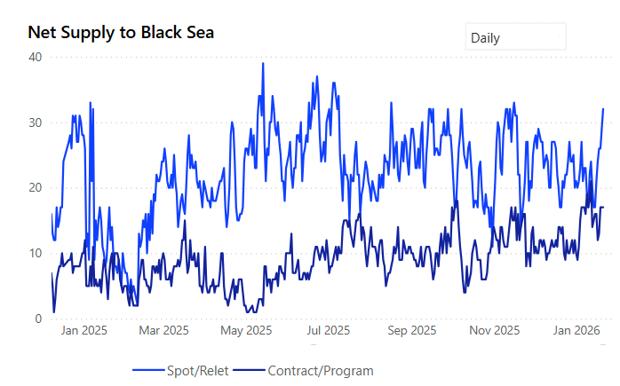
*Signal Figure*

## AframaxFirmer

‍

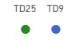
*Signal Figure*

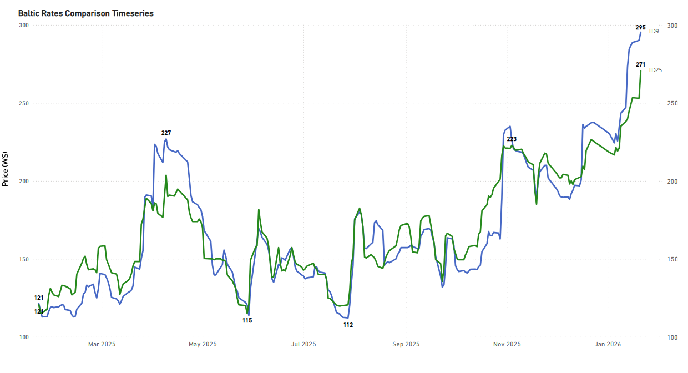
*Signal Figure*

- Since the start of the year, rates on TD9 and TD25 have steadily moved higher. TD9 has risen from around WS 230 in early January to close to WS 295, while TD25 has increased from the low WS 210s to above WS 270. The pace of gains has picked up in recent weeks, suggesting firmer underlying momentum as currentsupplyconditions continue to underpin the market.

‍

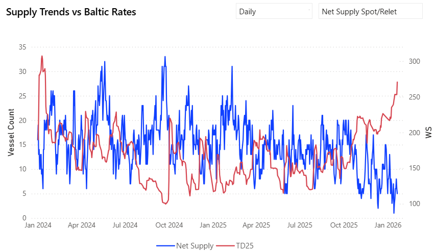
*Signal Figure*

## Ballasters| AG/IndiaSupply

VLCC AG/India Supply Builds, Weighing on recent rate firmness

‍

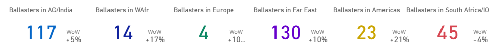
*Signal Figure*

- In line with our previousweeklyestimate, ballaster counts in AG/India continue to sit in the upper tier (over 110 vessels), while the 7-day moving average shows a 5% week-on-week rise.

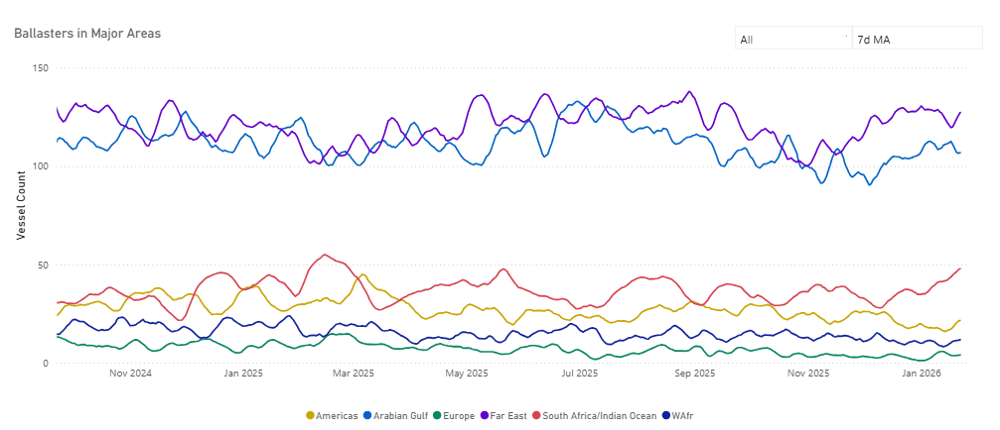
*Signal Figure*

## Demand|Tonne Days

## Dirty | Decreasing

- Dirty tonne-day growth has softened in recent weeks, pointing to a loss of momentum. Nevertheless, absolute tonne-day levels in 2026 remain notably higher than in prior years, running around 11% above 2025 levels and approximately 3% above 2024, suggesting that demand conditions are still relatively firm despite the recent easing.

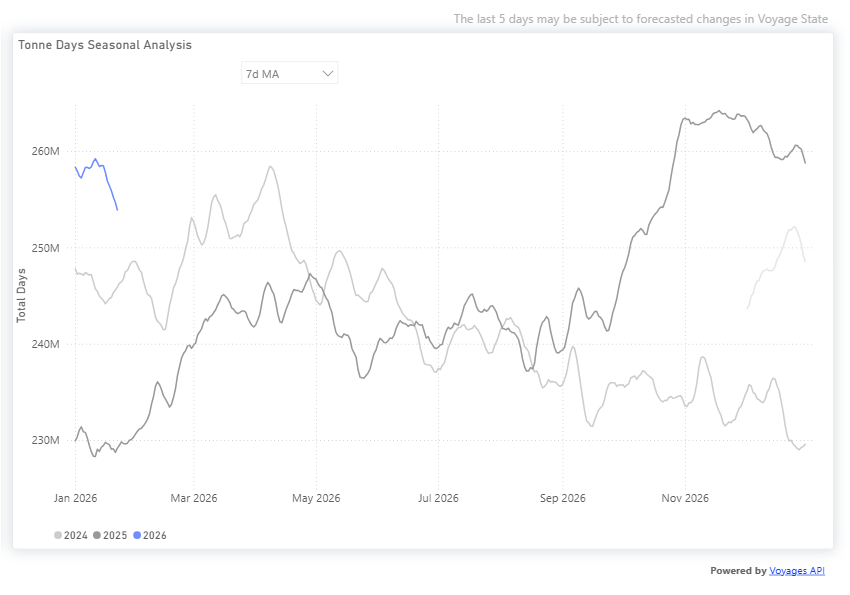
*Signal Figure*

## Takeaway

- VLCC rates have rebounded from recent lows, though current levels remain below prior peaks, suggesting that the recovery has yet to be fully confirmed.
- VLCC Ballaster counts in AG/India remain in the upper range and continue to build on a week-on-week basis, limiting upside potential.
- In the Suezmax segment, TD6 rates have corrected from mid-January highs, with supply conditions in the Black Sea increasingly weighing on sentiment.
- Aframax rates on TD9 and TD25 have continued to strengthen since the start of the year, with momentum further improving.
- Dirty tonne-day growth has softened in recent weeks, but overall demand levels remain above prior years.

‍

For the latest updates and insights, make sure to visit theSignal Ocean Newsroompage &subscribe to weekly reports. Clickhere to request a demo. Click here to see theprevious tanker weeklyreport.

For subscription to our FREE weekly market trends email, please contact us: research@thesignalgroup.com

-Republishing is allowed with an active link to the source
