# Weekly Tanker Market Monitor: Week 06, 2026

**Date**: February 6, 2026 | **Category**: Tankers | **Section**: Monitors | **Source**: [https://www.thesignalgroup.com/weekly-market-monitor/weekly-tanker-market-monitor-week-06-2026](https://www.thesignalgroup.com/weekly-market-monitor/weekly-tanker-market-monitor-week-06-2026)

---

## ‍Chart of the Week| AG VLCC Ballast Speed on Rise

The average VLCC ballast speed in the AG area is now edging toward the upper range of 11.9, which aligns with the upward trend in TD3C rates. (Speeds Trend Analysis availablenowhere)

![All data and commentary reflect market conditions as of [Thursday, 5 February 2026], unless otherwise stated.](../images/6985e3bd658ed643736a6f33_ef47a8f4.png)
*All data and commentary reflect market conditions as of [Thursday, 5 February 2026], unless otherwise stated.*

Amid rising Middle East tensions and geopolitical shifts, TD3C was indicating a soft downward trend into Friday’s close in the previous week, but the move proved short-lived, with rates surprisingly spiking again shortly thereafter.

Renewed U.S. threats toward Iran appear to be shocking oil prices and freight market sentiment, while the OPEC group agreed at its meeting on Sunday to continue its pause on scheduled oil output increases for March. The group cited seasonal demand factors and ongoing market uncertainty as the primary reasons for extending the output freeze. This move follows an earlier agreement in November 2025 to delay the restoration of voluntary output reductions.

Under the original plan, the group intended to gradually unwind 1.65 million barrels per day (bbl/d) of voluntary cuts. However, producers have opted for a cautious approach given the expected seasonal weakness in oil demand during the first quarter.

Uncertainty continues to rise as the global economy monitors developments in the oil market and escalating geopolitical tensions. Nevertheless, Brent crude oil prices are expected to trade at a premium of around USD 60 per barrel, in the base case scenario, as the oil market remainsoversupplied.

In the meantime, Iran confirmed that it will hold negotiations with the U.S. in Oman on Friday, reducing the immediate risk of military conflict and potential supply disruptions from the major OPEC producer. This news eased some of the geopolitical risk premium associated with the Middle East, which appears to have slowed the acceleration of dirty freight market prices. In parallel, the oil market is also monitoring developments surrounding Russia and Ukraine, following renewed Russian attacks on energy infrastructure, while the U.S. and Russia have agreed to resume high-level military contacts.

Lastly, the crude oil freight and trading environment is being shaken by reports of a halt in Russian crude oil purchases by Indian refiners and the potential stepwise increase in the share of U.S. crude oil as a replacement. As highlighted in ourMarket Insightsthis week, a full replacement with U.S. crude oil appears unlikely. Instead, the most probable scenario remains a continued, albeit reduced, flow of Russian crude oil imports to India.

Mid-weekenergy newsindicated that Russia’s flagship crude, Urals, is being offered in India at a widening discount to Brent, with the differential now reaching USD 11 per barrel. This pricing tests the appetite of Indian refiners amid a trade deal with the U.S. that calls for limited purchases of Russian oil. Importantly, the agreement on lower tariffs for Indian products entering the U.S. market is highly dependent on India reducing its imports of Russian crude oil.

In light of these developments, we reviewed U.S. crude oil shipments to India usingTSOPdata. From September onward, we observed a gradual increase in U.S. crude oil volumes shipped to India compared with the corresponding months of the previous year. Notably, during August 2025, volumes increased by more than 180% compared with July 2025 and by more than 80% compared with August 2024. This upward trend aligns with industry reports from early August, when U.S. officials first called on India to halt purchases of Russian oil or face potential tariff penalties.

‍

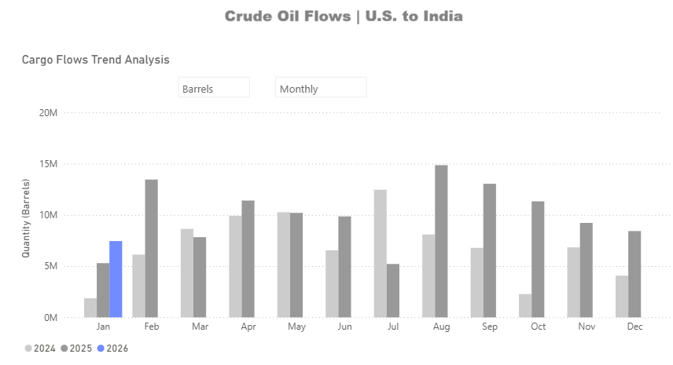
*Signal Figure*

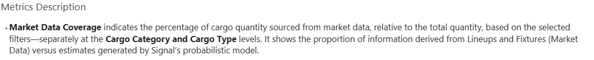
*Signal Figure*

‍

## Freight Market Overview - Dirty

## Baltic Dirty Tanker IndexTrending exceptionally higher (+87% YoY)

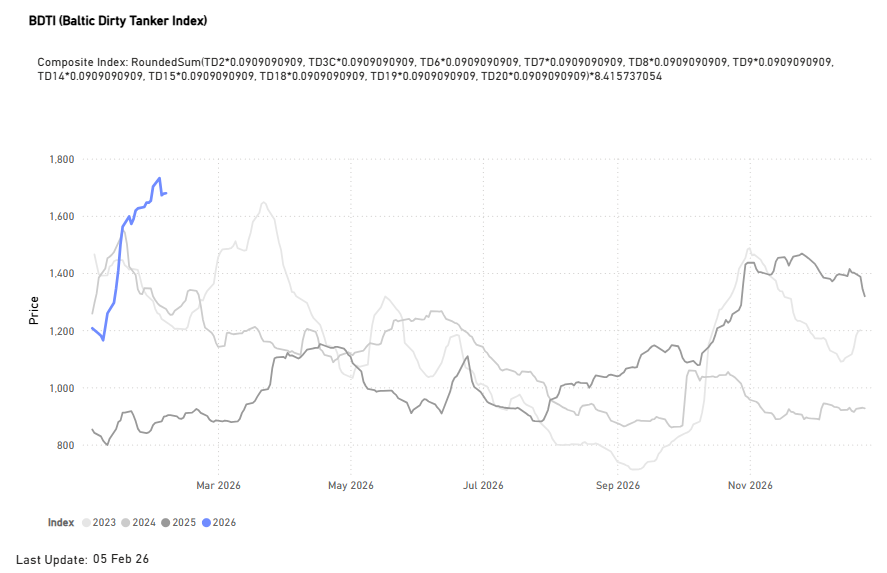
*Signal Figure*

‍

## DirtyTCE$/DAY

## VLCC | Suezmax | Aframax

## TD3CMiddle East Gulf to China |TD6Black Sea to Mediterranean |TD7North Sea to Continent

- Freight sentiment remains strong, despite a slight easing of momentum compared to recent levels. This sustained optimism is reflected when contrasting current figures with weekly, monthly, and annual performance.

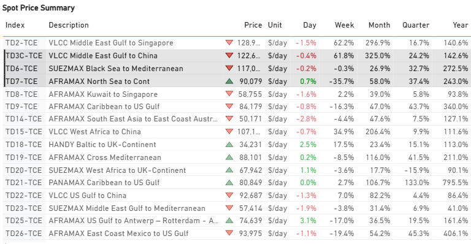
*Signal Figure*

- VLCC:Time Charter Equivalent (TCE) rates for the Middle East Gulf to China route are approximately $123k/d, marking a significant rise from the $29k/d seen at the beginning of January.
- Suezmax:Rates for the Black Sea to Mediterranean route have climbed substantially to $117k/d, up from $79k/d earlier in January.
- Aframax:North Sea-to-Continent rates currently stand at $90k/d. While this represents an outstanding increase from the start-of-year rate of around $57k/d, it is significantly weaker than the extraordinary spike to approximately $140k/d recorded just before the end of January.

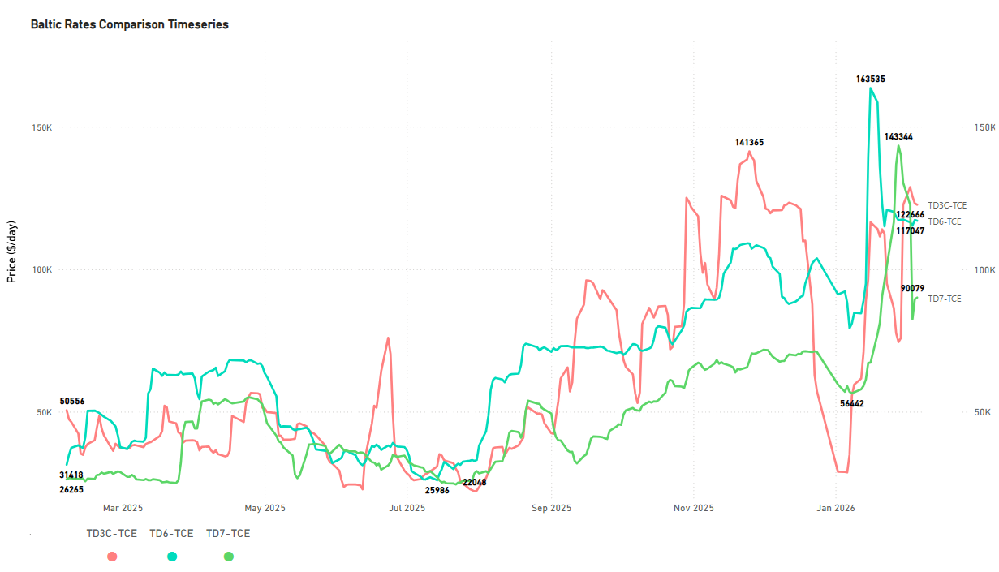
*Signal Figure*

‍

## Freight Market Overview - Clean

## Baltic Clean Tanker Index(+30% YoY)

- The current index value shows remarkable strength, posting a significant increase that places it notably higher than last year. However, it is crucial to temper this enthusiasm by recalling the exceptionally high peak observed just two years ago. While the current level is firmer on an annual basis, it has not yet reached the remarkable heights of 2024. During that period, the index surged to an unprecedented 1,400 points by the close of January.

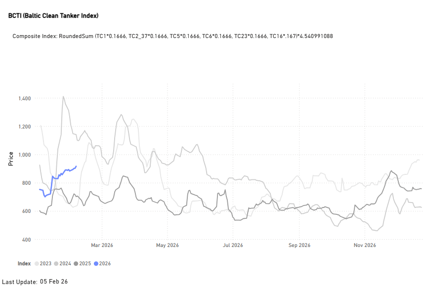
*Signal Figure*

‍

## CLEANTCE$/DAY

## LR2 | LR1 |MR

## TC1 75kMiddle East Gulf to Japan |TC5 55kMiddle East Gulf to Japan|TC1438k US Gulf to Japan

- In thecleansegment, the standout route for annual growth is MR USG to Continent, with earnings up 337% annually and latest indications at about $43k/day.

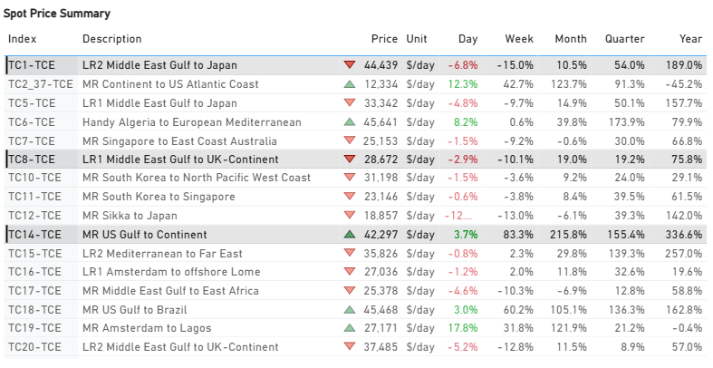
*Signal Figure*

‍

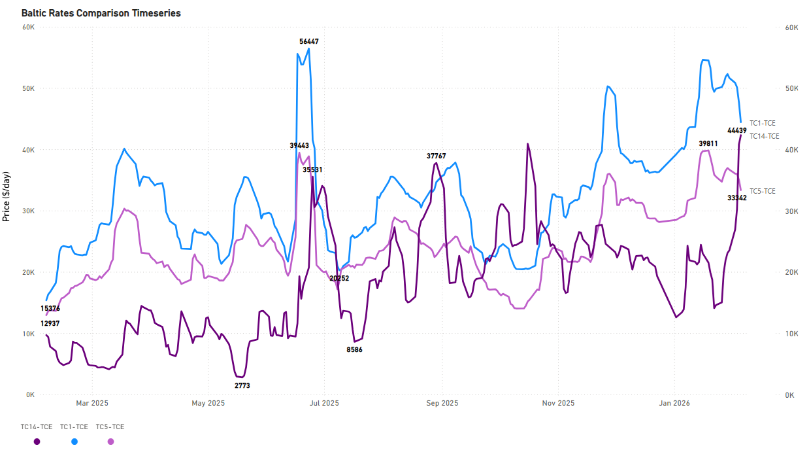
*Signal Figure*

‍

## SUPPLY MARKET TRENDS

In this section, we highlight the areas of the dirty Baltic routes where TSOP signals show the latest upward trend, contrary to the direction of freight market movements.

## VLCC |WafrVsAG

- West Africa:The increasing availability of spot/relet vessels on the TD15 route, which has surged by approximately 78% in the last week, may begin to weigh on market sentiment and increase downward pressure on freight rates. This upward trend in availability has been evident over the past 15 days, with the vessel count now nearing 20, a significant increase from a low of 6 vessels at the end of the third week of January.

- AG:However, the net supply trend in the AG is signalling a decrease, with the vessel count down by around 26% from the end of December in the previous year.

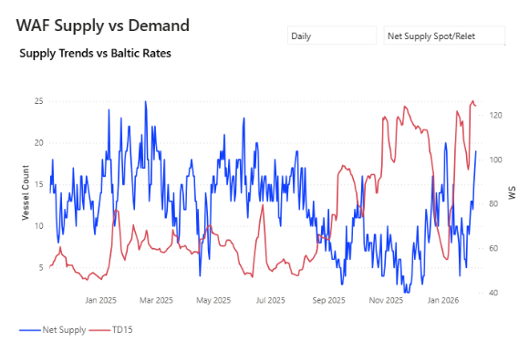
*Signal Figure*

## Suezmax | WafrVsBlack Sea

- West Africa: Supply pressure is evident, with the availability of spot/relet vessels on the TD20 route now exceeding 30. This marks a 100% increase from the exceptionally low levels observed in mid-January.

- Black Sea: A downward trend in vessel availability has been noted over the past month. Current volatility averages around 25 vessels, down from the peak of just over 30 vessels recorded in mid-November 2025.

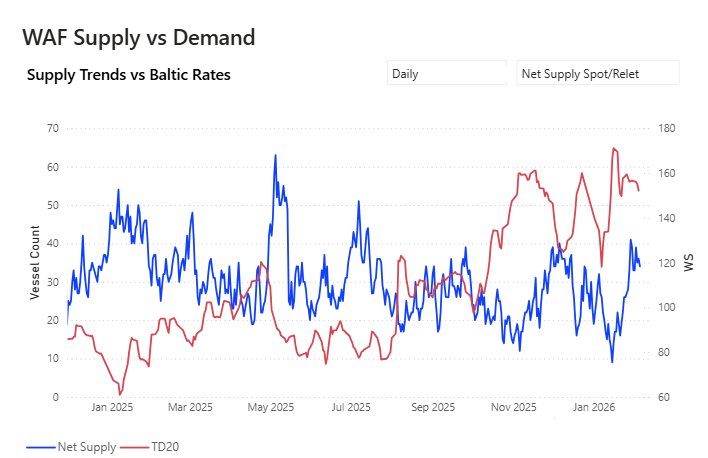
*Signal Figure*

‍

## DIRTY DEMAND | TONNE MILES - INDEX VIEW

## VLCC | Suezmax | Aframax 7D MA Mixed

The VLCC segment's year-on-year tonne-mile index growth has recently fallen below 100%, lagging behind the Suezmax and Aframax segments. Furthermore, this trend has been in steady decline since its mid-November peak, raising early caution signals regarding the freight market's ability to sustain strength as we approach the end of the first quarter.

‍

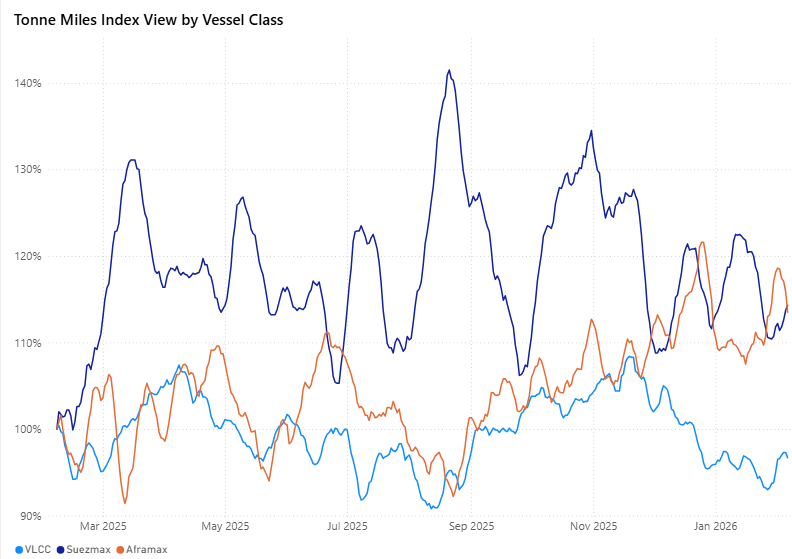
*Signal Figure*

Metrics Description:Index View(Base 100) by total Tonne Miles over the selected period. This facilitates relative performance comparisons between segments of different sizes (e.g., comparing the growth rate of VLCC vs Suezmax)

## CLEAN DEMAND | TONNE MILES - INDEX VIEW

## Aframax | Panamax | MR 7D MA Mixed

The Aframax segment is experiencing a significant downward trend in its growth index, recently dropping to a low of 80%. This contrasts sharply with the firmer performance observed in the dirty tonne-miles growth rate.

‍

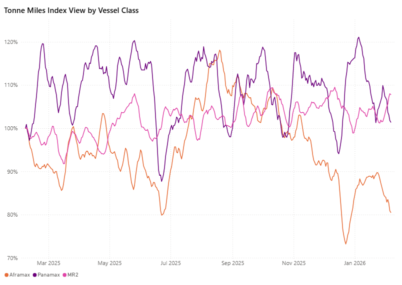
*Signal Figure*

Metrics Description:Index View(Base 100) by total Tonne Miles over the selected period. This facilitates relative performance comparisons between segments of different sizes (e.g., comparing the growth rate of VLCC vs Suezmax)

‍

For the latest updates and insights, make sure to visit theSignal Ocean Newsroompage &subscribe to weekly reports. Clickhere to request a demo. Click here to see theprevious tanker weeklyreport.

For subscription to our FREE weekly market trends email, please contact us: research@thesignalgroup.com

-Republishing is allowed with an active link to the source
