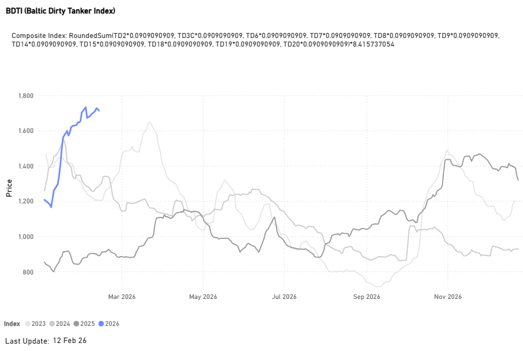
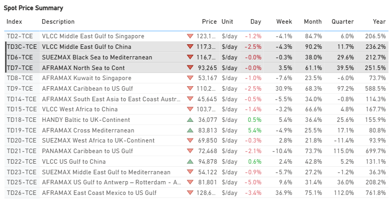
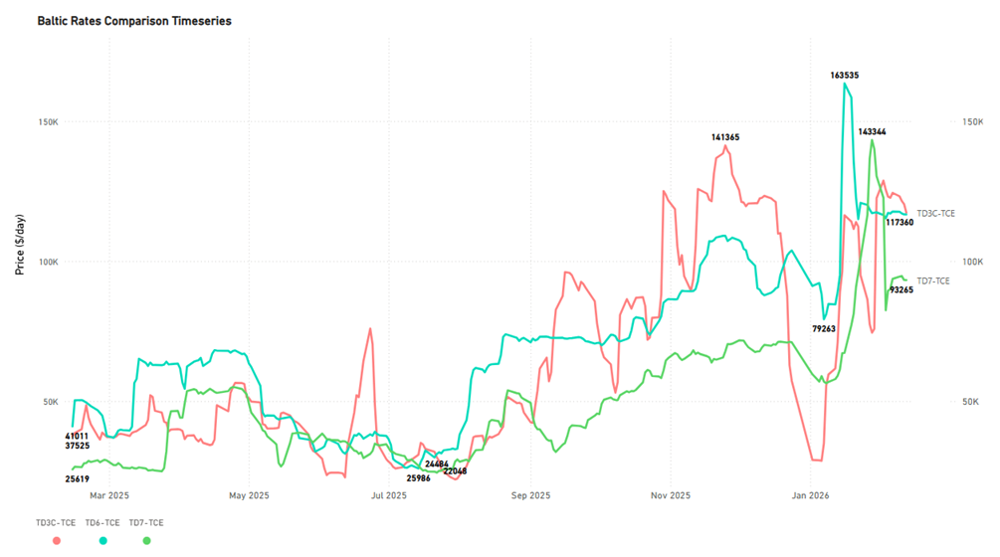
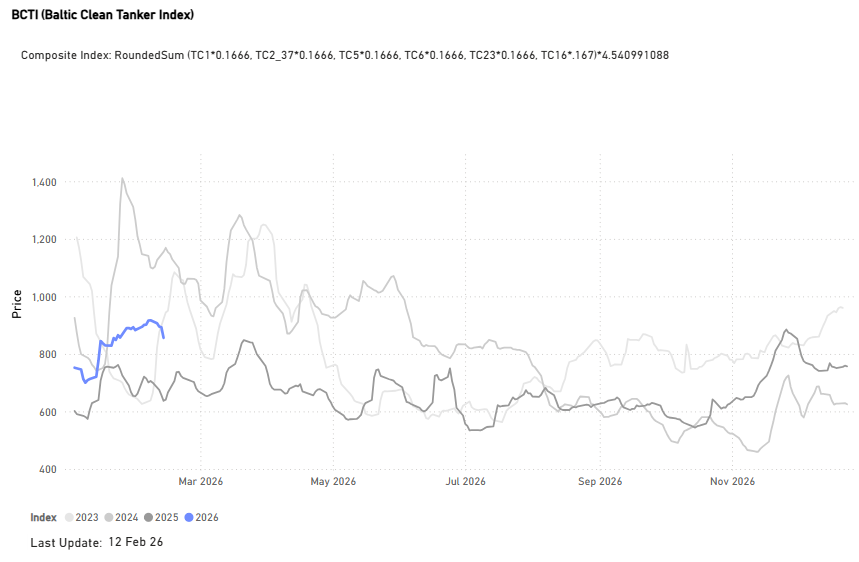
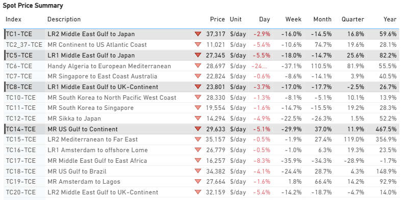
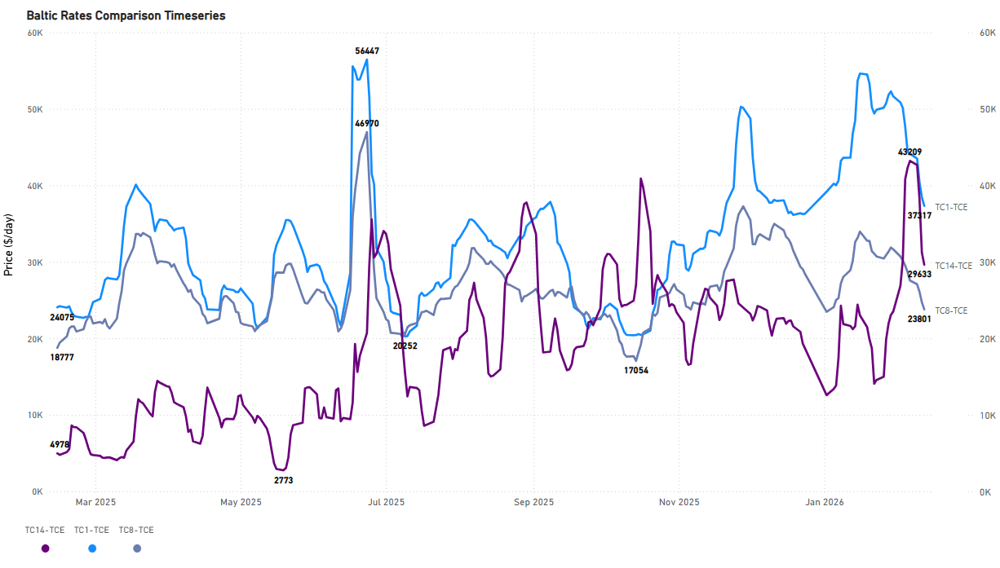
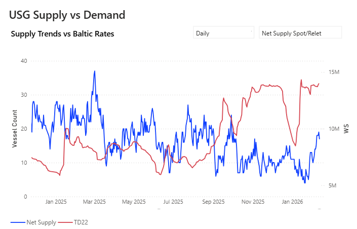
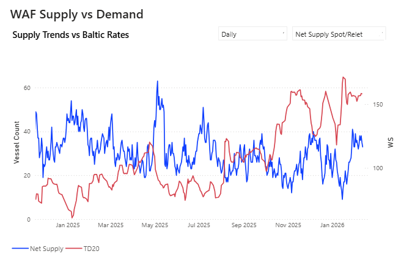
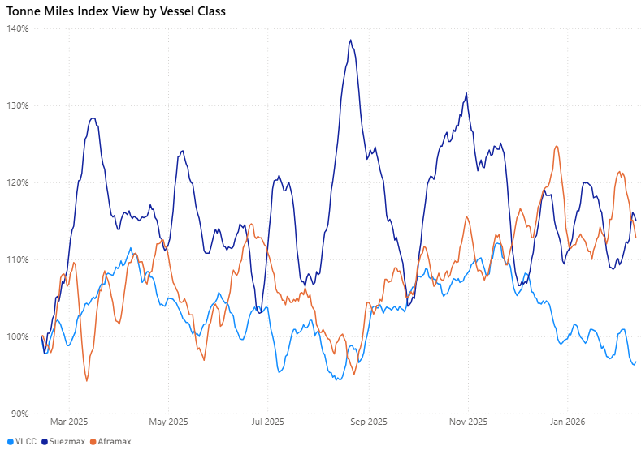
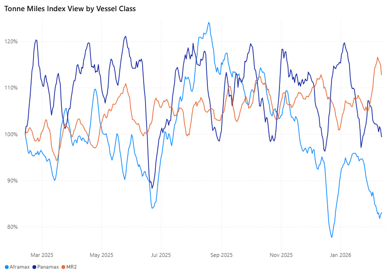

# Weekly Tanker Market Monitor: Week 07, 2026

**Date**: February 13, 2026 | **Category**: Tankers | **Section**: Monitors | **Source**: [https://www.thesignalgroup.com/weekly-market-monitor/weekly-tanker-market-monitor-week-07-2026](https://www.thesignalgroup.com/weekly-market-monitor/weekly-tanker-market-monitor-week-07-2026)

---

## Chart of the Week| Congestion per Discharge Area(WoW Change)

This week’s spotlight reviews the latest congestion trends in major dirty and clean discharge areas, highlighting notable weekly shifts.

VLCC(China)↓4%  |Suezmax(Continent)↓43% |Aframax(Singapore/Malaysia)↑ 18%

MR(Australia East)↓ 75%

‍

![All data and commentary reflect market conditions as of [Thursday, 12 February 2026], unless otherwise stated.(Congestion Trend Analysis availableVLCC|Suezmax|Aframax|MRInsights)](../images/698f2f34668f9bd10bfee874_91a11e20.png)
*All data and commentary reflect market conditions as of [Thursday, 12 February 2026], unless otherwise stated.(Congestion Trend Analysis availableVLCC|Suezmax|Aframax|MRInsights)*

‍

Recent freight market behavior suggests a pause in the rally rather than a structural reversal. Freight levels remain supported by constrained tonnage supply, particularly in core export regions, though near-term direction will depend on fresh cargo flow and overall market activity.

Arabian Gulf and West African dirty freight markets are currently characterized more by holding firmness than a new surge. Market activity appears measured, with participants monitoring cargo flow developments before establishing stronger directional conviction.

## Trade Flow & Policy Developments

The freight market's direction is increasingly shaped by evolving crude trade patterns and emerging policy shifts.

A potential trade agreement between the United States and India, expected bymid-March,  is drawing market attention. While the direct impact on freight remains uncertain, any adjustments to tariff frameworks or sourcing incentives could affect crude procurement strategies and, in turn, tonne-mile demand.

A gradual reconfiguration of global trade flows is already taking shape.

Indian refinershave shown renewed openness toward Venezuelan crude following the resumption of exports. State-owned Indian Oil Corporation (IOC) and Hindustan Petroleum Corporation Ltd (HPCL) have jointly secured 2 million barrels, marking the second Venezuelan cargo deal since export channels reopened.

If sustained, this shift could modestly extend average voyage distances, particularly if Atlantic Basin crude gains an incremental share in Asian refining systems.

However, structural realignment remains conditional. Commercial viability, refinery configuration constraints, and regulatory clarity continue to limit rapid substitution between crude grades. Not all barrels are interchangeable.

Sanctions frameworks and compliance requirements remain operational variables, particularly for vessel services, insurance, and financing channels.

For now, freight performance appears more directly driven by regional vessel availability and cargo timing rather than immediate geopolitical catalysts.

## Freight Market Overview - Dirty

Baltic Dirty Tanker Indexis trending exceptionally higher (+90% YoY), surpassing the monthly levels of the previous years since 2023.

*(Market Prices availableDirty)*

## DirtyTCE$/DAY

VLCC | Suezmax | Aframax ↓

TD3CMiddle East Gulf to China |TD6Black Sea to Mediterranean |TD7North Sea to Continent

- The freight market pulse has eased further since the start of the first week of February. Yet strong performances are still recorded in the VLCC Middle East Gulf-to-China TCE and the Suezmax Black Sea-to-Mediterranean, with TCE in excess of $110k/d, while the Aframax North Sea-to-Continent dropped below $95k/d.

*Signal Figure*

- VLCC: The Time Charter Equivalent (TCE) rates for the Middle East Gulf-to-China route, while dropping by about $5,000/day to $117,000/day, remained strong. This $117k/d figure represents a substantial increase of roughly $83,000/day compared to the rates seen a year ago.
- Suezmax: Rates for the Black Sea to Mediterranean route experienced a minor downward adjustment this week, remaining near $117k/day. This figure represents an increase of approximately $79k/day compared to the same time last year.
- Aframax: North Sea-to-Continent rates currently stand at $93k/d, dropping by around $3k/day from the previous week, and still significantly weaker than the extraordinary spike to approximately $140k/d recorded just before the end of January.

*(Spot Comparison availablehere)*

## Freight Market Overview - Clean

Baltic Clean Tanker Index(+34% YoY)

- The current index value remains strong; however, there has been a gradual easing, with a 4% weekly drop to below the 900-point mark. It appears the latest peak was reached on February 5, 2026, with the index near 920 points.

*(Market Prices availableClean)*

## CLEANTCE$/DAY

LR2 | LR1 |MR ↓

TC1 75kMiddle East Gulf to Japan |TC5 55kMiddle East Gulf to Japan|TC1438k US Gulf to Japan

- In thecleansegment, the second week of February seems to end with a clear downward trend signal. However, the standout route for annual growth remainedMR USGtoContinent, as mentioned in our lasttanker market monitor, with earnings up 476% annually, but with latest indications reversing significantly the firmness of the previous week, when levels were in excess of $40k/d, and lost momentum this week to around $30k/d.

*Signal Figure*

‍

*(Spot Comparison availablehere)*

## SUPPLY MARKET TRENDS

In this section, we highlight the areas of the dirty Baltic routes where TSOP signals show the latest upward trend, contrary to the direction of freight market movements.

## VLCC |USGVsAG&WAfr

Building on last week's observation of emerging oversupply in West Africa, current data indicate developing net supply pressure in the US Gulf. Specifically, the latestTSOPfigures indicate an oversupplied market on the TD22 route (24% above the 3-month average). This elevated supply level appears to be already restraining any further spike in recent freight market indications.

‍

*Signal Figure*

- West Africa:The spike in the availability of spot/relet vessels on the TD15 route, which saw the count peak near 20 over the last fortnight, has now subsided. The vessel count has dropped to 13, helping TD15 rates maintain a floor above WS 120.

- AG:The sustained downward trajectory in net vessel supply within the Arabian Gulf (AG) region remains a notable market feature. Current data indicate a substantial reduction in the vessel count, now approximately 45% below the peak level recorded at the end of December 2025. This significant decline has accelerated recently, in contrast to the 26% decrease observed just before the close of the previous week.

## Suezmax | WafrVsBlack Sea

‍

*Signal Figure*

- West Africa: Spot/relet vessels on the TD20 route are maintaining levels above 30 (the same as a week ago), marking a significant 100% rise from the exceptionally low figures recorded in mid-January. In addition, the current TSOP data indicate that the TD20 route is now oversupplied (23% above the 3-month average), which is expected to further depress freight demand.

- Black Sea: Current volatility continues, averaging around 25 vessels, down from the peak of just over 30 vessels recorded in mid-November 2025.

‍

## DIRTY DEMAND(TONNE MILES)| 7D MA - INDEX VIEW

VLCC ↓3.3% WoW| Suezmax ↑ 2.8%WoW| Aframax ↓ 6.0% WoW

*Signal Figure*

- The VLCC segment’s tonne-mile index growth stayed below 100%, in line with last week’s expectations, continuing to lag both Suezmax and Aframax. Suezmax continues to exhibit relatively firmer momentum. Although the Aframax index growth remains above 100%, it has moderated to around 115% from its early February peak of 120%.

Metrics Description:Index View(Base 100) by total Tonne Miles over the selected period. This facilitates relative performance comparisons between segments of different sizes (e.g., comparing the growth rate of VLCC vs Suezmax)

## CLEAN DEMAND(TONNE MILES)| 7D MA - INDEX VIEW

Aframax ↓1.5% WoW| Panamax ↓ 2.8%WoW| MR2 ↓2.0% WoW

‍

*Signal Figure*

- The Aframax segment's tonne-mile index growth remained below 85% compared to the previous period, as anticipated last week, and continues to trail both Panamax and MR segments. Overall, a decreasing trend has been observed, though the MR segment still recorded the highest index value growth at approximately 113%. However, recent indicators suggest a moderate correction for MR.

Metrics Description:Index View(Base 100) by total Tonne Miles over the selected period. This facilitates relative performance comparisons between segments of different sizes (e.g., comparing the growth rate of VLCC vs Suezmax)

For the latest updates and insights, make sure to visit theSignal Ocean Newsroompage &subscribe to weekly reports. Clickhere to request a demo. Click here to see theprevious tanker weeklyreport.

For subscription to our FREE weekly market trends email, please contact us: research@thesignalgroup.com

-Republishing is allowed with an active link to the source
