# Weekly Tanker Market Monitor: Week 08, 2026

**Date**: February 27, 2026 | **Category**: Tankers | **Section**: Monitors | **Source**: [https://www.thesignalgroup.com/weekly-market-monitor/weekly-tanker-market-monitor-week-08-2026](https://www.thesignalgroup.com/weekly-market-monitor/weekly-tanker-market-monitor-week-08-2026)

---

## Spotlight of the Week| VLCC Second-hand Market

The latest secondhand price trends for 5- and 10-year-old vessels in the VLCC segment are the focus of this week's review.

‍

![All data and commentary reflect market conditions as of [Thursday, 26 February 2026], unless otherwise stated.(Valuation Trend Analysis availableVLCC)](../images/69a1c6f450433bad7cdb53ec_a185e72b.png)
*All data and commentary reflect market conditions as of [Thursday, 26 February 2026], unless otherwise stated.(Valuation Trend Analysis availableVLCC)*

## Secondhand Values Repriced

The improvement in one-year time charter earnings has reshaped the VLCC secondhand market. The recent strong cash generation and improved freight visibility have pushed asset values sharply higher, not only for modern units but also for overaged units. The rising 1-year time charter (TC) rates are now closely tracking the upward trend in asset prices. This alignment has stimulated seller interest and increased price expectations in the second-hand market.

Asset values for both modern and vintage tanker tonnage have seen a significant re-rating, as evidenced by the sharp increase in valuations over multiple time horizons.

In February 2023, a five-year-old VLCC was valued at approximately USD 98 million. Today, it is indicated above USD 120 million, implying a year-on-year increase of c.17%. While the one-year change is increasing, the more striking development is visible over a longer horizon. Five-year-old values are up approximately +30% over three years and nearly +99% over five years.

Similarly, older units have experienced substantial growth. A ten-year-old vessel, valued at about USD 74 million in 2023, now commands a price above USD 100 million, representing a year-on-year increase exceeding 20%. The appreciation over five years for these units is exceptional, reaching +130%, while the three-year change stands at nearly +39%.

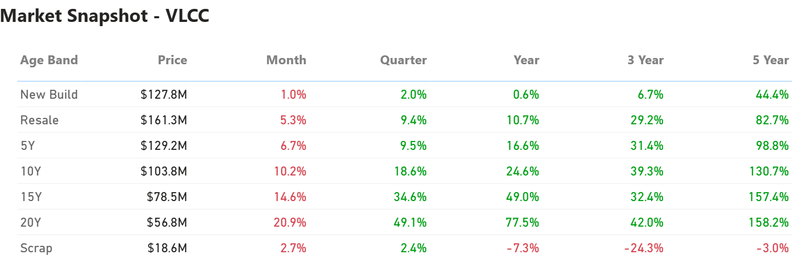
*Signal Figure*

## Age Discount Tightening

The spread between five- and ten-year-old vessels has narrowed.

In 2023, the discount of a ten-year-old unit versus a five-year-old was around 25%. Current indications suggest that the gap is closer to 20%. Buyers are increasingly comfortable with mid-age tonnage, provided earnings remain supportive.

For reference, in February 2016, five-year-old VLCCs were valued at about USD 76.2 million, while ten-year-old units stood near USD 52.7 million, a discount closer to 30%. Today’s tighter spread reflects a firmer asset environment and confidence that strong earnings are not limited to the very modern end of the fleet.

## Freight Strength and Hormuz Risk

Asset performance is being driven by freight. Since the end of January, the VLCC market has also been navigating heightened geopolitical tension around the Strait of Hormuz. As one of the most critical crude transit routes globally, any perceived risk in this corridor directly impacts freight sentiment. Even without disruption, uncertainty alone supports risk premiums, influences chartering decisions, and tightens effective supply.

At the same time, trade flows continue to evolve. The Arabian Gulf remains central to Asian demand, particularly from China and India. Atlantic Basin barrels are also playing a growing role, extending voyage distances and supporting tonne-mile demand. Recent news indicatedVenezuelais chartering its first VLCC tankers since easing U.S. sanctions and boosting crude exports to India.

## Deliveries Building

After several years of restrained ordering driven by regulatory uncertainty and fuel-transition considerations, the VLCC newbuilding cycle is beginning to turn.

Scheduled deliveries are set to increase from 2026 onward, with 48 vessels expected in 2026, rising to 69 in 2027 and peaking at 70 in 2028, before moderating to 24 in 2029 and 6 in 2030. While additions in 2026 remain moderate relative to the active fleet, deliveries become more concentrated in 2027–2028 compared with the preceding years of limited growth.

‍

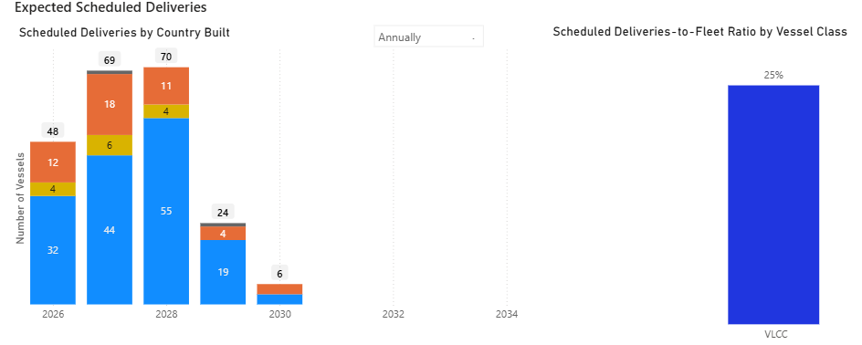
*Signal Figure*

Further analysis of the VLCC orderbook is available in the dedicatedOrderbook Insights section.

## Rally and Ordering Risk

Strong freight rates and rising asset prices have supported increased secondhand activity, with modern VLCCs trading at decade highs and buying interest remaining firm despite elevated entry levels. Periods of sustained earnings have historically coincided with renewed contracting interest, and continued freight strength could support further evaluation of newbuilding opportunities. At the same time, scheduled additions exceeding 20% of the existing fleet represent a meaningful increase in projected fleet capacity from 2027 onward.

Unlike earlier upward periods, the current environment is shaped heavily by geopolitical realignment and evolving environmental regulations, both of which are influencing trade patterns and investment decisions. Thus, the pace at which the forward delivery schedule is absorbed will play an important role in determining the longevity of the current freight rally.

## Freight Market Overview - Dirty

TheBaltic Dirty Tanker Indexhas reached a new historical high, exceeding 1,900 points (+120% YoY).

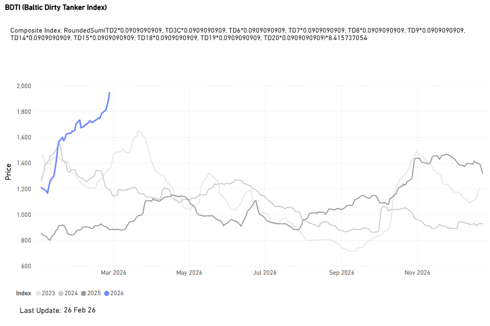
*(Market Prices availableDirty)*

DirtyTCE$/DAY

VLCC | Suezmax | Aframax ↑

TD3CMiddle East Gulf to China |TD6Black Sea to Mediterranean |TD7North Sea to Continent

Before the month's end, the freight market has reached elevated levels. Specifically, the Time Charter Equivalent (TCE) for VLCCs on the Middle East Gulf-to-China route has surged past the $200,000/day threshold, marking a substantial year-over-year increase of over 440%. This recent rally marks a reversal of the easing sentiment noted in our lastTanker Market Monitor, at which time the TD3C-TCE was hovering above $120k/d.

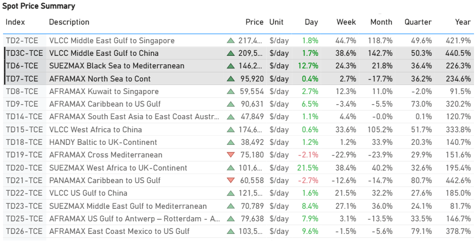
*Signal Figure*

- VLCC: TCE rates for the Middle East Gulf–to–China route rose sharply this week, increasing by approximately $58k/d. This strong upward momentum is particularly notable given historical patterns, such as in March 2021, when rates declined into negative territory at the beginning of the month.
- Suezmax: Rates for the Black Sea–to–Mediterranean route surged past $140,000 per day, marking a week-on-week gain of $29,000 per day. This also reflects a remarkable 226% increase compared to the same period last year.
- Aframax: North Sea–to–Continent rates rose by approximately $2.5k/d week-on-week, settling at around $95k/d. Despite this recent uptick, levels remain well below the exceptional late-January peak of roughly $140k/d.

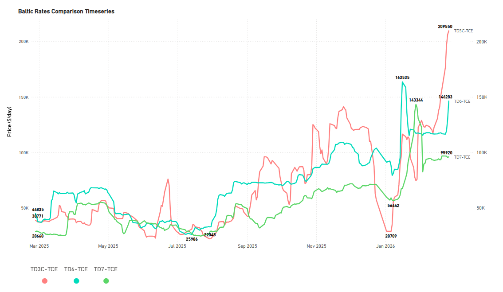
*(Spot Comparison availablehere)*

## Freight Market Overview - Clean

Baltic Clean Tanker Index(+23% YoY)

Although the index has stayed below 900 points and weakened since early February, it rose by nearly 7% week-on-week.

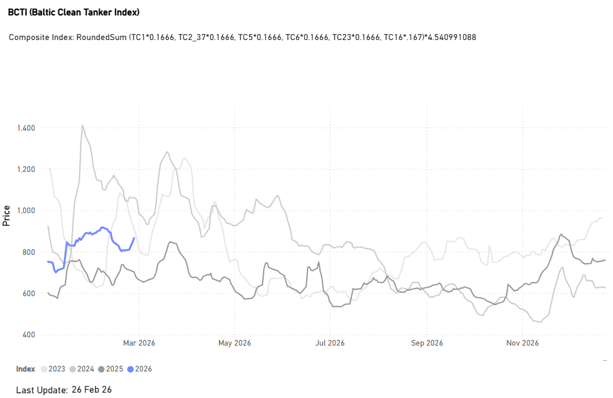
*(Market Prices availableClean)*

CLEANTCE$/DAY

LR2 | LR1 |MR ↑

TC1 75kMiddle East Gulf to Japan |TC5 55kMiddle East Gulf to Japan|TC1438k US Gulf to Japan

The clean segment is concluding the final week of February with a clear upward momentum. TheMRUSG to Continent route remains the top performer in terms of year-on-year growth, as highlighted in our previousTanker Market Monitor. Earnings on this route are up 530% annually, with sentiment around $36k/d. Strong annual gains were also seen in the Middle East Gulf to Japan routes:LR2rates rose by 100% to approximately $46k/d, andLR1rates were up 80% to $30k/d.

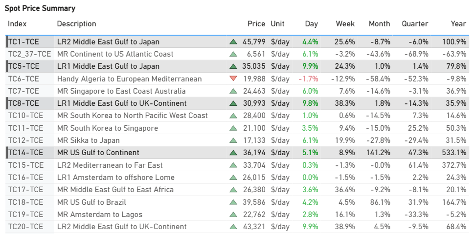
*Signal Figure*

‍

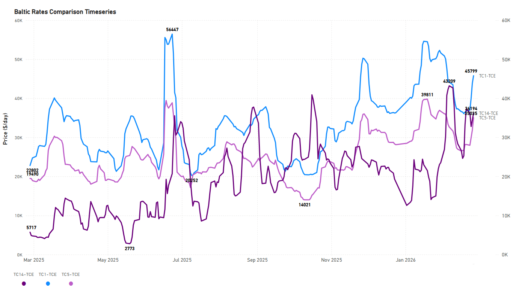
*(Spot Comparison availablehere)*

## SUPPLY MARKET TRENDS

Previous weekly market monitors concentrated on routes where ourTSOPsignals indicated an oversupplied market. This week, however, we shift our focus from oversupply to routes showing an undersupplied picture.

VLCC |AG&WAfr

The latestTSOPfigures indicate an undersupplied market on the TD3 route (-27% WoW ~80 Vessels).

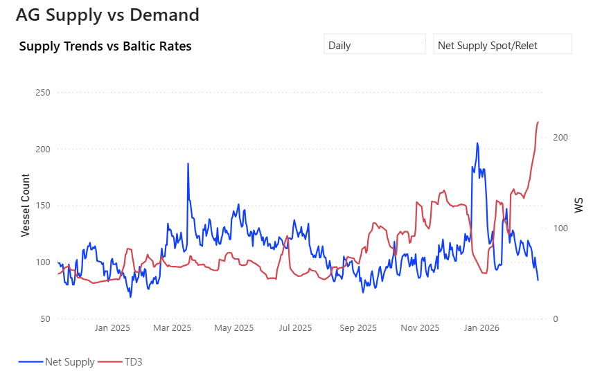
*Signal Figure*

- AG:The vessel count has fallen sharply to one of the lowest levels recorded in the first two months of the year, accelerating its decline since the end of January.

- West Africa:The spike in the availability of spot/relet vessels on the TD15 route has now dropped to 8 (-45% WoW), helping TD15 rates to firm above WS 180.

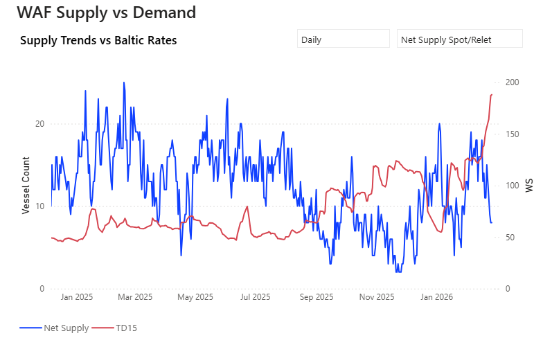
*Signal Figure*

Suezmax | Wafr

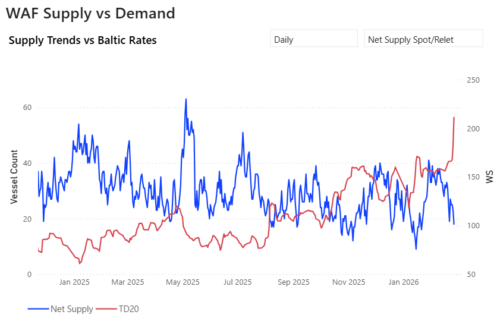
*Signal Figure*

‍

- West Africa: Spot/relet vessels on the TD20 route reversed the upward trend recorded in our latestTanker Market Monitor, and the current TSOP data indicate that the TD20 route is now undersupplied (-30% vs the 3-month average), with a 29% weekly increase in freight rates.

DIRTY DEMAND(TONNE MILES)| 7D MA - INDEX VIEW

VLCC ↓1.9% WoW| Suezmax ↓4.8% WoW| Aframax ↓ 7.8% WoW

‍

*Signal Figure*

- The tonne-mile indices for all dirty tanker segments softened during the week. VLCCs continued to trail the other segments, with its index dropping 1.9 percentage points (ppts) to 96.3% from 98.2%, remaining below the 100% threshold. Suezmaxes, despite still leading the pack, saw a noticeable decline, falling 5.4 ppts to 108.3% from 113.7%.
- Aframax experienced the sharpest correction, easing 8.7 ppts to 102.1% from 110.8%. Although this segment remains marginally above the 100% mark, the index has meaningfully pulled back from its early-February peak near 120%.

Metrics Description:Index View(Base 100) by total Tonne Miles over the selected period. This facilitates relative performance comparisons between segments of different sizes (e.g., comparing the growth rate of VLCC vs Suezmax)

## CLEAN DEMAND(TONNE MILES)| 7D MA - INDEX VIEW

Aframax ↑4.1% WoW| Panamax↓ 3.2% WoW| MR2 ↓ 10.4%WoW

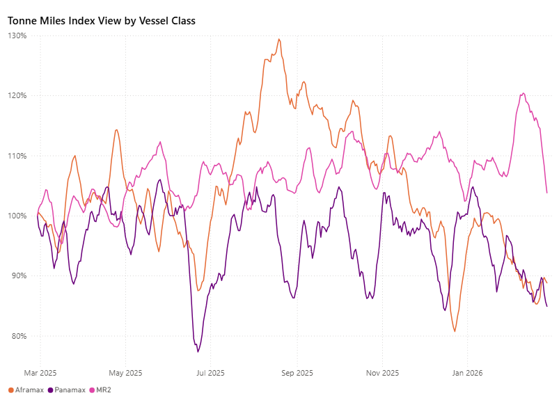
*Signal Figure*

- The MR segment, while still the strongest performer overall, experienced a significant correction, falling 12.0 percentage points from 115.8% to 103.8%.
- The Aframax segment saw an increase in its tonne-mile index, rising by 3.5 percentage points from 85.3% to 88.8%. Despite this gain, it remains below the 90% mark and still trails the MR segment. The Panamax index eased moderately week-on-week, dropping 2.8 percentage points from 87.7% to 84.9%, subsequently falling below Aframax.

Metrics Description:Index View(Base 100) by total Tonne Miles over the selected period. This facilitates relative performance comparisons between segments of different sizes (e.g., comparing the growth rate of VLCC vs Suezmax)

For the latest updates and insights, make sure to visit theSignal Ocean Newsroompage &subscribe to weekly reports. Clickhere to request a demo. Click here to see theprevious tanker weeklyreport.

For subscription to our FREE weekly market trends email, please contact us: research@thesignalgroup.com

-Republishing is allowed with an active link to the source
