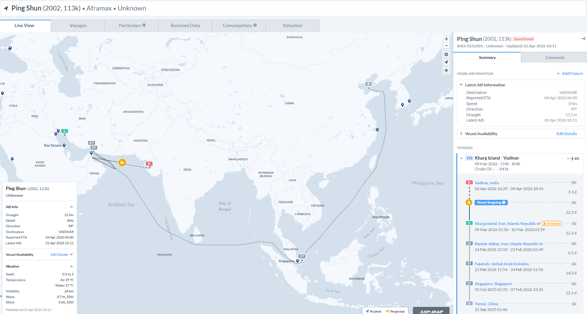
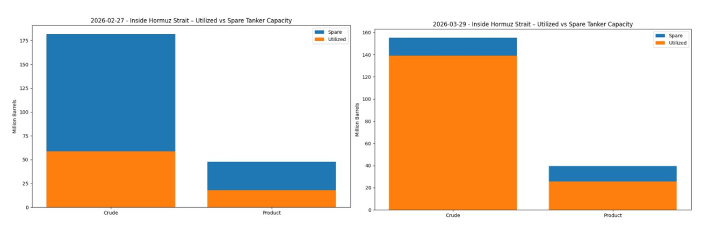
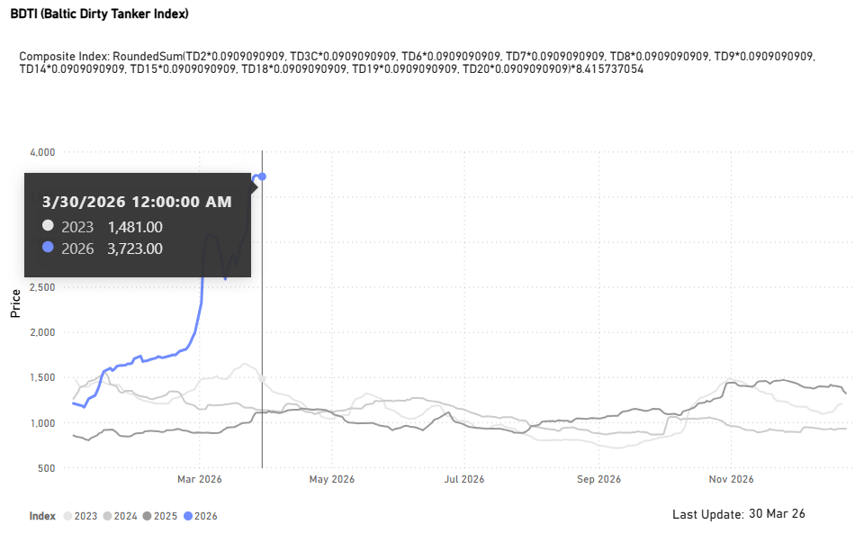
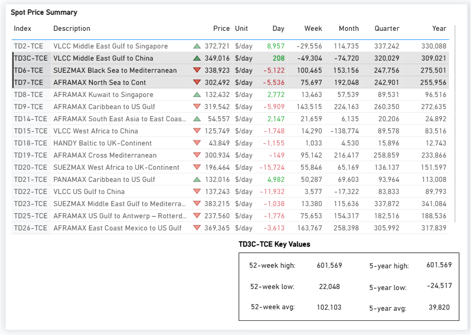
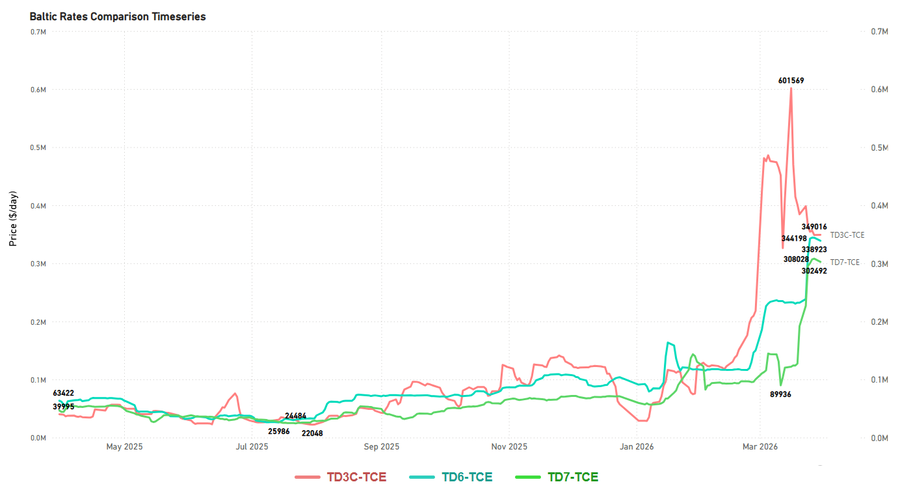
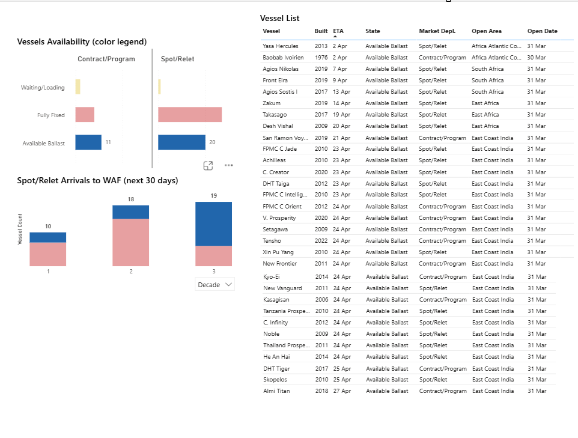
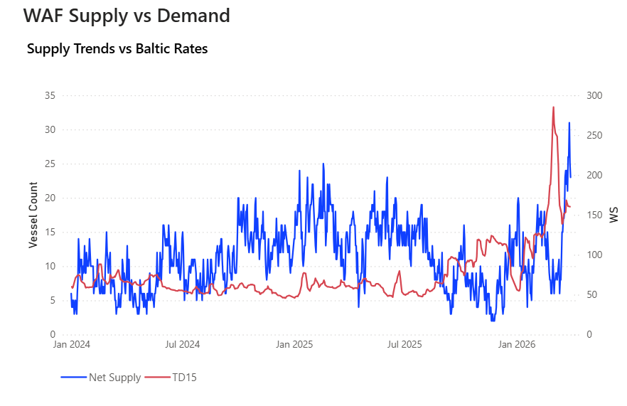
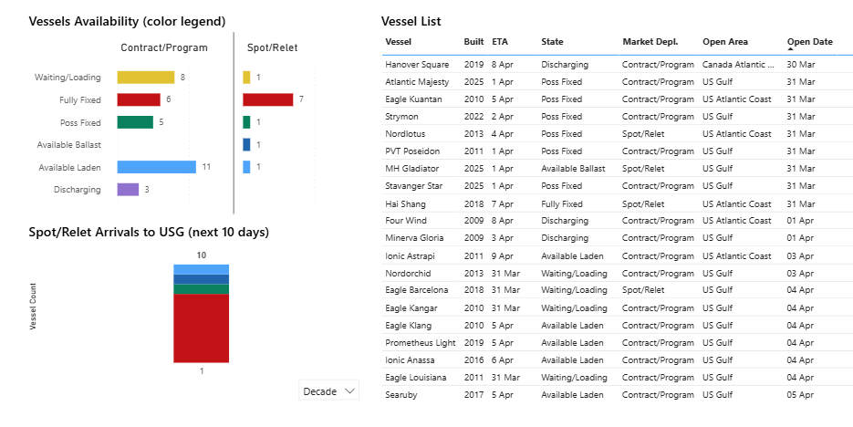
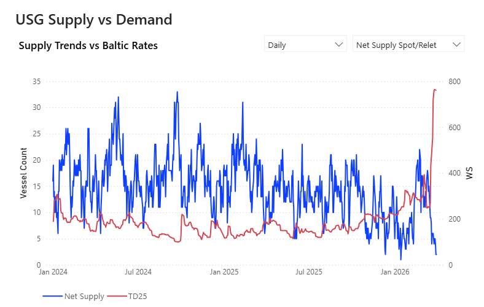
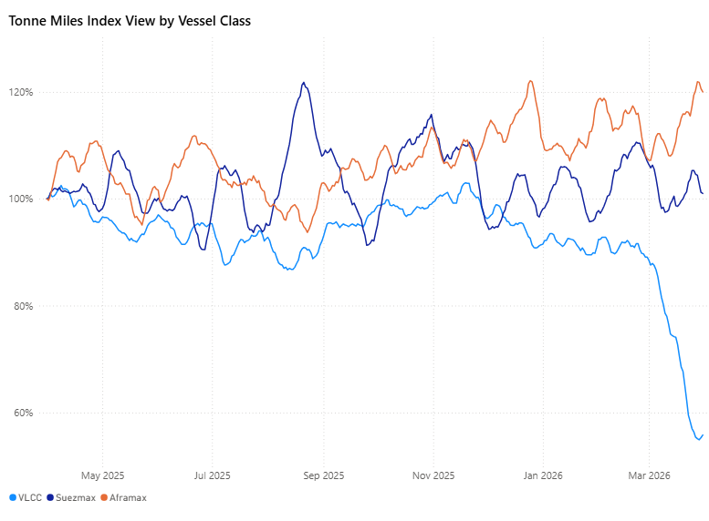

# Weekly Tanker Market Monitor: Week 14, 2026

**Date**: April 1, 2026 | **Category**: Tankers | **Section**: Monitors | **Source**: [https://www.thesignalgroup.com/weekly-market-monitor/weekly-tanker-market-monitor-week-14-2026](https://www.thesignalgroup.com/weekly-market-monitor/weekly-tanker-market-monitor-week-14-2026)

---

## ‍Spotlight of the Week | Yanbu Loadings March

![All data and commentary reflect market conditions as of [Tuesday, 31 March 2026], unless otherwise stated. (Oil FlowsTrend Analysis)](../images/69cd22c454534930f86506be_807775d2.png)
*All data and commentary reflect market conditions as of [Tuesday, 31 March 2026], unless otherwise stated. (Oil FlowsTrend Analysis)*

## A Month On: Our Hormuz Call Validated

One month ago, in ourWeek 08, 2026 Tanker Market Monitor, we drew our readers' attention to the mounting geopolitical risk building around the Strait of Hormuz, flagging the corridor as a potential flashpoint with direct implications for tanker freight. At the time, the VLCC market was already responding to early signals of supply tightness, with TCE rates on the Middle East Gulf-to-China route having surged past $200,000/day, a level that reflected not only strong physical demand but also a measurable geopolitical risk premium. We noted that uncertainty alone, even absent an actual disruption, was sufficient to reshape chartering behaviour and tighten effective fleet supply. That assessment has since been validated in full.

## The Supply Shock: Three Simultaneous Disruptions

Four weeks on, the risk we foresaw has crystallised into a multi-front supply shock of historic proportions. The tanker freight market is now navigating three distinct and severe disruptions to global crude supply simultaneously.

- Russia – Baltic Terminals: Ukrainian drone strikes have damaged the Ust-Luga and Primorsk export terminals on Russia's Baltic coast, temporarily halting an estimated to about 40% of Russia's seaborne trade, with Russian oil producers now facing the prospect of declaring force majeure on deliveries from Baltic Sea ports.
- Strait of Hormuz: The strait remains effectively closed in the context of the ongoing US-Iran conflict, severing the world's most critical crude export corridor.
- Iraq: Oil production has slumped by almost 80% since the beginning of the US-Iran conflict, with output from the country's southern oilfields plunging to just 800,000 b/d and total offline capacity reaching 3.5 million b/d, as storage capacity approaches tank-top conditions.

## Diplomatic Window: Narrow and Uncertain

On the diplomatic front, US President Donald Trump has extended his deadline for Iran to reopen the Strait of Hormuz, now set for April 6th, claiming that negotiations with Tehran were going very well, even as Iran formally rejected his 15-point proposal to end the ongoing US-Iran war. The extension offers a narrow window of diplomatic optionality, and market participants are not pricing in a swift normalisation. With each passing week, the operational and contractual damage compounds, and the structural reorientation of trade flows continues to deepen regardless of the diplomatic outcome.

## Freight Market: Rate Levels vs. Physical Reality

In the freight market, the critical distinction that must be drawn is between rate levels and physical market activity, and the two have rarely been more disconnected than they are today. While VLCC earnings are being quoted at extraordinary levels, the Arabian Gulf loading market has effectively seized up. Fixture activity out of the AG is running at a fraction of what would be considered normal for this time of year. The overwhelming majority of owners with vessels positioned in or near the Gulf are declining to engage, either awaiting clarity on the diplomatic track ahead of the April 6th deadline or facing outright refusal from their war-risk underwriters to grant cover for Hormuz transit.

## Escalation: Yanbu and the Loss of the Last Bypass

Since March 28, when Houthi forces entered the conflict with ballistic missile strikes against Israel, the group has sustained a pattern of escalation through repeated launches. The latest attacktoday, part of an ongoing series and described as coordinated with Iran and Hezbollah, combined with explicit warnings that they will not allow the Red Sea to be used for US or Israeli operations against Iran, signals a widening of the conflict across both geographic and operational domains. This expanding threat envelope raises the risk that disruption could extend further up the Red Sea, including toward critical Saudi infrastructure such as Yanbu.

Yanbu has historically served as a release valve for Arabian Gulf supply constraints, receiving crude via the Saudi East-West pipeline and loading it for westbound voyages, effectively bypassing the Strait of Hormuz. However, the pipeline has never been sustained at full capacity over a prolonged period; logistical constraints, infrastructure limitations, and upstream coordination challenges have consistently prevented it from serving as a seamless long-run substitute for Gulf loadings.

With risk perceptions now extending further up the Red Sea, potentially encompassing key Saudi infrastructure such as Yanbu, the market is confronting a scenario in which two of the most strategically critical corridors for global crude exports, the Strait of Hormuz and the Red Sea, are simultaneously exposed to elevated and evolving threat levels. The previous phase of Red Sea disruptions had already pushed Cape of Good Hope diversions into becoming the operational default for a significant share of East–West voyages. That dynamic now appears to be re-emerging, with freight on TD15 and TD22 reflecting increased volatility, driven by a combination of rerouting inefficiencies and rising security risk premiums.

Signal Ocean Data: Across the entirety of March 2026, Yanbu recorded 47 VLCC liftings, versus a monthly average of 11–12 in January–February, a near four-fold increase that underscores how rapidly the market has reoriented around the only remaining bypass corridor, which is now itself under threat.

With the Arabian Gulf facing significant disruption and the Red Sea increasingly exposed to renewed security risks, the seaborne crude market is operating under heightened strain across its two primary Middle Eastern export arteries. While flows have not ceased, conditions are severely constrained and subject to rapid deterioration, creating a risk environment with few clear precedents in the modern history of the tanker market.

## Knock-On Effects: India's Energy Crisis Deepens

The knock-on effects for importing nations are equally severe. India, one of the world's largest crude importers, is now facing a deepening energy crisis:

- India’s strategic petroleum reservesare filled to about 64% of their total capacity, which would cover roughly five days of demand at current consumption levels, junior petroleum minister Suresh Gopi told Parliament.
- The country maintains these reserves across three sites in Andhra Pradesh and Karnataka, with a combined storage capacity of 5.3 million metric tonnes of crude oil. At present, around 3.37 MMT (or 24.7 million barrels) is in storage, serving as a short-term safeguard against supply disruptions. India’s daily oil consumption stands at about 5 million barrels.
- Nayara Energy's Vadinar refinery has entered an extended 35-day shutdown, threatening domestic fuel supply.
- Reliance Industries has denied any resumption of Iranian crude purchases, stating its last intake was in April 2019. However, Signal Ocean AIS data shows the US-sanctioned Aframax tankerPing Shunloaded crude at Iran’s Kharg Island and is currently signaling Vadinar, India as its destination. While this points to Iranian crude potentially heading toward India, AIS signals do not confirm final discharge or buyer. There is no verifiable evidence linking this cargo to Reliance or any specific Indian refiner.

*Signal Figure*

## Signal Intelligence: Hormuz Storage Capacity Exhausted

One of the more significant observations this week came from the Signal Group chartering desk, which identified a critical divergence between spare and utilised tanker capacity inside the Strait of Hormuz as of March 29. When cross-referencing current capacity data from Signal DataWarehouse against the position at the onset of the conflict, the conclusion is stark: crude tanker storage capacity inside Hormuz has been effectively exhausted.

What this shift means in practical terms is a fundamental change in the risk. The Hormuz narrative, until now framed largely around transit disruption, has crossed into materially different territory. With no meaningful spare capacity remaining on crude tankers in the region, any escalation no longer carries the risk of a slowdown; it carries the risk of a supply shutdown.

*Source: Signal Ocean Data Warehouse*

## Freight Market Overview - Dirty

TheBaltic Dirty Tanker Index(BDTI) reached a new historical high of  3,723 points as of March 30, 2026 (+230% YoY), a surge compared to 1,481 points recorded at the same point in 2023. The sharp acceleration seen from late February into March reflects the compounding impact of ongoing strait and chokepoint disruptions on market sentiment and vessel availability.

*(Market Prices availableDirty)*

## DirtyTCE$/DAY

## VLCC | Suezmax | Aframax Mixed Trends

TD3CMiddle East Gulf to China |TD6Black Sea to Mediterranean |TD7North Sea to Continent

The dirty tanker market into end-March is characterised by Suezmax strength, a firm Aframax tone, and a divergent VLCC picture, with AG routes holding well above historical averages. At the same time, West Africa and USG trade lanes underperform relative to other trade lanes.

*Source: Signal Ocean / Baltic Exchange. Indicative late-March assessments, subject to revision.*

- VLCC: The Middle East Gulf (AG) routes remain the strongest performers in the tanker market. Specifically, the TD3C-TCE (Middle East Gulf to China) and TD2-TCE (Middle East Gulf to Singapore) are still holding well above their 52-week average of $100k/d, despite having dropped significantly from the exceptional highs of $600k/d seen earlier in March.

In contrast, the Atlantic market is showing signs of softness. The TD15-TCE (West Africa to China) has recorded a steep monthly decline, widening the gap considerably with the AG routes. Similarly, the TD22-TCE (US Gulf to China) reflects near-term weakness. Nevertheless, both Atlantic routes maintain solid positive year-on-year gains, highlighting the outstanding overall improvement experienced over the past twelve months.

- Suezmax: The TD23-TCE (Middle East Gulf to Mediterranean) route reached a 52-week peak, surpassing $380k/d. Similarly, the TD6-TCE (Black Sea to Mediterranean) route experienced exceptional weekly and monthly gains, with rates climbing to $338k/d. While the TD20-TCE (West Africa to UK-Continent) has shown strong year-on-year performance, recent daily softening suggests a near-term dip below $200,000 per day, compared to its 52-week high of $216,000 per day.

- Aframax: Atlantic Aframax maintains a firm tone into end-March. TD26-TCE (East Coast Mexico to US Gulf) leads the cohort with the strongest weekly gain of xs $160k/d and surged to around $370k/d. TD7-TCE (North Sea to Continent) and TD19-TCE (Cross Mediterranean) also reflected a sustained rally at a peak of $300k/d.

*(Spot Comparison availablehere)*

## SUPPLY MARKET TRENDS

This week, the VLCC West African market takes centre stage, where a pronounced build-up of ballast tonnage across both the 10- and 20-day availability windows is pointing to an increasingly competitive fixing environment. In contrast, the Aframax segment tells a different story; the USG area continues to stand out with a tightening tonnage picture.

VLCC |WAfr

- The latestSignal Ocean Platformfigures indicate an oversupplied market on the TD15 route (from mid-April onwards), with the vessel list showing multiple units in available ballast status, both Spot/Relet and Contract/Program categories, all open as of 31 March.

‍

*Signal Figure*

- TheNet Supply Spot/Reletcurrently stands at 20 vessels (down 9% WoW), while Gross Supply sits at 48 (70% of total), with a Net/Gross ratio of 42%.

*Signal Figure*

Aframax| USG

- The undersupply theme in theUSGAframax market is easily noticeable when examining the availability breakdown in detail. Prompt ballast tonnage is almost absent from the fixing window, with the vessel list dominated by units already Fully Fixed, Possibly Fixed, or in Waiting/Loading and Available Laden status. Of the entire list, only a single Available Ballast unit — MH Gladiator — is showing prompt availability, leaving charterers with an exceptionally thin pool of free tonnage to work with. With Spot/Relet arrivals to USG over the next 10 days offering limited relief, the balance of power firmly favors owners, and any new cargo inquiry is likely to be met with strong resistance on rates.

*Signal Figure*

- Adding further weight to the tightness narrative, the USG Net Supply Spot/Relet has collapsed to just 2 vessels, a drop of 67% week-on-week and what appears to be a record low over the observed period.

*Signal Figure*

## ‍DIRTY DEMAND(TONNE MILES)| 7D MA - INDEX VIEW

VLCC ↓3.0% WoW| Suezmax ↓2.5% WoW| Aframax ↑5.1%WoW

*Signal Figure*

VLCCs extended their underperformance, declining 3.0 ppts WoW to 55.3%, remaining well below the 100% threshold and highlighting continued demand weakness. Suezmaxes softened modestly, down 2.5 ppts WoW to 101.2%, though still holding slightly above the 100% mark and maintaining relative resilience. Aframaxes moved in the opposite direction, rising 5.1 ppts WoW to 120.6%, strengthening further and clearly outperforming the rest of the complex. Overall, the market reflects a three-speed dynamic: persistent VLCC weakness, stable-to-soft Suezmax performance, and continued Aframax strength.

Metrics Description:Index View(Base 100) by total Tonne Miles over the selected period. This facilitates relative performance comparisons between segments of different sizes (e.g., comparing the growth rate of VLCC vs Suezmax)

For the latest updates and insights, make sure to visit theSignal Ocean Newsroompage &subscribe to weekly reports. Clickhere to request a demo. Click here to see theprevious tanker weeklyreport.

For subscription to our FREE weekly market trends email, please contact us: research@thesignalgroup.com

-Republishing is allowed with an active link to the source
