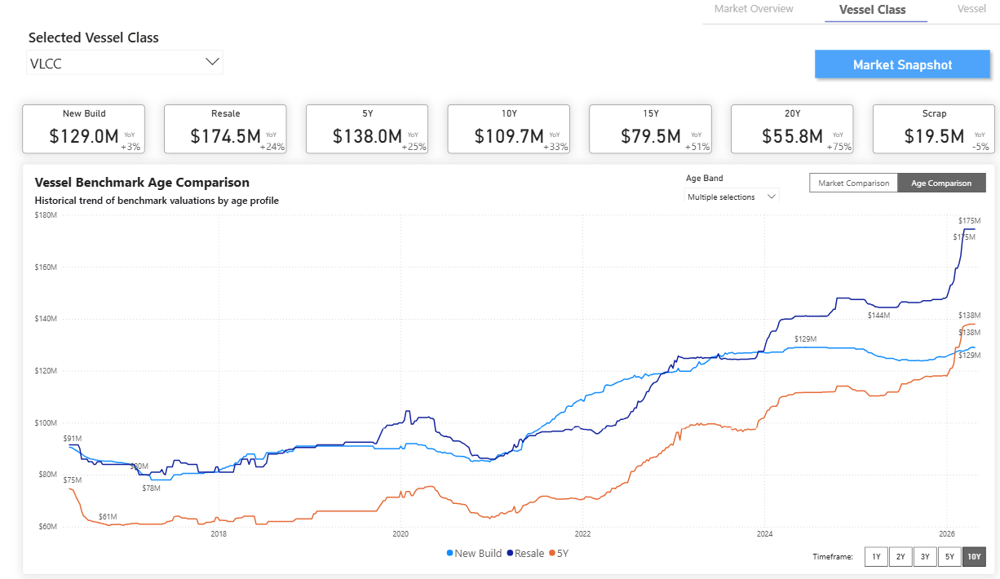
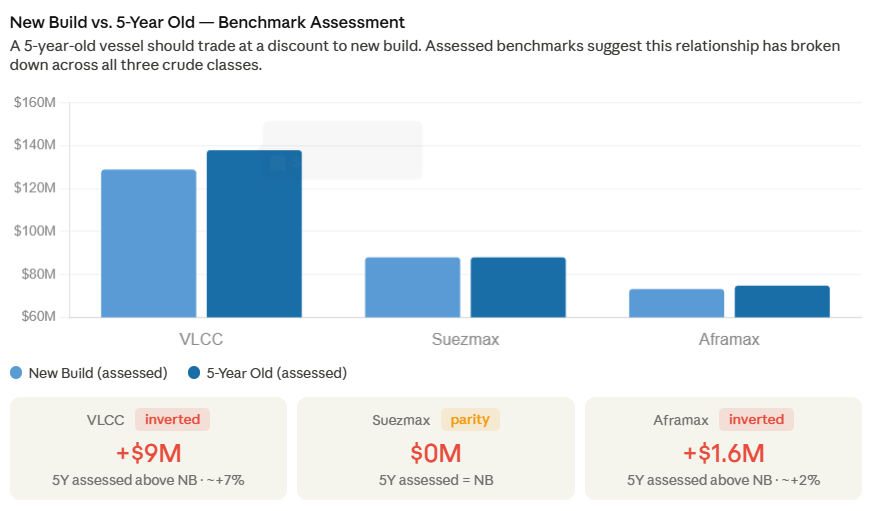
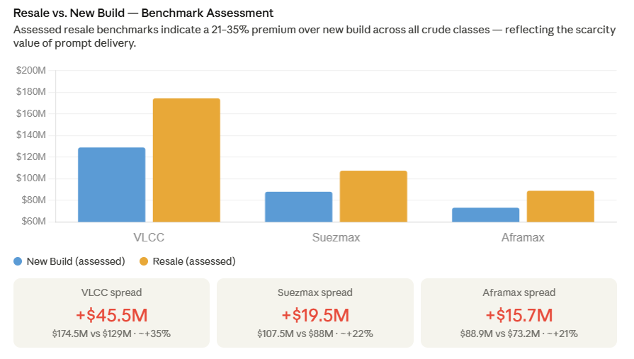
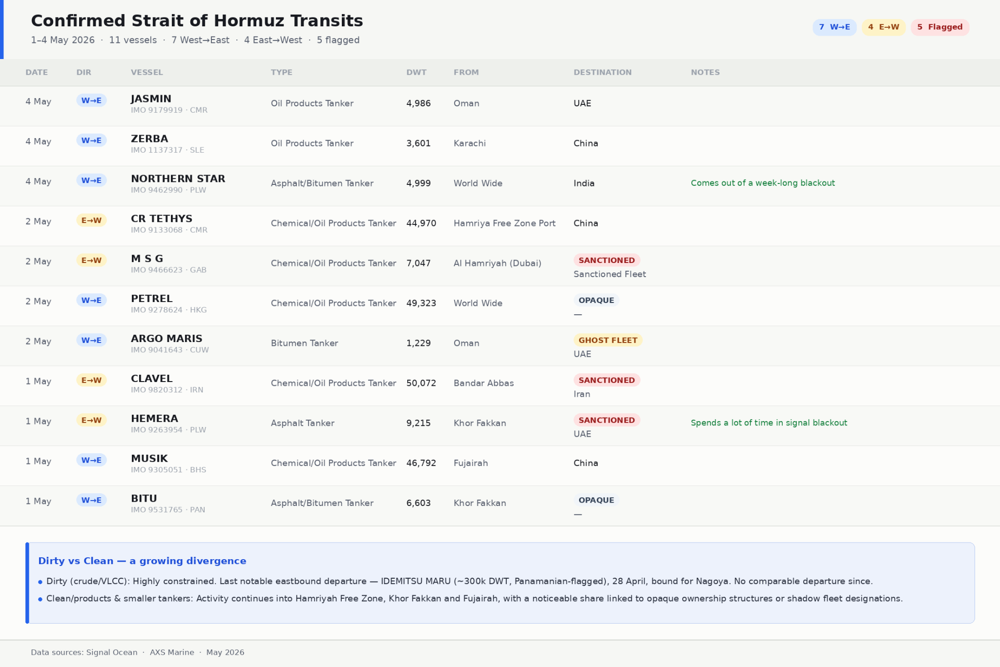
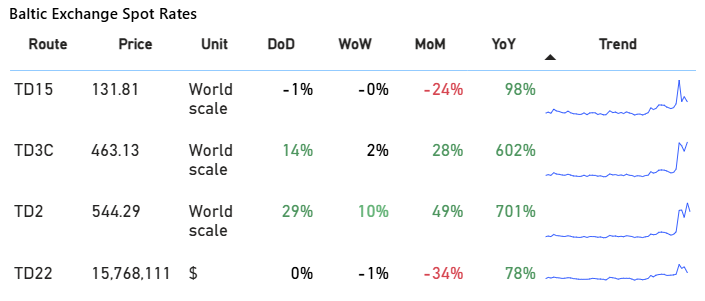
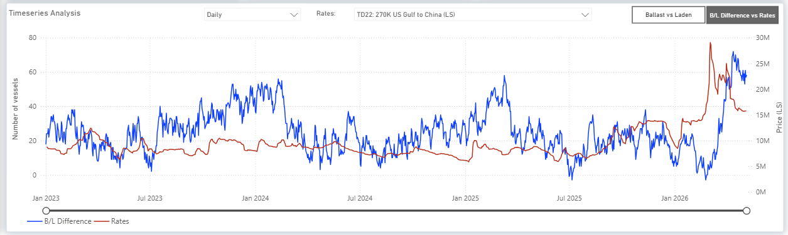
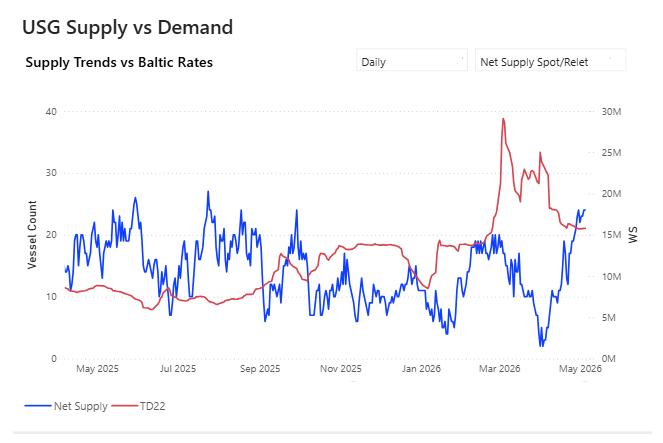
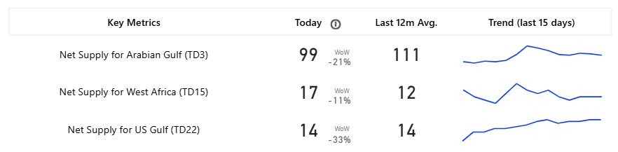
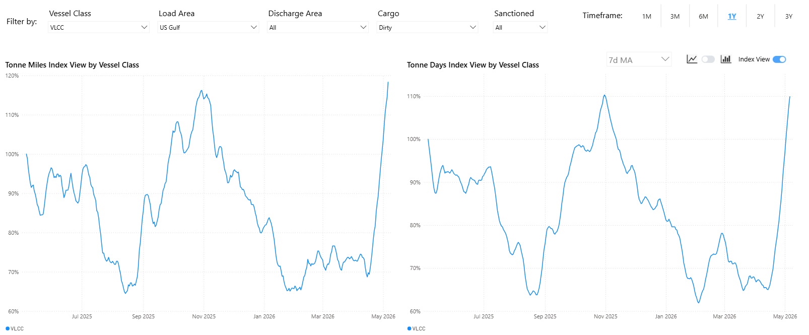

# Weekly Tanker Market Monitor: Week 19, 2026

**Date**: May 07, 2026 | **Category**: Tankers | **Section**: Monitors | **Source**: [https://www.thesignalgroup.com/weekly-market-monitor/weekly-tanker-market-monitor-week-19-2026](https://www.thesignalgroup.com/weekly-market-monitor/weekly-tanker-market-monitor-week-19-2026)

---

## Spotlight |Asset Benchmark Assessments— NB vs 5Y & NB vs Resale

Asset market anomaly - not just freight

*Indicative benchmark valuations by age profile*

We take a closer look at the evolution of ship price assessment in the crude carrier segment. At the end ofFebruary,we highlighted growth in values for the VLCC segment and foresaw an upward trend, despite the threat of geopolitical risk at the time. We also highlighted the age discount tightening and the narrowing of the spread between five- and ten-year-old vessels, with buyers’ interest in mid-aged tonnage. Now, after more than 60 days of Hormuz disruption, we review the evolution again, and it seems that the age depreciation curve has been lost.

In normal conditions, a resale vessel earns a modest premium for saved wait time, and a 5-year-old ship trades at a clear discount to a new build. Neither is true today. VLCC 5-year-old tonnage trades $9M above a new build contract; Suezmax sits at dead flat; Aframax has also inverted. On the resale side, buyers are paying 21–35% over NB, $45.5M excess on a VLCC alone, purely for prompt availability.

*Signal Figure*

*Signal Figure*

*Benchmark MethodologyValuations for newbuilds, resale, and age-specific benchmarks are derived from statistical models based on benchmark vessels per vessel class.· VLCC benchmark: 310k dwt (44,170 lwt), built in Korea  ·  Suezmax benchmark: 157k dwt (24,387 lwt), built in Korea  ·  Aframax benchmark: 114k dwt (18,899 lwt), built in Korea*

## Vessel Crossings | May observations

Disruption in the Middle East has continued to dominate oil and tanker market dynamics, with tanker transits through the Strait remaining >95% below pre-conflict levels.

*Signal Figure*

## Transits on Iranian waters

Iran’s new routing regime around Larak Island has increased the degree of political and military oversight applied to commercial transit through the Strait of Hormuz.

Iran’s Islamic Revolutionary Guard Corps (IRGC) has instructed commercial vessels seeking transit through the strait to coordinate with Iranian authorities and follow designated routes near Larak Island.

Under the reported routing pattern, inbound vessels heading into the Gulf pass north of Larak Island near the Iranian coastline, while outbound vessels transit south of the island. The arrangement shifts traffic closer to waters claimed by Iran and gives the IRGC greater ability to monitor passing ships.

Iran has also described controlled or restricted monitoring areas between the traffic lanes overseen by the IRGC. This represents a departure from the traditional traffic separation scheme, which relied more heavily on routes associated with Omani waters and internationally managed navigation patterns.

While international maritime law still recognizes transit rights through the Strait of Hormuz, critics argue that the new system increases Iranian operational control over vessels during passage.

## The Mine Threat

Crucially, the operational outlook remains constrained by the mine threat. Although US and allied naval forces are expected to prioritize mine countermeasure operations, some warnings indicate that fully securing the Strait could take months, and that some residual mine risk may persist even after clearance efforts.

This lingering uncertainty is central to the freight outlook, as marine insurers are generally less constrained by volatility than by difficult-to-quantify security risk. Without clear visibility on residual mine threats, predictable operating conditions, and sustained freedom of navigation, war risk cover is likely to remain restricted, selectively available, or prohibitively expensive.

As a result, even if partial transit resumes through routes designated by Iranian authorities, traffic is likely to remain constrained and operationally inefficient, reinforcing vessel displacement toward the Atlantic Basin and sustaining elevated freight rates.

The net effect could be a more durable reconfiguration of tanker markets, in which insurance constraints and security uncertainty, not just physical disruption, support Atlantic Basin strength and increase the strategic importance of US Gulf-driven flows.

## Oil Macro

Hormuz transit risk is no longer a temporary overhang, and the East-West split deepens in the freight market. The supply shock is historic in scale. IEA has placed the current disruption above 1973, 1979, and 2022 in severity, 12 million bpd of crude supply affected versus 5 million bpd during the OPEC embargo. Brent above $110 and WTI above $100 are the market's response to that arithmetic.

Two producer-side developments complicate the picture. The UAE's departure from OPEC signals a longer-term pivot toward unconstrained output growth, relevant for post-normalisation supply, less so for today's constrained flows. Meanwhile, the 188kbd OPEC+ increase agreed by remaining members, including Kuwait, appears to be too small to significantly offset Hormuz-scale disruption and reads more as a political signal than a market intervention. Asian importers are feeling the squeeze most acutely, with Middle Eastern crude arrivals down sharply and U.S. barrels partially, but not fully, filling the gap.

## FREIGHT | VLCC latest signal trends

*Signal Figure*

With Atlantic freight markets increasingly driven by supply-side signals, one clear trend has been the growing number of ballast VLCCs in the US Gulf. Average vessel counts have risen toward the 60 mark, contributing to the downward pressure on rates observed at the start of May.

*https://app.signalocean.com/tanker/dynamic/vessel_count_tanker*

Based on the current supply levels, the TD22 route has shown an increasing trend over the last 15 days, with the daily vessel count now more than 20, compared with a record low of 2 at the start of April.

*Signal Figure*

Current monthly freight metrics indicate a 34% decline, though the year-on-year increase remains substantial at 78%. While net supply has been trending upward since mid-April, this has not yet translated into a significant market correction. However, the rapid buildup of ballasting vessels may begin to exert more downward pressure in the near term. A review of the net supply over the past 15 days shows that the West African (TD15) route is experiencing a downward trend; despite this, market sentiment for the current week remains stable with no notable volatility.

*https://app.signalocean.com/tanker/dynamic/vlcc_insights_downloadable*

For freight markets, the impact is less about a complete halt in global flows and more about the severe distortion of vessel availability and trade patterns caused by the dual-sided blockade of the Strait of Hormuz. The combination of physical transit restrictions, unresolved mine risk, elevated war risk premiums, and the absence of reliable freedom of navigation has effectively prevented a large share of the mainstream international tanker fleet from operating through the region. This has accelerated the reallocation of vessels from the Gulf toward the Atlantic Basin, reinforcing the role of the US Gulf as a key marginal supplier, particularly into Asia, and driving a substantial increase in tonne-mile demand as longer haul Atlantic routes replace disrupted Middle Eastern exports.

*https://app.signalocean.com/tanker/dynamic/timeseries_tanker*

For the latest updates and insights, make sure to visit theSignal Ocean Newsroompage &subscribe to weekly reports. Clickhere to request a demo. Click here to see theprevious tanker weeklyreport.

For subscription to our FREE weekly market trends email, please contact us: research@thesignalgroup.com

-Republishing is allowed with an active link to the source
