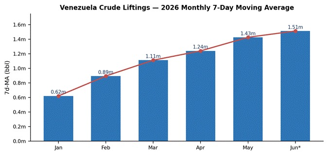
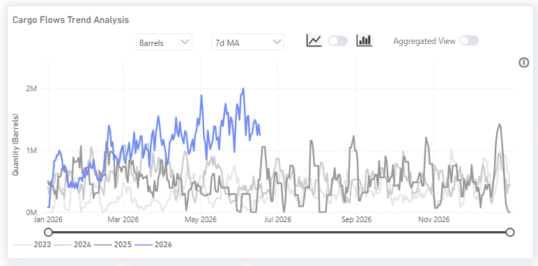
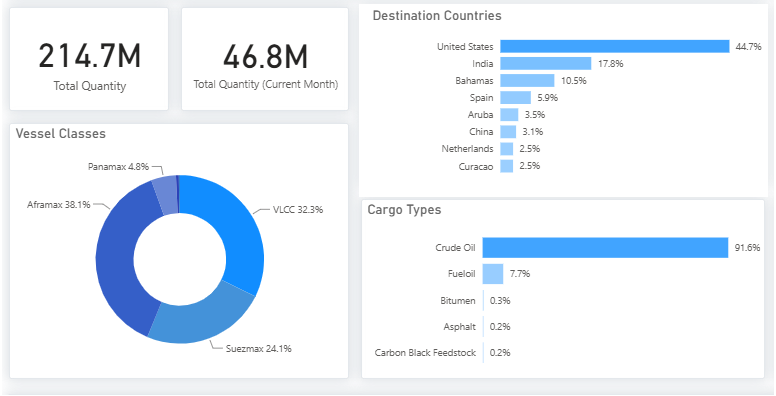
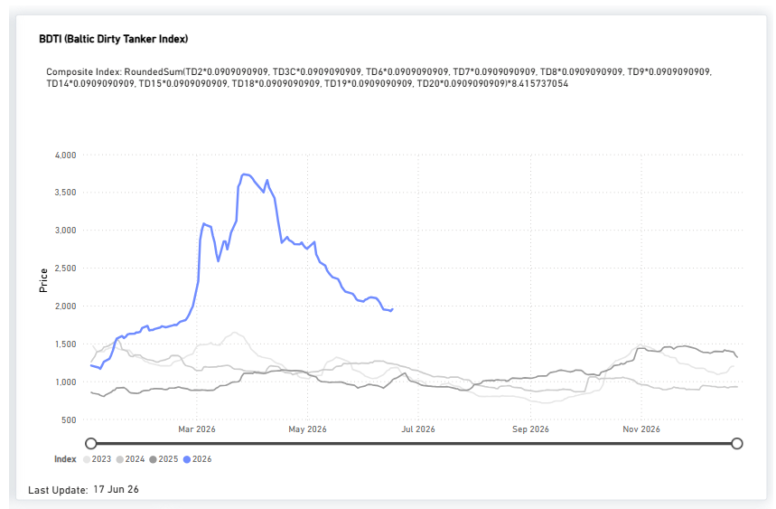
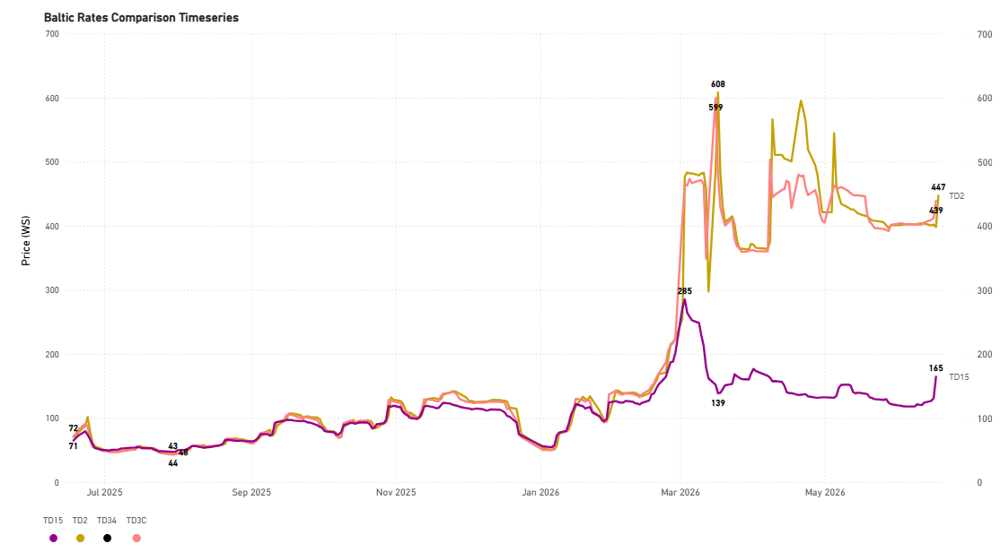
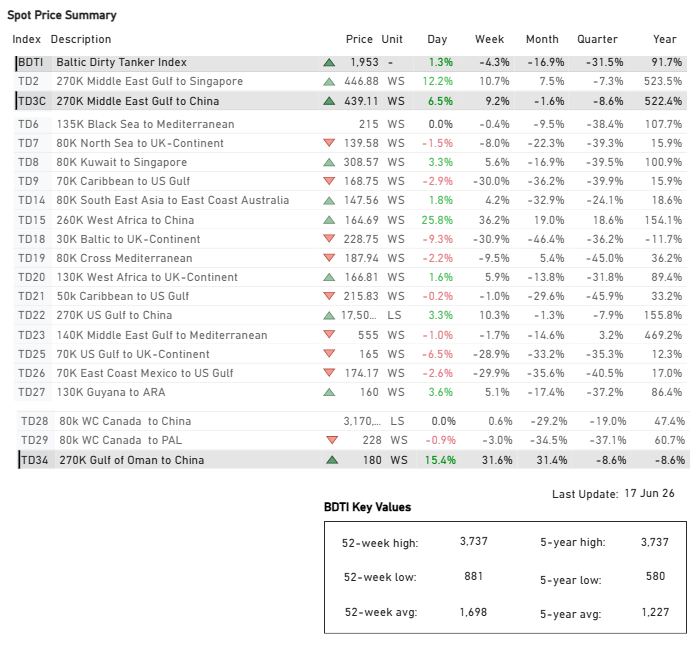
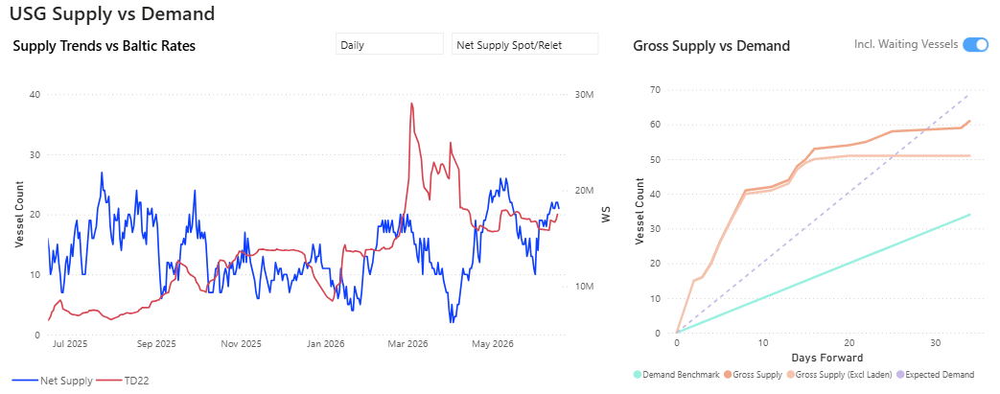
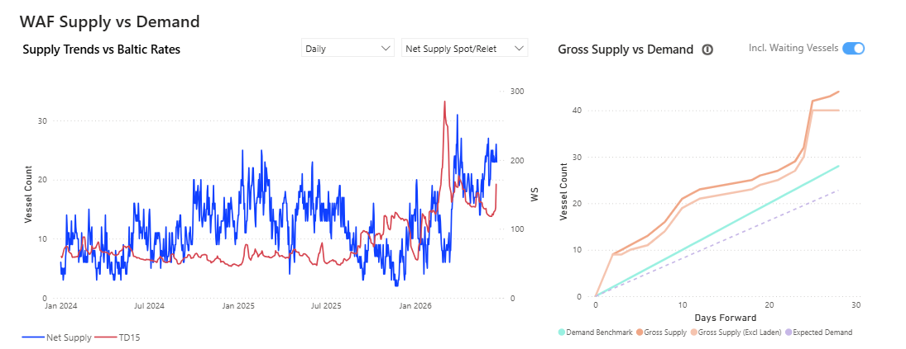
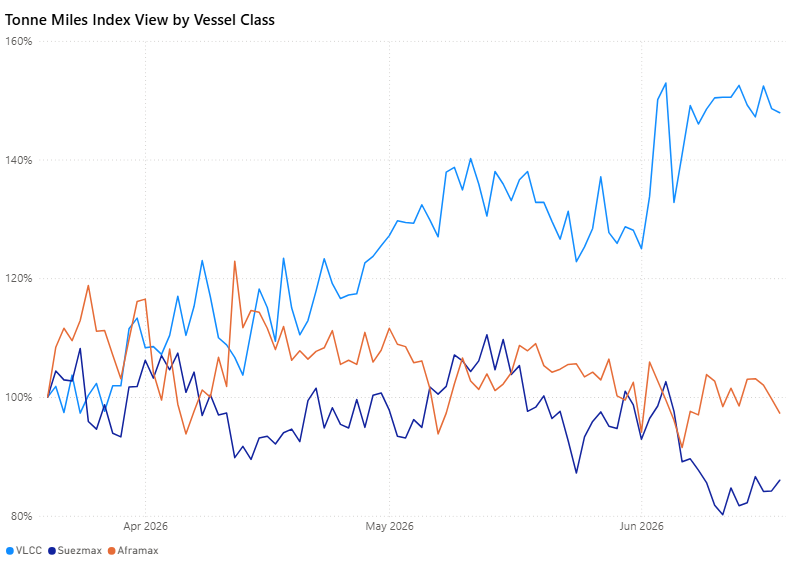

# Weekly Tanker Market Monitor: Week 25, 2026

**Date**: June 23, 2026 | **Category**: Tankers | **Section**: Monitors | **Source**: [https://www.thesignalgroup.com/weekly-market-monitor/weekly-tanker-market-monitor-week-25-2026](https://www.thesignalgroup.com/weekly-market-monitor/weekly-tanker-market-monitor-week-25-2026)

---

## ‍Spotlight of the Week| Venezuelan Crude Oil Flows‍

Signal Oceanvoyage data confirms a sustained ramp in seaborne crude liftings from Venezuela through 2026. On a7-daymoving-average basis, monthly volumes have risen in unbroken succession from approximately 0.62m bbl in January to roughly 1.5m bbl by mid-June, six consecutive month-on-month gains and an increase of about 144% over the period. The series peaked above 2.0m bbl in early May, and the year-to-date average (~1.10m bbl) runs at roughly double the 2024 and 2025 full-year levels.

‍

*Signal Figure*

‍

The recovery began in January–February, following the reinstatement of several US licenses for Venezuela-related energy activities. Momentum strengthened further after June 10, 2026, when the US Treasury (OFAC) eased additional general licenses covering oil, gas, and mineral extraction, effectively extending and broadening the scope of existing authorizations. Cargoes are being marketed by Vitol and Trafigura, while SLB has signed a long-term framework agreement with PDVSA to support modernization and production growth, highlighting the gradual re-engagement of mainstream international counterparties in the Venezuelan energy sector.

## Signal Ocean Platform - Oil Flows

The views below are taken directly from the Signal Ocean platform'sOil Flowsdashboard. The first sets 2026 against prior years; the second isolates the 2026 picture by destination, vessel class, and cargo type.

Historical comparison — Venezuela crude liftings, 2026 vs prior years

*7-day moving average of barrels. The 2026 line (blue) runs clear of 2023–2025 throughout the year to date.(Oil FlowsTrend Analysis)*

## 2026 focus — destinations, vessel classes, and cargo mix

*2026 to date: destination countries, vessel-class split, and cargo types (Signal Ocean).*

The platform detail reinforces three points. Destinations: the United States leads at 44.7% of 2026 flows, followed by India at 17.8% and the Bahamas at 10.5%. Vessel classes: Aframax holds the largest share at 38%, ahead of VLCC at 32% and Suezmax at 24%, reflecting the Caribbean short-haul and intermediate-haul nature of much of the trade. Cargo mix: crude dominates at 92% of liftings, with fuel oil the next largest at 8%.

Venezuela's production recovery is contributing to higher South American crude exports alongside those of Brazil and Guyana, increasing the region's significance in global crude trade flows. As concerns over the full normalization of oil flows in the Strait of Hormuz persist, rising South American exports provide refiners with greater flexibility to diversify feedstock sourcing away from Middle Eastern barrels.

The United States remains the dominant destination in our platform data, accounting for 45% of projected 2026 flows, while the easing of operating restrictions supports higher Venezuelan crude intake by US refiners. This dynamic should increase demand for regional tanker employment, particularly in the Aframax segment, which accounts for 38% of observed liftings, ahead of VLCCs (32%) and Suezmaxes (24%).

Long-haul exports to Asia could provide an additional source of tonne-mile growth. India represents the second-largest destination in our data, accounting for 18% of estimated year to date flows. Sustained export growth on these routes would support demand for larger tanker classes, particularly Suezmaxes and VLCCs, which are better suited to long-distance voyages and together account for more than half of the vessel mix serving Venezuelan exports.

All data and commentary reflect market conditions as of [Thursday, 18 June 2026], unless otherwise stated.

## Freight Market Overview - Dirty

TheBaltic Dirty Tanker Index(BDTI) surged to a multi-year high of 3,737 points in early April 2026, highlighting the significant impact of Middle East geopolitical tensions on crude tanker markets. Elevated uncertainty surrounding vessel transit through the Strait of Hormuz increased freight risk premiums, reduced effective vessel availability, and intensified competition for available tonnage, driving freight rates to historic highs across key crude oil routes.

*(Market Prices availableDirty)*

By17 June 2026, the index had eased to 1,953 points, as diplomatic progress between the United States and Iran reduced concerns over potential disruptions to Gulf crude exports. The decline reflects a partial normalization of freight markets following the unwinding of extreme geopolitical risk premiums. Nevertheless, tanker earnings remain elevated relative to historical averages, suggesting that residual geopolitical uncertainty, ongoing fleet inefficiencies, and the critical role of Middle Eastern exports in global oil balances continue to provide underlying support to freight markets.

## DirtyVLCC

VLCC |

TD2Middle East Gulf to Singapore| TD3CMiddle East Gulf to China |TD15West African to China |TD34Gulf of Oman to China

*Signal Figure*

(Spot Comparison availablehere)

Recent diplomatic developments between the United States and Iran have shifted market attention toward freight performance on key Middle East crude export routes. The strongest moves were recorded in the VLCC segment, with both the Middle East Gulf–China route (TD3C) and the Gulf of Oman–China route (TD34) posting substantial gains despite weakness in the broader tanker market.

TD3C increased 9.2% week-on-week to 439.1 WS, while TD34 rose 31.6% to 180 WS, reversing several weeks of limited rate movement. This contrasts with the broader Baltic Dirty Tanker Index (BDTI), which declined 4.3% over the same period to 1,953 points.

The outperformance of these Gulf-linked routes indicates that freight sentiment remains particularly sensitive to developments affecting Middle East crude exports. As a result, TD3C and TD34 will remain key indicators to watch as the market reassesses operating conditions across the Gulf and their implications for crude tanker demand.

‍

*(Market Prices availableDirty)*

## SUPPLY MARKET TRENDS

This week, the VLCC USG market takes centre stage, where signals of an oversupplied picture have started to reflect in the freight market sentiment.

VLCC | USG & West Africa Supply Trends

- VLCC Insights from theSignal Ocean Platformindicates that the TD22 route shifted into an oversupplied state starting in late May. After the net vessel count climbed from 11 to more than 20 by mid-May, current forecasts for the next 10 to 20 days suggest that supply growth continues to outpace projected demand.

*Signal Figure*

- A similar surplus is evident in the West African market, where the net vessel count has remained above 20 since early June. Although this is down from a peak of 31 at the end of May, the oversupply is expected to intensify over the next 10 to 20 days, paralleling the conditions observed in the USG and signaling a broader oversupplied market environment.

*Signal Figure*

‍

Persistent vessel surpluses in both the US Gulf and West Africa are likely to limit upside potential for VLCC freight rates in the near term, particularly on TD22 and TD15, unless cargo demand accelerates materially.

## DIRTY DEMAND(TONNE MILES)| 7D MA - INDEX VIEW

‍VLCC ↓1.7% WoW| Suezmax ↑7.0% WoW| Aframax ↓1.1% WoW

‍

*Signal Figure*

VLCC tonne-mile demand eased further, declining 2.6 ppts WoW to 147.9%, though remaining by far the strongest segment and well above historical norms. Suezmaxes posted the largest weekly improvement, rising 5.8 ppts WoW to 86.0%, recovering from recent lows but remaining below the 100% threshold. Aframaxes softened marginally, down 1.1 ppts WoW to 97.3%, hovering just below parity and broadly stable compared with the previous week.

Metrics Description:Index View(Base 100) by total Tonne Miles over the selected period. This facilitates relative performance comparisons between segments of different sizes (e.g., comparing the growth rate of VLCC vs Suezmax)

‍

For the latest updates and insights, make sure to visit theSignal Ocean Newsroompage &subscribe to weekly reports. Clickhere to request a demo. Click here to see theprevious tanker weeklyreport.

For subscription to our FREE weekly market trends email, please contact us: research@thesignalgroup.com

-Republishing is allowed with an active link to the source
