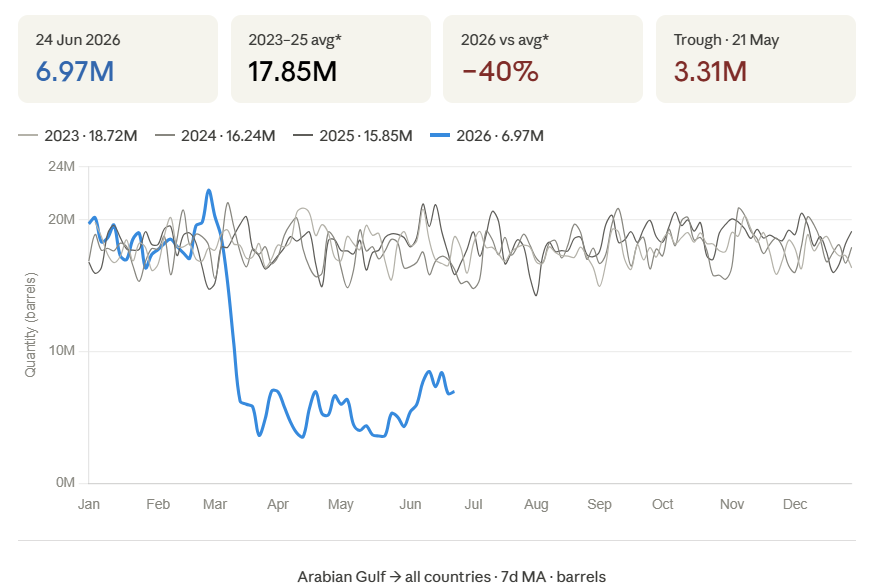
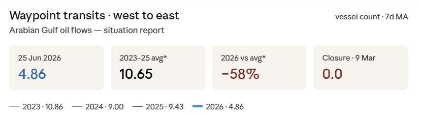
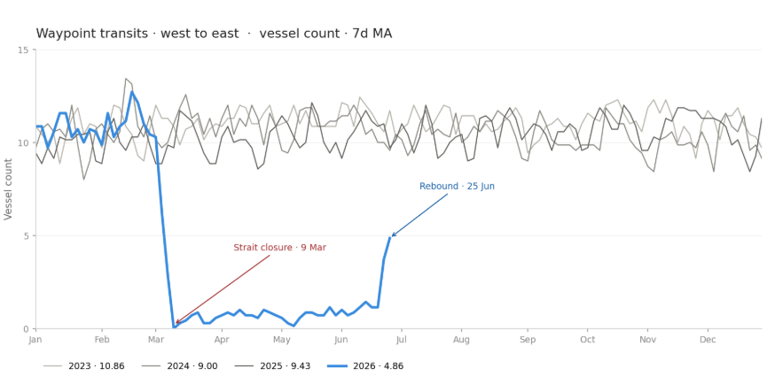
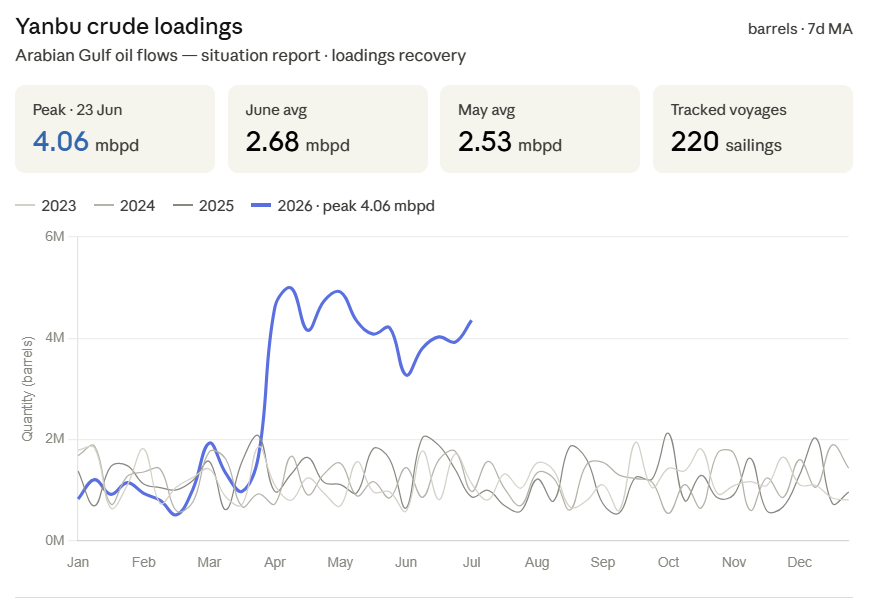
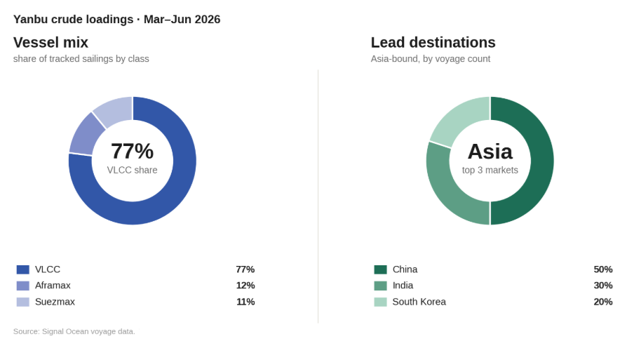
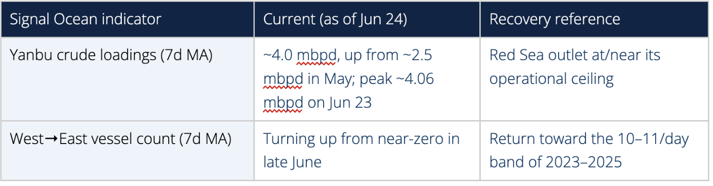

# Weekly Tanker Market Monitor: Week 26, 2026

**Date**: June 23, 2026 | **Category**: Tankers | **Section**: Monitors | **Source**: [https://www.thesignalgroup.com/weekly-market-monitor/weekly-tanker-market-monitor-week-26-2026](https://www.thesignalgroup.com/weekly-market-monitor/weekly-tanker-market-monitor-week-26-2026)

---

## Spotlight of the Week| AG Dirty Oil Flows

Arabian Gulf dirty-cargo flows, 2026 (blue) vs. 2023–2025. Flows collapse from early March and remain depressed through Q2.

*(Oil FlowsTrend Analysis)*

The 2026 trend (blue) sits far below its 2023–2025 range, the visible fingerprint of the wartime collapse. Flows tracked the historical norm through mid-March, fell off a cliff in the last week of March, and bottomed at 3.31M barrels on 21 May. The series has since recovered to 6.97M barrels on 24 June, but the year-to-date average of 10.68M remains about 40% below the three-year same-window average of 17.85M.

*Signal Figure*

‍

*West→East vessel count (7-day moving average)*

West-to-East vessel count, smoothed on a 7-day moving average, tracks the prior-year range through February, then collapses to zero around 9 March when the strait closed. Transits hold near zero through May, a near-total halt of roughly eleven weeks, before turning sharply upward and reaching 4.86 on 25 June. That rebound is consistent with the loadings recovery seen in the cargo data, though transits remain about 58% below the 2023–2025 norm for the same window.

## Production-restoration announcements from Gulf countries

Externally reported guidance based on operator and government statements. The announced increases represent the restoration of production disrupted by the conflict rather than net-new supply.

- Iraq:The Oil Ministry aims to raise southern crude production above 3 million bpd within one to two months. Output has already recovered from a wartime low of 1.3 million bpd to around 1.75 million bpd, with 2 million bpd expected in the near term through the gradual restart of West Qurna 1, Majnoon, and Fauqi.
- Kuwait:Kuwait Petroleum Corporation (KPC) expects production to increase to 2 million bpd within one week, up from approximately 573,000 bpd during the disruption in May. Officials indicated that pre-conflict production levels could be restored within weeks, subject to the resumption of normal shipping operations.
- Saudi Arabia & UAE:Both countries maintained sufficient operational flexibility to restore curtailed production rapidly, while continuing to utilize export pipelines to Yanbu (Red Sea) and Fujairah (Gulf of Oman) to partially bypass the Strait of Hormuz. Industry estimates suggest that production could return to pre-conflict levels within approximately two weeks, although no formal restoration timetable has been officially announced.
- Qatar (LNG):Reported QatarEnergy guidance indicates that LNG production at Ras Laffan could recover to approximately 50% of normal capacity within around 30 days after secure shipping resumes, increasing to roughly 80% within around 60 days.

## Oman / IMO temporary maritime corridor

Oman, in coordination with the International Maritime Organization, has established a temporary maritime corridor for vessels transiting the Strait of Hormuz. This is the operational bridge between the production announcements and the vessel-count recovery: producers can ramp output, but barrels only move if vessels can transit safely. However, implementation has become more complex after the IRGC Navy rejected the southern Oman/IMO route and instructed vessels to use Iranian-designated corridors instead.

- Issued via navigation warning by the Oman National Hydrographic Office and the Royal Navy of Oman, in coordination with the IMO, to preserve freedom of navigation while addressing elevated safety and security concerns.
- Transit continues without tolls or transit fees, referencing understandings from recent U.S.–Iran efforts.
- The existing Traffic Separation Scheme (TSS) is currently not considered safe for normal use; movements are managed through a phased, IMO-coordinated system with regional coastal authorities.
- Ships are assigned to groups, directed to a designated waiting area, and given individual transit instructions before proceeding via temporary routes.
- Traffic may be temporarily suspended for safety, security, or naval deconfliction; AIS must remain active throughout, and vessels must maintain communication with coastal authorities.
- The IRGC Navy has rejected the Oman/IMO southern route, calling it unacceptable and warning that vessels should follow corridors designated by Iranian authorities. This creates competing navigation frameworks and may slow the normalization of tanker traffic despite the formal reopening of the Strait.

## Pipelines & the Red Sea outlet

The bypass routes that carried Gulf crude during the closure are not a temporary fix; they have become a durable feature of the export map. Saudi Arabia's East-West (Petroline) and the UAE's Habshan–Fujairah (ADCOP) line are the two material alternatives to Hormuz.

Yanbu tells the other half of the story. As Gulf transits stalled, loadings here climbed steadily from March and now run far above any prior year, a clear sign that crude is being rerouted to the Red Sea coast. The pace stepped up sharply after the 19 June deal, lifting daily loadings from about 2.7 to 4.0 mbpd within days and pushing the 7-day average to a 4.06 mbpd peak on 23 June. June's monthly average of 2.68 mbpd already edges out May's 2.53, and the late-month surge points to a stronger July.

*(Oil FlowsTrend Analysis)*

*Signal Figure*

Two signals track the recovery: Yanbu crude loadings and the West→East vessel count, both on a 7-day moving-average basis. Both turned up in late June; neither has yet returned to a settled pre-disruption pattern.

*Signal Figure*

## Risks to the Recovery

- Renewed disruption risk:Although the ceasefire has enabled the partial resumption of maritime traffic, the security environment remains highly fragile. Any renewed military escalation, political disagreement, or unilateral restriction on navigation could quickly disrupt commercial shipping and reverse recent improvements in vessel movements.
- Persistent navigational constraints:Safe passage through the Strait has not been fully restored. Mine-clearance operations continue in parts of the conventional Traffic Separation Scheme, while competing routing guidance issued by regional authorities has forced vessels to adopt selective transit patterns. Consequently, physical access remains constrained despite the reopening of shipping.
- Fleet repositioning and supply-chain inertia:The temporary disruption dispersed tanker fleets across multiple trading regions, creating a logistical lag between the reopening of the Strait and the normalization of vessel availability. As highlighted by Saudi Aramco's CEO, repositioning ships back into the Gulf remains one of the principal constraints on restoring export capacity, even where production is available.
- OPEC+ production management:Any restoration of exports must be coordinated with existing OPEC+ production targets. The reintegration of volumes affected by force majeure declarations may therefore proceed more gradually than implied by improvements in maritime access alone, limiting the pace at which export flows return to normal.
- Temporary governance framework:The current transit regime is designed as a 60-day interim arrangement, during which navigation procedures, routing coordination and fee waivers remain in place while Iran, Oman and other stakeholders negotiate a longer-term governance framework for the Strait. The absence of clarity over the post-60-day regime, including future traffic management, administrative requirements and the potential introduction of transit-related charges, continues to weigh on commercial decision-making, insurance pricing, and market confidence.

For the latest updates and insights, make sure to visit theSignal Ocean Newsroompage &subscribe to weekly reports. Clickhere to request a demo. Click here to see theprevious tanker weeklyreport.

For subscription to our FREE weekly market trends email, please contact us: research@thesignalgroup.com

-Republishing is allowed with an active link to the source
