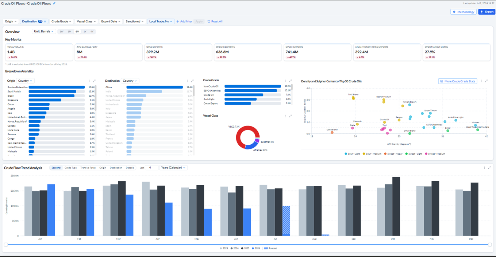
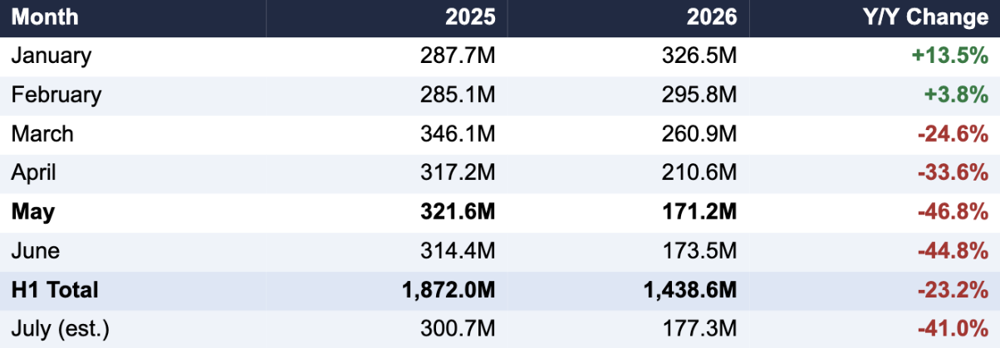
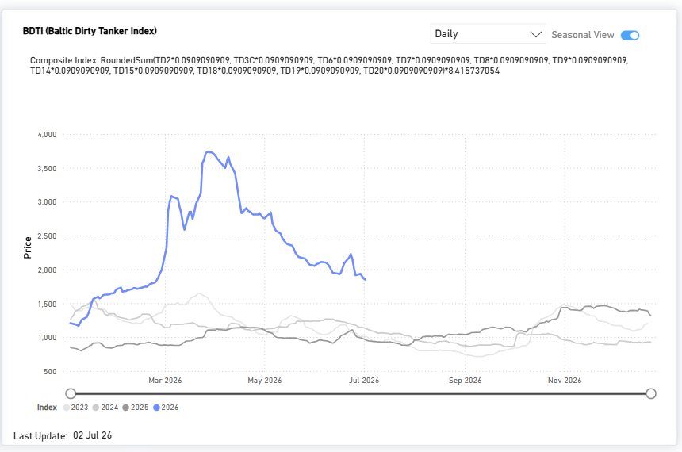
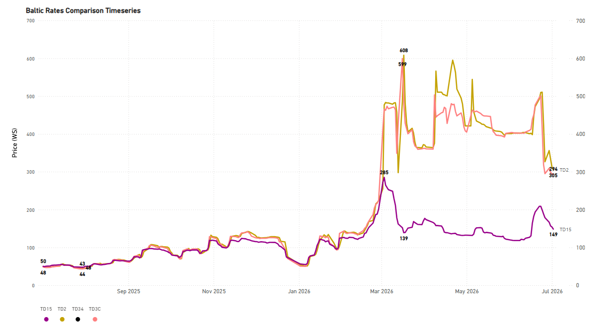
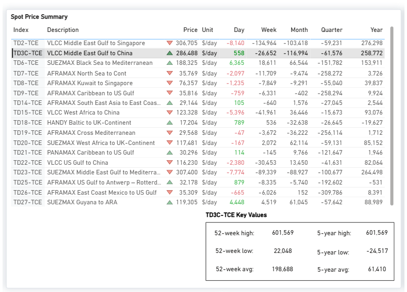
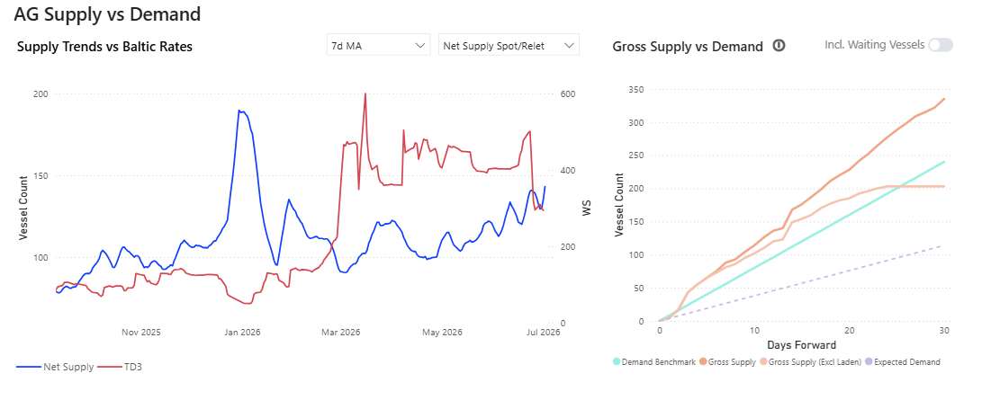
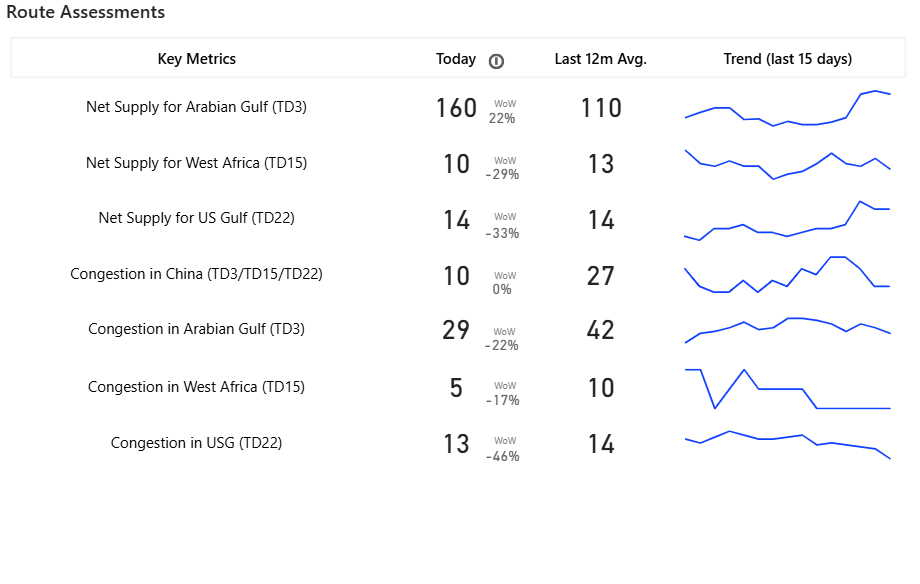
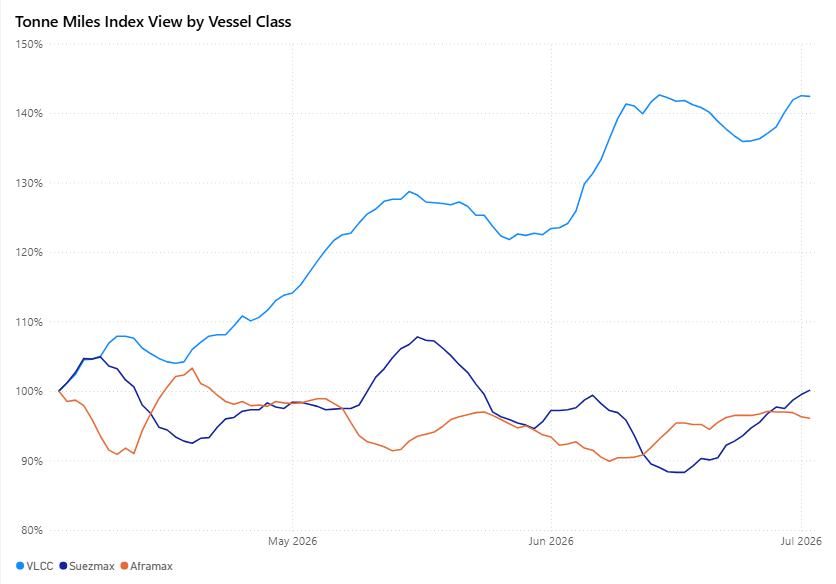

# Weekly Tanker Market Monitor: Week 27, 2026

**Date**: July 03, 2026 | **Category**: Tankers | **Section**: Monitors | **Source**: [https://www.thesignalgroup.com/weekly-market-monitor/weekly-tanker-market-monitor-week-27-2026](https://www.thesignalgroup.com/weekly-market-monitor/weekly-tanker-market-monitor-week-27-2026)

---

## ‍Spotlight of the Week| Chinese Crude Oil Flows‍

## China Crude Oil Imports Fall 23% in First Half of 2026

May marks the low point of the period as vessel-tracking data shows a sharp Q2 decline, followed by signs of stabilization in July

Chinese seaborne crude oil imports fell approximately 23% year-on-year in the first half of 2026, according to Signal Ocean vessel-tracking data, declining from roughly 1.87 billion barrels in H1 2025 to an estimated 1.44 billion barrels in H1 2026.

Imports opened the year above 2025 levels in January and February before turning sharply lower from March onward. May 2026 marked the low point of the period, with tracked imports down approximately 47% year-on-year, the steepest single-month decline observed in the dataset this year. June volumes remained at similarly depressed levels.

Preliminary tracking for July 2026, combined with a modeled month-end estimate, indicates imports of approximately 177 million barrels,  a modest increase of around 2% versus June, but still roughly 41% below the same month in 2025. The data suggests the sharp sequential declines seen from March through June have begun to stabilize, though volumes remain well below prior-year levels.

## Signal Ocean Crude Oil Flows - China, 6-Month View

*Signal Figure*

China crude imports, trailing 6-month view. Platform-reported tracked volume of1.4B barrels, down 26.6% YoYon a rolling 6-month basis.

## Key year-on-year moves:  Jan +13.5%·May -46.8%·July -41.0% (est.)

Monthly Import Volumes - China (Year-on-Year)

*Signal Figure*

Volumes in barrels. H1 Total covers January–June. July 2026 reflects partial-month tracking plus a modeled projection and is excluded from the H1 total. This update reflects observed and estimated import volumes only and does not constitute a forecast of future market conditions or an indicator of underlying demand drivers. Source: Signal Ocean.

## Freight Market Overview - Dirty

As of early July 2026, theBaltic Dirty Tanker Indexhad eased sharply to 1,850 points, down 49.2% year-to-date and roughly 50% from its peak, as tanker traffic through Hormuz began to normalize, though it remained approximately 92.5% above year-ago levels. Middle East Gulf-to-China rates (TD3C) had similarly retreated to 293.89 Worldscale points, down 27% monthly.

*(Market Prices availableDirty)*

## DirtyVLCC

VLCC | TD2Middle East Gulf to Singapore| TD3CMiddle East Gulf to China |TD15West African to China |TD34Gulf of Oman to China

*(Spot Comparison availablehere)*

## Time-Charter-Equivalent Earnings: The AG–China Route Correction

The correction was especially pronounced on time-charter-equivalent (TCE) earnings for the Middle East Gulf-to-China VLCC route (TD3C-TCE), the benchmark most directly tied to Chinese crude buying. As of July 2, 2026, daily earnings on the route stood at approximately $286,500 per day, still elevated at roughly 44% above the 52-week average, but down about $117,000 (‑29%) over the past month and more than 52% below the 52-week high of $601,569 recorded at the height of the crisis. On a year-on-year basis, earnings remained sharply higher (+$258,772), reflecting how depressed the pre-conflict starting point had been.

The retreat in freight earnings tracks the broader trajectory of US–Iran negotiations over the Strait of Hormuz. Following more than three months of conflict that severely disrupted a waterway through which around 20% of global oil trade normally passes, the United States and Iran reached an interim agreement in mid-June 2026 aimed at ending the conflict and reopening the strait, formalized through the Islamabad Memorandum signed on June 17, 2026. As transit conditions gradually improved, freight risk premiums eased, pulling TCE earnings back from their wartime extremes.

The latest round of indirect US–Iran talks in Doha on July 1 underscored that normalization remains incomplete. Mediators reported positive progress on issues linked to the memorandum, and both sides agreed to continue discussions. However, the technical negotiations concluded without resolving the main outstanding issues, with transit arrangements through the Strait of Hormuz remaining the principal point of disagreement. Shipping traffic has recovered only partially and remains well below pre-war levels, helping explain why TD3C earnings, despite retreating sharply from wartime highs, continue to trade well above pre-conflict norms.

*(Market Prices availableDirty)*

## SUPPLY MARKET TRENDS

This week, the VLCC AG market takes centre stage, where signals of an oversupplied picture have started to reflect in the freight market sentiment.

VLCC | AG Supply Trends

- VLCC Insights from theSignal Ocean Platformindicate that the TD3C route has shifted into an oversupplied state starting in early July.

‍

*VLCC insights*

The latest indicators point to an upward trend in the net supply for the Arabian Gulf during the last 15 days, with the latest estimate at 160, up 22% W-o-W.

*VLCC insights*

## DIRTY DEMAND(TONNE MILES)| 7D MA - INDEX VIEW

VLCC  ↑4.5% WoW| Suezmax  ↑4.8% WoW| Aframax ↓0.6% WoW

*Signal Figure*

‍

VLCC tonne-mile demand extended its outperformance, rising 6.1 ppts WoW to 142.4% and remaining above historical norms. Suezmaxes recorded a further improvement of 4.6 ppts WoW to 100.1%, returning above the 100% parity threshold. By contrast, Aframax tonne-mile demand softened only marginally, declining 0.6 ppts WoW to 96.1%, indicating almost stable underlying demand.

Metrics Description:Index View(Base 100) by total Tonne Miles over the selected period. This facilitates relative performance comparisons between segments of different sizes (e.g., comparing the growth rate of VLCC vs Suezmax)

‍

For the latest updates and insights, make sure to visit theSignal Ocean Newsroompage &subscribe to weekly reports. Clickhere to request a demo. Click here to see theprevious tanker weeklyreport.

For subscription to our FREE weekly market trends email, please contact us: research@thesignalgroup.com

-Republishing is allowed with an active link to the source
