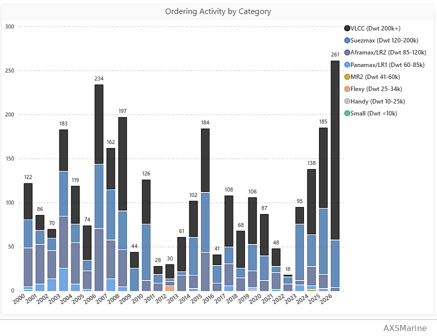
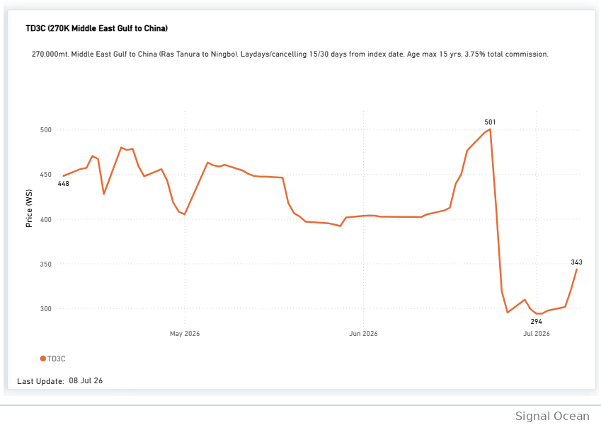
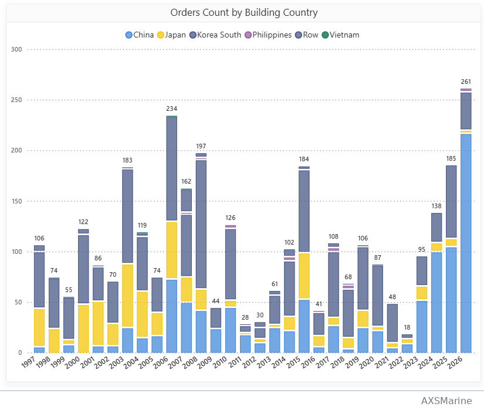
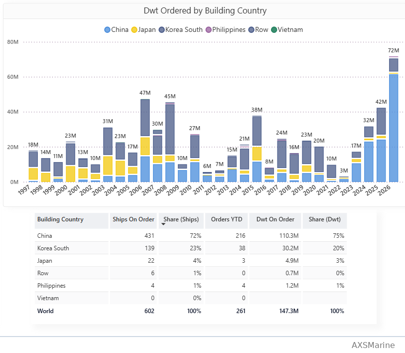
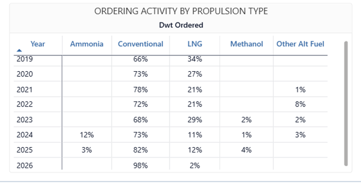
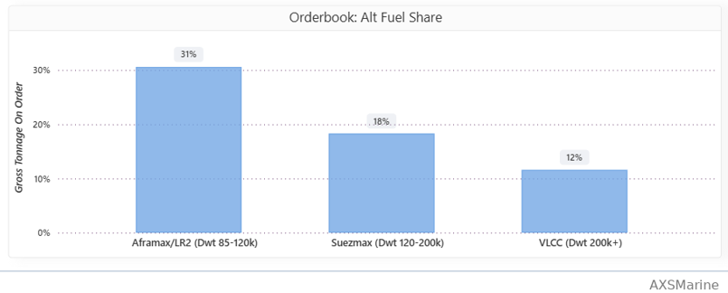
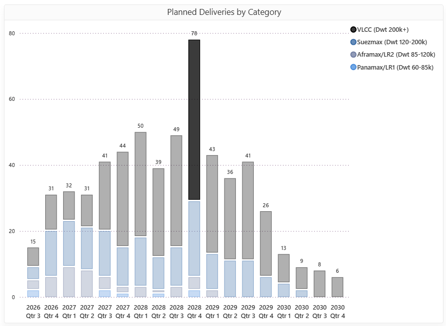
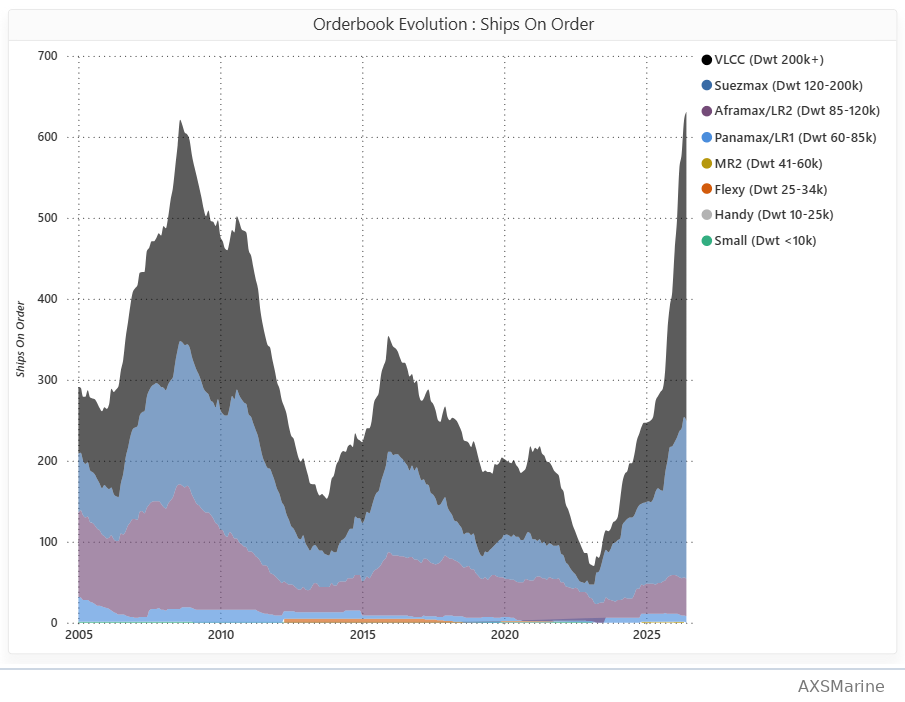
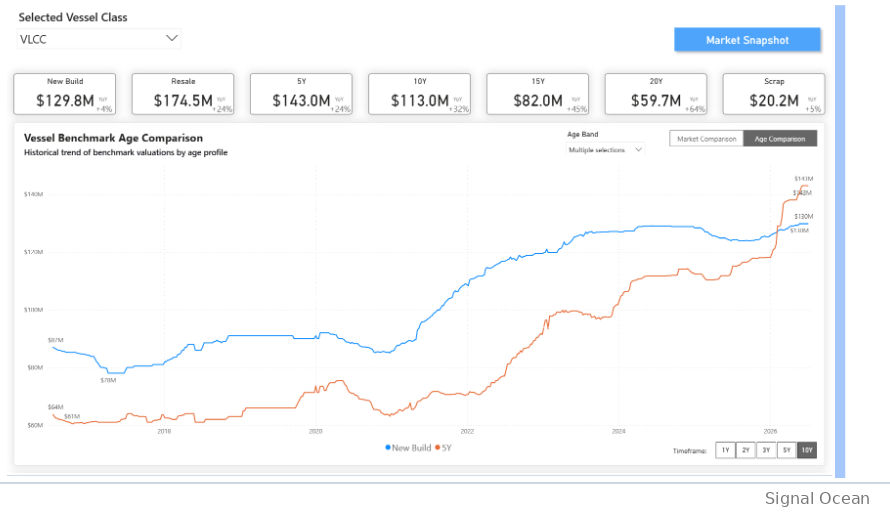

# Weekly Tanker Market Monitor: Week 28, 2026

**Date**: July 10, 2026 | **Category**: Tankers | **Section**: Monitors | **Source**: [https://www.thesignalgroup.com/weekly-market-monitor/weekly-tanker-market-monitor-week-28-2026](https://www.thesignalgroup.com/weekly-market-monitor/weekly-tanker-market-monitor-week-28-2026)

---

## SPOTLIGHT OF THE WEEK

## Crude Tanker Orderbook Broke Its 2008 Record in 1H

With the United States and Iran breaking the ceasefire again this week, the freight market has reacted sharply, resuming its upward trend within days as risk premia around the Strait of Hormuz returned. The Baltic Dirty Tanker Index and the benchmark Middle East Gulf-to-China VLCC route (TD3C) both firmed on the week. This week, however, the focus shifts beyond short-term freight rate movements to the exceptional pace of VLCC newbuilding orders recorded during the first half of 2026.

*Figure 1:Crude tanker ordering by vessel class category. Source:AXS Insights, Tanker Orderbook*

## EXECUTIVE SUMMARY

•  2008 record broken in a single half-year:Driven by the robust contracting activity observed during the first half of 2026, the crude tanker orderbook has exceeded its 2008 historical maximum, expanding beyond 600 dirty tankers.

•  VLCCs dominate the ordering cycle:This unprecedented volume is overwhelmingly driven by the VLCC segment, which accounts for 78% of the orders contracted in H1 2026. This stands in sharp contrast to the previous major wave in 2006, which saw orders evenly distributed for VLCC, Suezmax, and Aframax sizes.

• • Second-hand premiums reinforce newbuilding demand:Strong secondhand asset prices continue to support contracting, with buyers paying premiums for prompt availability and 5-year resale values reaching $174.5m, well above the newbuilding price of $129.8m.

•  Geopolitical risk underpins investment sentiment:The scale and timing of the ordering wave coincided with the months-long Strait of Hormuz risk premium, while the renewed ceasefire breakdown has again lifted freight rates.

## Freight Market — Dirty Rates Turn Higher on Renewed Hormuz Risk

The weekly freight reaction underscores the sensitivity of dirty-tanker rates to the renewed Hormuz risk. As of8 July, the TD3C (Middle East Gulf–China) benchmark stood at343 WS, up7.1%on the day and16.8%on the week after recovering from a recent low of294 WSon1 July. TD3C reached501 WSon23 June, six days after the17 June Islamabad Memorandum of Understanding (MoU)established a60-day frameworkfor ending hostilities and restoring navigation through the Strait of Hormuz. Despite the agreement, freight rates continued to reflect elevated geopolitical uncertainty before easing as confidence in implementation gradually improved. This week's renewed escalation has interrupted that easing trend.

The Baltic Dirty Tanker Index (BDTI) rose to1,939, up4.0%week-on-week. The index remains107.4%above its level a year earlier, indicating that freight markets continue to price a significant geopolitical risk premium amid persistent uncertainty in the Gulf.

*Figure 2:TD3C (270k Middle East Gulf to China). Source:Signal Ocean,Market Prices*

Freight snapshot (TD3C):  343 WS  ·  Day +7.1%  ·  Week +16.8%  ·  52-wk high 599  ·  wartime peak 501

## VLCCs Dominate in the Ordering Activity — and the Comparison With 2006 Peak

Isolating the VLCC segment shows contracting rising to204 units in H1 2026, a level far above the intervening lean years of 2011–2022. The comparison with 2007 — the last great newbuilding wave — is instructive. In 2006, activity was spread almost evenly between the three principal crude sizes: Suezmax (57), VLCC (48), and Aframax/LR2 (44).

*Figure 3:Crude tanker ordering by vessel class category. Source:AXS Insights, Tanker Orderbook*

2006 vs. H1 2026:  VLCC 48 → 204  ·  Suezmax 57 → 54  ·  Aframax/LR2 44 → 3

## Build Location — China Dominates Crude Tanker Contacting Activity

Of the261 crude tankers on order,216 vessels (83%)have been placed atChinese shipyards, compared with38 vessels (15%)atSouth Koreanyards and just3 vessels (1%)inJapan.

*Figure 5:Orders by building country. Source:AXS Insights, Tanker Orderbook*

At the aggregate orderbook level, China accounts for72% of shipsand75% of deadweight on order, versus13% of shipsand20% of deadweightfor South Korea, while Japan represents1% of shipsand3% of deadweight.

*Figure 6:Orders by DWT and building country. Source:AXS Insights, Tanker Orderbook*

Build-country split (ships on order):  China 432 (72%)  ·  Korea 139 (23%) · Japan 22 (4%)

## Propulsion — Conventional Propulsion Regains Momentum

Conventional propulsion has reasserted its dominance in the current ordering cycle.Only2%of crude tanker orders placed duringH1 2026specified alternative-fuel propulsion, exclusively LNG, compared with12%across full-year2025. While the figures are not directly comparable because 2026 covers only January–June,98%of H1 2026 orders have been placed with conventional engines, indicating a strong preference for conventional propulsion. Across the current orderbook, however, alternative-fuel adoption varies by vessel class, accounting for31%ofAframax/LR2orders,18%ofSuezmaxorders and12%ofVLCCorders, suggesting that uptake has remained more limited in the largest crude carriers.

*Signal Figure*

*Figure 6 & 7:Ordering by propulsion type & orderbook alt-fuel share. Source:AXS Insights, Tanker Orderbook*

## Delivery Schedule — 2028 Marks the Peak of the Pipeline

The delivery schedule is heavily over the next three years, with volumes building steadily through 2027 before reaching a peak of 78 vessels in Q4 2028, the busiest quarter in the current orderbook. The late-2028 surge is overwhelmingly driven by VLCC (49, 60% of the total deliveries), while Suezmax deliveries are estimated to be more limited (23, 30% of the total). Following the Q4 2028 peak, quarterly deliveries moderate to 43 vessels in Q1 2029, 36 in Q2, 41 in Q3, and 26 in Q4, before falling to just 13 vessels in Q1 2030 and single-digit quarterly levels thereafter.

*Figure 8:Crude tanker planned deliveries by vessel class category. Source:AXS Insights, Tanker Orderbook*

‍

## Orderbook Evolution — The 2008 Record Is Broken

The orderbook reflects the scale of the current investment cycle. Contracting during the first half of 2026 has lifted the crude tanker orderbook above600 vessels, surpassing the previous peak recorded in2008with half the year remaining. The expansion has been overwhelmingly concentrated in theVLCC segment, which now accounts for the largest share of the orderbook and has led the increase in contracting since the market bottomed in2022–23.

‍

*Figure 9:Orderbook evolution by vessel class category. Source:AXS Insights, Tanker Orderbook*

Orderbook milestone:  600+ dirty tankers on order  ·  above the 2008 all-time peak  ·  VLCC-led

## Asset Prices — The VLCC Value Trend Remains Intact

The latest valuation data extend the trend highlighted in ourWeek 19 Tanker Market Monitor, where VLCC asset prices were already moving well above newbuilding prices, and the age-discount curve was tightening. That trend remains intact. Across the VLCC age curve, values continue to advance, with the strongest year-on-year increases concentrated in older tonnage. Five-year-old VLCCs are now valued at $174.5m, compared with a newbuilding price of $129.8m, as buyers continue to pay a premium for prompt availability. With values strengthening across every age segment, the asset-price environment continues to support the record pace of VLCC ordering.

*Figure 10:VLCC benchmark valuations by age. Source:Signal Ocean, Valuations*

VLCC benchmark YoY:  New Build $129.8M (+4%)  ·  Resale $174.5M (+24%)  ·  5Y $143.0M (+24%)  ·  20Y $59.7M (+64%)

## Key Takeaways

The first half of 2026 has already established a new benchmark for crude tanker contracting.With261 ordersplaced, the period represents the strongest six-month ordering performance on record, lifting the crude tanker orderbook above its previous historical peak.The scale of contracting recorded in just six months exceeds the previous orderbook peak achieved over a full ordering cycle. Recent freight developments have provided a supportive market backdrop.Following this week's renewed U.S.–Iran tensions, dirty-tanker freight rates have turned higher after the correction from late-June highs, highlighting the continued sensitivity of the market to developments in the Strait of Hormuz.

For the latest updates and insights, make sure to visit theSignal Ocean Newsroompage &subscribe to weekly reports. Clickhere to request a demo. Click here to see theprevious tanker weeklyreport.

For subscription to our FREE weekly market trends email, please contact us: research@thesignalgroup.com

-Republishing is allowed with an active link to the source
